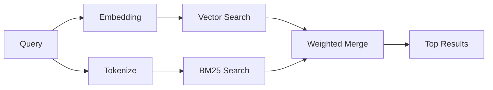

---
read_when:
    - Chcesz zrozumieć, jak działa `memory_search`
    - Chcesz wybrać dostawcę embeddingów
    - Chcesz dostroić jakość wyszukiwania
summary: Jak wyszukiwanie pamięci znajduje odpowiednie notatki za pomocą embeddingów i wyszukiwania hybrydowego
title: Wyszukiwanie pamięci
x-i18n:
    generated_at: "2026-04-26T11:27:27Z"
    model: gpt-5.4
    provider: openai
    source_hash: 95d86fb3efe79aae92f5e3590f1c15fb0d8f3bb3301f8fe9a41f891e290d7a14
    source_path: concepts/memory-search.md
    workflow: 15
---

`memory_search` znajduje odpowiednie notatki z plików pamięci, nawet gdy
sformułowanie różni się od oryginalnego tekstu. Działa to przez indeksowanie pamięci w małe
fragmenty i przeszukiwanie ich za pomocą embeddingów, słów kluczowych albo obu metod jednocześnie.

## Szybki start

Jeśli masz skonfigurowany klucz API GitHub Copilot, OpenAI, Gemini, Voyage lub Mistral,
wyszukiwanie pamięci działa automatycznie. Aby jawnie ustawić dostawcę:

```json5
{
  agents: {
    defaults: {
      memorySearch: {
        provider: "openai", // lub "gemini", "local", "ollama" itd.
      },
    },
  },
}
```

W przypadku lokalnych embeddingów bez klucza API zainstaluj opcjonalny pakiet środowiska uruchomieniowego `node-llama-cpp`
obok OpenClaw i użyj `provider: "local"`.

## Obsługiwani dostawcy

| Dostawca       | ID               | Wymaga klucza API | Uwagi                                                |
| -------------- | ---------------- | ----------------- | ---------------------------------------------------- |
| Bedrock        | `bedrock`        | Nie               | Wykrywany automatycznie, gdy łańcuch poświadczeń AWS zostanie rozwiązany |
| Gemini         | `gemini`         | Tak               | Obsługuje indeksowanie obrazów/dźwięku               |
| GitHub Copilot | `github-copilot` | Nie               | Wykrywany automatycznie, używa subskrypcji Copilot   |
| Local          | `local`          | Nie               | Model GGUF, pobieranie ~0,6 GB                       |
| Mistral        | `mistral`        | Tak               | Wykrywany automatycznie                              |
| Ollama         | `ollama`         | Nie               | Lokalny, musi być ustawiony jawnie                   |
| OpenAI         | `openai`         | Tak               | Wykrywany automatycznie, szybki                      |
| Voyage         | `voyage`         | Tak               | Wykrywany automatycznie                              |

## Jak działa wyszukiwanie

OpenClaw uruchamia równolegle dwie ścieżki wyszukiwania i scala wyniki:



- **Wyszukiwanie wektorowe** znajduje notatki o podobnym znaczeniu („host gateway” pasuje do
  „maszyna, na której działa OpenClaw”).
- **Wyszukiwanie słów kluczowych BM25** znajduje dokładne dopasowania (identyfikatory, ciągi błędów, klucze konfiguracji).

Jeśli dostępna jest tylko jedna ścieżka (brak embeddingów albo brak FTS), działa tylko ta jedna.

Gdy embeddingi są niedostępne, OpenClaw nadal używa rankingu leksykalnego nad wynikami FTS zamiast przechodzić wyłącznie do surowego porządkowania według dokładnego dopasowania. Ten tryb degradacji wzmacnia fragmenty z lepszym pokryciem terminów zapytania i odpowiednimi ścieżkami plików, co pozwala zachować przydatny recall nawet bez `sqlite-vec` lub dostawcy embeddingów.

## Poprawianie jakości wyszukiwania

Dwie opcjonalne funkcje pomagają, gdy masz dużą historię notatek:

### Temporal decay

Stare notatki stopniowo tracą wagę w rankingu, dzięki czemu najpierw pojawiają się nowsze informacje.
Przy domyślnym okresie półtrwania 30 dni notatka z zeszłego miesiąca ma wynik równy 50% swojej
pierwotnej wagi. Pliki trwałe, takie jak `MEMORY.md`, nigdy nie podlegają osłabieniu.

<Tip>
Włącz temporal decay, jeśli Twój agent ma kilka miesięcy codziennych notatek, a nieaktualne
informacje stale wyprzedzają nowszy kontekst.
</Tip>

### MMR (różnorodność)

Ogranicza nadmiarowe wyniki. Jeśli pięć notatek wspomina tę samą konfigurację routera, MMR
zapewnia, że najwyższe wyniki obejmują różne tematy zamiast się powtarzać.

<Tip>
Włącz MMR, jeśli `memory_search` stale zwraca niemal zduplikowane fragmenty z
różnych codziennych notatek.
</Tip>

### Włączanie obu

```json5
{
  agents: {
    defaults: {
      memorySearch: {
        query: {
          hybrid: {
            mmr: { enabled: true },
            temporalDecay: { enabled: true },
          },
        },
      },
    },
  },
}
```

## Pamięć multimodalna

Dzięki Gemini Embedding 2 możesz indeksować obrazy i pliki audio razem z
Markdown. Zapytania wyszukiwania pozostają tekstowe, ale dopasowują się do treści wizualnej i dźwiękowej. Zobacz [Memory configuration reference](/pl/reference/memory-config), aby poznać
konfigurację.

## Wyszukiwanie pamięci sesji

Możesz opcjonalnie indeksować transkrypcje sesji, aby `memory_search` mogło przywoływać
wcześniejsze rozmowy. To funkcja opt-in przez
`memorySearch.experimental.sessionMemory`. Szczegóły znajdziesz w
[dokumentacji konfiguracji](/pl/reference/memory-config).

## Rozwiązywanie problemów

**Brak wyników?** Uruchom `openclaw memory status`, aby sprawdzić indeks. Jeśli jest pusty, uruchom
`openclaw memory index --force`.

**Tylko dopasowania słów kluczowych?** Twój dostawca embeddingów może nie być skonfigurowany. Sprawdź
`openclaw memory status --deep`.

**Lokalne embeddingi przekraczają limit czasu?** `ollama`, `lmstudio` i `local` używają domyślnie dłuższego
limitu czasu dla wsadowego przetwarzania inline. Jeśli host jest po prostu wolny, ustaw
`agents.defaults.memorySearch.sync.embeddingBatchTimeoutSeconds` i ponownie uruchom
`openclaw memory index --force`.

**Nie można znaleźć tekstu CJK?** Odbuduj indeks FTS za pomocą
`openclaw memory index --force`.

## Dalsza lektura

- [Active Memory](/pl/concepts/active-memory) -- pamięć subagentów dla interaktywnych sesji czatu
- [Memory](/pl/concepts/memory) -- układ plików, backendy, narzędzia
- [Memory configuration reference](/pl/reference/memory-config) -- wszystkie opcje konfiguracji

## Powiązane

- [Memory overview](/pl/concepts/memory)
- [Active memory](/pl/concepts/active-memory)
- [Builtin memory engine](/pl/concepts/memory-builtin)
