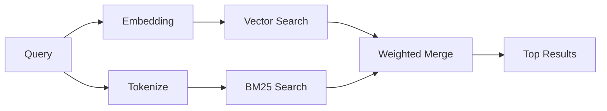

---
read_when:
    - Chcesz zrozumieć, jak działa `memory_search`
    - Chcesz wybrać dostawcę embeddingów
    - Chcesz dostroić jakość wyszukiwania
summary: Jak wyszukiwanie pamięci znajduje odpowiednie notatki za pomocą embeddingów i wyszukiwania hybrydowego
title: Wyszukiwanie pamięci
x-i18n:
    generated_at: "2026-04-15T09:51:03Z"
    model: gpt-5.4
    provider: openai
    source_hash: f5757aa8fe8f7fec30ef5c826f72230f591ce4cad591d81a091189d50d4262ed
    source_path: concepts/memory-search.md
    workflow: 15
---

# Wyszukiwanie pamięci

`memory_search` znajduje odpowiednie notatki z Twoich plików pamięci, nawet gdy
sformułowanie różni się od oryginalnego tekstu. Działa przez indeksowanie pamięci w małych
fragmentach i przeszukiwanie ich za pomocą embeddingów, słów kluczowych albo obu metod naraz.

## Szybki start

Jeśli masz subskrypcję GitHub Copilot albo skonfigurowany klucz API OpenAI, Gemini, Voyage lub Mistral,
wyszukiwanie pamięci działa automatycznie. Aby jawnie ustawić dostawcę:

```json5
{
  agents: {
    defaults: {
      memorySearch: {
        provider: "openai", // lub "gemini", "local", "ollama" itd.
      },
    },
  },
}
```

Do lokalnych embeddingów bez klucza API użyj `provider: "local"` (wymaga
node-llama-cpp).

## Obsługiwani dostawcy

| Dostawca       | ID               | Wymaga klucza API | Uwagi                                                |
| -------------- | ---------------- | ----------------- | ---------------------------------------------------- |
| Bedrock        | `bedrock`        | Nie               | Wykrywany automatycznie, gdy łańcuch poświadczeń AWS zostanie rozwiązany |
| Gemini         | `gemini`         | Tak               | Obsługuje indeksowanie obrazów/dźwięku               |
| GitHub Copilot | `github-copilot` | Nie               | Wykrywany automatycznie, używa subskrypcji Copilot   |
| Local          | `local`          | Nie               | Model GGUF, pobranie ~0,6 GB                         |
| Mistral        | `mistral`        | Tak               | Wykrywany automatycznie                              |
| Ollama         | `ollama`         | Nie               | Lokalny, trzeba ustawić jawnie                       |
| OpenAI         | `openai`         | Tak               | Wykrywany automatycznie, szybki                      |
| Voyage         | `voyage`         | Tak               | Wykrywany automatycznie                              |

## Jak działa wyszukiwanie

OpenClaw uruchamia równolegle dwie ścieżki pobierania i scala wyniki:



- **Wyszukiwanie wektorowe** znajduje notatki o podobnym znaczeniu (`"gateway host"` pasuje
  do `"the machine running OpenClaw"`).
- **Wyszukiwanie słów kluczowych BM25** znajduje dokładne dopasowania (ID, ciągi błędów, klucze
  konfiguracji).

Jeśli dostępna jest tylko jedna ścieżka (brak embeddingów albo brak FTS), działa tylko ta druga.

Gdy embeddingi są niedostępne, OpenClaw nadal używa rankingu leksykalnego względem wyników FTS zamiast wracać wyłącznie do surowego porządku dokładnych dopasowań. Ten tryb obniżonej jakości wzmacnia fragmenty z lepszym pokryciem terminów zapytania i odpowiednimi ścieżkami plików, co pomaga zachować użyteczną trafność nawet bez `sqlite-vec` albo dostawcy embeddingów.

## Poprawa jakości wyszukiwania

Dwie opcjonalne funkcje pomagają, gdy masz dużą historię notatek:

### Zanikanie czasowe

Stare notatki stopniowo tracą wagę rankingową, dzięki czemu najpierw pojawiają się nowsze informacje.
Przy domyślnym okresie połowicznego zaniku wynoszącym 30 dni notatka z zeszłego miesiąca ma wynik równy 50%
swojej pierwotnej wagi. Pliki stałe, takie jak `MEMORY.md`, nigdy nie podlegają zanikaniu.

<Tip>
Włącz zanikanie czasowe, jeśli Twój agent ma miesiące codziennych notatek, a nieaktualne
informacje stale wyprzedzają nowszy kontekst.
</Tip>

### MMR (różnorodność)

Ogranicza powtarzające się wyniki. Jeśli pięć notatek wspomina tę samą konfigurację routera, MMR
sprawia, że najwyższe wyniki obejmują różne tematy zamiast się powtarzać.

<Tip>
Włącz MMR, jeśli `memory_search` stale zwraca niemal identyczne fragmenty z
różnych codziennych notatek.
</Tip>

### Włącz oba

```json5
{
  agents: {
    defaults: {
      memorySearch: {
        query: {
          hybrid: {
            mmr: { enabled: true },
            temporalDecay: { enabled: true },
          },
        },
      },
    },
  },
}
```

## Pamięć multimodalna

Z Gemini Embedding 2 możesz indeksować obrazy i pliki audio razem z
Markdownem. Zapytania wyszukiwania nadal pozostają tekstowe, ale dopasowują się do
treści wizualnych i audio. Zobacz [odnośnik do konfiguracji pamięci](/pl/reference/memory-config), aby poznać
konfigurację.

## Wyszukiwanie w pamięci sesji

Możesz opcjonalnie indeksować transkrypty sesji, aby `memory_search` mógł przywoływać
wcześniejsze rozmowy. To funkcja opt-in przez
`memorySearch.experimental.sessionMemory`. Szczegóły znajdziesz w
[odnośniku do konfiguracji](/pl/reference/memory-config).

## Rozwiązywanie problemów

**Brak wyników?** Uruchom `openclaw memory status`, aby sprawdzić indeks. Jeśli jest pusty, uruchom
`openclaw memory index --force`.

**Tylko dopasowania słów kluczowych?** Twój dostawca embeddingów może nie być skonfigurowany. Sprawdź
`openclaw memory status --deep`.

**Nie znajduje tekstu CJK?** Odbuduj indeks FTS za pomocą
`openclaw memory index --force`.

## Dalsza lektura

- [Active Memory](/pl/concepts/active-memory) -- pamięć subagenta dla interaktywnych sesji czatu
- [Pamięć](/pl/concepts/memory) -- układ plików, backendy, narzędzia
- [Odnośnik do konfiguracji pamięci](/pl/reference/memory-config) -- wszystkie opcje konfiguracji
