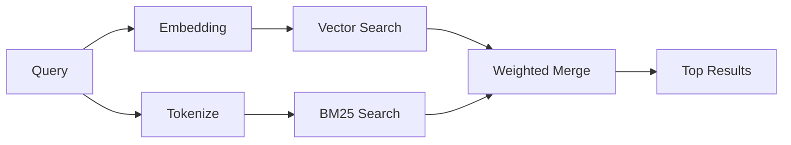

---
read_when:
    - Chcesz zrozumieć, jak działa `memory_search`
    - Chcesz wybrać providera embeddingów
    - Chcesz dostroić jakość wyszukiwania
summary: Jak wyszukiwanie pamięci znajduje odpowiednie notatki za pomocą embeddingów i wyszukiwania hybrydowego
title: Wyszukiwanie pamięci
x-i18n:
    generated_at: "2026-04-25T13:45:31Z"
    model: gpt-5.4
    provider: openai
    source_hash: 5cc6bbaf7b0a755bbe44d3b1b06eed7f437ebdc41a81c48cca64bd08bbc546b7
    source_path: concepts/memory-search.md
    workflow: 15
---

`memory_search` znajduje odpowiednie notatki z plików pamięci, nawet gdy
sformułowanie różni się od oryginalnego tekstu. Działa przez indeksowanie pamięci na małe
chunki i przeszukiwanie ich za pomocą embeddingów, słów kluczowych albo obu metod.

## Szybki start

Jeśli masz subskrypcję GitHub Copilot albo skonfigurowany klucz API OpenAI, Gemini, Voyage lub Mistral,
wyszukiwanie pamięci działa automatycznie. Aby jawnie ustawić providera:

```json5
{
  agents: {
    defaults: {
      memorySearch: {
        provider: "openai", // lub "gemini", "local", "ollama" itd.
      },
    },
  },
}
```

Aby używać lokalnych embeddingów bez klucza API, zainstaluj opcjonalny pakiet
runtime `node-llama-cpp` obok OpenClaw i użyj `provider: "local"`.

## Obsługiwani providerzy

| Provider       | ID               | Wymaga klucza API | Uwagi                                                  |
| -------------- | ---------------- | ----------------- | ------------------------------------------------------ |
| Bedrock        | `bedrock`        | Nie               | Wykrywany automatycznie, gdy łańcuch poświadczeń AWS się rozwiąże |
| Gemini         | `gemini`         | Tak               | Obsługuje indeksowanie obrazów/audio                   |
| GitHub Copilot | `github-copilot` | Nie               | Wykrywany automatycznie, używa subskrypcji Copilot     |
| Local          | `local`          | Nie               | Model GGUF, pobieranie ~0,6 GB                         |
| Mistral        | `mistral`        | Tak               | Wykrywany automatycznie                                |
| Ollama         | `ollama`         | Nie               | Lokalny, trzeba ustawić jawnie                         |
| OpenAI         | `openai`         | Tak               | Wykrywany automatycznie, szybki                        |
| Voyage         | `voyage`         | Tak               | Wykrywany automatycznie                                |

## Jak działa wyszukiwanie

OpenClaw uruchamia równolegle dwie ścieżki wyszukiwania i scala wyniki:



- **Wyszukiwanie wektorowe** znajduje notatki o podobnym znaczeniu („gateway host” pasuje do
  „the machine running OpenClaw”).
- **Wyszukiwanie słów kluczowych BM25** znajduje dokładne dopasowania (identyfikatory, ciągi błędów, klucze konfiguracji).

Jeśli dostępna jest tylko jedna ścieżka (brak embeddingów albo brak FTS), druga działa samodzielnie.

Gdy embeddingi są niedostępne, OpenClaw nadal używa rankingu leksykalnego na wynikach FTS zamiast wracać wyłącznie do surowego porządku dokładnych dopasowań. Ten tryb obniżonej jakości wzmacnia chunki z lepszym pokryciem terminów zapytania i odpowiednimi ścieżkami plików, co utrzymuje użyteczny recall nawet bez `sqlite-vec` lub providera embeddingów.

## Poprawa jakości wyszukiwania

Dwie opcjonalne funkcje pomagają, gdy masz dużą historię notatek:

### Zanikanie czasowe

Stare notatki stopniowo tracą wagę rankingową, dzięki czemu najpierw pojawiają się nowsze informacje.
Przy domyślnym okresie półtrwania 30 dni notatka z zeszłego miesiąca ma wynik równy 50%
swojej pierwotnej wagi. Ponadczasowe pliki, takie jak `MEMORY.md`, nigdy nie podlegają zanikaniu.

<Tip>
Włącz zanikanie czasowe, jeśli Twój agent ma miesiące codziennych notatek i nieaktualne
informacje stale przewyższają nowszy kontekst.
</Tip>

### MMR (różnorodność)

Ogranicza powtarzające się wyniki. Jeśli pięć notatek wspomina tę samą konfigurację routera, MMR
zapewnia, że najwyższe wyniki obejmują różne tematy zamiast się powtarzać.

<Tip>
Włącz MMR, jeśli `memory_search` stale zwraca niemal identyczne fragmenty z
różnych codziennych notatek.
</Tip>

### Włącz oba

```json5
{
  agents: {
    defaults: {
      memorySearch: {
        query: {
          hybrid: {
            mmr: { enabled: true },
            temporalDecay: { enabled: true },
          },
        },
      },
    },
  },
}
```

## Pamięć multimodalna

Z Gemini Embedding 2 możesz indeksować obrazy i pliki audio razem z
Markdown. Zapytania wyszukiwania nadal pozostają tekstowe, ale dopasowują się do treści wizualnych i audio. Zobacz [dokumentację konfiguracji pamięci](/pl/reference/memory-config), aby
skonfigurować tę funkcję.

## Wyszukiwanie pamięci sesji

Możesz opcjonalnie indeksować transkrypcje sesji, aby `memory_search` mogło przywoływać
wcześniejsze rozmowy. Jest to funkcja opt-in przez
`memorySearch.experimental.sessionMemory`. Szczegóły znajdziesz w
[dokumentacji konfiguracji](/pl/reference/memory-config).

## Rozwiązywanie problemów

**Brak wyników?** Uruchom `openclaw memory status`, aby sprawdzić indeks. Jeśli jest pusty, uruchom
`openclaw memory index --force`.

**Tylko dopasowania słów kluczowych?** Provider embeddingów może nie być skonfigurowany. Sprawdź
`openclaw memory status --deep`.

**Tekst CJK nie został znaleziony?** Przebuduj indeks FTS za pomocą
`openclaw memory index --force`.

## Dalsza lektura

- [Active Memory](/pl/concepts/active-memory) -- pamięć subagentów dla interaktywnych sesji czatu
- [Pamięć](/pl/concepts/memory) -- układ plików, backendy, narzędzia
- [Dokumentacja konfiguracji pamięci](/pl/reference/memory-config) -- wszystkie opcje konfiguracji

## Powiązane

- [Przegląd pamięci](/pl/concepts/memory)
- [Active Memory](/pl/concepts/active-memory)
- [Wbudowany silnik pamięci](/pl/concepts/memory-builtin)
