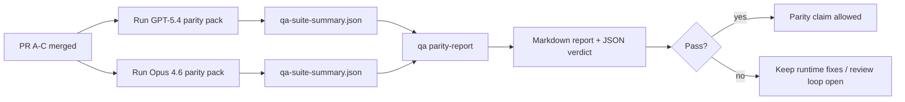

---
read_when:
    - Przegląd serii PR dotyczących zgodności GPT-5.4 / Codex.
    - Utrzymywanie sześciokontraktowej architektury agentic stojącej za programem zgodności.
summary: Jak przeglądać program zgodności GPT-5.4 / Codex jako cztery jednostki scalania
title: Uwagi maintainera dotyczące zgodności GPT-5.4 / Codex
x-i18n:
    generated_at: "2026-04-25T13:49:37Z"
    model: gpt-5.4
    provider: openai
    source_hash: 162ea68476880d4dbf9b8c3b9397a51a2732c3eb10ac52e421a9c9d90e04eec2
    source_path: help/gpt54-codex-agentic-parity-maintainers.md
    workflow: 15
---

Ta notatka wyjaśnia, jak przeglądać program zgodności GPT-5.4 / Codex jako cztery jednostki scalania bez utraty pierwotnej sześciokontraktowej architektury.

## Jednostki scalania

### PR A: wykonanie strict-agentic

Obejmuje:

- `executionContract`
- doprowadzenie do końca w tej samej turze w stylu GPT-5-first
- `update_plan` jako nieterminalne śledzenie postępu
- jawne stany zablokowania zamiast cichych zatrzymań opartych wyłącznie na planie

Nie obejmuje:

- klasyfikacji błędów auth/runtime
- prawdomówności uprawnień
- przebudowy replay/continuation
- benchmarkowania zgodności

### PR B: prawdomówność runtime’u

Obejmuje:

- poprawność zakresów OAuth Codex
- typizowaną klasyfikację błędów dostawcy/runtime’u
- prawdziwą dostępność `/elevated full` i powody blokady

Nie obejmuje:

- normalizacji schematów narzędzi
- stanu replay/liveness
- bramkowania benchmarków

### PR C: poprawność wykonania

Obejmuje:

- zgodność narzędzi OpenAI/Codex należących do dostawcy
- ścisłą obsługę schematów bez parametrów
- ujawnianie replay-invalid
- widoczność stanów paused, blocked i abandoned dla długich zadań

Nie obejmuje:

- samodzielnie wybieranej kontynuacji
- ogólnego zachowania dialektu Codex poza hookami dostawcy
- bramkowania benchmarków

### PR D: wiązka zgodności

Obejmuje:

- pierwszy pakiet scenariuszy GPT-5.4 vs Opus 4.6
- dokumentację zgodności
- mechanikę raportu zgodności i bramki wydania

Nie obejmuje:

- zmian zachowania runtime’u poza QA-lab
- symulacji auth/proxy/DNS wewnątrz wiązki

## Mapowanie z powrotem do pierwotnych sześciu kontraktów

| Pierwotny kontrakt                        | Jednostka scalania |
| ---------------------------------------- | ------------------ |
| Poprawność transportu/auth dostawcy      | PR B               |
| Zgodność kontraktu/schematu narzędzi      | PR C               |
| Wykonanie w tej samej turze              | PR A               |
| Prawdomówność uprawnień                  | PR B               |
| Poprawność replay/continuation/liveness  | PR C               |
| Benchmark/bramka wydania                 | PR D               |

## Kolejność przeglądu

1. PR A
2. PR B
3. PR C
4. PR D

PR D jest warstwą dowodową. Nie powinien być powodem opóźniania PR-ów dotyczących poprawności runtime’u.

## Na co zwracać uwagę

### PR A

- przebiegi GPT-5 wykonują działanie albo kończą się zamkniętym błędem zamiast zatrzymywać się na komentarzu
- `update_plan` samo w sobie nie wygląda już jak postęp
- zachowanie pozostaje ograniczone do GPT-5-first i embedded-Pi

### PR B

- błędy auth/proxy/runtime przestają zapadać się do ogólnej obsługi „model failed”
- `/elevated full` jest opisywane jako dostępne tylko wtedy, gdy rzeczywiście jest dostępne
- powody blokady są widoczne zarówno dla modelu, jak i dla runtime’u skierowanego do użytkownika

### PR C

- ścisła rejestracja narzędzi OpenAI/Codex zachowuje się przewidywalnie
- narzędzia bez parametrów nie kończą się błędami ścisłych kontroli schematu
- wyniki replay i Compaction zachowują prawdziwy stan liveness

### PR D

- pakiet scenariuszy jest zrozumiały i odtwarzalny
- pakiet zawiera ścieżkę bezpieczeństwa mutującego replay, a nie tylko przepływy tylko do odczytu
- raporty są czytelne dla ludzi i automatyzacji
- twierdzenia o zgodności są poparte dowodami, a nie anegdotyczne

Oczekiwane artefakty z PR D:

- `qa-suite-report.md` / `qa-suite-summary.json` dla każdego uruchomienia modelu
- `qa-agentic-parity-report.md` z porównaniem zagregowanym i na poziomie scenariuszy
- `qa-agentic-parity-summary.json` z werdyktem czytelnym maszynowo

## Bramka wydania

Nie twierdź, że GPT-5.4 osiąga zgodność z Opus 4.6 ani go przewyższa, dopóki:

- PR A, PR B i PR C nie zostaną scalone
- PR D nie uruchomi czysto pierwszej fali pakietu zgodności
- zestawy regresji runtime-truthfulness pozostają zielone
- raport zgodności nie pokazuje przypadków fałszywego sukcesu ani regresji w zachowaniu zatrzymania

Wiązka zgodności nie jest jedynym źródłem dowodów. W przeglądzie zachowaj wyraźny podział:

- PR D odpowiada za porównanie GPT-5.4 vs Opus 4.6 oparte na scenariuszach
- deterministyczne zestawy PR B nadal odpowiadają za dowody auth/proxy/DNS i prawdomówności pełnego dostępu

## Szybki workflow scalania dla maintainera

Używaj tego, gdy jesteś gotowy wdrożyć PR zgodności i chcesz powtarzalnej sekwencji o niskim ryzyku.

1. Potwierdź próg dowodowy przed scaleniem:
   - odtwarzalny objaw lub nieudany test
   - zweryfikowana przyczyna źródłowa w zmienionym kodzie
   - poprawka w ścieżce, której dotyczy problem
   - test regresji albo jawna notatka o ręcznej weryfikacji
2. Przeprowadź triage/nadaj etykiety przed scaleniem:
   - zastosuj odpowiednie etykiety auto-close `r:*`, gdy PR nie powinien zostać wdrożony
   - kandydaci do scalenia nie powinni mieć nierozwiązanych wątków blokujących
3. Zweryfikuj lokalnie zmienioną powierzchnię:
   - `pnpm check:changed`
   - `pnpm test:changed`, gdy zmieniły się testy albo pewność poprawki błędu zależy od pokrycia testami
4. Scal standardowym przepływem maintainera (proces `/landpr`), a następnie sprawdź:
   - zachowanie auto-close powiązanych issue
   - CI i status po scaleniu na `main`
5. Po scaleniu uruchom wyszukiwanie duplikatów dla powiązanych otwartych PR-ów/issue i zamykaj je tylko z odwołaniem do kanonicznego źródła.

Jeśli brakuje choć jednego elementu progu dowodowego, zażądaj zmian zamiast scalać.

## Mapa celów do dowodów

| Element bramki ukończenia                 | Główny właściciel | Artefakt przeglądu                                                   |
| ----------------------------------------- | ----------------- | -------------------------------------------------------------------- |
| Brak zatrzymań opartych tylko na planie   | PR A              | testy runtime strict-agentic oraz `approval-turn-tool-followthrough` |
| Brak fałszywego postępu lub fałszywego ukończenia narzędzia | PR A + PR D | liczba fałszywych sukcesów zgodności plus szczegóły raportu na poziomie scenariuszy |
| Brak fałszywych wskazówek `/elevated full` | PR B             | deterministyczne zestawy runtime-truthfulness                        |
| Błędy replay/liveness pozostają jawne     | PR C + PR D       | zestawy lifecycle/replay plus `compaction-retry-mutating-tool`       |
| GPT-5.4 dorównuje lub przewyższa Opus 4.6 | PR D              | `qa-agentic-parity-report.md` i `qa-agentic-parity-summary.json`     |

## Skrót dla recenzenta: przed vs po

| Problem widoczny dla użytkownika wcześniej                | Sygnał przeglądu po zmianie                                                           |
| --------------------------------------------------------- | ------------------------------------------------------------------------------------- |
| GPT-5.4 zatrzymywał się po planowaniu                     | PR A pokazuje zachowanie act-or-block zamiast ukończenia opartego tylko na komentarzu |
| Użycie narzędzi wydawało się kruche przy ścisłych schematach OpenAI/Codex | PR C utrzymuje przewidywalność rejestracji narzędzi i wywołań bez parametrów |
| Wskazówki `/elevated full` bywały mylące                  | PR B wiąże wskazówki z rzeczywistymi możliwościami runtime’u i powodami blokady      |
| Długie zadania mogły znikać w niejednoznaczności replay/Compaction | PR C emituje jawny stan paused, blocked, abandoned i replay-invalid         |
| Twierdzenia o zgodności były anegdotyczne                 | PR D tworzy raport plus werdykt JSON z tym samym pokryciem scenariuszy dla obu modeli |

## Powiązane

- [Zgodność agentic GPT-5.4 / Codex](/pl/help/gpt54-codex-agentic-parity)
