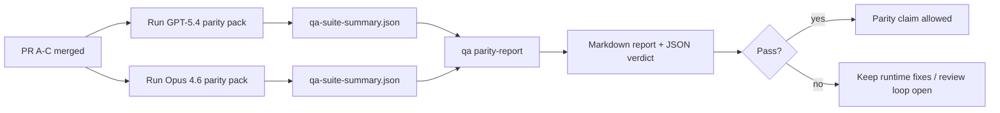

---
x-i18n:
    generated_at: "2026-04-11T15:15:56Z"
    model: gpt-5.4
    provider: openai
    source_hash: 910bcf7668becf182ef48185b43728bf2fa69629d6d50189d47d47b06f807a9e
    source_path: help/gpt54-codex-agentic-parity-maintainers.md
    workflow: 15
---

# Notatki konserwatora dotyczące parytetu GPT-5.4 / Codex

Ta notatka wyjaśnia, jak przeglądać program parytetu GPT-5.4 / Codex jako cztery jednostki scalania bez utraty oryginalnej architektury sześciu kontraktów.

## Jednostki scalania

### PR A: ścisłe wykonanie agentowe

Obejmuje:

- `executionContract`
- GPT-5-first same-turn follow-through
- `update_plan` jako nieterminalne śledzenie postępu
- jawne stany zablokowania zamiast cichych zatrzymań opartych wyłącznie na planie

Nie obejmuje:

- klasyfikacji błędów uwierzytelniania/środowiska uruchomieniowego
- prawdomówności uprawnień
- przeprojektowania odtwarzania/kontynuacji
- benchmarkingu parytetu

### PR B: prawdomówność środowiska uruchomieniowego

Obejmuje:

- poprawność zakresów OAuth Codex
- typowaną klasyfikację błędów dostawcy/środowiska uruchomieniowego
- rzetelną dostępność `/elevated full` i powody zablokowania

Nie obejmuje:

- normalizacji schematu narzędzi
- stanu odtwarzania/żywotności
- bramkowania benchmarków

### PR C: poprawność wykonania

Obejmuje:

- zgodność narzędzi OpenAI/Codex należącą do dostawcy
- ścisłą obsługę schematów bez parametrów
- ujawnianie nieprawidłowego odtwarzania
- widoczność stanów wstrzymania, zablokowania i porzucenia dla zadań długotrwałych

Nie obejmuje:

- samodzielnie wybranej kontynuacji
- ogólnego zachowania dialektu Codex poza hookami dostawcy
- bramkowania benchmarków

### PR D: harness parytetu

Obejmuje:

- pakiet scenariuszy pierwszej fali GPT-5.4 vs Opus 4.6
- dokumentację parytetu
- raport parytetu i mechanikę bramki wydania

Nie obejmuje:

- zmian zachowania środowiska uruchomieniowego poza QA-lab
- symulacji auth/proxy/DNS wewnątrz harnessu

## Mapowanie z powrotem na oryginalne sześć kontraktów

| Oryginalny kontrakt                      | Jednostka scalania |
| ---------------------------------------- | ------------------ |
| Poprawność transportu/uwierzytelniania dostawcy | PR B               |
| Zgodność kontraktu/schematu narzędzi     | PR C               |
| Wykonanie w tej samej turze              | PR A               |
| Prawdomówność uprawnień                  | PR B               |
| Poprawność odtwarzania/kontynuacji/żywotności | PR C               |
| Bramka benchmarku/wydania                | PR D               |

## Kolejność przeglądu

1. PR A
2. PR B
3. PR C
4. PR D

PR D jest warstwą dowodową. Nie powinien być powodem opóźniania PR-ów dotyczących poprawności środowiska uruchomieniowego.

## Na co zwracać uwagę

### PR A

- uruchomienia GPT-5 działają albo kończą się w sposób zamknięty, zamiast zatrzymywać się na komentarzu
- `update_plan` nie wygląda już sam w sobie jak postęp
- zachowanie pozostaje GPT-5-first i ograniczone do embedded-Pi

### PR B

- błędy auth/proxy/środowiska uruchomieniowego przestają zapadać się do ogólnej obsługi „model failed”
- `/elevated full` jest opisywane jako dostępne tylko wtedy, gdy rzeczywiście jest dostępne
- powody zablokowania są widoczne zarówno dla modelu, jak i dla środowiska uruchomieniowego skierowanego do użytkownika

### PR C

- ścisła rejestracja narzędzi OpenAI/Codex zachowuje się przewidywalnie
- narzędzia bez parametrów nie kończą się niepowodzeniem przy ścisłych kontrolach schematu
- wyniki odtwarzania i kompaktowania zachowują prawdziwy stan żywotności

### PR D

- pakiet scenariuszy jest zrozumiały i odtwarzalny
- pakiet zawiera ścieżkę bezpieczeństwa odtwarzania z mutacjami, a nie tylko przepływy tylko do odczytu
- raporty są czytelne dla ludzi i automatyzacji
- twierdzenia o parytecie są poparte dowodami, a nie anegdotami

Oczekiwane artefakty z PR D:

- `qa-suite-report.md` / `qa-suite-summary.json` dla każdego uruchomienia modelu
- `qa-agentic-parity-report.md` z porównaniem zbiorczym i na poziomie scenariuszy
- `qa-agentic-parity-summary.json` z werdyktem możliwym do odczytu maszynowego

## Bramka wydania

Nie twierdź, że GPT-5.4 osiąga parytet lub przewagę nad Opus 4.6, dopóki:

- PR A, PR B i PR C nie zostaną scalone
- PR D nie uruchomi czysto pakietu parytetu pierwszej fali
- zestawy regresji prawdomówności środowiska uruchomieniowego pozostają zielone
- raport parytetu nie wykazuje przypadków fałszywego sukcesu ani regresji w zachowaniu zatrzymania

Harness parytetu nie jest jedynym źródłem dowodów. Zachowaj ten podział jako jawny podczas przeglądu:

- PR D obejmuje porównanie GPT-5.4 vs Opus 4.6 oparte na scenariuszach
- deterministyczne zestawy PR B nadal obejmują dowody dotyczące auth/proxy/DNS i prawdomówności pełnego dostępu

## Mapa celu do dowodów

| Element bramki ukończenia                | Główny właściciel | Artefakt przeglądu                                                  |
| ---------------------------------------- | ----------------- | ------------------------------------------------------------------- |
| Brak zacięć opartych wyłącznie na planie | PR A              | testy środowiska ścisłego wykonania agentowego i `approval-turn-tool-followthrough` |
| Brak fałszywego postępu lub fałszywego zakończenia narzędzia | PR A + PR D       | liczba fałszywych sukcesów w parytecie plus szczegóły raportu na poziomie scenariuszy |
| Brak fałszywych wskazówek `/elevated full` | PR B              | deterministyczne zestawy prawdomówności środowiska uruchomieniowego |
| Błędy odtwarzania/żywotności pozostają jawne | PR C + PR D       | zestawy lifecycle/replay plus `compaction-retry-mutating-tool`      |
| GPT-5.4 dorównuje Opus 4.6 lub go przewyższa | PR D              | `qa-agentic-parity-report.md` i `qa-agentic-parity-summary.json`    |

## Skrót dla recenzenta: przed vs po

| Problem widoczny dla użytkownika przed                    | Sygnał przeglądu po                                                                     |
| --------------------------------------------------------- | --------------------------------------------------------------------------------------- |
| GPT-5.4 zatrzymywał się po planowaniu                     | PR A pokazuje zachowanie wykonaj-lub-zablokuj zamiast zakończenia opartego wyłącznie na komentarzu |
| Użycie narzędzi wydawało się kruche przy ścisłych schematach OpenAI/Codex | PR C utrzymuje przewidywalność rejestracji narzędzi i wywołań bez parametrów            |
| Wskazówki `/elevated full` bywały czasem mylące           | PR B wiąże wskazówki z rzeczywistą zdolnością środowiska uruchomieniowego i powodami zablokowania |
| Długie zadania mogły zniknąć w niejednoznaczności odtwarzania/kompaktowania | PR C emituje jawny stan: wstrzymane, zablokowane, porzucone i replay-invalid           |
| Twierdzenia o parytecie były anegdotyczne                 | PR D tworzy raport oraz werdykt JSON z tym samym pokryciem scenariuszy dla obu modeli |
