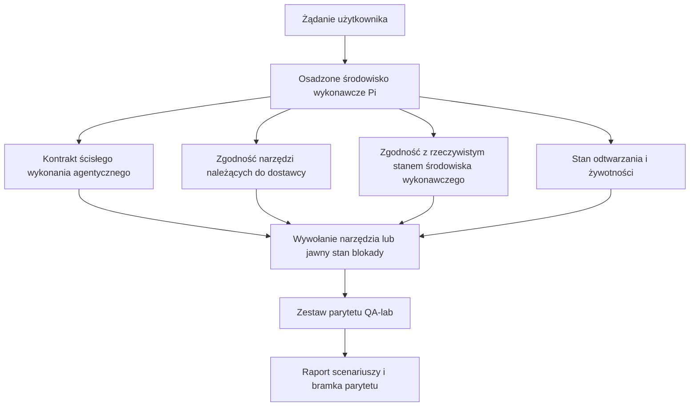
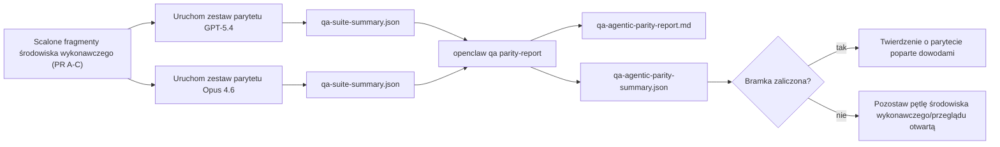

---
x-i18n:
    generated_at: "2026-04-11T15:15:56Z"
    model: gpt-5.4
    provider: openai
    source_hash: 7ee6b925b8a0f8843693cea9d50b40544657b5fb8a9e0860e2ff5badb273acb6
    source_path: help/gpt54-codex-agentic-parity.md
    workflow: 15
---

# GPT-5.4 / Codex Agentic Parity w OpenClaw

OpenClaw już dobrze działał z modelami granicznymi korzystającymi z narzędzi, ale modele w stylu GPT-5.4 i Codex nadal wypadały słabiej w kilku praktycznych aspektach:

- mogły zatrzymać się po etapie planowania zamiast wykonać pracę
- mogły niepoprawnie używać ścisłych schematów narzędzi OpenAI/Codex
- mogły prosić o `/elevated full`, nawet gdy pełny dostęp był niemożliwy
- mogły tracić stan długotrwałego zadania podczas odtwarzania lub kompaktowania
- twierdzenia o parytecie względem Claude Opus 4.6 opierały się na anegdotach zamiast na powtarzalnych scenariuszach

Ten program parytetu usuwa te luki w czterech fragmentach możliwych do przeglądu.

## Co się zmieniło

### PR A: ścisłe wykonanie agentyczne

Ten fragment dodaje opcjonalny kontrakt wykonania `strict-agentic` dla osadzonych uruchomień Pi GPT-5.

Gdy jest włączony, OpenClaw przestaje akceptować tury zawierające wyłącznie plan jako „wystarczająco dobre” zakończenie. Jeśli model tylko mówi, co zamierza zrobić, i faktycznie nie używa narzędzi ani nie robi postępu, OpenClaw ponawia próbę z nakierowaniem na natychmiastowe działanie, a następnie kończy się w trybie fail-closed z jawnym stanem blokady zamiast po cichu kończyć zadanie.

Najbardziej poprawia to działanie GPT-5.4 w następujących przypadkach:

- krótkie dopowiedzenia typu „ok, zrób to”
- zadania programistyczne, w których pierwszy krok jest oczywisty
- przepływy, w których `update_plan` powinno służyć do śledzenia postępu, a nie jako tekst wypełniający

### PR B: zgodność z rzeczywistym stanem środowiska wykonawczego

Ten fragment sprawia, że OpenClaw mówi prawdę o dwóch rzeczach:

- dlaczego wywołanie dostawcy/środowiska wykonawczego nie powiodło się
- czy `/elevated full` jest faktycznie dostępne

Oznacza to, że GPT-5.4 otrzymuje lepsze sygnały środowiska wykonawczego dla brakującego zakresu uprawnień, błędów odświeżenia uwierzytelnienia, błędów uwierzytelnienia HTML 403, problemów z proxy, błędów DNS lub przekroczenia czasu oraz zablokowanych trybów pełnego dostępu. Model z mniejszym prawdopodobieństwem będzie halucynował błędne działania naprawcze albo nadal prosił o tryb uprawnień, którego środowisko wykonawcze nie może zapewnić.

### PR C: poprawność wykonania

Ten fragment poprawia dwa rodzaje poprawności:

- zgodność schematów narzędzi należących do dostawcy z OpenAI/Codex
- widoczność odtwarzania i żywotności długich zadań

Prace nad zgodnością narzędzi zmniejszają tarcia związane ze ścisłą rejestracją narzędzi OpenAI/Codex, szczególnie w przypadku narzędzi bez parametrów i oczekiwań dotyczących ścisłego obiektu jako korzenia. Prace nad odtwarzaniem i żywotnością sprawiają, że zadania długotrwałe są lepiej obserwowalne, dzięki czemu stany wstrzymania, blokady i porzucenia są widoczne zamiast znikać w ogólnym komunikacie o błędzie.

### PR D: wiązka testów parytetu

Ten fragment dodaje pierwszą falę zestawu parytetu QA-lab, aby GPT-5.4 i Opus 4.6 można było uruchamiać w tych samych scenariuszach i porównywać na podstawie wspólnych dowodów.

Zestaw parytetu jest warstwą dowodową. Sam z siebie nie zmienia zachowania środowiska wykonawczego.

Gdy masz już dwa artefakty `qa-suite-summary.json`, wygeneruj porównanie bramki wydania za pomocą:

```bash
pnpm openclaw qa parity-report \
  --repo-root . \
  --candidate-summary .artifacts/qa-e2e/gpt54/qa-suite-summary.json \
  --baseline-summary .artifacts/qa-e2e/opus46/qa-suite-summary.json \
  --output-dir .artifacts/qa-e2e/parity
```

To polecenie zapisuje:

- czytelny dla człowieka raport Markdown
- czytelny maszynowo werdykt JSON
- jawny wynik bramki `pass` / `fail`

## Dlaczego to w praktyce poprawia GPT-5.4

Przed tymi zmianami GPT-5.4 w OpenClaw mógł sprawiać wrażenie mniej agentycznego niż Opus w rzeczywistych sesjach programistycznych, ponieważ środowisko wykonawcze tolerowało zachowania szczególnie szkodliwe dla modeli w stylu GPT-5:

- tury zawierające wyłącznie komentarz
- tarcia schematów wokół narzędzi
- niejasne informacje zwrotne o uprawnieniach
- ciche uszkodzenia odtwarzania lub kompaktowania

Celem nie jest sprawienie, by GPT-5.4 naśladował Opus. Celem jest zapewnienie GPT-5.4 kontraktu środowiska wykonawczego, który nagradza rzeczywisty postęp, dostarcza czytelniejszej semantyki narzędzi i uprawnień oraz zamienia tryby awarii w jawne stany czytelne zarówno dla maszyn, jak i ludzi.

To zmienia doświadczenie użytkownika z:

- „model miał dobry plan, ale się zatrzymał”

na:

- „model albo zadziałał, albo OpenClaw wskazał dokładny powód, dlaczego nie mógł”

## Przed i po dla użytkowników GPT-5.4

| Przed tym programem                                                                            | Po PR A-D                                                                                |
| ---------------------------------------------------------------------------------------------- | ---------------------------------------------------------------------------------------- |
| GPT-5.4 mógł zatrzymać się po rozsądnym planie bez wykonania kolejnego kroku narzędziowego    | PR A zamienia „sam plan” na „działaj teraz albo pokaż stan blokady”                     |
| Ścisłe schematy narzędzi mogły w mylący sposób odrzucać narzędzia bez parametrów lub w kształcie OpenAI/Codex | PR C sprawia, że rejestracja i wywoływanie narzędzi należących do dostawcy są bardziej przewidywalne |
| Wskazówki dotyczące `/elevated full` mogły być niejasne lub błędne w zablokowanych środowiskach wykonawczych | PR B daje GPT-5.4 i użytkownikowi prawdziwe wskazówki środowiska wykonawczego i uprawnień |
| Błędy odtwarzania lub kompaktowania mogły sprawiać wrażenie, że zadanie po cichu zniknęło     | PR C jawnie pokazuje wyniki paused, blocked, abandoned i replay-invalid                  |
| „GPT-5.4 wypada gorzej niż Opus” było głównie anegdotyczne                                     | PR D zamienia to w ten sam zestaw scenariuszy, te same metryki i twardą bramkę pass/fail |

## Architektura



## Przepływ wydania



## Zestaw scenariuszy

Pierwsza fala zestawu parytetu obejmuje obecnie pięć scenariuszy:

### `approval-turn-tool-followthrough`

Sprawdza, czy model nie zatrzymuje się na „zrobię to” po krótkiej zgodzie. Powinien wykonać pierwsze konkretne działanie w tej samej turze.

### `model-switch-tool-continuity`

Sprawdza, czy praca z użyciem narzędzi pozostaje spójna po przełączeniu modelu/środowiska wykonawczego zamiast resetować się do komentarza lub tracić kontekst wykonania.

### `source-docs-discovery-report`

Sprawdza, czy model potrafi czytać kod źródłowy i dokumentację, syntetyzować ustalenia oraz kontynuować zadanie w sposób agentyczny zamiast tworzyć cienkie podsumowanie i zatrzymywać się zbyt wcześnie.

### `image-understanding-attachment`

Sprawdza, czy zadania mieszane obejmujące załączniki pozostają wykonalne i nie sprowadzają się do ogólnej narracji.

### `compaction-retry-mutating-tool`

Sprawdza, czy zadanie z rzeczywistym modyfikującym zapisem zachowuje jawną informację o niebezpieczeństwie odtwarzania zamiast sprawiać ciche wrażenie bezpiecznego odtworzenia, gdy uruchomienie ulega kompaktowaniu, ponownej próbie lub traci stan odpowiedzi pod presją.

## Macierz scenariuszy

| Scenariusz                         | Co testuje                              | Dobre zachowanie GPT-5.4                                                      | Sygnał niepowodzenia                                                           |
| ---------------------------------- | --------------------------------------- | ----------------------------------------------------------------------------- | ------------------------------------------------------------------------------ |
| `approval-turn-tool-followthrough` | Krótkie zgody po planie                 | Natychmiast rozpoczyna pierwsze konkretne działanie narzędziowe zamiast powtarzać zamiar | dopowiedzenie ograniczające się do planu, brak aktywności narzędziowej lub tura zablokowana bez rzeczywistej przeszkody |
| `model-switch-tool-continuity`     | Przełączanie środowiska wykonawczego/modelu podczas użycia narzędzi | Zachowuje kontekst zadania i spójnie kontynuuje działanie                     | reset do komentarza, utrata kontekstu narzędzi lub zatrzymanie po przełączeniu |
| `source-docs-discovery-report`     | Czytanie kodu źródłowego + synteza + działanie | Znajduje źródła, używa narzędzi i tworzy użyteczny raport bez zastoju         | cienkie podsumowanie, brak pracy z narzędziami lub zatrzymanie w niepełnej turze |
| `image-understanding-attachment`   | Agentyczna praca oparta na załączniku   | Interpretuje załącznik, łączy go z narzędziami i kontynuuje zadanie           | ogólna narracja, zignorowany załącznik lub brak konkretnego następnego działania |
| `compaction-retry-mutating-tool`   | Praca modyfikująca pod presją kompaktowania | Wykonuje rzeczywisty zapis i po skutku ubocznym zachowuje jawną informację o niebezpieczeństwie odtwarzania | następuje modyfikujący zapis, ale bezpieczeństwo odtwarzania jest sugerowane, nieobecne lub sprzeczne |

## Bramka wydania

Można uznać, że GPT-5.4 osiągnął parytet lub lepszy wynik tylko wtedy, gdy scalone środowisko wykonawcze jednocześnie przechodzi zestaw parytetu oraz regresje zgodności z rzeczywistym stanem środowiska wykonawczego.

Wymagane wyniki:

- brak zastoju na samym planie, gdy następne działanie narzędziowe jest oczywiste
- brak fałszywego zakończenia bez rzeczywistego wykonania
- brak niepoprawnych wskazówek `/elevated full`
- brak cichego porzucenia podczas odtwarzania lub kompaktowania
- metryki zestawu parytetu co najmniej tak dobre jak uzgodniona baza odniesienia Opus 4.6

W pierwszej fali wiązki bramka porównuje:

- wskaźnik ukończenia
- wskaźnik niezamierzonych zatrzymań
- wskaźnik prawidłowych wywołań narzędzi
- liczbę fałszywych sukcesów

Dowody parytetu są celowo podzielone na dwie warstwy:

- PR D dowodzi zachowania GPT-5.4 vs Opus 4.6 w tych samych scenariuszach przy użyciu QA-lab
- deterministyczne zestawy PR B dowodzą zgodności uwierzytelniania, proxy, DNS i `/elevated full` z rzeczywistym stanem poza tą wiązką

## Macierz celu i dowodów

| Element bramki ukończenia                               | Odpowiedzialny PR | Źródło dowodów                                                    | Sygnał zaliczenia                                                                     |
| ------------------------------------------------------- | ----------------- | ----------------------------------------------------------------- | ------------------------------------------------------------------------------------- |
| GPT-5.4 nie zatrzymuje się już po planowaniu            | PR A              | `approval-turn-tool-followthrough` oraz zestawy środowiska wykonawczego PR A | tury zatwierdzenia wywołują rzeczywistą pracę albo jawny stan blokady                 |
| GPT-5.4 nie udaje już postępu ani fałszywego ukończenia narzędzia | PR A + PR D       | wyniki scenariuszy w raporcie parytetu i liczba fałszywych sukcesów | brak podejrzanych wyników zaliczających i brak zakończeń opartych wyłącznie na komentarzu |
| GPT-5.4 nie podaje już fałszywych wskazówek `/elevated full` | PR B              | deterministyczne zestawy zgodności z rzeczywistym stanem          | powody blokady i wskazówki pełnego dostępu pozostają zgodne z rzeczywistym stanem środowiska wykonawczego |
| Błędy odtwarzania/żywotności pozostają jawne            | PR C + PR D       | zestawy lifecycle/replay PR C oraz `compaction-retry-mutating-tool` | praca modyfikująca zachowuje jawną informację o niebezpieczeństwie odtwarzania zamiast po cichu znikać |
| GPT-5.4 dorównuje lub przewyższa Opus 4.6 w uzgodnionych metrykach | PR D              | `qa-agentic-parity-report.md` i `qa-agentic-parity-summary.json` | ten sam zakres scenariuszy i brak regresji w ukończeniu, zachowaniu zatrzymania lub prawidłowym użyciu narzędzi |

## Jak odczytać werdykt parytetu

Użyj werdyktu w `qa-agentic-parity-summary.json` jako ostatecznej, czytelnej maszynowo decyzji dla zestawu parytetu pierwszej fali.

- `pass` oznacza, że GPT-5.4 objął te same scenariusze co Opus 4.6 i nie odnotował regresji w uzgodnionych metrykach zbiorczych.
- `fail` oznacza, że została uruchomiona co najmniej jedna twarda bramka: słabsze ukończenie, gorsze niezamierzone zatrzymania, słabsze prawidłowe użycie narzędzi, jakikolwiek przypadek fałszywego sukcesu lub niedopasowany zakres scenariuszy.
- „shared/base CI issue” samo w sobie nie jest wynikiem parytetu. Jeśli szum CI poza PR D blokuje uruchomienie, werdykt powinien poczekać na czyste wykonanie na scalonym środowisku wykonawczym, zamiast być wywnioskowany z logów z okresu gałęzi.
- Zgodność uwierzytelniania, proxy, DNS i `/elevated full` z rzeczywistym stanem nadal pochodzi z deterministycznych zestawów PR B, więc ostateczne twierdzenie wydaniowe wymaga obu elementów: pozytywnego werdyktu parytetu PR D i zielonego pokrycia zgodności z rzeczywistym stanem z PR B.

## Kto powinien włączyć `strict-agentic`

Użyj `strict-agentic`, gdy:

- oczekuje się, że agent zacznie działać natychmiast, gdy kolejny krok jest oczywisty
- modele z rodziny GPT-5.4 lub Codex są podstawowym środowiskiem wykonawczym
- wolisz jawne stany blokady zamiast „pomocnych” odpowiedzi zawierających wyłącznie podsumowanie

Pozostaw domyślny kontrakt, gdy:

- chcesz zachować dotychczasowe, luźniejsze zachowanie
- nie używasz modeli z rodziny GPT-5
- testujesz prompty, a nie wymuszanie na poziomie środowiska wykonawczego
