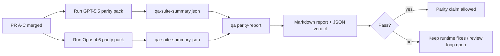

---
read_when:
    - Przegląd serii PR dotyczących zgodności GPT-5.5 / Codex
    - Utrzymywanie sześciokontraktowej architektury agentycznej stojącej za programem zgodności
summary: Jak przejrzeć program zgodności GPT-5.5 / Codex jako cztery jednostki scalania
title: Uwagi maintainera dotyczące zgodności GPT-5.5 / Codex
x-i18n:
    generated_at: "2026-04-26T11:32:49Z"
    model: gpt-5.4
    provider: openai
    source_hash: 8de69081f5985954b88583880c36388dc47116c3351c15d135b8ab3a660058e3
    source_path: help/gpt55-codex-agentic-parity-maintainers.md
    workflow: 15
---

Ta notatka wyjaśnia, jak przejrzeć program zgodności GPT-5.5 / Codex jako cztery jednostki scalania bez utraty oryginalnej sześciokontraktowej architektury.

## Jednostki scalania

### PR A: ścisłe wykonanie agentyczne

Obejmuje:

- `executionContract`
- GPT-5-first same-turn follow-through
- `update_plan` jako nieterminalne śledzenie postępu
- jawne stany blocked zamiast cichych zatrzymań opartych wyłącznie na planie

Nie obejmuje:

- klasyfikacji błędów auth/runtime
- prawdomówności uprawnień
- przeprojektowania replay/continuation
- benchmarkingu zgodności

### PR B: prawdomówność runtime

Obejmuje:

- poprawność zakresów OAuth Codex
- typowaną klasyfikację błędów providera/runtime
- prawdziwą dostępność `/elevated full` i przyczyny blocked

Nie obejmuje:

- normalizacji schematu narzędzi
- stanu replay/liveness
- bramkowania benchmarków

### PR C: poprawność wykonania

Obejmuje:

- kompatybilność narzędzi OpenAI/Codex należącą do providera
- ścisłą obsługę schematów bez parametrów
- ujawnianie replay-invalid
- widoczność stanów paused, blocked i abandoned dla długich zadań

Nie obejmuje:

- continuation wybieranego samodzielnie
- ogólnego zachowania dialektu Codex poza hookami providera
- bramkowania benchmarków

### PR D: harness zgodności

Obejmuje:

- pierwszy pakiet scenariuszy GPT-5.5 vs Opus 4.6
- dokumentację zgodności
- mechanikę raportu zgodności i bramki wydania

Nie obejmuje:

- zmian zachowania runtime poza QA-lab
- symulacji auth/proxy/DNS wewnątrz harnessu

## Mapowanie z powrotem do oryginalnych sześciu kontraktów

| Oryginalny kontrakt                      | Jednostka scalania |
| ---------------------------------------- | ------------------ |
| Poprawność transportu/auth providera     | PR B               |
| Kompatybilność kontraktu/schematu narzędzi | PR C             |
| Wykonanie w tej samej turze              | PR A               |
| Prawdomówność uprawnień                  | PR B               |
| Poprawność replay/continuation/liveness  | PR C               |
| Benchmark/bramka wydania                 | PR D               |

## Kolejność przeglądu

1. PR A
2. PR B
3. PR C
4. PR D

PR D to warstwa dowodowa. Nie powinien być powodem opóźniania PR dotyczących poprawności runtime.

## Na co zwracać uwagę

### PR A

- Uruchomienia GPT-5 wykonują działanie albo kończą się bezpiecznym błędem zamiast zatrzymywać się na komentarzu
- `update_plan` nie wygląda już sam z siebie jak postęp
- zachowanie pozostaje GPT-5-first i ma zakres embedded-Pi

### PR B

- błędy auth/proxy/runtime przestają zapadać się do ogólnej obsługi „model failed”
- `/elevated full` jest opisywane jako dostępne tylko wtedy, gdy rzeczywiście jest dostępne
- przyczyny blocked są widoczne zarówno dla modelu, jak i dla runtime widocznego dla użytkownika

### PR C

- ścisła rejestracja narzędzi OpenAI/Codex należących do providera zachowuje się przewidywalnie
- narzędzia bez parametrów nie kończą się błędem przy ścisłych kontrolach schematu
- wyniki replay i Compaction zachowują prawdziwy stan liveness

### PR D

- pakiet scenariuszy jest zrozumiały i odtwarzalny
- pakiet zawiera ścieżkę mutating replay-safety, a nie tylko przepływy tylko do odczytu
- raporty są czytelne dla ludzi i automatyzacji
- twierdzenia o zgodności są poparte dowodami, a nie anegdotami

Oczekiwane artefakty z PR D:

- `qa-suite-report.md` / `qa-suite-summary.json` dla każdego uruchomienia modelu
- `qa-agentic-parity-report.md` z porównaniem zbiorczym i na poziomie scenariuszy
- `qa-agentic-parity-summary.json` z werdyktem czytelnym maszynowo

## Bramka wydania

Nie twierdź, że GPT-5.5 ma zgodność lub przewagę nad Opus 4.6, dopóki:

- PR A, PR B i PR C nie zostaną scalone
- PR D nie uruchomi czysto pierwszej fali pakietu zgodności
- zestawy regresji runtime-truthfulness pozostają zielone
- raport zgodności nie pokazuje przypadków fake-success i braku regresji zachowania stop

Harness zgodności nie jest jedynym źródłem dowodów. Zachowaj ten podział jako jawny w przeglądzie:

- PR D obejmuje porównanie GPT-5.5 vs Opus 4.6 oparte na scenariuszach
- deterministyczne zestawy PR B nadal obejmują dowody dotyczące auth/proxy/DNS i prawdomówności pełnego dostępu

## Szybki przepływ scalania dla maintainera

Używaj tego, gdy jesteś gotów scalić PR zgodności i chcesz powtarzalnej sekwencji o niskim ryzyku.

1. Potwierdź, że przed scaleniem spełniony jest próg dowodowy:
   - odtwarzalny symptom lub nieprzechodzący test
   - zweryfikowana główna przyczyna w zmienianym kodzie
   - poprawka w ścieżce, której dotyczy problem
   - test regresji lub jawna notatka o ręcznej weryfikacji
2. Triaging/etykiety przed scaleniem:
   - zastosuj wszelkie etykiety autozamknięcia `r:*`, gdy PR nie powinien zostać scalony
   - utrzymuj kandydatów do scalenia bez nierozwiązanych wątków blokujących
3. Zweryfikuj lokalnie na zmienianej powierzchni:
   - `pnpm check:changed`
   - `pnpm test:changed`, gdy zmieniły się testy lub pewność poprawki błędu zależy od pokrycia testami
4. Scal standardowym przepływem maintenera (proces `/landpr`), a następnie zweryfikuj:
   - zachowanie autozamykania powiązanych zgłoszeń
   - CI i status po scaleniu na `main`
5. Po scaleniu uruchom wyszukiwanie duplikatów powiązanych otwartych PR/issues i zamykaj je tylko z kanonicznym odwołaniem.

Jeśli brakuje choć jednego elementu progu dowodowego, poproś o zmiany zamiast scalać.

## Mapa cel–dowód

| Element bramki ukończenia                 | Główny właściciel | Artefakt przeglądu                                                   |
| ----------------------------------------- | ----------------- | -------------------------------------------------------------------- |
| Brak zacięć opartych wyłącznie na planie  | PR A              | testy runtime strict-agentic i `approval-turn-tool-followthrough`    |
| Brak sztucznego postępu lub sztucznego ukończenia narzędzia | PR A + PR D | liczba fake-success zgodności plus szczegóły raportu na poziomie scenariuszy |
| Brak fałszywych wskazówek `/elevated full` | PR B             | deterministyczne zestawy runtime-truthfulness                        |
| Błędy replay/liveness pozostają jawne     | PR C + PR D       | zestawy lifecycle/replay plus `compaction-retry-mutating-tool`       |
| GPT-5.5 dorównuje lub przewyższa Opus 4.6 | PR D              | `qa-agentic-parity-report.md` i `qa-agentic-parity-summary.json`     |

## Skrót dla reviewera: przed vs po

| Problem widoczny dla użytkownika przed zmianą              | Sygnał przeglądu po zmianie                                                            |
| ---------------------------------------------------------- | --------------------------------------------------------------------------------------- |
| GPT-5.5 zatrzymywał się po planowaniu                      | PR A pokazuje zachowanie act-or-block zamiast ukończenia opartego wyłącznie na komentarzu |
| Użycie narzędzi wydawało się kruche przy ścisłych schematach OpenAI/Codex | PR C utrzymuje przewidywalność rejestracji narzędzi i wywołań bez parametrów |
| Wskazówki `/elevated full` bywały mylące                   | PR B wiąże wskazówki z rzeczywistą zdolnością runtime i przyczynami blocked             |
| Długie zadania mogły zniknąć w niejednoznaczności replay/Compaction | PR C emituje jawny stan paused, blocked, abandoned i replay-invalid                 |
| Twierdzenia o zgodności były anegdotyczne                  | PR D tworzy raport plus werdykt JSON z tym samym pokryciem scenariuszy na obu modelach |

## Powiązane

- [Zgodność agentyczna GPT-5.5 / Codex](/pl/help/gpt55-codex-agentic-parity)
