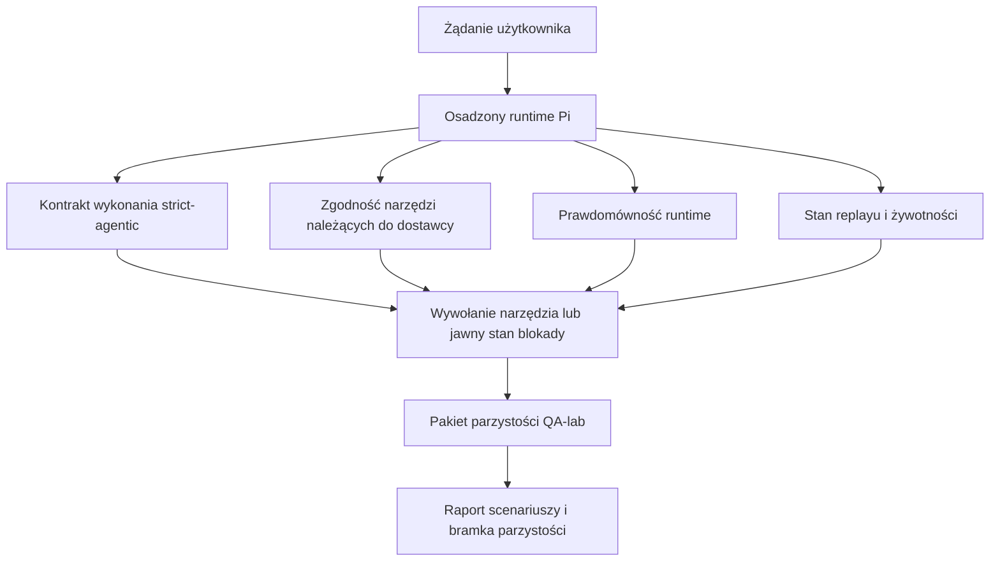
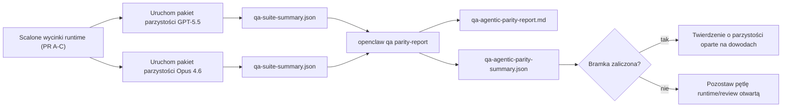

---
read_when:
    - Debugowanie zachowania agenta GPT-5.5 lub Codex
    - Porównywanie zachowania agentycznego OpenClaw między modelami frontier
    - Przegląd poprawek strict-agentic, schematów narzędzi, elevacji i replayu
summary: Jak OpenClaw zamyka luki agentycznego wykonywania dla modeli w stylu GPT-5.5 i Codex
title: Parzystość agentyczna GPT-5.5 / Codex
x-i18n:
    generated_at: "2026-04-26T11:32:48Z"
    model: gpt-5.4
    provider: openai
    source_hash: 8a3b9375cd9e9d95855c4a1135953e00fd7a939e52fb7b75342da3bde2d83fe1
    source_path: help/gpt55-codex-agentic-parity.md
    workflow: 15
---

# Parzystość agentyczna GPT-5.5 / Codex w OpenClaw

OpenClaw już dobrze działał z modelami frontier używającymi narzędzi, ale modele w stylu GPT-5.5 i Codex nadal w kilku praktycznych aspektach wypadały słabiej:

- mogły zatrzymywać się po planowaniu zamiast wykonać pracę
- mogły niepoprawnie używać ścisłych schematów narzędzi OpenAI/Codex
- mogły prosić o `/elevated full`, nawet gdy pełny dostęp był niemożliwy
- mogły tracić stan zadań długotrwałych podczas replayu lub Compaction
- twierdzenia o parzystości względem Claude Opus 4.6 opierały się na anegdotach zamiast na powtarzalnych scenariuszach

Ten program parzystości zamyka te luki w czterech dających się przejrzeć wycinkach.

## Co się zmieniło

### PR A: wykonywanie strict-agentic

Ten wycinek dodaje opcjonalny kontrakt wykonania `strict-agentic` dla osadzonych uruchomień Pi GPT-5.

Po włączeniu OpenClaw przestaje akceptować tury zawierające wyłącznie plan jako „wystarczająco dobre” zakończenie. Jeśli model tylko mówi, co zamierza zrobić, ale faktycznie nie używa narzędzi ani nie robi postępu, OpenClaw ponawia próbę z wymuszeniem działania teraz, a następnie zamyka się bezpiecznie z jawnym stanem blokady zamiast po cichu kończyć zadanie.

To najbardziej poprawia doświadczenie GPT-5.5 w przypadku:

- krótkich follow-upów typu „ok zrób to”
- zadań programistycznych, gdzie pierwszy krok jest oczywisty
- przepływów, w których `update_plan` powinno śledzić postęp zamiast być wypełniaczem tekstowym

### PR B: prawdomówność runtime

Ten wycinek sprawia, że OpenClaw mówi prawdę o dwóch rzeczach:

- dlaczego wywołanie dostawcy/runtime zakończyło się niepowodzeniem
- czy `/elevated full` jest faktycznie dostępne

To oznacza, że GPT-5.5 dostaje lepsze sygnały runtime dla brakującego zakresu, błędów odświeżania auth, błędów auth HTML 403, problemów z proxy, błędów DNS lub timeoutów oraz zablokowanych trybów pełnego dostępu. Model ma mniejszą skłonność do halucynowania błędnej metody naprawy albo ciągłego proszenia o tryb uprawnień, którego runtime nie może zapewnić.

### PR C: poprawność wykonania

Ten wycinek poprawia dwa rodzaje poprawności:

- zgodność schematów narzędzi OpenAI/Codex należących do dostawcy
- ujawnianie replayu i żywotności zadań długotrwałych

Prace nad zgodnością narzędzi zmniejszają tarcie schematów przy ścisłej rejestracji narzędzi OpenAI/Codex, zwłaszcza wokół narzędzi bez parametrów i ścisłych oczekiwań co do obiektu głównego. Prace nad replayem/żywotnością zwiększają obserwowalność zadań długotrwałych, dzięki czemu stany wstrzymane, zablokowane i porzucone są widoczne zamiast ginąć w ogólnym tekście o błędzie.

### PR D: harness parzystości

Ten wycinek dodaje pierwszy pakiet parzystości QA-lab, dzięki któremu GPT-5.5 i Opus 4.6 można ćwiczyć na tych samych scenariuszach i porównywać przy użyciu współdzielonych dowodów.

Pakiet parzystości jest warstwą dowodową. Sam z siebie nie zmienia zachowania runtime.

Gdy masz już dwa artefakty `qa-suite-summary.json`, wygeneruj porównanie release-gate za pomocą:

```bash
pnpm openclaw qa parity-report \
  --repo-root . \
  --candidate-summary .artifacts/qa-e2e/gpt55/qa-suite-summary.json \
  --baseline-summary .artifacts/qa-e2e/opus46/qa-suite-summary.json \
  --output-dir .artifacts/qa-e2e/parity
```

To polecenie zapisuje:

- raport Markdown czytelny dla człowieka
- werdykt JSON czytelny maszynowo
- jawny wynik bramki `pass` / `fail`

## Dlaczego to w praktyce poprawia GPT-5.5

Przed tymi pracami GPT-5.5 w OpenClaw mogło sprawiać wrażenie mniej agentycznego niż Opus w rzeczywistych sesjach programistycznych, ponieważ runtime tolerował zachowania szczególnie szkodliwe dla modeli w stylu GPT-5:

- tury zawierające tylko komentarz
- tarcie schematów wokół narzędzi
- niejasny feedback uprawnień
- ciche psucie replayu lub Compaction

Celem nie jest sprawienie, by GPT-5.5 imitował Opus. Celem jest zapewnienie GPT-5.5 kontraktu runtime, który nagradza rzeczywisty postęp, dostarcza czystszej semantyki narzędzi i uprawnień oraz zamienia tryby awarii w jawne stany czytelne zarówno dla maszyn, jak i ludzi.

To zmienia doświadczenie użytkownika z:

- „model miał dobry plan, ale się zatrzymał”

na:

- „model albo zadziałał, albo OpenClaw ujawnił dokładny powód, dla którego nie mógł”

## Przed i po dla użytkowników GPT-5.5

| Przed tym programem                                                                         | Po PR A-D                                                                               |
| ------------------------------------------------------------------------------------------- | --------------------------------------------------------------------------------------- |
| GPT-5.5 mogło zatrzymać się po rozsądnym planie bez wykonania kolejnego kroku narzędziowego | PR A zamienia „tylko plan” w „działaj teraz albo pokaż stan blokady”                   |
| Ścisłe schematy narzędzi mogły w mylący sposób odrzucać narzędzia bez parametrów lub w kształcie OpenAI/Codex | PR C czyni rejestrację i wywoływanie narzędzi należących do dostawcy bardziej przewidywalnymi |
| Wskazówki `/elevated full` mogły być niejasne albo błędne w zablokowanych runtime          | PR B daje GPT-5.5 i użytkownikowi prawdziwe wskazówki runtime i uprawnień              |
| Błędy replayu lub Compaction mogły sprawiać wrażenie, że zadanie po cichu zniknęło         | PR C jawnie pokazuje wyniki paused, blocked, abandoned i replay-invalid                |
| „GPT-5.5 wypada gorzej niż Opus” było głównie anegdotyczne                                 | PR D zamienia to w ten sam pakiet scenariuszy, te same metryki i twardą bramkę pass/fail |

## Architektura



## Przepływ wydania



## Pakiet scenariuszy

Pakiet parzystości pierwszej fali obejmuje obecnie pięć scenariuszy:

### `approval-turn-tool-followthrough`

Sprawdza, czy model nie zatrzymuje się na „zrobię to” po krótkiej aprobacie. Powinien wykonać pierwszą konkretną akcję w tej samej turze.

### `model-switch-tool-continuity`

Sprawdza, czy praca z użyciem narzędzi pozostaje spójna na granicach przełączania modelu/runtime, zamiast resetować się do komentarza lub tracić kontekst wykonania.

### `source-docs-discovery-report`

Sprawdza, czy model potrafi czytać źródła i dokumentację, syntetyzować ustalenia i kontynuować zadanie agentycznie, zamiast tworzyć cienkie podsumowanie i zatrzymywać się zbyt wcześnie.

### `image-understanding-attachment`

Sprawdza, czy zadania mieszane obejmujące załączniki pozostają wykonalne i nie zapadają się do niejasnej narracji.

### `compaction-retry-mutating-tool`

Sprawdza, czy zadanie z rzeczywistym mutującym zapisem zachowuje jawną niebezpieczność replayu zamiast po cichu wyglądać na bezpieczne dla replayu, jeśli uruchomienie przechodzi Compaction, retry lub traci stan odpowiedzi pod presją.

## Macierz scenariuszy

| Scenariusz                         | Co testuje                               | Dobre zachowanie GPT-5.5                                                         | Sygnał awarii                                                                    |
| ---------------------------------- | ---------------------------------------- | --------------------------------------------------------------------------------- | -------------------------------------------------------------------------------- |
| `approval-turn-tool-followthrough` | Krótkie tury aprobaty po planie          | Natychmiast rozpoczyna pierwszą konkretną akcję narzędzia zamiast powtarzać zamiar | follow-up tylko z planem, brak aktywności narzędzi lub tura blocked bez realnej blokady |
| `model-switch-tool-continuity`     | Przełączanie runtime/modelu przy użyciu narzędzi | Zachowuje kontekst zadania i nadal działa spójnie                                | reset do komentarza, utrata kontekstu narzędzi lub zatrzymanie po przełączeniu  |
| `source-docs-discovery-report`     | Czytanie źródeł + synteza + działanie    | Znajduje źródła, używa narzędzi i tworzy użyteczny raport bez zacięcia            | cienkie podsumowanie, brak pracy narzędziowej lub zatrzymanie na niepełnej turze |
| `image-understanding-attachment`   | Agentyczna praca oparta na załączniku    | Interpretuje załącznik, łączy go z narzędziami i kontynuuje zadanie              | niejasna narracja, zignorowany załącznik lub brak konkretnej kolejnej akcji      |
| `compaction-retry-mutating-tool`   | Mutująca praca pod presją Compaction     | Wykonuje rzeczywisty zapis i utrzymuje jawną niebezpieczność replayu po skutku ubocznym | mutujący zapis następuje, ale bezpieczeństwo replayu jest sugerowane, nieobecne lub sprzeczne |

## Release gate

GPT-5.5 można uznać za na poziomie parzystości lub lepsze tylko wtedy, gdy scalony runtime jednocześnie przechodzi pakiet parzystości i regresje prawdomówności runtime.

Wymagane wyniki:

- brak zacięcia na samym planie, gdy kolejna akcja narzędzia jest oczywista
- brak fałszywego zakończenia bez rzeczywistego wykonania
- brak błędnych wskazówek `/elevated full`
- brak cichego porzucenia replayu lub Compaction
- metryki pakietu parzystości co najmniej tak mocne jak uzgodniony baseline Opus 4.6

Dla harnessu pierwszej fali bramka porównuje:

- completion rate
- unintended-stop rate
- valid-tool-call rate
- fake-success count

Dowody parzystości są celowo rozdzielone na dwie warstwy:

- PR D dowodzi zachowania GPT-5.5 vs Opus 4.6 w tych samych scenariuszach za pomocą QA-lab
- deterministyczne zestawy PR B dowodzą prawdomówności auth, proxy, DNS i `/elevated full` poza harnessem

## Macierz cel-do-dowodu

| Element bramki ukończenia                             | Odpowiedzialny PR | Źródło dowodu                                                      | Sygnał zaliczenia                                                                       |
| ----------------------------------------------------- | ----------------- | ------------------------------------------------------------------ | --------------------------------------------------------------------------------------- |
| GPT-5.5 nie zacina się już po planowaniu              | PR A              | `approval-turn-tool-followthrough` plus zestawy runtime PR A       | tury aprobaty wywołują rzeczywistą pracę lub jawny stan blokady                        |
| GPT-5.5 nie udaje już postępu ani fałszywego zakończenia narzędzia | PR A + PR D       | wyniki scenariuszy raportu parzystości i fake-success count        | brak podejrzanych wyników pass i brak zakończeń zawierających tylko komentarz           |
| GPT-5.5 nie daje już fałszywych wskazówek `/elevated full` | PR B              | deterministyczne zestawy prawdomówności                            | przyczyny blokady i wskazówki pełnego dostępu pozostają zgodne z runtime                |
| Błędy replayu/żywotności pozostają jawne             | PR C + PR D       | zestawy lifecycle/replay PR C plus `compaction-retry-mutating-tool` | mutująca praca utrzymuje jawną niebezpieczność replayu zamiast po cichu znikać         |
| GPT-5.5 dorównuje lub przewyższa Opus 4.6 w uzgodnionych metrykach | PR D              | `qa-agentic-parity-report.md` i `qa-agentic-parity-summary.json`   | to samo pokrycie scenariuszy i brak regresji w completion, zachowaniu stop lub poprawnym użyciu narzędzi |

## Jak czytać werdykt parzystości

Użyj werdyktu w `qa-agentic-parity-summary.json` jako ostatecznej decyzji czytelnej maszynowo dla pakietu parzystości pierwszej fali.

- `pass` oznacza, że GPT-5.5 pokryło te same scenariusze co Opus 4.6 i nie zanotowało regresji w uzgodnionych zagregowanych metrykach.
- `fail` oznacza, że uruchomiła się przynajmniej jedna twarda bramka: słabszy completion, gorszy unintended stop, słabsze poprawne użycie narzędzi, dowolny przypadek fake-success lub niedopasowane pokrycie scenariuszy.
- „shared/base CI issue” samo w sobie nie jest wynikiem parzystości. Jeśli szum CI poza PR D blokuje uruchomienie, werdykt powinien poczekać na czyste wykonanie scalonego runtime zamiast być wyciągany z logów z epoki gałęzi.
- Prawdomówność auth, proxy, DNS i `/elevated full` nadal pochodzi z deterministycznych zestawów PR B, więc końcowe twierdzenie wydaniowe wymaga obu elementów: zaliczonego werdyktu parzystości PR D i zielonego pokrycia prawdomówności PR B.

## Kto powinien włączyć `strict-agentic`

Użyj `strict-agentic`, gdy:

- od agenta oczekuje się natychmiastowego działania, gdy kolejny krok jest oczywisty
- podstawowym runtime są modele z rodziny GPT-5.5 lub Codex
- wolisz jawne stany blokady zamiast „pomocnych” odpowiedzi zawierających tylko podsumowanie

Pozostaw domyślny kontrakt, gdy:

- chcesz zachować istniejące luźniejsze zachowanie
- nie używasz modeli z rodziny GPT-5
- testujesz promptty, a nie egzekwowanie przez runtime

## Powiązane

- [Uwagi maintainerów dotyczące parzystości GPT-5.5 / Codex](/pl/help/gpt55-codex-agentic-parity-maintainers)
