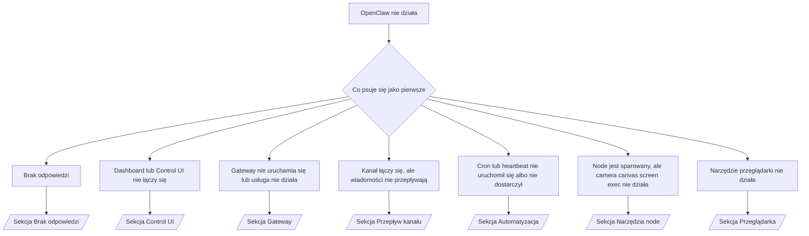

---
read_when:
    - OpenClaw nie działa i potrzebujesz najszybszej drogi do rozwiązania
    - Chcesz przejść przez proces triage, zanim zagłębisz się w szczegółowe instrukcje
summary: Centrum rozwiązywania problemów OpenClaw zorientowane na objawy
title: Ogólne rozwiązywanie problemów
x-i18n:
    generated_at: "2026-04-08T02:16:21Z"
    model: gpt-5.4
    provider: openai
    source_hash: 8abda90ef80234c2f91a51c5e1f2c004d4a4da12a5d5631b5927762550c6d5e3
    source_path: help/troubleshooting.md
    workflow: 15
---

# Rozwiązywanie problemów

Jeśli masz tylko 2 minuty, potraktuj tę stronę jako punkt wejścia do triage.

## Pierwsze 60 sekund

Uruchom dokładnie tę sekwencję, po kolei:

```bash
openclaw status
openclaw status --all
openclaw gateway probe
openclaw gateway status
openclaw doctor
openclaw channels status --probe
openclaw logs --follow
```

Prawidłowe dane wyjściowe w jednym wierszu:

- `openclaw status` → pokazuje skonfigurowane kanały i brak oczywistych błędów uwierzytelniania.
- `openclaw status --all` → pełny raport jest dostępny i można go udostępnić.
- `openclaw gateway probe` → oczekiwany cel gateway jest osiągalny (`Reachable: yes`). `RPC: limited - missing scope: operator.read` oznacza pogorszoną diagnostykę, a nie błąd połączenia.
- `openclaw gateway status` → `Runtime: running` i `RPC probe: ok`.
- `openclaw doctor` → brak blokujących błędów konfiguracji/usługi.
- `openclaw channels status --probe` → osiągalny gateway zwraca stan transportu na żywo dla każdego konta oraz wyniki probe/audytu, takie jak `works` lub `audit ok`; jeśli gateway jest nieosiągalny, polecenie wraca do podsumowań opartych wyłącznie na konfiguracji.
- `openclaw logs --follow` → stabilna aktywność, bez powtarzających się błędów krytycznych.

## Anthropic long context 429

Jeśli widzisz:
`HTTP 429: rate_limit_error: Extra usage is required for long context requests`,
przejdź do [/gateway/troubleshooting#anthropic-429-extra-usage-required-for-long-context](/pl/gateway/troubleshooting#anthropic-429-extra-usage-required-for-long-context).

## Lokalny backend zgodny z OpenAI działa bezpośrednio, ale nie działa w OpenClaw

Jeśli lokalny lub samodzielnie hostowany backend `/v1` odpowiada na małe bezpośrednie
zapytania testowe `/v1/chat/completions`, ale nie działa z `openclaw infer model run` ani podczas zwykłych
tur agenta:

1. Jeśli błąd wspomina o `messages[].content` oczekującym ciągu znaków, ustaw
   `models.providers.<provider>.models[].compat.requiresStringContent: true`.
2. Jeśli backend nadal zawodzi tylko podczas tur agenta OpenClaw, ustaw
   `models.providers.<provider>.models[].compat.supportsTools: false` i spróbuj ponownie.
3. Jeśli małe bezpośrednie wywołania nadal działają, ale większe prompty OpenClaw powodują awarię
   backendu, potraktuj pozostały problem jako ograniczenie modelu/serwera po stronie upstream i
   przejdź do szczegółowej instrukcji:
   [/gateway/troubleshooting#local-openai-compatible-backend-passes-direct-probes-but-agent-runs-fail](/pl/gateway/troubleshooting#local-openai-compatible-backend-passes-direct-probes-but-agent-runs-fail)

## Instalacja pluginu kończy się błędem z powodu brakujących rozszerzeń openclaw

Jeśli instalacja kończy się błędem `package.json missing openclaw.extensions`, pakiet pluginu
używa starej struktury, której OpenClaw już nie akceptuje.

Naprawa w pakiecie pluginu:

1. Dodaj `openclaw.extensions` do `package.json`.
2. Skieruj wpisy do zbudowanych plików runtime (zwykle `./dist/index.js`).
3. Opublikuj plugin ponownie i uruchom `openclaw plugins install <package>` jeszcze raz.

Przykład:

```json
{
  "name": "@openclaw/my-plugin",
  "version": "1.2.3",
  "openclaw": {
    "extensions": ["./dist/index.js"]
  }
}
```

Odwołanie: [Architektura pluginów](/pl/plugins/architecture)

## Drzewo decyzyjne



<AccordionGroup>
  <Accordion title="Brak odpowiedzi">
    ```bash
    openclaw status
    openclaw gateway status
    openclaw channels status --probe
    openclaw pairing list --channel <channel> [--account <id>]
    openclaw logs --follow
    ```

    Prawidłowe dane wyjściowe wyglądają tak:

    - `Runtime: running`
    - `RPC probe: ok`
    - Twój kanał pokazuje podłączony transport oraz, jeśli jest obsługiwane, `works` lub `audit ok` w `channels status --probe`
    - Nadawca jest zatwierdzony (lub polityka DM jest otwarta/lista dozwolonych)

    Typowe sygnatury logów:

    - `drop guild message (mention required` → bramka wzmianek zablokowała wiadomość w Discord.
    - `pairing request` → nadawca jest niezatwierdzony i czeka na zgodę sparowania DM.
    - `blocked` / `allowlist` w logach kanału → nadawca, pokój lub grupa są filtrowane.

    Szczegółowe strony:

    - [/gateway/troubleshooting#no-replies](/pl/gateway/troubleshooting#no-replies)
    - [/channels/troubleshooting](/pl/channels/troubleshooting)
    - [/channels/pairing](/pl/channels/pairing)

  </Accordion>

  <Accordion title="Dashboard lub Control UI nie łączy się">
    ```bash
    openclaw status
    openclaw gateway status
    openclaw logs --follow
    openclaw doctor
    openclaw channels status --probe
    ```

    Prawidłowe dane wyjściowe wyglądają tak:

    - `Dashboard: http://...` jest pokazane w `openclaw gateway status`
    - `RPC probe: ok`
    - Brak pętli uwierzytelniania w logach

    Typowe sygnatury logów:

    - `device identity required` → kontekst HTTP/niezabezpieczony nie może ukończyć uwierzytelniania urządzenia.
    - `origin not allowed` → przeglądarkowy `Origin` nie jest dozwolony dla celu gateway Control UI.
    - `AUTH_TOKEN_MISMATCH` z podpowiedziami ponownej próby (`canRetryWithDeviceToken=true`) → może automatycznie wystąpić jedna ponowna próba z zaufanym tokenem urządzenia.
    - Ta ponowna próba z pamięci podręcznej ponownie używa zestawu scope z pamięci podręcznej zapisanego razem ze sparowanym tokenem urządzenia. Wywołania z jawnym `deviceToken` / jawnymi `scopes` zachowują zamiast tego żądany zestaw scope.
    - W asynchronicznej ścieżce Tailscale Serve dla Control UI nieudane próby dla tego samego `{scope, ip}` są serializowane, zanim ogranicznik zarejestruje niepowodzenie, więc druga równoległa błędna ponowna próba może już zwrócić `retry later`.
    - `too many failed authentication attempts (retry later)` z pochodzenia przeglądarki localhost → powtarzające się niepowodzenia z tego samego `Origin` są tymczasowo blokowane; inne pochodzenie localhost używa osobnego bucketu.
    - powtarzające się `unauthorized` po tej ponownej próbie → błędny token/hasło, niedopasowanie trybu uwierzytelniania lub nieaktualny sparowany token urządzenia.
    - `gateway connect failed:` → UI kieruje do błędnego URL/portu lub do nieosiągalnego gateway.

    Szczegółowe strony:

    - [/gateway/troubleshooting#dashboard-control-ui-connectivity](/pl/gateway/troubleshooting#dashboard-control-ui-connectivity)
    - [/web/control-ui](/web/control-ui)
    - [/gateway/authentication](/pl/gateway/authentication)

  </Accordion>

  <Accordion title="Gateway nie uruchamia się lub usługa jest zainstalowana, ale nie działa">
    ```bash
    openclaw status
    openclaw gateway status
    openclaw logs --follow
    openclaw doctor
    openclaw channels status --probe
    ```

    Prawidłowe dane wyjściowe wyglądają tak:

    - `Service: ... (loaded)`
    - `Runtime: running`
    - `RPC probe: ok`

    Typowe sygnatury logów:

    - `Gateway start blocked: set gateway.mode=local` lub `existing config is missing gateway.mode` → tryb gateway jest zdalny albo w pliku konfiguracji brakuje oznaczenia trybu lokalnego i należy go naprawić.
    - `refusing to bind gateway ... without auth` → powiązanie spoza loopback bez prawidłowej ścieżki uwierzytelniania gateway (token/hasło lub trusted-proxy, jeśli skonfigurowano).
    - `another gateway instance is already listening` lub `EADDRINUSE` → port jest już zajęty.

    Szczegółowe strony:

    - [/gateway/troubleshooting#gateway-service-not-running](/pl/gateway/troubleshooting#gateway-service-not-running)
    - [/gateway/background-process](/pl/gateway/background-process)
    - [/gateway/configuration](/pl/gateway/configuration)

  </Accordion>

  <Accordion title="Kanał łączy się, ale wiadomości nie przepływają">
    ```bash
    openclaw status
    openclaw gateway status
    openclaw logs --follow
    openclaw doctor
    openclaw channels status --probe
    ```

    Prawidłowe dane wyjściowe wyglądają tak:

    - Transport kanału jest połączony.
    - Kontrole pairing/allowlist przechodzą pomyślnie.
    - Wzmianki są wykrywane tam, gdzie jest to wymagane.

    Typowe sygnatury logów:

    - `mention required` → bramka wzmianek grupowych zablokowała przetwarzanie.
    - `pairing` / `pending` → nadawca DM nie jest jeszcze zatwierdzony.
    - `not_in_channel`, `missing_scope`, `Forbidden`, `401/403` → problem z tokenem uprawnień kanału.

    Szczegółowe strony:

    - [/gateway/troubleshooting#channel-connected-messages-not-flowing](/pl/gateway/troubleshooting#channel-connected-messages-not-flowing)
    - [/channels/troubleshooting](/pl/channels/troubleshooting)

  </Accordion>

  <Accordion title="Cron lub heartbeat nie uruchomił się albo nie dostarczył">
    ```bash
    openclaw status
    openclaw gateway status
    openclaw cron status
    openclaw cron list
    openclaw cron runs --id <jobId> --limit 20
    openclaw logs --follow
    ```

    Prawidłowe dane wyjściowe wyglądają tak:

    - `cron.status` pokazuje, że jest włączony i ma następne wybudzenie.
    - `cron runs` pokazuje ostatnie wpisy `ok`.
    - Heartbeat jest włączony i nie znajduje się poza aktywnymi godzinami.

    Typowe sygnatury logów:

- `cron: scheduler disabled; jobs will not run automatically` → cron jest wyłączony.
- `heartbeat skipped` z `reason=quiet-hours` → poza skonfigurowanymi aktywnymi godzinami.
- `heartbeat skipped` z `reason=empty-heartbeat-file` → `HEARTBEAT.md` istnieje, ale zawiera tylko puste/nagłówkowe szkielety.
- `heartbeat skipped` z `reason=no-tasks-due` → tryb zadań `HEARTBEAT.md` jest aktywny, ale żaden z interwałów zadań nie jest jeszcze należny.
- `heartbeat skipped` z `reason=alerts-disabled` → cała widoczność heartbeat jest wyłączona (`showOk`, `showAlerts` i `useIndicator` są wyłączone).
- `requests-in-flight` → główna ścieżka jest zajęta; wybudzenie heartbeat zostało odroczone. - `unknown accountId` → docelowe konto dostarczania heartbeat nie istnieje.

      Szczegółowe strony:

      - [/gateway/troubleshooting#cron-and-heartbeat-delivery](/pl/gateway/troubleshooting#cron-and-heartbeat-delivery)
      - [/automation/cron-jobs#troubleshooting](/pl/automation/cron-jobs#troubleshooting)
      - [/gateway/heartbeat](/pl/gateway/heartbeat)

    </Accordion>

    <Accordion title="Node jest sparowany, ale narzędzie camera canvas screen exec nie działa">
      ```bash
      openclaw status
      openclaw gateway status
      openclaw nodes status
      openclaw nodes describe --node <idOrNameOrIp>
      openclaw logs --follow
      ```

      Prawidłowe dane wyjściowe wyglądają tak:

      - Node jest wymieniony jako połączony i sparowany dla roli `node`.
      - Dla wywoływanego polecenia istnieje capability.
      - Stan uprawnień jest przyznany dla narzędzia.

      Typowe sygnatury logów:

      - `NODE_BACKGROUND_UNAVAILABLE` → przenieś aplikację node na pierwszy plan.
      - `*_PERMISSION_REQUIRED` → uprawnienie systemowe zostało odrzucone lub nie istnieje.
      - `SYSTEM_RUN_DENIED: approval required` → oczekuje zatwierdzenie exec.
      - `SYSTEM_RUN_DENIED: allowlist miss` → polecenia nie ma na liście dozwolonych exec.

      Szczegółowe strony:

      - [/gateway/troubleshooting#node-paired-tool-fails](/pl/gateway/troubleshooting#node-paired-tool-fails)
      - [/nodes/troubleshooting](/pl/nodes/troubleshooting)
      - [/tools/exec-approvals](/pl/tools/exec-approvals)

    </Accordion>

    <Accordion title="Exec nagle prosi o zatwierdzenie">
      ```bash
      openclaw config get tools.exec.host
      openclaw config get tools.exec.security
      openclaw config get tools.exec.ask
      openclaw gateway restart
      ```

      Co się zmieniło:

      - Jeśli `tools.exec.host` nie jest ustawione, wartością domyślną jest `auto`.
      - `host=auto` rozstrzyga się do `sandbox`, gdy aktywne jest środowisko sandbox, w przeciwnym razie do `gateway`.
      - `host=auto` dotyczy tylko routingu; zachowanie „YOLO” bez promptu wynika z `security=full` oraz `ask=off` na gateway/node.
      - W `gateway` i `node` nieustawione `tools.exec.security` domyślnie przyjmuje wartość `full`.
      - Nieustawione `tools.exec.ask` domyślnie przyjmuje wartość `off`.
      - Wniosek: jeśli widzisz zatwierdzenia, jakaś lokalna dla hosta lub dla sesji polityka zaostrzyła exec względem obecnych wartości domyślnych.

      Przywróć obecne domyślne zachowanie bez zatwierdzeń:

      ```bash
      openclaw config set tools.exec.host gateway
      openclaw config set tools.exec.security full
      openclaw config set tools.exec.ask off
      openclaw gateway restart
      ```

      Bezpieczniejsze alternatywy:

      - Ustaw tylko `tools.exec.host=gateway`, jeśli chcesz po prostu stabilnego routingu hosta.
      - Użyj `security=allowlist` z `ask=on-miss`, jeśli chcesz exec na hoście, ale nadal chcesz przeglądu przy chybieniach allowlist.
      - Włącz tryb sandbox, jeśli chcesz, aby `host=auto` znowu rozstrzygał się do `sandbox`.

      Typowe sygnatury logów:

      - `Approval required.` → polecenie czeka na `/approve ...`.
      - `SYSTEM_RUN_DENIED: approval required` → oczekuje zatwierdzenie exec na hoście node.
      - `exec host=sandbox requires a sandbox runtime for this session` → niejawny/jawny wybór sandbox, ale tryb sandbox jest wyłączony.

      Szczegółowe strony:

      - [/tools/exec](/pl/tools/exec)
      - [/tools/exec-approvals](/pl/tools/exec-approvals)
      - [/gateway/security#runtime-expectation-drift](/pl/gateway/security#runtime-expectation-drift)

    </Accordion>

    <Accordion title="Narzędzie przeglądarki nie działa">
      ```bash
      openclaw status
      openclaw gateway status
      openclaw browser status
      openclaw logs --follow
      openclaw doctor
      ```

      Prawidłowe dane wyjściowe wyglądają tak:

      - Status przeglądarki pokazuje `running: true` oraz wybraną przeglądarkę/profil.
      - `openclaw` uruchamia się lub `user` widzi lokalne karty Chrome.

      Typowe sygnatury logów:

      - `unknown command "browser"` lub `unknown command 'browser'` → ustawiono `plugins.allow` i nie zawiera ono `browser`.
      - `Failed to start Chrome CDP on port` → nie udało się uruchomić lokalnej przeglądarki.
      - `browser.executablePath not found` → skonfigurowana ścieżka do pliku binarnego jest błędna.
      - `browser.cdpUrl must be http(s) or ws(s)` → skonfigurowany URL CDP używa nieobsługiwanego schematu.
      - `browser.cdpUrl has invalid port` → skonfigurowany URL CDP ma nieprawidłowy port lub port spoza zakresu.
      - `No Chrome tabs found for profile="user"` → profil dołączania Chrome MCP nie ma otwartych lokalnych kart Chrome.
      - `Remote CDP for profile "<name>" is not reachable` → skonfigurowany zdalny endpoint CDP jest nieosiągalny z tego hosta.
      - `Browser attachOnly is enabled ... not reachable` lub `Browser attachOnly is enabled and CDP websocket ... is not reachable` → profil tylko-dołączania nie ma aktywnego celu CDP.
      - nieaktualne nadpisania viewport / dark-mode / locale / offline w profilach tylko-dołączania lub zdalnego CDP → uruchom `openclaw browser stop --browser-profile <name>`, aby zamknąć aktywną sesję sterowania i zwolnić stan emulacji bez restartowania gateway.

      Szczegółowe strony:

      - [/gateway/troubleshooting#browser-tool-fails](/pl/gateway/troubleshooting#browser-tool-fails)
      - [/tools/browser#missing-browser-command-or-tool](/pl/tools/browser#missing-browser-command-or-tool)
      - [/tools/browser-linux-troubleshooting](/pl/tools/browser-linux-troubleshooting)
      - [/tools/browser-wsl2-windows-remote-cdp-troubleshooting](/pl/tools/browser-wsl2-windows-remote-cdp-troubleshooting)

    </Accordion>
  </AccordionGroup>

## Powiązane

- [FAQ](/pl/help/faq) — często zadawane pytania
- [Rozwiązywanie problemów z Gateway](/pl/gateway/troubleshooting) — problemy specyficzne dla gateway
- [Doctor](/pl/gateway/doctor) — zautomatyzowane kontrole kondycji i naprawy
- [Rozwiązywanie problemów z kanałami](/pl/channels/troubleshooting) — problemy z łącznością kanałów
- [Rozwiązywanie problemów z automatyzacją](/pl/automation/cron-jobs#troubleshooting) — problemy z cron i heartbeat
