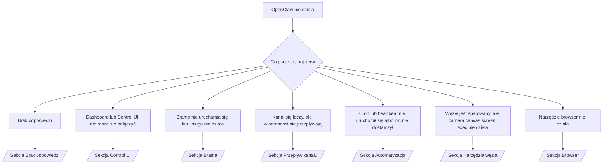

---
read_when:
    - OpenClaw nie działa i potrzebujesz najszybszej drogi do rozwiązania problemu
    - Chcesz przejść przez proces wstępnej diagnostyki, zanim zagłębisz się w szczegółowe instrukcje postępowania
summary: Hub rozwiązywania problemów dla OpenClaw według objawów
title: Ogólne rozwiązywanie problemów
x-i18n:
    generated_at: "2026-04-11T02:45:34Z"
    model: gpt-5.4
    provider: openai
    source_hash: 16b38920dbfdc8d4a79bbb5d6fab2c67c9f218a97c36bb4695310d7db9c4614a
    source_path: help/troubleshooting.md
    workflow: 15
---

# Rozwiązywanie problemów

Jeśli masz tylko 2 minuty, użyj tej strony jako punktu wejścia do wstępnej diagnostyki.

## Pierwsze 60 sekund

Uruchom dokładnie tę sekwencję poleceń, w tej kolejności:

```bash
openclaw status
openclaw status --all
openclaw gateway probe
openclaw gateway status
openclaw doctor
openclaw channels status --probe
openclaw logs --follow
```

Prawidłowy wynik w jednym wierszu:

- `openclaw status` → pokazuje skonfigurowane kanały i brak oczywistych błędów uwierzytelniania.
- `openclaw status --all` → pełny raport jest dostępny i nadaje się do udostępnienia.
- `openclaw gateway probe` → oczekiwany cel bramy jest osiągalny (`Reachable: yes`). `RPC: limited - missing scope: operator.read` oznacza ograniczoną diagnostykę, a nie błąd połączenia.
- `openclaw gateway status` → `Runtime: running` oraz `RPC probe: ok`.
- `openclaw doctor` → brak blokujących błędów konfiguracji/usługi.
- `openclaw channels status --probe` → osiągalna brama zwraca stan transportu na żywo dla każdego konta
  oraz wyniki sondy/audytu, takie jak `works` lub `audit ok`; jeśli
  brama jest nieosiągalna, polecenie przechodzi do podsumowań opartych tylko na konfiguracji.
- `openclaw logs --follow` → stabilna aktywność, bez powtarzających się krytycznych błędów.

## Anthropic long context 429

Jeśli widzisz:
`HTTP 429: rate_limit_error: Extra usage is required for long context requests`,
przejdź do [/gateway/troubleshooting#anthropic-429-extra-usage-required-for-long-context](/pl/gateway/troubleshooting#anthropic-429-extra-usage-required-for-long-context).

## Lokalny backend zgodny z OpenAI działa bezpośrednio, ale nie działa w OpenClaw

Jeśli lokalny lub hostowany samodzielnie backend `/v1` odpowiada na małe
bezpośrednie sondy `/v1/chat/completions`, ale nie działa przy `openclaw infer model run` lub zwykłych
turach agenta:

1. Jeśli błąd wspomina o `messages[].content`, które ma oczekiwać ciągu znaków, ustaw
   `models.providers.<provider>.models[].compat.requiresStringContent: true`.
2. Jeśli backend nadal nie działa tylko podczas tur agenta OpenClaw, ustaw
   `models.providers.<provider>.models[].compat.supportsTools: false` i spróbuj ponownie.
3. Jeśli małe bezpośrednie wywołania nadal działają, ale większe monity OpenClaw powodują awarię
   backendu, potraktuj pozostały problem jako ograniczenie modelu/serwera po stronie upstream i
   przejdź do szczegółowej instrukcji:
   [/gateway/troubleshooting#local-openai-compatible-backend-passes-direct-probes-but-agent-runs-fail](/pl/gateway/troubleshooting#local-openai-compatible-backend-passes-direct-probes-but-agent-runs-fail)

## Instalacja pluginu kończy się niepowodzeniem z powodu braku rozszerzeń openclaw

Jeśli instalacja kończy się błędem `package.json missing openclaw.extensions`, pakiet pluginu
używa starego formatu, którego OpenClaw już nie akceptuje.

Poprawka w pakiecie pluginu:

1. Dodaj `openclaw.extensions` do `package.json`.
2. Skieruj wpisy na zbudowane pliki środowiska uruchomieniowego (zwykle `./dist/index.js`).
3. Opublikuj plugin ponownie i uruchom `openclaw plugins install <package>` jeszcze raz.

Przykład:

```json
{
  "name": "@openclaw/my-plugin",
  "version": "1.2.3",
  "openclaw": {
    "extensions": ["./dist/index.js"]
  }
}
```

Dokument referencyjny: [Architektura pluginów](/pl/plugins/architecture)

## Drzewo decyzyjne



<AccordionGroup>
  <Accordion title="Brak odpowiedzi">
    ```bash
    openclaw status
    openclaw gateway status
    openclaw channels status --probe
    openclaw pairing list --channel <channel> [--account <id>]
    openclaw logs --follow
    ```

    Prawidłowy wynik wygląda tak:

    - `Runtime: running`
    - `RPC probe: ok`
    - Kanał pokazuje połączony transport i, tam gdzie jest to obsługiwane, `works` lub `audit ok` w `channels status --probe`
    - Nadawca wydaje się zatwierdzony (albo zasada DM jest otwarta/lista dozwolonych)

    Typowe sygnatury w logach:

    - `drop guild message (mention required` → blokada wzmianki zablokowała wiadomość w Discordzie.
    - `pairing request` → nadawca nie jest zatwierdzony i czeka na zatwierdzenie parowania DM.
    - `blocked` / `allowlist` w logach kanału → nadawca, pokój lub grupa jest filtrowana.

    Szczegółowe strony:

    - [/gateway/troubleshooting#no-replies](/pl/gateway/troubleshooting#no-replies)
    - [/channels/troubleshooting](/pl/channels/troubleshooting)
    - [/channels/pairing](/pl/channels/pairing)

  </Accordion>

  <Accordion title="Dashboard lub Control UI nie może się połączyć">
    ```bash
    openclaw status
    openclaw gateway status
    openclaw logs --follow
    openclaw doctor
    openclaw channels status --probe
    ```

    Prawidłowy wynik wygląda tak:

    - `Dashboard: http://...` jest pokazywane w `openclaw gateway status`
    - `RPC probe: ok`
    - Brak pętli uwierzytelniania w logach

    Typowe sygnatury w logach:

    - `device identity required` → kontekst HTTP/niezabezpieczony nie może ukończyć uwierzytelniania urządzenia.
    - `origin not allowed` → przeglądarkowe `Origin` nie jest dozwolone dla
      celu bramy Control UI.
    - `AUTH_TOKEN_MISMATCH` ze wskazówkami ponowienia (`canRetryWithDeviceToken=true`) → jedna zaufana próba ponowienia z tokenem urządzenia może nastąpić automatycznie.
    - To ponowienie z użyciem tokenu z pamięci podręcznej wykorzystuje zapisany wraz ze sparowanym
      tokenem urządzenia zestaw zakresów. Wywołujący z jawnym `deviceToken` / jawnymi `scopes` zachowują
      zamiast tego żądany zestaw zakresów.
    - W asynchronicznej ścieżce Tailscale Serve Control UI nieudane próby dla tego samego
      `{scope, ip}` są serializowane, zanim ogranicznik zarejestruje niepowodzenie, więc
      drugie równoległe błędne ponowienie może już pokazać `retry later`.
    - `too many failed authentication attempts (retry later)` z lokalnego
      pochodzenia przeglądarki localhost → powtarzające się nieudane próby z tego samego `Origin` są tymczasowo
      blokowane; inne pochodzenie localhost używa osobnego przedziału.
    - powtarzające się `unauthorized` po tej próbie ponowienia → zły token/hasło, niedopasowany tryb uwierzytelniania lub nieaktualny sparowany token urządzenia.
    - `gateway connect failed:` → UI kieruje na zły URL/port lub nieosiągalną bramę.

    Szczegółowe strony:

    - [/gateway/troubleshooting#dashboard-control-ui-connectivity](/pl/gateway/troubleshooting#dashboard-control-ui-connectivity)
    - [/web/control-ui](/web/control-ui)
    - [/gateway/authentication](/pl/gateway/authentication)

  </Accordion>

  <Accordion title="Brama nie uruchamia się lub usługa jest zainstalowana, ale nie działa">
    ```bash
    openclaw status
    openclaw gateway status
    openclaw logs --follow
    openclaw doctor
    openclaw channels status --probe
    ```

    Prawidłowy wynik wygląda tak:

    - `Service: ... (loaded)`
    - `Runtime: running`
    - `RPC probe: ok`

    Typowe sygnatury w logach:

    - `Gateway start blocked: set gateway.mode=local` lub `existing config is missing gateway.mode` → tryb bramy to remote albo w pliku konfiguracji brakuje oznaczenia trybu lokalnego i należy to naprawić.
    - `refusing to bind gateway ... without auth` → powiązanie poza loopback bez prawidłowej ścieżki uwierzytelniania bramy (token/hasło albo zaufany serwer proxy, jeśli skonfigurowano).
    - `another gateway instance is already listening` lub `EADDRINUSE` → port jest już zajęty.

    Szczegółowe strony:

    - [/gateway/troubleshooting#gateway-service-not-running](/pl/gateway/troubleshooting#gateway-service-not-running)
    - [/gateway/background-process](/pl/gateway/background-process)
    - [/gateway/configuration](/pl/gateway/configuration)

  </Accordion>

  <Accordion title="Kanał się łączy, ale wiadomości nie przepływają">
    ```bash
    openclaw status
    openclaw gateway status
    openclaw logs --follow
    openclaw doctor
    openclaw channels status --probe
    ```

    Prawidłowy wynik wygląda tak:

    - Transport kanału jest połączony.
    - Kontrole parowania/listy dozwolonych przechodzą pomyślnie.
    - Wzmianki są wykrywane tam, gdzie są wymagane.

    Typowe sygnatury w logach:

    - `mention required` → blokada wymagająca wzmianki zablokowała przetwarzanie.
    - `pairing` / `pending` → nadawca DM nie jest jeszcze zatwierdzony.
    - `not_in_channel`, `missing_scope`, `Forbidden`, `401/403` → problem z tokenem uprawnień kanału.

    Szczegółowe strony:

    - [/gateway/troubleshooting#channel-connected-messages-not-flowing](/pl/gateway/troubleshooting#channel-connected-messages-not-flowing)
    - [/channels/troubleshooting](/pl/channels/troubleshooting)

  </Accordion>

  <Accordion title="Cron lub heartbeat nie uruchomił się albo nic nie dostarczył">
    ```bash
    openclaw status
    openclaw gateway status
    openclaw cron status
    openclaw cron list
    openclaw cron runs --id <jobId> --limit 20
    openclaw logs --follow
    ```

    Prawidłowy wynik wygląda tak:

    - `cron.status` pokazuje, że funkcja jest włączona i ma następne wybudzenie.
    - `cron runs` pokazuje ostatnie wpisy `ok`.
    - Heartbeat jest włączony i nie znajduje się poza aktywnymi godzinami.

    Typowe sygnatury w logach:

    - `cron: scheduler disabled; jobs will not run automatically` → cron jest wyłączony.
    - `heartbeat skipped` z `reason=quiet-hours` → poza skonfigurowanymi aktywnymi godzinami.
    - `heartbeat skipped` z `reason=empty-heartbeat-file` → `HEARTBEAT.md` istnieje, ale zawiera tylko pusty/nagłówkowy szkielet.
    - `heartbeat skipped` z `reason=no-tasks-due` → tryb zadań `HEARTBEAT.md` jest aktywny, ale żaden z interwałów zadań nie jest jeszcze wymagalny.
    - `heartbeat skipped` z `reason=alerts-disabled` → cała widoczność heartbeat jest wyłączona (`showOk`, `showAlerts` i `useIndicator` są wyłączone).
    - `requests-in-flight` → główna ścieżka jest zajęta; wybudzenie heartbeat zostało odroczone.
    - `unknown accountId` → docelowe konto dostarczania heartbeat nie istnieje.

    Szczegółowe strony:

    - [/gateway/troubleshooting#cron-and-heartbeat-delivery](/pl/gateway/troubleshooting#cron-and-heartbeat-delivery)
    - [/automation/cron-jobs#troubleshooting](/pl/automation/cron-jobs#troubleshooting)
    - [/gateway/heartbeat](/pl/gateway/heartbeat)

    </Accordion>

    <Accordion title="Węzeł jest sparowany, ale narzędzie camera canvas screen exec nie działa">
      ```bash
      openclaw status
      openclaw gateway status
      openclaw nodes status
      openclaw nodes describe --node <idOrNameOrIp>
      openclaw logs --follow
      ```

      Prawidłowy wynik wygląda tak:

      - Węzeł jest widoczny jako połączony i sparowany dla roli `node`.
      - Dla wywoływanego polecenia istnieje odpowiednia zdolność.
      - Stan uprawnień dla narzędzia to granted.

      Typowe sygnatury w logach:

      - `NODE_BACKGROUND_UNAVAILABLE` → przenieś aplikację węzła na pierwszy plan.
      - `*_PERMISSION_REQUIRED` → uprawnienie systemowe zostało odrzucone lub nie istnieje.
      - `SYSTEM_RUN_DENIED: approval required` → zatwierdzenie exec oczekuje.
      - `SYSTEM_RUN_DENIED: allowlist miss` → polecenia nie ma na liście dozwolonych exec.

      Szczegółowe strony:

      - [/gateway/troubleshooting#node-paired-tool-fails](/pl/gateway/troubleshooting#node-paired-tool-fails)
      - [/nodes/troubleshooting](/pl/nodes/troubleshooting)
      - [/tools/exec-approvals](/pl/tools/exec-approvals)

    </Accordion>

    <Accordion title="Exec nagle wymaga zatwierdzenia">
      ```bash
      openclaw config get tools.exec.host
      openclaw config get tools.exec.security
      openclaw config get tools.exec.ask
      openclaw gateway restart
      ```

      Co się zmieniło:

      - Jeśli `tools.exec.host` nie jest ustawione, wartością domyślną jest `auto`.
      - `host=auto` rozstrzyga na `sandbox`, gdy środowisko sandbox jest aktywne, w przeciwnym razie na `gateway`.
      - `host=auto` odpowiada tylko za trasowanie; zachowanie „YOLO” bez pytań wynika z `security=full` oraz `ask=off` na gateway/node.
      - W `gateway` i `node` brak ustawienia `tools.exec.security` oznacza domyślnie `full`.
      - Brak ustawienia `tools.exec.ask` oznacza domyślnie `off`.
      - Wynik: jeśli widzisz prośby o zatwierdzenie, jakaś lokalna dla hosta lub konkretnej sesji polityka exec została zaostrzona względem bieżących ustawień domyślnych.

      Przywrócenie bieżącego domyślnego zachowania bez zatwierdzania:

      ```bash
      openclaw config set tools.exec.host gateway
      openclaw config set tools.exec.security full
      openclaw config set tools.exec.ask off
      openclaw gateway restart
      ```

      Bezpieczniejsze alternatywy:

      - Ustaw tylko `tools.exec.host=gateway`, jeśli chcesz po prostu stabilnego trasowania hosta.
      - Użyj `security=allowlist` z `ask=on-miss`, jeśli chcesz exec na hoście, ale nadal chcesz przeglądu przy brakach na liście dozwolonych.
      - Włącz tryb sandbox, jeśli chcesz, aby `host=auto` ponownie rozstrzygało do `sandbox`.

      Typowe sygnatury w logach:

      - `Approval required.` → polecenie czeka na `/approve ...`.
      - `SYSTEM_RUN_DENIED: approval required` → zatwierdzenie exec na hoście węzła oczekuje.
      - `exec host=sandbox requires a sandbox runtime for this session` → niejawny/jawny wybór sandbox, ale tryb sandbox jest wyłączony.

      Szczegółowe strony:

      - [/tools/exec](/pl/tools/exec)
      - [/tools/exec-approvals](/pl/tools/exec-approvals)
      - [/gateway/security#what-the-audit-checks-high-level](/pl/gateway/security#what-the-audit-checks-high-level)

    </Accordion>

    <Accordion title="Narzędzie browser nie działa">
      ```bash
      openclaw status
      openclaw gateway status
      openclaw browser status
      openclaw logs --follow
      openclaw doctor
      ```

      Prawidłowy wynik wygląda tak:

      - Status przeglądarki pokazuje `running: true` oraz wybraną przeglądarkę/profil.
      - `openclaw` się uruchamia albo `user` widzi lokalne karty Chrome.

      Typowe sygnatury w logach:

      - `unknown command "browser"` lub `unknown command 'browser'` → ustawiono `plugins.allow` i nie zawiera ono `browser`.
      - `Failed to start Chrome CDP on port` → nie udało się uruchomić lokalnej przeglądarki.
      - `browser.executablePath not found` → skonfigurowana ścieżka do pliku wykonywalnego jest nieprawidłowa.
      - `browser.cdpUrl must be http(s) or ws(s)` → skonfigurowany adres URL CDP używa nieobsługiwanego schematu.
      - `browser.cdpUrl has invalid port` → skonfigurowany adres URL CDP ma nieprawidłowy lub spoza zakresu port.
      - `No Chrome tabs found for profile="user"` → profil do dołączania Chrome MCP nie ma otwartych lokalnych kart Chrome.
      - `Remote CDP for profile "<name>" is not reachable` → skonfigurowany zdalny punkt końcowy CDP nie jest osiągalny z tego hosta.
      - `Browser attachOnly is enabled ... not reachable` lub `Browser attachOnly is enabled and CDP websocket ... is not reachable` → profil tylko-dołączania nie ma aktywnego celu CDP.
      - nieaktualne nadpisania viewport / trybu ciemnego / ustawień regionalnych / trybu offline w profilach tylko-dołączania lub zdalnego CDP → uruchom `openclaw browser stop --browser-profile <name>`, aby zamknąć aktywną sesję sterowania i zwolnić stan emulacji bez restartowania bramy.

      Szczegółowe strony:

      - [/gateway/troubleshooting#browser-tool-fails](/pl/gateway/troubleshooting#browser-tool-fails)
      - [/tools/browser#missing-browser-command-or-tool](/pl/tools/browser#missing-browser-command-or-tool)
      - [/tools/browser-linux-troubleshooting](/pl/tools/browser-linux-troubleshooting)
      - [/tools/browser-wsl2-windows-remote-cdp-troubleshooting](/pl/tools/browser-wsl2-windows-remote-cdp-troubleshooting)

    </Accordion>

  </AccordionGroup>

## Powiązane

- [FAQ](/pl/help/faq) — często zadawane pytania
- [Rozwiązywanie problemów z bramą](/pl/gateway/troubleshooting) — problemy specyficzne dla bramy
- [Doctor](/pl/gateway/doctor) — automatyczne kontrole kondycji i naprawy
- [Rozwiązywanie problemów z kanałami](/pl/channels/troubleshooting) — problemy z łącznością kanałów
- [Rozwiązywanie problemów z automatyzacją](/pl/automation/cron-jobs#troubleshooting) — problemy z cronem i heartbeat
