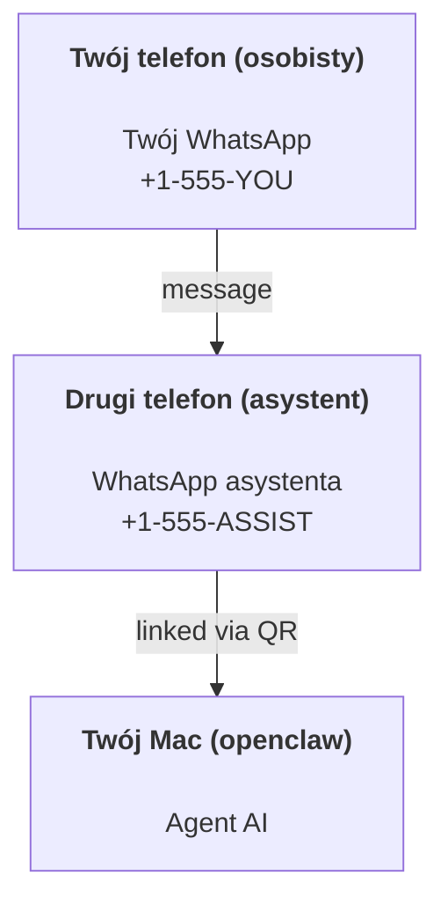

---
read_when:
    - Onboarding nowej instancji asystenta
    - Przegląd implikacji dotyczących bezpieczeństwa i uprawnień
summary: Kompletny przewodnik po uruchamianiu OpenClaw jako osobistego asystenta z uwagami dotyczącymi bezpieczeństwa
title: Konfiguracja osobistego asystenta
x-i18n:
    generated_at: "2026-04-25T13:58:09Z"
    model: gpt-5.4
    provider: openai
    source_hash: 1647b78e8cf23a3a025969c52fbd8a73aed78df27698abf36bbf62045dc30e3b
    source_path: start/openclaw.md
    workflow: 15
---

# Tworzenie osobistego asystenta z OpenClaw

OpenClaw to samohostowany Gateway, który łączy Discord, Google Chat, iMessage, Matrix, Microsoft Teams, Signal, Slack, Telegram, WhatsApp, Zalo i inne usługi z agentami AI. Ten przewodnik opisuje konfigurację „osobistego asystenta”: dedykowany numer WhatsApp, który działa jak Twój zawsze dostępny asystent AI.

## ⚠️ Najpierw bezpieczeństwo

Umieszczasz agenta w pozycji, w której może:

- uruchamiać polecenia na Twoim komputerze (zależnie od polityki narzędzi)
- odczytywać i zapisywać pliki w Twoim obszarze roboczym
- wysyłać wiadomości na zewnątrz przez WhatsApp/Telegram/Discord/Mattermost i inne dołączone kanały

Zacznij zachowawczo:

- Zawsze ustaw `channels.whatsapp.allowFrom` (nigdy nie uruchamiaj otwartego dla całego świata dostępu na swoim osobistym Macu).
- Używaj dedykowanego numeru WhatsApp dla asystenta.
- Heartbeat domyślnie uruchamia się teraz co 30 minut. Wyłącz go, dopóki nie zaufasz tej konfiguracji, ustawiając `agents.defaults.heartbeat.every: "0m"`.

## Wymagania wstępne

- OpenClaw zainstalowany i po onboardingu — zobacz [Pierwsze kroki](/pl/start/getting-started), jeśli jeszcze tego nie zrobiono
- Drugi numer telefonu (SIM/eSIM/prepaid) dla asystenta

## Konfiguracja z dwoma telefonami (zalecana)

Chodzi o taki układ:



Jeśli połączysz swój osobisty WhatsApp z OpenClaw, każda wiadomość do Ciebie stanie się „wejściem dla agenta”. Rzadko o to właśnie chodzi.

## Szybki start w 5 minut

1. Sparuj WhatsApp Web (wyświetli kod QR; zeskanuj go telefonem asystenta):

```bash
openclaw channels login
```

2. Uruchom Gateway (pozostaw go włączonego):

```bash
openclaw gateway --port 18789
```

3. Umieść minimalną konfigurację w `~/.openclaw/openclaw.json`:

```json5
{
  gateway: { mode: "local" },
  channels: { whatsapp: { allowFrom: ["+15555550123"] } },
}
```

Teraz wyślij wiadomość na numer asystenta z telefonu znajdującego się na liście dozwolonych numerów.

Po zakończeniu onboardingu OpenClaw automatycznie otwiera dashboard i wyświetla czysty link (bez tokena). Jeśli dashboard poprosi o uwierzytelnienie, wklej skonfigurowany współdzielony sekret do ustawień Control UI. Onboarding domyślnie używa tokena (`gateway.auth.token`), ale uwierzytelnianie hasłem też działa, jeśli przełączono `gateway.auth.mode` na `password`. Aby otworzyć ponownie później: `openclaw dashboard`.

## Daj agentowi obszar roboczy (AGENTS)

OpenClaw odczytuje instrukcje operacyjne i „pamięć” z katalogu obszaru roboczego.

Domyślnie OpenClaw używa `~/.openclaw/workspace` jako obszaru roboczego agenta i automatycznie utworzy go (wraz z początkowymi plikami `AGENTS.md`, `SOUL.md`, `TOOLS.md`, `IDENTITY.md`, `USER.md`, `HEARTBEAT.md`) podczas konfiguracji lub przy pierwszym uruchomieniu agenta. `BOOTSTRAP.md` jest tworzony tylko wtedy, gdy obszar roboczy jest całkowicie nowy (nie powinien pojawić się ponownie po usunięciu). `MEMORY.md` jest opcjonalny (nie jest tworzony automatycznie); jeśli istnieje, jest ładowany dla zwykłych sesji. Sesje subagentów wstrzykują tylko `AGENTS.md` i `TOOLS.md`.

Wskazówka: traktuj ten folder jak „pamięć” OpenClaw i zrób z niego repozytorium git (najlepiej prywatne), aby Twoje `AGENTS.md` i pliki pamięci miały kopię zapasową. Jeśli git jest zainstalowany, całkowicie nowe obszary robocze są inicjalizowane automatycznie.

```bash
openclaw setup
```

Pełny układ obszaru roboczego + przewodnik po kopiach zapasowych: [Obszar roboczy agenta](/pl/concepts/agent-workspace)
Przepływ pracy pamięci: [Pamięć](/pl/concepts/memory)

Opcjonalnie: wybierz inny obszar roboczy przez `agents.defaults.workspace` (obsługuje `~`).

```json5
{
  agents: {
    defaults: {
      workspace: "~/.openclaw/workspace",
    },
  },
}
```

Jeśli dostarczasz już własne pliki obszaru roboczego z repozytorium, możesz całkowicie wyłączyć tworzenie plików bootstrap:

```json5
{
  agents: {
    defaults: {
      skipBootstrap: true,
    },
  },
}
```

## Konfiguracja, która zmienia to w „asystenta”

OpenClaw domyślnie używa dobrej konfiguracji asystenta, ale zwykle warto dostroić:

- personę/instrukcje w [`SOUL.md`](/pl/concepts/soul)
- domyślne ustawienia myślenia (w razie potrzeby)
- Heartbeat (gdy już zaufasz konfiguracji)

Przykład:

```json5
{
  logging: { level: "info" },
  agent: {
    model: "anthropic/claude-opus-4-6",
    workspace: "~/.openclaw/workspace",
    thinkingDefault: "high",
    timeoutSeconds: 1800,
    // Zacznij od 0; włącz później.
    heartbeat: { every: "0m" },
  },
  channels: {
    whatsapp: {
      allowFrom: ["+15555550123"],
      groups: {
        "*": { requireMention: true },
      },
    },
  },
  routing: {
    groupChat: {
      mentionPatterns: ["@openclaw", "openclaw"],
    },
  },
  session: {
    scope: "per-sender",
    resetTriggers: ["/new", "/reset"],
    reset: {
      mode: "daily",
      atHour: 4,
      idleMinutes: 10080,
    },
  },
}
```

## Sesje i pamięć

- Pliki sesji: `~/.openclaw/agents/<agentId>/sessions/{{SessionId}}.jsonl`
- Metadane sesji (użycie tokenów, ostatnia trasa itp.): `~/.openclaw/agents/<agentId>/sessions/sessions.json` (starsza lokalizacja: `~/.openclaw/sessions/sessions.json`)
- `/new` lub `/reset` rozpoczyna nową sesję dla tego czatu (konfigurowane przez `resetTriggers`). Jeśli zostanie wysłane samodzielnie, agent odpowie krótkim powitaniem, aby potwierdzić reset.
- `/compact [instructions]` wykonuje Compaction kontekstu sesji i zgłasza pozostały budżet kontekstu.

## Heartbeat (tryb proaktywny)

Domyślnie OpenClaw uruchamia Heartbeat co 30 minut z promptem:
`Read HEARTBEAT.md if it exists (workspace context). Follow it strictly. Do not infer or repeat old tasks from prior chats. If nothing needs attention, reply HEARTBEAT_OK.`
Aby wyłączyć, ustaw `agents.defaults.heartbeat.every: "0m"`.

- Jeśli `HEARTBEAT.md` istnieje, ale jest w praktyce pusty (tylko puste linie i nagłówki markdown, takie jak `# Heading`), OpenClaw pomija uruchomienie Heartbeat, aby oszczędzać wywołania API.
- Jeśli plik nie istnieje, Heartbeat nadal się uruchamia, a model decyduje, co zrobić.
- Jeśli agent odpowie `HEARTBEAT_OK` (opcjonalnie z krótkim wypełnieniem; zobacz `agents.defaults.heartbeat.ackMaxChars`), OpenClaw wstrzymuje dostarczenie wychodzące dla tego Heartbeat.
- Domyślnie dostarczanie Heartbeat do celów typu DM `user:<id>` jest dozwolone. Ustaw `agents.defaults.heartbeat.directPolicy: "block"`, aby zablokować dostarczanie do celów bezpośrednich przy zachowaniu aktywnych uruchomień Heartbeat.
- Heartbeat uruchamia pełne tury agenta — krótsze interwały zużywają więcej tokenów.

```json5
{
  agent: {
    heartbeat: { every: "30m" },
  },
}
```

## Media przychodzące i wychodzące

Załączniki przychodzące (obrazy/audio/dokumenty) mogą być przekazane do Twojego polecenia przez szablony:

- `{{MediaPath}}` (ścieżka do lokalnego pliku tymczasowego)
- `{{MediaUrl}}` (pseudo-URL)
- `{{Transcript}}` (jeśli transkrypcja audio jest włączona)

Załączniki wychodzące od agenta: umieść `MEDIA:<path-or-url>` w osobnej linii (bez spacji). Przykład:

```
Oto zrzut ekranu.
MEDIA:https://example.com/screenshot.png
```

OpenClaw wyodrębnia te wpisy i wysyła je jako media razem z tekstem.

Zachowanie dla ścieżek lokalnych podlega temu samemu modelowi zaufania odczytu plików co agent:

- Jeśli `tools.fs.workspaceOnly` ma wartość `true`, wychodzące lokalne ścieżki `MEDIA:` pozostają ograniczone do głównego katalogu tymczasowego OpenClaw, pamięci podręcznej mediów, ścieżek obszaru roboczego agenta i plików wygenerowanych przez sandbox.
- Jeśli `tools.fs.workspaceOnly` ma wartość `false`, wychodzące `MEDIA:` może używać lokalnych plików hosta, które agent ma już prawo odczytywać.
- Wysyłki plików lokalnych hosta nadal dopuszczają tylko media i bezpieczne typy dokumentów (obrazy, audio, wideo, PDF i dokumenty Office). Zwykły tekst i pliki przypominające sekrety nie są traktowane jako media możliwe do wysłania.

To oznacza, że wygenerowane obrazy/pliki poza obszarem roboczym mogą być teraz wysyłane, jeśli Twoja polityka fs już zezwala na taki odczyt, bez ponownego otwierania możliwości arbitralnej eksfiltracji załączników tekstowych z hosta.

## Lista kontrolna operacji

```bash
openclaw status          # lokalny status (poświadczenia, sesje, zdarzenia w kolejce)
openclaw status --all    # pełna diagnoza (tylko do odczytu, gotowa do wklejenia)
openclaw status --deep   # prosi Gateway o aktywną sondę kondycji z sondami kanałów, jeśli są obsługiwane
openclaw health --json   # migawka kondycji Gateway (WS; domyślnie może zwrócić świeżą migawkę z pamięci podręcznej)
```

Logi znajdują się w `/tmp/openclaw/` (domyślnie: `openclaw-YYYY-MM-DD.log`).

## Następne kroki

- WebChat: [WebChat](/pl/web/webchat)
- Operacje Gateway: [Runbook Gateway](/pl/gateway)
- Cron + wybudzenia: [Zadania Cron](/pl/automation/cron-jobs)
- Towarzysząca aplikacja paska menu macOS: [Aplikacja OpenClaw na macOS](/pl/platforms/macos)
- Aplikacja Node na iOS: [Aplikacja iOS](/pl/platforms/ios)
- Aplikacja Node na Androida: [Aplikacja Android](/pl/platforms/android)
- Stan Windows: [Windows (WSL2)](/pl/platforms/windows)
- Stan Linux: [Aplikacja Linux](/pl/platforms/linux)
- Bezpieczeństwo: [Bezpieczeństwo](/pl/gateway/security)

## Powiązane

- [Pierwsze kroki](/pl/start/getting-started)
- [Konfiguracja](/pl/start/setup)
- [Przegląd kanałów](/pl/channels)
