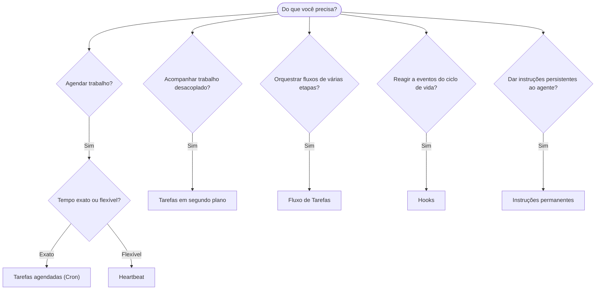

---
read_when:
    - Decidindo como automatizar o trabalho com OpenClaw
    - Escolhendo entre heartbeat, cron, hooks e instruções permanentes
    - Procurando o ponto de entrada de automação certo
summary: 'Visão geral dos mecanismos de automação: tarefas, cron, hooks, instruções permanentes e Fluxo de Tarefas'
title: Automação e Tarefas
x-i18n:
    generated_at: "2026-04-05T12:34:23Z"
    model: gpt-5.4
    provider: openai
    source_hash: 13cd05dcd2f38737f7bb19243ad1136978bfd727006fd65226daa3590f823afe
    source_path: automation/index.md
    workflow: 15
---

# Automação e Tarefas

O OpenClaw executa trabalho em segundo plano por meio de tarefas, jobs agendados, hooks de eventos e instruções permanentes. Esta página ajuda você a escolher o mecanismo certo e a entender como eles se encaixam.

## Guia rápido de decisão

| Caso de uso                              | Recomendado           | Por quê                                           |
| ---------------------------------------- | --------------------- | ------------------------------------------------- |
| Enviar relatório diário às 9h em ponto   | Tarefas agendadas (Cron) | Tempo exato, execução isolada                  |
| Lembre-me em 20 minutos                  | Tarefas agendadas (Cron) | Execução única com tempo preciso (`--at`)      |
| Executar análise aprofundada semanal     | Tarefas agendadas (Cron) | Tarefa independente, pode usar um modelo diferente |
| Verificar a caixa de entrada a cada 30 min | Heartbeat            | Agrupa com outras verificações, ciente do contexto |
| Monitorar o calendário para eventos futuros | Heartbeat           | Encaixe natural para percepção periódica        |
| Inspecionar o status de um subagente ou de uma execução ACP | Tarefas em segundo plano | O registro de tarefas acompanha todo o trabalho desacoplado |
| Auditar o que foi executado e quando     | Tarefas em segundo plano | `openclaw tasks list` e `openclaw tasks audit` |
| Pesquisa em várias etapas e depois resumo | Fluxo de Tarefas     | Orquestração durável com rastreamento de revisões |
| Executar um script ao redefinir a sessão | Hooks                 | Orientado a eventos, dispara em eventos do ciclo de vida |
| Executar código em toda chamada de ferramenta | Hooks              | Hooks podem filtrar por tipo de evento          |
| Sempre verificar conformidade antes de responder | Instruções permanentes | Injetadas automaticamente em toda sessão     |

### Tarefas agendadas (Cron) vs Heartbeat

| Dimensão       | Tarefas agendadas (Cron)            | Heartbeat                            |
| -------------- | ----------------------------------- | ------------------------------------ |
| Tempo          | Exato (expressões cron, execução única) | Aproximado (padrão a cada 30 min) |
| Contexto da sessão | Nova (isolada) ou compartilhada | Contexto completo da sessão principal |
| Registros de tarefa | Sempre criados                  | Nunca criados                        |
| Entrega        | Canal, webhook ou silenciosa        | Inline na sessão principal           |
| Ideal para     | Relatórios, lembretes, jobs em segundo plano | Verificações de caixa de entrada, calendário, notificações |

Use Tarefas agendadas (Cron) quando você precisar de tempo preciso ou execução isolada. Use Heartbeat quando o trabalho se beneficiar do contexto completo da sessão e um tempo aproximado for suficiente.

## Conceitos principais

### Tarefas agendadas (cron)

Cron é o agendador integrado do Gateway para tempo preciso. Ele persiste jobs, ativa o agente no momento certo e pode entregar a saída para um canal de chat ou endpoint de webhook. Oferece suporte a lembretes de execução única, expressões recorrentes e gatilhos de webhook de entrada.

Consulte [Tarefas agendadas](/automation/cron-jobs).

### Tarefas

O registro de tarefas em segundo plano acompanha todo o trabalho desacoplado: execuções ACP, criação de subagentes, execuções cron isoladas e operações da CLI. Tarefas são registros, não agendadores. Use `openclaw tasks list` e `openclaw tasks audit` para inspecioná-las.

Consulte [Tarefas em segundo plano](/automation/tasks).

### Fluxo de Tarefas

Fluxo de Tarefas é a camada de orquestração de fluxos acima das tarefas em segundo plano. Ele gerencia fluxos duráveis de várias etapas com modos de sincronização gerenciados e espelhados, rastreamento de revisões e `openclaw tasks flow list|show|cancel` para inspeção.

Consulte [Fluxo de Tarefas](/automation/taskflow).

### Instruções permanentes

As instruções permanentes concedem ao agente autoridade operacional permanente para programas definidos. Elas ficam em arquivos do workspace (normalmente `AGENTS.md`) e são injetadas em toda sessão. Combine com cron para aplicação baseada em tempo.

Consulte [Instruções permanentes](/automation/standing-orders).

### Hooks

Hooks são scripts orientados a eventos acionados por eventos do ciclo de vida do agente (`/new`, `/reset`, `/stop`), compactação de sessão, inicialização do gateway, fluxo de mensagens e chamadas de ferramentas. Hooks são descobertos automaticamente em diretórios e podem ser gerenciados com `openclaw hooks`.

Consulte [Hooks](/automation/hooks).

### Heartbeat

Heartbeat é um turno periódico da sessão principal (padrão a cada 30 minutos). Ele agrupa várias verificações (caixa de entrada, calendário, notificações) em um turno do agente com contexto completo da sessão. Os turnos de Heartbeat não criam registros de tarefa. Use `HEARTBEAT.md` para uma pequena lista de verificação, ou um bloco `tasks:` quando você quiser verificações periódicas somente quando vencidas dentro do próprio heartbeat. Arquivos de heartbeat vazios são ignorados como `empty-heartbeat-file`; o modo de tarefas somente quando vencidas é ignorado como `no-tasks-due`.

Consulte [Heartbeat](/gateway/heartbeat).

## Como eles funcionam juntos

- **Cron** lida com agendamentos precisos (relatórios diários, revisões semanais) e lembretes de execução única. Todas as execuções cron criam registros de tarefa.
- **Heartbeat** lida com monitoramento de rotina (caixa de entrada, calendário, notificações) em um turno agrupado a cada 30 minutos.
- **Hooks** reagem a eventos específicos (chamadas de ferramentas, redefinições de sessão, compactação) com scripts personalizados.
- **Instruções permanentes** dão ao agente contexto persistente e limites de autoridade.
- **Fluxo de Tarefas** coordena fluxos de várias etapas acima de tarefas individuais.
- **Tarefas** acompanham automaticamente todo o trabalho desacoplado para que você possa inspecioná-lo e auditá-lo.

## Relacionado

- [Tarefas agendadas](/automation/cron-jobs) — agendamento preciso e lembretes de execução única
- [Tarefas em segundo plano](/automation/tasks) — registro de tarefas para todo o trabalho desacoplado
- [Fluxo de Tarefas](/automation/taskflow) — orquestração durável de fluxos em várias etapas
- [Hooks](/automation/hooks) — scripts de ciclo de vida orientados a eventos
- [Instruções permanentes](/automation/standing-orders) — instruções persistentes para o agente
- [Heartbeat](/gateway/heartbeat) — turnos periódicos da sessão principal
- [Referência de configuração](/gateway/configuration-reference) — todas as chaves de configuração
