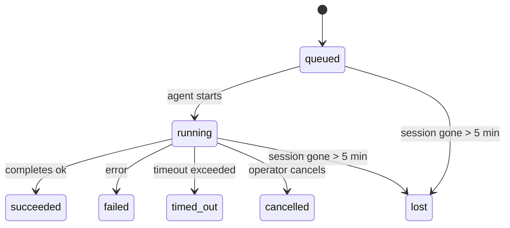

---
read_when:
    - Inspecionando trabalho em segundo plano em andamento ou concluído recentemente
    - Depurando falhas de entrega para execuções destacadas do agente
    - Entendendo como execuções em segundo plano se relacionam com sessões, cron e heartbeat
summary: Rastreamento de tarefas em segundo plano para execuções de ACP, subagentes, trabalhos cron isolados e operações de CLI
title: Tarefas em segundo plano
x-i18n:
    generated_at: "2026-04-05T12:34:54Z"
    model: gpt-5.4
    provider: openai
    source_hash: 6c95ccf4388d07e60a7bb68746b161793f4bb5ff2ba3d5ce9e51f2225dab2c4d
    source_path: automation/tasks.md
    workflow: 15
---

# Tarefas em segundo plano

> **Está procurando agendamento?** Consulte [Automation & Tasks](/automation) para escolher o mecanismo certo. Esta página cobre o **rastreamento** do trabalho em segundo plano, não o agendamento.

As tarefas em segundo plano rastreiam o trabalho que é executado **fora da sua sessão principal de conversa**:
execuções de ACP, inicializações de subagentes, execuções isoladas de trabalhos cron e operações iniciadas por CLI.

As tarefas **não** substituem sessões, trabalhos cron nem heartbeats — elas são o **registro de atividade** que registra qual trabalho destacado aconteceu, quando aconteceu e se foi bem-sucedido.

<Note>
Nem toda execução de agente cria uma tarefa. Turnos de heartbeat e chat interativo normal não criam. Todas as execuções de cron, inicializações de ACP, inicializações de subagentes e comandos de agente da CLI criam.
</Note>

## Resumo rápido

- As tarefas são **registros**, não agendadores — cron e heartbeat decidem _quando_ o trabalho é executado; as tarefas rastreiam _o que aconteceu_.
- ACP, subagentes, todos os trabalhos cron e operações de CLI criam tarefas. Turnos de heartbeat não criam.
- Cada tarefa passa por `queued → running → terminal` (succeeded, failed, timed_out, cancelled ou lost).
- As tarefas cron permanecem ativas enquanto o runtime do cron ainda for proprietário do trabalho; tarefas de CLI com suporte de chat permanecem ativas apenas enquanto o contexto de execução proprietário ainda estiver ativo.
- A conclusão é orientada por envio: o trabalho destacado pode notificar diretamente ou acordar a sessão solicitante/heartbeat quando terminar, então loops de polling de status normalmente não são o formato certo.
- Execuções cron isoladas e conclusões de subagentes fazem uma limpeza best-effort de abas/processos de navegador rastreados para sua sessão filha antes da contabilidade final de limpeza.
- A entrega de cron isolado suprime respostas intermediárias obsoletas do pai enquanto o trabalho descendente do subagente ainda está sendo drenado, e prefere a saída final do descendente quando ela chega antes da entrega.
- As notificações de conclusão são entregues diretamente a um canal ou enfileiradas para o próximo heartbeat.
- `openclaw tasks list` mostra todas as tarefas; `openclaw tasks audit` exibe problemas.
- Registros terminais são mantidos por 7 dias e depois removidos automaticamente.

## Início rápido

```bash
# Listar todas as tarefas (mais novas primeiro)
openclaw tasks list

# Filtrar por runtime ou status
openclaw tasks list --runtime acp
openclaw tasks list --status running

# Mostrar detalhes de uma tarefa específica (por ID, ID de execução ou chave da sessão)
openclaw tasks show <lookup>

# Cancelar uma tarefa em execução (encerra a sessão filha)
openclaw tasks cancel <lookup>

# Alterar a política de notificação de uma tarefa
openclaw tasks notify <lookup> state_changes

# Executar uma auditoria de integridade
openclaw tasks audit

# Visualizar ou aplicar manutenção
openclaw tasks maintenance
openclaw tasks maintenance --apply

# Inspecionar o estado do TaskFlow
openclaw tasks flow list
openclaw tasks flow show <lookup>
openclaw tasks flow cancel <lookup>
```

## O que cria uma tarefa

| Fonte                  | Tipo de runtime | Quando um registro de tarefa é criado                 | Política padrão de notificação |
| ---------------------- | --------------- | ----------------------------------------------------- | ------------------------------ |
| Execuções em segundo plano de ACP | `acp`        | Inicialização de uma sessão filha de ACP              | `done_only`                    |
| Orquestração de subagente | `subagent`   | Inicialização de um subagente via `sessions_spawn`    | `done_only`                    |
| Trabalhos cron (todos os tipos) | `cron`   | Toda execução de cron (sessão principal e isolada)    | `silent`                       |
| Operações de CLI       | `cli`           | Comandos `openclaw agent` que são executados pelo gateway | `silent`                   |

Tarefas cron da sessão principal usam a política de notificação `silent` por padrão — elas criam registros para rastreamento, mas não geram notificações. Tarefas cron isoladas também usam `silent` por padrão, mas são mais visíveis porque são executadas em sua própria sessão.

**O que não cria tarefas:**

- Turnos de heartbeat — sessão principal; consulte [Heartbeat](/gateway/heartbeat)
- Turnos normais de chat interativo
- Respostas diretas de `/command`

## Ciclo de vida da tarefa



| Status      | O que significa                                                           |
| ----------- | ------------------------------------------------------------------------- |
| `queued`    | Criada, aguardando o agente iniciar                                       |
| `running`   | O turno do agente está sendo executado ativamente                         |
| `succeeded` | Concluída com sucesso                                                     |
| `failed`    | Concluída com erro                                                        |
| `timed_out` | Excedeu o tempo limite configurado                                        |
| `cancelled` | Interrompida pelo operador via `openclaw tasks cancel`                    |
| `lost`      | O runtime perdeu o estado de suporte autoritativo após um período de tolerância de 5 minutos |

As transições acontecem automaticamente — quando a execução do agente associada termina, o status da tarefa é atualizado para corresponder.

`lost` considera o runtime:

- Tarefas de ACP: os metadados da sessão filha de ACP de suporte desapareceram.
- Tarefas de subagente: a sessão filha de suporte desapareceu do armazenamento do agente de destino.
- Tarefas cron: o runtime do cron não rastreia mais o trabalho como ativo.
- Tarefas de CLI: tarefas isoladas de sessão filha usam a sessão filha; tarefas de CLI com suporte de chat usam o contexto de execução ativo, então linhas persistentes de sessão de canal/grupo/direta não as mantêm ativas.

## Entrega e notificações

Quando uma tarefa atinge um estado terminal, o OpenClaw notifica você. Há dois caminhos de entrega:

**Entrega direta** — se a tarefa tiver um destino de canal (o `requesterOrigin`), a mensagem de conclusão vai diretamente para esse canal (Telegram, Discord, Slack etc.). Para conclusões de subagente, o OpenClaw também preserva o roteamento de thread/tópico vinculado quando disponível e pode preencher um `to` / conta ausente a partir da rota armazenada da sessão solicitante (`lastChannel` / `lastTo` / `lastAccountId`) antes de desistir da entrega direta.

**Entrega enfileirada na sessão** — se a entrega direta falhar ou nenhuma origem estiver definida, a atualização será enfileirada como um evento do sistema na sessão do solicitante e aparecerá no próximo heartbeat.

<Tip>
A conclusão da tarefa dispara um despertar imediato do heartbeat para que você veja o resultado rapidamente — você não precisa esperar o próximo tick agendado do heartbeat.
</Tip>

Isso significa que o fluxo de trabalho usual é baseado em envio: inicie o trabalho destacado uma vez e depois deixe o runtime acordar ou notificar você na conclusão. Faça polling do estado da tarefa apenas quando precisar de depuração, intervenção ou uma auditoria explícita.

### Políticas de notificação

Controle o quanto você quer receber sobre cada tarefa:

| Política              | O que é entregue                                                        |
| --------------------- | ----------------------------------------------------------------------- |
| `done_only` (padrão)  | Apenas o estado terminal (succeeded, failed etc.) — **este é o padrão** |
| `state_changes`       | Toda transição de estado e atualização de progresso                     |
| `silent`              | Nada                                                                    |

Altere a política enquanto uma tarefa está em execução:

```bash
openclaw tasks notify <lookup> state_changes
```

## Referência da CLI

### `tasks list`

```bash
openclaw tasks list [--runtime <acp|subagent|cron|cli>] [--status <status>] [--json]
```

Colunas da saída: ID da tarefa, Tipo, Status, Entrega, ID de execução, Sessão filha, Resumo.

### `tasks show`

```bash
openclaw tasks show <lookup>
```

O token de busca aceita um ID de tarefa, ID de execução ou chave de sessão. Mostra o registro completo, incluindo tempo, estado de entrega, erro e resumo terminal.

### `tasks cancel`

```bash
openclaw tasks cancel <lookup>
```

Para tarefas de ACP e subagente, isso encerra a sessão filha. O status passa para `cancelled` e uma notificação de entrega é enviada.

### `tasks notify`

```bash
openclaw tasks notify <lookup> <done_only|state_changes|silent>
```

### `tasks audit`

```bash
openclaw tasks audit [--json]
```

Exibe problemas operacionais. As descobertas também aparecem em `openclaw status` quando problemas são detectados.

| Descoberta               | Severidade | Gatilho                                              |
| ------------------------ | ---------- | ---------------------------------------------------- |
| `stale_queued`           | warn       | Em fila por mais de 10 minutos                       |
| `stale_running`          | error      | Em execução por mais de 30 minutos                   |
| `lost`                   | error      | A propriedade da tarefa com suporte de runtime desapareceu |
| `delivery_failed`        | warn       | A entrega falhou e a política de notificação não é `silent` |
| `missing_cleanup`        | warn       | Tarefa terminal sem carimbo de data/hora de limpeza  |
| `inconsistent_timestamps` | warn      | Violação da linha do tempo (por exemplo, terminou antes de começar) |

### `tasks maintenance`

```bash
openclaw tasks maintenance [--json]
openclaw tasks maintenance --apply [--json]
```

Use isto para visualizar ou aplicar reconciliação, marcação de limpeza e remoção para tarefas e estado do Task Flow.

A reconciliação considera o runtime:

- Tarefas de ACP/subagente verificam sua sessão filha de suporte.
- Tarefas cron verificam se o runtime do cron ainda é proprietário do trabalho.
- Tarefas de CLI com suporte de chat verificam o contexto de execução ativo proprietário, e não apenas a linha de sessão do chat.

A limpeza após conclusão também considera o runtime:

- A conclusão de subagente fecha em modo best-effort abas/processos de navegador rastreados para a sessão filha antes de a limpeza de anúncio continuar.
- A conclusão de cron isolado fecha em modo best-effort abas/processos de navegador rastreados para a sessão cron antes de a execução ser totalmente encerrada.
- A entrega de cron isolado espera o acompanhamento de subagentes descendentes quando necessário e suprime texto de confirmação obsoleto do pai em vez de anunciá-lo.
- A entrega da conclusão de subagente prefere o texto do assistente visível mais recente; se estiver vazio, recorre ao texto sanitizado mais recente de tool/toolResult, e execuções de chamada de ferramenta apenas com timeout podem ser reduzidas a um breve resumo de progresso parcial.
- Falhas de limpeza não mascaram o resultado real da tarefa.

### `tasks flow list|show|cancel`

```bash
openclaw tasks flow list [--status <status>] [--json]
openclaw tasks flow show <lookup> [--json]
openclaw tasks flow cancel <lookup>
```

Use estes comandos quando o Task Flow de orquestração for o que importa para você, em vez de um registro individual de tarefa em segundo plano.

## Quadro de tarefas do chat (`/tasks`)

Use `/tasks` em qualquer sessão de chat para ver tarefas em segundo plano vinculadas a essa sessão. O quadro mostra
tarefas ativas e concluídas recentemente com runtime, status, tempo e detalhes de progresso ou erro.

Quando a sessão atual não tiver tarefas vinculadas visíveis, `/tasks` recorre às contagens de tarefas locais do agente
para que você ainda tenha uma visão geral sem expor detalhes de outras sessões.

Para o registro completo do operador, use a CLI: `openclaw tasks list`.

## Integração de status (pressão de tarefas)

`openclaw status` inclui um resumo rápido das tarefas:

```
Tasks: 3 queued · 2 running · 1 issues
```

O resumo informa:

- **active** — contagem de `queued` + `running`
- **failures** — contagem de `failed` + `timed_out` + `lost`
- **byRuntime** — detalhamento por `acp`, `subagent`, `cron`, `cli`

Tanto `/status` quanto a ferramenta `session_status` usam um snapshot de tarefas com reconhecimento de limpeza: tarefas ativas são priorizadas, linhas concluídas obsoletas são ocultadas, e falhas recentes só aparecem quando não resta trabalho ativo.
Isso mantém o cartão de status focado no que importa agora.

## Armazenamento e manutenção

### Onde as tarefas ficam

Os registros de tarefas persistem em SQLite em:

```
$OPENCLAW_STATE_DIR/tasks/runs.sqlite
```

O registro é carregado na memória na inicialização do gateway e sincroniza gravações com o SQLite para durabilidade entre reinicializações.

### Manutenção automática

Um processo de varredura é executado a cada **60 segundos** e faz três coisas:

1. **Reconciliação** — verifica se tarefas ativas ainda têm suporte autoritativo no runtime. Tarefas de ACP/subagente usam o estado da sessão filha, tarefas cron usam a propriedade do trabalho ativo, e tarefas de CLI com suporte de chat usam o contexto de execução proprietário. Se esse estado de suporte desaparecer por mais de 5 minutos, a tarefa é marcada como `lost`.
2. **Marcação de limpeza** — define um carimbo de data/hora `cleanupAfter` em tarefas terminais (`endedAt` + 7 dias).
3. **Remoção** — exclui registros após sua data `cleanupAfter`.

**Retenção**: registros de tarefas terminais são mantidos por **7 dias** e depois removidos automaticamente. Nenhuma configuração é necessária.

## Como as tarefas se relacionam com outros sistemas

### Tarefas e Task Flow

[Task Flow](/automation/taskflow) é a camada de orquestração de fluxo acima das tarefas em segundo plano. Um único fluxo pode coordenar várias tarefas ao longo de sua vida útil usando modos de sincronização gerenciados ou espelhados. Use `openclaw tasks` para inspecionar registros individuais de tarefa e `openclaw tasks flow` para inspecionar o fluxo de orquestração.

Consulte [Task Flow](/automation/taskflow) para mais detalhes.

### Tarefas e cron

Uma **definição** de trabalho cron fica em `~/.openclaw/cron/jobs.json`. **Toda** execução de cron cria um registro de tarefa — tanto na sessão principal quanto em modo isolado. Tarefas cron da sessão principal usam a política de notificação `silent` por padrão para que sejam rastreadas sem gerar notificações.

Consulte [Cron Jobs](/automation/cron-jobs).

### Tarefas e heartbeat

Execuções de heartbeat são turnos da sessão principal — elas não criam registros de tarefa. Quando uma tarefa é concluída, ela pode disparar um despertar do heartbeat para que você veja o resultado rapidamente.

Consulte [Heartbeat](/gateway/heartbeat).

### Tarefas e sessões

Uma tarefa pode referenciar uma `childSessionKey` (onde o trabalho é executado) e uma `requesterSessionKey` (quem o iniciou). Sessões são contexto de conversa; tarefas são rastreamento de atividade sobre isso.

### Tarefas e execuções de agente

O `runId` de uma tarefa se vincula à execução do agente que está fazendo o trabalho. Eventos de ciclo de vida do agente (início, término, erro) atualizam automaticamente o status da tarefa — você não precisa gerenciar o ciclo de vida manualmente.

## Relacionado

- [Automation & Tasks](/automation) — todos os mecanismos de automação em um relance
- [Task Flow](/automation/taskflow) — orquestração de fluxo acima das tarefas
- [Scheduled Tasks](/automation/cron-jobs) — agendamento de trabalho em segundo plano
- [Heartbeat](/gateway/heartbeat) — turnos periódicos da sessão principal
- [CLI: Tasks](/cli/index#tasks) — referência de comandos da CLI
