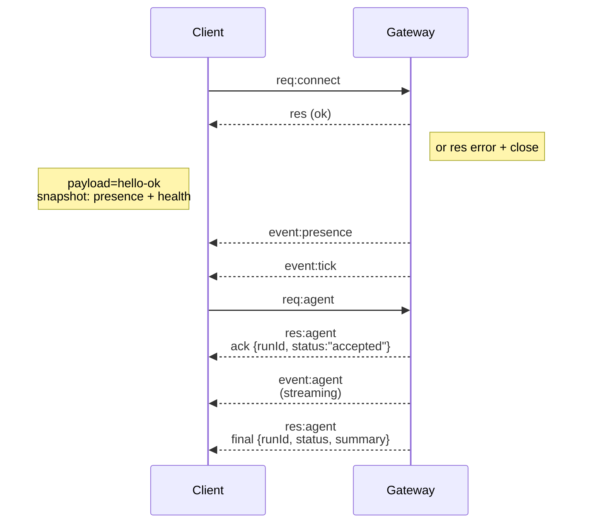

---
read_when:
    - Trabalhando no protocolo do gateway, clientes ou transportes
summary: Arquitetura do gateway WebSocket, componentes e fluxos de clientes
title: Arquitetura do Gateway
x-i18n:
    generated_at: "2026-04-05T12:39:11Z"
    model: gpt-5.4
    provider: openai
    source_hash: 2b12a2a29e94334c6d10787ac85c34b5b046f9a14f3dd53be453368ca4a7547d
    source_path: concepts/architecture.md
    workflow: 15
---

# Arquitetura do gateway

## Visão geral

- Um único **Gateway** de longa duração é proprietário de todas as superfícies de mensagens (WhatsApp via
  Baileys, Telegram via grammY, Slack, Discord, Signal, iMessage, WebChat).
- Clientes do plano de controle (app macOS, CLI, interface web, automações) se conectam ao
  Gateway por **WebSocket** no host de bind configurado (padrão
  `127.0.0.1:18789`).
- **Nodes** (macOS/iOS/Android/headless) também se conectam por **WebSocket**, mas
  declaram `role: node` com caps/comandos explícitos.
- Um Gateway por host; é o único lugar que abre uma sessão do WhatsApp.
- O **canvas host** é servido pelo servidor HTTP do Gateway em:
  - `/__openclaw__/canvas/` (HTML/CSS/JS editáveis pelo agente)
  - `/__openclaw__/a2ui/` (host A2UI)
    Ele usa a mesma porta do Gateway (padrão `18789`).

## Componentes e fluxos

### Gateway (daemon)

- Mantém conexões com providers.
- Expõe uma API WS tipada (requisições, respostas, eventos enviados pelo servidor).
- Valida frames de entrada em relação ao JSON Schema.
- Emite eventos como `agent`, `chat`, `presence`, `health`, `heartbeat`, `cron`.

### Clientes (app Mac / CLI / admin web)

- Uma conexão WS por cliente.
- Enviam requisições (`health`, `status`, `send`, `agent`, `system-presence`).
- Assinam eventos (`tick`, `agent`, `presence`, `shutdown`).

### Nodes (macOS / iOS / Android / headless)

- Conectam-se ao **mesmo servidor WS** com `role: node`.
- Fornecem uma identidade do dispositivo em `connect`; o pareamento é **baseado em dispositivo** (role `node`) e
  a aprovação fica no armazenamento de pareamento de dispositivos.
- Expõem comandos como `canvas.*`, `camera.*`, `screen.record`, `location.get`.

Detalhes do protocolo:

- [Gateway protocol](/gateway/protocol)

### WebChat

- Interface estática que usa a API WS do Gateway para histórico de chat e envios.
- Em configurações remotas, conecta-se pelo mesmo túnel SSH/Tailscale que outros
  clientes.

## Ciclo de vida da conexão (cliente único)



## Protocolo wire (resumo)

- Transporte: WebSocket, frames de texto com payload JSON.
- O primeiro frame **deve** ser `connect`.
- Após o handshake:
  - Requisições: `{type:"req", id, method, params}` → `{type:"res", id, ok, payload|error}`
  - Eventos: `{type:"event", event, payload, seq?, stateVersion?}`
- `hello-ok.features.methods` / `events` são metadados de descoberta, não um
  dump gerado de toda rota de helper chamável.
- A autenticação por segredo compartilhado usa `connect.params.auth.token` ou
  `connect.params.auth.password`, dependendo do modo de autenticação configurado do gateway.
- Modos com identidade, como Tailscale Serve
  (`gateway.auth.allowTailscale: true`) ou `gateway.auth.mode: "trusted-proxy"` fora de loopback,
  satisfazem a autenticação a partir de cabeçalhos da requisição
  em vez de `connect.params.auth.*`.
- O modo de ingresso privado `gateway.auth.mode: "none"` desativa totalmente a autenticação por segredo compartilhado;
  mantenha esse modo desligado em ingressos públicos/não confiáveis.
- Chaves de idempotência são obrigatórias para métodos com efeitos colaterais (`send`, `agent`) para
  permitir retentativas seguras; o servidor mantém um cache de desduplicação de curta duração.
- Nodes devem incluir `role: "node"` mais caps/comandos/permissões em `connect`.

## Pareamento + confiança local

- Todos os clientes WS (operadores + nodes) incluem uma **identidade de dispositivo** em `connect`.
- Novos IDs de dispositivo exigem aprovação de pareamento; o Gateway emite um **token de dispositivo**
  para conexões subsequentes.
- Conexões diretas locais de local loopback podem ser aprovadas automaticamente para manter a UX no mesmo host fluida.
- O OpenClaw também tem um caminho restrito de autoconexão local de backend/contêiner para
  fluxos confiáveis de helper com segredo compartilhado.
- Conexões por tailnet e LAN, incluindo binds tailnet no mesmo host, ainda exigem aprovação explícita de pareamento.
- Todas as conexões devem assinar o nonce `connect.challenge`.
- O payload de assinatura `v3` também vincula `platform` + `deviceFamily`; o gateway
  fixa metadados pareados na reconexão e exige pareamento de reparo para mudanças de metadados.
- Conexões **não locais** ainda exigem aprovação explícita.
- A autenticação do Gateway (`gateway.auth.*`) ainda se aplica a **todas** as conexões, locais ou
  remotas.

Detalhes: [Gateway protocol](/gateway/protocol), [Pairing](/channels/pairing),
[Security](/gateway/security).

## Tipagem do protocolo e codegen

- Schemas TypeBox definem o protocolo.
- JSON Schema é gerado a partir desses schemas.
- Modelos Swift são gerados a partir do JSON Schema.

## Acesso remoto

- Preferido: Tailscale ou VPN.
- Alternativa: túnel SSH

  ```bash
  ssh -N -L 18789:127.0.0.1:18789 user@host
  ```

- O mesmo handshake + token de autenticação se aplicam pelo túnel.
- TLS + pinning opcional podem ser ativados para WS em configurações remotas.

## Resumo operacional

- Iniciar: `openclaw gateway` (foreground, logs em stdout).
- Integridade: `health` por WS (também incluído em `hello-ok`).
- Supervisão: launchd/systemd para reinicialização automática.

## Invariantes

- Exatamente um Gateway controla uma única sessão Baileys por host.
- O handshake é obrigatório; qualquer primeiro frame não JSON ou não `connect` resulta em fechamento forçado.
- Eventos não são reproduzidos; clientes precisam atualizar em caso de lacunas.

## Relacionado

- [Agent Loop](/concepts/agent-loop) — ciclo detalhado de execução do agente
- [Gateway Protocol](/gateway/protocol) — contrato do protocolo WebSocket
- [Queue](/concepts/queue) — fila de comandos e concorrência
- [Security](/gateway/security) — modelo de confiança e reforço de segurança
