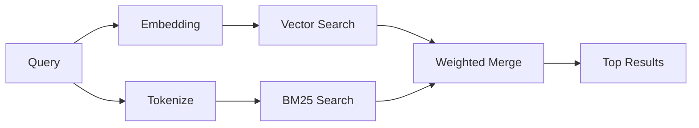

---
read_when:
    - Você quer entender como `memory_search` funciona
    - Você quer escolher um provedor de embedding
    - Você quer ajustar a qualidade da pesquisa
summary: Como a pesquisa de memória encontra notas relevantes usando embeddings e recuperação híbrida
title: Pesquisa de memória
x-i18n:
    generated_at: "2026-04-05T12:39:42Z"
    model: gpt-5.4
    provider: openai
    source_hash: 87b1cb3469c7805f95bca5e77a02919d1e06d626ad3633bbc5465f6ab9db12a2
    source_path: concepts/memory-search.md
    workflow: 15
---

# Pesquisa de memória

`memory_search` encontra notas relevantes dos seus arquivos de memória, mesmo quando a formulação é diferente do texto original. Isso funciona indexando a memória em pequenos blocos e pesquisando neles usando embeddings, palavras-chave ou ambos.

## Início rápido

Se você tiver uma chave de API da OpenAI, Gemini, Voyage ou Mistral configurada, a pesquisa de memória funciona automaticamente. Para definir explicitamente um provedor:

```json5
{
  agents: {
    defaults: {
      memorySearch: {
        provider: "openai", // ou "gemini", "local", "ollama" etc.
      },
    },
  },
}
```

Para embeddings locais sem chave de API, use `provider: "local"` (requer `node-llama-cpp`).

## Provedores compatíveis

| Provedor | ID        | Precisa de chave de API | Observações                    |
| -------- | --------- | ----------------------- | ------------------------------ |
| OpenAI   | `openai`  | Sim                     | Detectado automaticamente, rápido |
| Gemini   | `gemini`  | Sim                     | Compatível com indexação de imagem/áudio |
| Voyage   | `voyage`  | Sim                     | Detectado automaticamente      |
| Mistral  | `mistral` | Sim                     | Detectado automaticamente      |
| Ollama   | `ollama`  | Não                     | Local, deve ser definido explicitamente |
| Local    | `local`   | Não                     | Modelo GGUF, download de ~0.6 GB |

## Como a pesquisa funciona

O OpenClaw executa dois caminhos de recuperação em paralelo e mescla os resultados:



- **Pesquisa vetorial** encontra notas com significado semelhante ("gateway host" corresponde a "the machine running OpenClaw").
- **Pesquisa por palavra-chave BM25** encontra correspondências exatas (IDs, strings de erro, chaves de configuração).

Se apenas um caminho estiver disponível (sem embeddings ou sem FTS), o outro será executado sozinho.

## Melhorando a qualidade da pesquisa

Dois recursos opcionais ajudam quando você tem um histórico grande de notas:

### Decaimento temporal

Notas antigas perdem peso no ranking gradualmente, para que informações recentes apareçam primeiro.
Com a meia-vida padrão de 30 dias, uma nota do mês passado pontua 50% da sua
pontuação original. Arquivos perenes como `MEMORY.md` nunca sofrem decaimento.

<Tip>
Ative o decaimento temporal se seu agente tiver meses de notas diárias e
informações desatualizadas continuarem superando o contexto recente.
</Tip>

### MMR (diversidade)

Reduz resultados redundantes. Se cinco notas mencionarem a mesma configuração de roteador, o MMR garante que os principais resultados cubram tópicos diferentes em vez de repetir.

<Tip>
Ative o MMR se `memory_search` continuar retornando trechos quase duplicados de
diferentes notas diárias.
</Tip>

### Ativar ambos

```json5
{
  agents: {
    defaults: {
      memorySearch: {
        query: {
          hybrid: {
            mmr: { enabled: true },
            temporalDecay: { enabled: true },
          },
        },
      },
    },
  },
}
```

## Memória multimodal

Com o Gemini Embedding 2, você pode indexar imagens e arquivos de áudio junto com
Markdown. As consultas de pesquisa continuam sendo texto, mas correspondem a
conteúdo visual e de áudio. Veja a [referência de configuração de memória](/reference/memory-config) para
a configuração.

## Pesquisa de memória de sessão

Opcionalmente, você pode indexar transcrições de sessão para que `memory_search`
possa recuperar conversas anteriores. Isso é opt-in via
`memorySearch.experimental.sessionMemory`. Veja a
[referência de configuração](/reference/memory-config) para detalhes.

## Solução de problemas

**Sem resultados?** Execute `openclaw memory status` para verificar o índice. Se estiver vazio, execute
`openclaw memory index --force`.

**Apenas correspondências por palavra-chave?** Seu provedor de embedding pode não estar configurado. Verifique
`openclaw memory status --deep`.

**Texto CJK não encontrado?** Reconstrua o índice FTS com
`openclaw memory index --force`.

## Leitura adicional

- [Memory](/concepts/memory) -- layout de arquivos, backends, ferramentas
- [Referência de configuração de memória](/reference/memory-config) -- todos os controles de configuração
