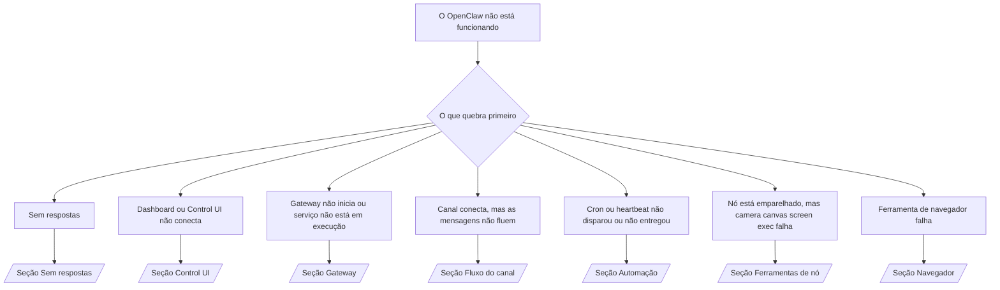

---
read_when:
    - O OpenClaw não está funcionando e você precisa do caminho mais rápido para corrigir
    - Você quer um fluxo de triagem antes de mergulhar em runbooks detalhados
summary: Hub de solução de problemas do OpenClaw orientado por sintomas
title: Solução geral de problemas
x-i18n:
    generated_at: "2026-04-05T12:44:13Z"
    model: gpt-5.4
    provider: openai
    source_hash: 23ae9638af5edf5a5e0584ccb15ba404223ac3b16c2d62eb93b2c9dac171c252
    source_path: help/troubleshooting.md
    workflow: 15
---

# Solução de problemas

Se você só tem 2 minutos, use esta página como porta de entrada para triagem.

## Primeiros 60 segundos

Execute esta sequência exata, em ordem:

```bash
openclaw status
openclaw status --all
openclaw gateway probe
openclaw gateway status
openclaw doctor
openclaw channels status --probe
openclaw logs --follow
```

Saída boa em uma linha:

- `openclaw status` → mostra os canais configurados e nenhum erro óbvio de autenticação.
- `openclaw status --all` → o relatório completo está presente e pode ser compartilhado.
- `openclaw gateway probe` → o destino esperado do gateway está acessível (`Reachable: yes`). `RPC: limited - missing scope: operator.read` indica diagnóstico degradado, não falha de conexão.
- `openclaw gateway status` → `Runtime: running` e `RPC probe: ok`.
- `openclaw doctor` → sem erros bloqueantes de configuração/serviço.
- `openclaw channels status --probe` → um gateway acessível retorna estado de transporte ao vivo por conta
  mais resultados de probe/auditoria como `works` ou `audit ok`; se o
  gateway estiver inacessível, o comando recorre a resumos apenas da configuração.
- `openclaw logs --follow` → atividade contínua, sem erros fatais repetidos.

## Anthropic long context 429

Se você vir:
`HTTP 429: rate_limit_error: Extra usage is required for long context requests`,
vá para [/gateway/troubleshooting#anthropic-429-extra-usage-required-for-long-context](/gateway/troubleshooting#anthropic-429-extra-usage-required-for-long-context).

## Falha na instalação de plugin com extensões openclaw ausentes

Se a instalação falhar com `package.json missing openclaw.extensions`, o pacote do plugin
está usando um formato antigo que o OpenClaw não aceita mais.

Corrija no pacote do plugin:

1. Adicione `openclaw.extensions` ao `package.json`.
2. Aponte as entradas para arquivos de runtime compilados (geralmente `./dist/index.js`).
3. Republice o plugin e execute `openclaw plugins install <package>` novamente.

Exemplo:

```json
{
  "name": "@openclaw/my-plugin",
  "version": "1.2.3",
  "openclaw": {
    "extensions": ["./dist/index.js"]
  }
}
```

Referência: [Arquitetura de plugins](/plugins/architecture)

## Árvore de decisão



<AccordionGroup>
  <Accordion title="Sem respostas">
    ```bash
    openclaw status
    openclaw gateway status
    openclaw channels status --probe
    openclaw pairing list --channel <channel> [--account <id>]
    openclaw logs --follow
    ```

    Uma boa saída se parece com:

    - `Runtime: running`
    - `RPC probe: ok`
    - Seu canal mostra transporte conectado e, quando compatível, `works` ou `audit ok` em `channels status --probe`
    - O remetente aparece como aprovado (ou a política de DM é open/allowlist)

    Assinaturas comuns nos logs:

    - `drop guild message (mention required` → o controle por menção bloqueou a mensagem no Discord.
    - `pairing request` → o remetente não está aprovado e está aguardando aprovação de emparelhamento da DM.
    - `blocked` / `allowlist` nos logs do canal → remetente, sala ou grupo está filtrado.

    Páginas detalhadas:

    - [/gateway/troubleshooting#no-replies](/gateway/troubleshooting#no-replies)
    - [/channels/troubleshooting](/channels/troubleshooting)
    - [/channels/pairing](/channels/pairing)

  </Accordion>

  <Accordion title="Dashboard ou Control UI não conecta">
    ```bash
    openclaw status
    openclaw gateway status
    openclaw logs --follow
    openclaw doctor
    openclaw channels status --probe
    ```

    Uma boa saída se parece com:

    - `Dashboard: http://...` aparece em `openclaw gateway status`
    - `RPC probe: ok`
    - Nenhum loop de autenticação nos logs

    Assinaturas comuns nos logs:

    - `device identity required` → o contexto HTTP/não seguro não consegue concluir a autenticação do dispositivo.
    - `origin not allowed` → o `Origin` do navegador não é permitido para o destino do gateway da Control UI.
    - `AUTH_TOKEN_MISMATCH` com dicas de nova tentativa (`canRetryWithDeviceToken=true`) → uma nova tentativa com token de dispositivo confiável pode ocorrer automaticamente.
    - Essa nova tentativa com token em cache reutiliza o conjunto de escopos em cache armazenado com o token de dispositivo emparelhado. Chamadores com `deviceToken` explícito / `scopes` explícitos mantêm o conjunto de escopos solicitado.
    - No caminho assíncrono da Control UI com Tailscale Serve, tentativas com falha para o mesmo
      `{scope, ip}` são serializadas antes que o limitador registre a falha, então uma
      segunda nova tentativa ruim simultânea já pode mostrar `retry later`.
    - `too many failed authentication attempts (retry later)` a partir de uma origem localhost no navegador → falhas repetidas dessa mesma `Origin` ficam temporariamente bloqueadas; outra origem localhost usa um bucket separado.
    - `unauthorized` repetido depois dessa nova tentativa → token/senha incorretos, incompatibilidade no modo de autenticação ou token de dispositivo emparelhado obsoleto.
    - `gateway connect failed:` → a UI está apontando para URL/porta erradas ou para um gateway inacessível.

    Páginas detalhadas:

    - [/gateway/troubleshooting#dashboard-control-ui-connectivity](/gateway/troubleshooting#dashboard-control-ui-connectivity)
    - [/web/control-ui](/web/control-ui)
    - [/gateway/authentication](/gateway/authentication)

  </Accordion>

  <Accordion title="Gateway não inicia ou o serviço está instalado mas não está em execução">
    ```bash
    openclaw status
    openclaw gateway status
    openclaw logs --follow
    openclaw doctor
    openclaw channels status --probe
    ```

    Uma boa saída se parece com:

    - `Service: ... (loaded)`
    - `Runtime: running`
    - `RPC probe: ok`

    Assinaturas comuns nos logs:

    - `Gateway start blocked: set gateway.mode=local` ou `existing config is missing gateway.mode` → o modo do gateway é remoto, ou o arquivo de configuração está sem a marca de modo local e deve ser reparado.
    - `refusing to bind gateway ... without auth` → bind fora de loopback sem um caminho válido de autenticação do gateway (token/senha, ou trusted-proxy onde configurado).
    - `another gateway instance is already listening` ou `EADDRINUSE` → a porta já está em uso.

    Páginas detalhadas:

    - [/gateway/troubleshooting#gateway-service-not-running](/gateway/troubleshooting#gateway-service-not-running)
    - [/gateway/background-process](/gateway/background-process)
    - [/gateway/configuration](/gateway/configuration)

  </Accordion>

  <Accordion title="Canal conecta, mas as mensagens não fluem">
    ```bash
    openclaw status
    openclaw gateway status
    openclaw logs --follow
    openclaw doctor
    openclaw channels status --probe
    ```

    Uma boa saída se parece com:

    - O transporte do canal está conectado.
    - As verificações de emparelhamento/lista de permissões passam.
    - As menções são detectadas quando exigidas.

    Assinaturas comuns nos logs:

    - `mention required` → o controle por menção em grupo bloqueou o processamento.
    - `pairing` / `pending` → o remetente da DM ainda não está aprovado.
    - `not_in_channel`, `missing_scope`, `Forbidden`, `401/403` → problema de token/permissão do canal.

    Páginas detalhadas:

    - [/gateway/troubleshooting#channel-connected-messages-not-flowing](/gateway/troubleshooting#channel-connected-messages-not-flowing)
    - [/channels/troubleshooting](/channels/troubleshooting)

  </Accordion>

  <Accordion title="Cron ou heartbeat não disparou ou não entregou">
    ```bash
    openclaw status
    openclaw gateway status
    openclaw cron status
    openclaw cron list
    openclaw cron runs --id <jobId> --limit 20
    openclaw logs --follow
    ```

    Uma boa saída se parece com:

    - `cron.status` mostra que está habilitado e com o próximo despertar.
    - `cron runs` mostra entradas `ok` recentes.
    - Heartbeat está habilitado e não está fora do horário ativo.

    Assinaturas comuns nos logs:

- `cron: scheduler disabled; jobs will not run automatically` → o cron está desabilitado.
- `heartbeat skipped` com `reason=quiet-hours` → fora do horário ativo configurado.
- `heartbeat skipped` com `reason=empty-heartbeat-file` → `HEARTBEAT.md` existe, mas contém apenas estrutura vazia/somente cabeçalho.
- `heartbeat skipped` com `reason=no-tasks-due` → o modo de tarefas de `HEARTBEAT.md` está ativo, mas nenhum intervalo de tarefa venceu ainda.
- `heartbeat skipped` com `reason=alerts-disabled` → toda a visibilidade do heartbeat está desabilitada (`showOk`, `showAlerts` e `useIndicator` estão todos desativados).
- `requests-in-flight` → a trilha principal está ocupada; o despertar do heartbeat foi adiado.
- `unknown accountId` → a conta de destino de entrega do heartbeat não existe.

      Páginas detalhadas:

      - [/gateway/troubleshooting#cron-and-heartbeat-delivery](/gateway/troubleshooting#cron-and-heartbeat-delivery)
      - [/automation/cron-jobs#troubleshooting](/automation/cron-jobs#troubleshooting)
      - [/gateway/heartbeat](/gateway/heartbeat)

    </Accordion>

    <Accordion title="O nó está emparelhado, mas a ferramenta falha em camera canvas screen exec">
      ```bash
      openclaw status
      openclaw gateway status
      openclaw nodes status
      openclaw nodes describe --node <idOrNameOrIp>
      openclaw logs --follow
      ```

      Uma boa saída se parece com:

      - O nó aparece como conectado e emparelhado para o papel `node`.
      - A capacidade existe para o comando que você está invocando.
      - O estado de permissão está concedido para a ferramenta.

      Assinaturas comuns nos logs:

      - `NODE_BACKGROUND_UNAVAILABLE` → traga o app do nó para primeiro plano.
      - `*_PERMISSION_REQUIRED` → a permissão do sistema operacional foi negada/está ausente.
      - `SYSTEM_RUN_DENIED: approval required` → a aprovação de exec está pendente.
      - `SYSTEM_RUN_DENIED: allowlist miss` → o comando não está na lista de permissões de exec.

      Páginas detalhadas:

      - [/gateway/troubleshooting#node-paired-tool-fails](/gateway/troubleshooting#node-paired-tool-fails)
      - [/nodes/troubleshooting](/nodes/troubleshooting)
      - [/tools/exec-approvals](/tools/exec-approvals)

    </Accordion>

    <Accordion title="Exec de repente pede aprovação">
      ```bash
      openclaw config get tools.exec.host
      openclaw config get tools.exec.security
      openclaw config get tools.exec.ask
      openclaw gateway restart
      ```

      O que mudou:

      - Se `tools.exec.host` não estiver definido, o padrão é `auto`.
      - `host=auto` é resolvido como `sandbox` quando um runtime de sandbox está ativo, e `gateway` caso contrário.
      - `host=auto` é apenas roteamento; o comportamento sem prompt "YOLO" vem de `security=full` mais `ask=off` em gateway/node.
      - Em `gateway` e `node`, `tools.exec.security` não definido tem padrão `full`.
      - `tools.exec.ask` não definido tem padrão `off`.
      - Resultado: se você está vendo aprovações, alguma política local do host ou por sessão tornou o exec mais restrito em relação aos padrões atuais.

      Restaurar o comportamento atual padrão sem aprovação:

      ```bash
      openclaw config set tools.exec.host gateway
      openclaw config set tools.exec.security full
      openclaw config set tools.exec.ask off
      openclaw gateway restart
      ```

      Alternativas mais seguras:

      - Defina apenas `tools.exec.host=gateway` se você só quiser roteamento estável no host.
      - Use `security=allowlist` com `ask=on-miss` se quiser exec no host, mas ainda desejar revisão em falhas da lista de permissões.
      - Habilite o modo sandbox se quiser que `host=auto` volte a ser resolvido como `sandbox`.

      Assinaturas comuns nos logs:

      - `Approval required.` → o comando está aguardando `/approve ...`.
      - `SYSTEM_RUN_DENIED: approval required` → a aprovação de exec no host do nó está pendente.
      - `exec host=sandbox requires a sandbox runtime for this session` → seleção implícita/explícita de sandbox, mas o modo sandbox está desativado.

      Páginas detalhadas:

      - [/tools/exec](/tools/exec)
      - [/tools/exec-approvals](/tools/exec-approvals)
      - [/gateway/security#runtime-expectation-drift](/gateway/security#runtime-expectation-drift)

    </Accordion>

    <Accordion title="A ferramenta de navegador falha">
      ```bash
      openclaw status
      openclaw gateway status
      openclaw browser status
      openclaw logs --follow
      openclaw doctor
      ```

      Uma boa saída se parece com:

      - O status do navegador mostra `running: true` e um navegador/perfil escolhido.
      - `openclaw` inicia, ou `user` consegue ver abas locais do Chrome.

      Assinaturas comuns nos logs:

      - `unknown command "browser"` ou `unknown command 'browser'` → `plugins.allow` está definido e não inclui `browser`.
      - `Failed to start Chrome CDP on port` → a inicialização local do navegador falhou.
      - `browser.executablePath not found` → o caminho binário configurado está incorreto.
      - `browser.cdpUrl must be http(s) or ws(s)` → a URL CDP configurada usa um esquema não compatível.
      - `browser.cdpUrl has invalid port` → a URL CDP configurada tem uma porta inválida ou fora do intervalo.
      - `No Chrome tabs found for profile="user"` → o perfil de anexação MCP do Chrome não tem abas locais do Chrome abertas.
      - `Remote CDP for profile "<name>" is not reachable` → o endpoint CDP remoto configurado não está acessível a partir deste host.
      - `Browser attachOnly is enabled ... not reachable` ou `Browser attachOnly is enabled and CDP websocket ... is not reachable` → o perfil attach-only não tem um destino CDP ao vivo.
      - substituições obsoletas de viewport / modo escuro / localidade / offline em perfis attach-only ou CDP remoto → execute `openclaw browser stop --browser-profile <name>` para fechar a sessão ativa de controle e liberar o estado de emulação sem reiniciar o gateway.

      Páginas detalhadas:

      - [/gateway/troubleshooting#browser-tool-fails](/gateway/troubleshooting#browser-tool-fails)
      - [/tools/browser#missing-browser-command-or-tool](/tools/browser#missing-browser-command-or-tool)
      - [/tools/browser-linux-troubleshooting](/tools/browser-linux-troubleshooting)
      - [/tools/browser-wsl2-windows-remote-cdp-troubleshooting](/tools/browser-wsl2-windows-remote-cdp-troubleshooting)

    </Accordion>
  </AccordionGroup>

## Relacionados

- [FAQ](/help/faq) — perguntas frequentes
- [Solução de problemas do gateway](/gateway/troubleshooting) — problemas específicos do gateway
- [Doctor](/gateway/doctor) — verificações automatizadas de integridade e reparos
- [Solução de problemas de canais](/channels/troubleshooting) — problemas de conectividade de canais
- [Solução de problemas de automação](/automation/cron-jobs#troubleshooting) — problemas de cron e heartbeat
