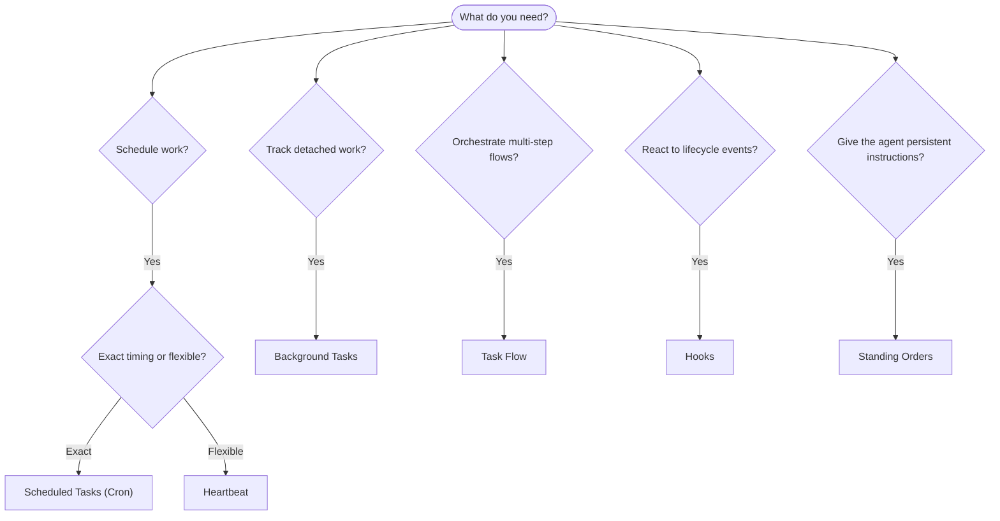

---
read_when:
    - การตัดสินใจว่าจะทำให้งานเป็นอัตโนมัติด้วย OpenClaw อย่างไร
    - การเลือกระหว่าง Heartbeat, Cron, hooks และ standing orders
    - กำลังมองหาจุดเริ่มต้นการทำงานอัตโนมัติที่เหมาะสม
summary: 'ภาพรวมของกลไกการทำงานอัตโนมัติ: งาน, cron, hooks, standing orders และ TaskFlow'
title: การทำงานอัตโนมัติและงาน
x-i18n:
    generated_at: "2026-04-24T08:57:15Z"
    model: gpt-5.4
    provider: openai
    source_hash: 1b4615cc05a6d0ef7c92f44072d11a2541bc5e17b7acb88dc27ddf0c36b2dcab
    source_path: automation/index.md
    workflow: 15
---

OpenClaw เรียกใช้งานเบื้องหลังผ่านงาน งานที่ตั้งเวลาไว้ event hooks และคำสั่งถาวร หน้านี้จะช่วยคุณเลือกกลไกที่เหมาะสมและทำความเข้าใจว่ากลไกเหล่านี้ทำงานร่วมกันอย่างไร

## คู่มือการตัดสินใจอย่างรวดเร็ว

| กรณีการใช้งาน                           | ตัวเลือกที่แนะนำ        | เหตุผล                                           |
| --------------------------------------- | ---------------------- | ------------------------------------------------ |
| ส่งรายงานประจำวันตรงเวลา 9:00 น.       | Scheduled Tasks (Cron) | กำหนดเวลาได้แม่นยำ การทำงานแยกอิสระ             |
| เตือนฉันในอีก 20 นาที                   | Scheduled Tasks (Cron) | งานครั้งเดียวที่ตั้งเวลาได้แม่นยำ (`--at`)      |
| รันการวิเคราะห์เชิงลึกทุกสัปดาห์       | Scheduled Tasks (Cron) | งานแบบสแตนด์อโลน สามารถใช้โมเดลอื่นได้          |
| ตรวจสอบกล่องข้อความทุก 30 นาที         | Heartbeat              | รวมกับการตรวจสอบอื่นได้ และรับรู้บริบท          |
| ติดตามปฏิทินสำหรับเหตุการณ์ที่กำลังจะมา | Heartbeat              | เหมาะโดยธรรมชาติกับการรับรู้อย่างเป็นระยะ      |
| ตรวจสอบสถานะของ subagent หรือการรัน ACP | Background Tasks       | ทะเบียนงานติดตามงานที่แยกทำทั้งหมด             |
| ตรวจสอบว่าอะไรถูกรันและเมื่อไร          | Background Tasks       | `openclaw tasks list` และ `openclaw tasks audit` |
| วิจัยหลายขั้นตอนแล้วสรุปผล              | TaskFlow               | orchestration แบบคงทนพร้อมการติดตาม revision    |
| รันสคริปต์เมื่อเซสชันถูกรีเซ็ต          | Hooks                  | ขับเคลื่อนด้วยเหตุการณ์ เรียกใช้ตาม lifecycle events |
| เรียกใช้โค้ดทุกครั้งที่มีการเรียก tool  | Hooks                  | Hooks สามารถกรองตามประเภทเหตุการณ์ได้          |
| ตรวจสอบ compliance ก่อนตอบกลับเสมอ     | Standing Orders        | ถูกแทรกเข้าไปในทุกเซสชันโดยอัตโนมัติ            |

### Scheduled Tasks (Cron) เทียบกับ Heartbeat

| มิติ            | Scheduled Tasks (Cron)             | Heartbeat                            |
| --------------- | ---------------------------------- | ------------------------------------ |
| การกำหนดเวลา    | แม่นยำ (cron expressions, ครั้งเดียว) | โดยประมาณ (ค่าปริยายทุก 30 นาที)    |
| บริบทเซสชัน     | เริ่มใหม่ (แยกอิสระ) หรือใช้ร่วมกัน | บริบทเต็มของเซสชันหลัก              |
| ระเบียนงาน      | ถูกสร้างเสมอ                        | ไม่ถูกสร้างเลย                       |
| การส่งผลลัพธ์    | ช่องทาง แชแนล Webhook หรือเงียบ    | แสดงในเซสชันหลักแบบอินไลน์          |
| เหมาะที่สุดสำหรับ | รายงาน การเตือน งานเบื้องหลัง      | การตรวจ inbox ปฏิทิน การแจ้งเตือน   |

ใช้ Scheduled Tasks (Cron) เมื่อคุณต้องการการกำหนดเวลาที่แม่นยำหรือการทำงานที่แยกอิสระ ใช้ Heartbeat เมื่องานนั้นได้ประโยชน์จากบริบทเต็มของเซสชันและการกำหนดเวลาแบบประมาณก็เพียงพอ

## แนวคิดหลัก

### งานที่ตั้งเวลาไว้ (cron)

Cron คือ scheduler ในตัวของ Gateway สำหรับการกำหนดเวลาที่แม่นยำ มันเก็บงานไว้อย่างคงทน ปลุกเอเจนต์ในเวลาที่เหมาะสม และสามารถส่งผลลัพธ์ไปยังแชแนลแชตหรือปลายทาง Webhook ได้ รองรับการเตือนแบบครั้งเดียว expressions แบบเกิดซ้ำ และทริกเกอร์ Webhook ขาเข้า

ดู [Scheduled Tasks](/th/automation/cron-jobs)

### งาน

ทะเบียนงานเบื้องหลังจะติดตามงานที่แยกทำทั้งหมด: การรัน ACP, การสร้าง subagent, การรัน cron แบบแยกอิสระ และการทำงานผ่าน CLI งานเป็นระเบียน ไม่ใช่ scheduler ใช้ `openclaw tasks list` และ `openclaw tasks audit` เพื่อตรวจสอบงานเหล่านี้

ดู [Background Tasks](/th/automation/tasks)

### TaskFlow

TaskFlow คือ substrate สำหรับ flow orchestration ที่อยู่เหนือ background tasks มันจัดการ flow แบบหลายขั้นตอนที่คงทนด้วยโหมดซิงก์แบบ managed และ mirrored การติดตาม revision และ `openclaw tasks flow list|show|cancel` สำหรับการตรวจสอบ

ดู [Task Flow](/th/automation/taskflow)

### คำสั่งถาวร

คำสั่งถาวรมอบสิทธิ์การปฏิบัติงานถาวรให้เอเจนต์สำหรับโปรแกรมที่กำหนดไว้ คำสั่งเหล่านี้อยู่ในไฟล์ของ workspace (โดยทั่วไปคือ `AGENTS.md`) และถูกแทรกเข้าไปในทุกเซสชัน ใช้ร่วมกับ cron เพื่อบังคับใช้ตามเวลา

ดู [Standing Orders](/th/automation/standing-orders)

### Hooks

Hooks คือสคริปต์แบบขับเคลื่อนด้วยเหตุการณ์ที่ถูกทริกเกอร์โดย lifecycle events ของเอเจนต์ (`/new`, `/reset`, `/stop`), การ Compaction ของเซสชัน, การเริ่มต้นของ gateway, การไหลของข้อความ และการเรียก tool Hooks จะถูกค้นพบโดยอัตโนมัติจากไดเรกทอรีต่าง ๆ และสามารถจัดการได้ด้วย `openclaw hooks`

ดู [Hooks](/th/automation/hooks)

### Heartbeat

Heartbeat คือเทิร์นตามรอบของเซสชันหลัก (ค่าปริยายทุก 30 นาที) มันรวมการตรวจสอบหลายอย่างไว้ด้วยกัน (inbox, ปฏิทิน, การแจ้งเตือน) ในหนึ่งเทิร์นของเอเจนต์พร้อมบริบทเต็มของเซสชัน เทิร์นของ Heartbeat จะไม่สร้างระเบียนงาน ใช้ `HEARTBEAT.md` สำหรับเช็กลิสต์ขนาดเล็ก หรือบล็อก `tasks:` เมื่อคุณต้องการการตรวจสอบเป็นระยะเฉพาะงานที่ถึงกำหนดภายใน heartbeat เอง ไฟล์ heartbeat ที่ว่างจะถูกข้ามเป็น `empty-heartbeat-file`; โหมดงานเฉพาะที่ถึงกำหนดจะถูกข้ามเป็น `no-tasks-due`

ดู [Heartbeat](/th/gateway/heartbeat)

## กลไกเหล่านี้ทำงานร่วมกันอย่างไร

- **Cron** จัดการตารางเวลาที่แม่นยำ (รายงานประจำวัน รีวิวรายสัปดาห์) และการเตือนแบบครั้งเดียว การรัน cron ทั้งหมดจะสร้างระเบียนงาน
- **Heartbeat** จัดการการติดตามตามกิจวัตร (inbox, ปฏิทิน, การแจ้งเตือน) ในหนึ่งเทิร์นแบบรวมทุก 30 นาที
- **Hooks** ตอบสนองต่อเหตุการณ์เฉพาะ (การเรียก tool, การรีเซ็ตเซสชัน, Compaction) ด้วยสคริปต์แบบกำหนดเอง
- **Standing Orders** มอบบริบทถาวรและขอบเขตอำนาจให้เอเจนต์
- **TaskFlow** ประสาน flow หลายขั้นตอนที่อยู่เหนือแต่ละงาน
- **Tasks** ติดตามงานที่แยกทำทั้งหมดโดยอัตโนมัติ เพื่อให้คุณตรวจสอบและตรวจสอบย้อนหลังได้

## ที่เกี่ยวข้อง

- [Scheduled Tasks](/th/automation/cron-jobs) — การตั้งเวลาที่แม่นยำและการเตือนแบบครั้งเดียว
- [Background Tasks](/th/automation/tasks) — ทะเบียนงานสำหรับงานที่แยกทำทั้งหมด
- [Task Flow](/th/automation/taskflow) — orchestration ของ flow หลายขั้นตอนแบบคงทน
- [Hooks](/th/automation/hooks) — สคริปต์ lifecycle แบบขับเคลื่อนด้วยเหตุการณ์
- [Standing Orders](/th/automation/standing-orders) — คำสั่งถาวรของเอเจนต์
- [Heartbeat](/th/gateway/heartbeat) — เทิร์นตามรอบของเซสชันหลัก
- [Configuration Reference](/th/gateway/configuration-reference) — คีย์การกำหนดค่าทั้งหมด
