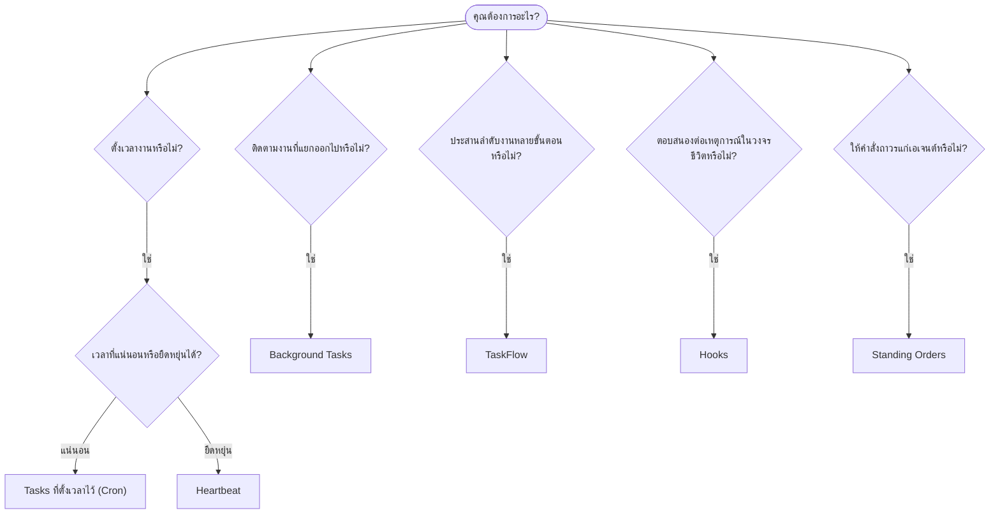

---
read_when:
    - การตัดสินใจว่าจะทำให้งานเป็นอัตโนมัติด้วย OpenClaw อย่างไร
    - การเลือกระหว่าง Heartbeat, Cron, hooks และ standing orders
    - กำลังมองหาจุดเริ่มต้นของระบบอัตโนมัติที่เหมาะสม
summary: 'ภาพรวมของกลไกการทำงานอัตโนมัติ: tasks, Cron, hooks, standing orders และ TaskFlow'
title: การทำงานอัตโนมัติและ Tasks
x-i18n:
    generated_at: "2026-04-23T05:24:38Z"
    model: gpt-5.4
    provider: openai
    source_hash: 13cd05dcd2f38737f7bb19243ad1136978bfd727006fd65226daa3590f823afe
    source_path: automation/index.md
    workflow: 15
---

# การทำงานอัตโนมัติและ Tasks

OpenClaw เรียกใช้งานในเบื้องหลังผ่าน tasks, งานที่ตั้งเวลาไว้, event hooks และคำสั่งถาวร หน้านี้จะช่วยคุณเลือกกลไกที่เหมาะสมและทำความเข้าใจว่ากลไกเหล่านี้ทำงานร่วมกันอย่างไร

## คู่มือตัดสินใจแบบรวดเร็ว

| กรณีใช้งาน                              | สิ่งที่แนะนำ            | เหตุผล                                           |
| --------------------------------------- | ---------------------- | ------------------------------------------------ |
| ส่งรายงานประจำวันตอน 9 โมงตรง          | Tasks ที่ตั้งเวลาไว้ (Cron) | เวลาที่แน่นอน, แยกการทำงานอย่างอิสระ            |
| เตือนฉันอีก 20 นาที                     | Tasks ที่ตั้งเวลาไว้ (Cron) | งานครั้งเดียวที่มีเวลาชัดเจน (`--at`)           |
| รันวิเคราะห์เชิงลึกทุกสัปดาห์          | Tasks ที่ตั้งเวลาไว้ (Cron) | เป็น task แบบแยกเดี่ยว, ใช้โมเดลอื่นได้         |
| ตรวจกล่องข้อความทุก 30 นาที            | Heartbeat              | รวมกับการตรวจอื่นได้, รับรู้บริบทได้             |
| เฝ้าดูปฏิทินสำหรับเหตุการณ์ที่ใกล้เข้ามา | Heartbeat              | เหมาะโดยธรรมชาติสำหรับการรับรู้อย่างเป็นระยะ   |
| ตรวจสถานะของ subagent หรือการรัน ACP   | Background Tasks       | บัญชีรายการ Tasks ติดตามงานที่แยกออกไปทั้งหมด   |
| ตรวจสอบว่าสิ่งใดรันไปแล้วและเมื่อใด     | Background Tasks       | `openclaw tasks list` และ `openclaw tasks audit` |
| วิจัยหลายขั้นตอนแล้วสรุปผล              | TaskFlow               | การประสานงานที่คงทนพร้อมการติดตาม revision      |
| รันสคริปต์เมื่อรีเซ็ตเซสชัน            | Hooks                  | ขับเคลื่อนด้วยเหตุการณ์, ทำงานเมื่อเกิดเหตุการณ์ในวงจรชีวิต |
| รันโค้ดทุกครั้งที่มีการเรียกใช้เครื่องมือ | Hooks                  | Hooks กรองตามประเภทเหตุการณ์ได้                 |
| ตรวจ compliance ก่อนตอบกลับเสมอ        | Standing Orders        | แทรกเข้าไปในทุกเซสชันโดยอัตโนมัติ               |

### Tasks ที่ตั้งเวลาไว้ (Cron) เทียบกับ Heartbeat

| มิติ            | Tasks ที่ตั้งเวลาไว้ (Cron)         | Heartbeat                            |
| --------------- | ----------------------------------- | ------------------------------------ |
| เวลา            | แน่นอน (cron expressions, one-shot) | โดยประมาณ (ค่าเริ่มต้นทุก 30 นาที) |
| บริบทเซสชัน     | ใหม่ทั้งหมด (แยกอิสระ) หรือใช้ร่วมกัน | บริบทเต็มของเซสชันหลัก            |
| ระเบียน task    | ถูกสร้างเสมอ                        | ไม่ถูกสร้างเลย                      |
| การส่งผลลัพธ์    | ช่องทาง, Webhook หรือเงียบ          | แสดงในเซสชันหลักแบบ inline         |
| เหมาะที่สุดสำหรับ | รายงาน, การเตือน, งานเบื้องหลัง     | การตรวจกล่องข้อความ, ปฏิทิน, การแจ้งเตือน |

ใช้ Tasks ที่ตั้งเวลาไว้ (Cron) เมื่อคุณต้องการเวลาที่แม่นยำหรือการทำงานแบบแยกอิสระ ใช้ Heartbeat เมื่องานนั้นได้ประโยชน์จากบริบทเต็มของเซสชันและไม่จำเป็นต้องมีเวลาที่แม่นยำมาก

## แนวคิดหลัก

### tasks ที่ตั้งเวลาไว้ (cron)

Cron คือ scheduler ในตัวของ Gateway สำหรับการตั้งเวลาที่แม่นยำ มันเก็บ jobs ไว้ถาวร ปลุกเอเจนต์ในเวลาที่เหมาะสม และสามารถส่งผลลัพธ์ไปยังช่องแชตหรือปลายทาง Webhook ได้ รองรับการเตือนแบบครั้งเดียว, recurring expressions และ inbound webhook triggers

ดู [Tasks ที่ตั้งเวลาไว้](/th/automation/cron-jobs)

### Tasks

บัญชีรายการ task เบื้องหลังใช้ติดตามงานที่แยกออกไปทั้งหมด: การรัน ACP, การสร้าง subagent, การรัน cron แบบแยกอิสระ และการทำงานของ CLI Tasks เป็นระเบียน ไม่ใช่ตัวจัดตาราง ใช้ `openclaw tasks list` และ `openclaw tasks audit` เพื่อตรวจดูข้อมูลเหล่านี้

ดู [Background Tasks](/th/automation/tasks)

### TaskFlow

TaskFlow คือชั้นโครงสร้างสำหรับประสานลำดับงานเหนือ background tasks มันจัดการลำดับงานหลายขั้นตอนที่คงทนด้วยโหมดซิงก์แบบ managed และ mirrored, การติดตาม revision และ `openclaw tasks flow list|show|cancel` สำหรับการตรวจสอบ

ดู [TaskFlow](/th/automation/taskflow)

### คำสั่งถาวร

คำสั่งถาวรมอบอำนาจในการปฏิบัติงานอย่างถาวรให้เอเจนต์สำหรับโปรแกรมที่กำหนดไว้ คำสั่งเหล่านี้อยู่ในไฟล์ของ workspace (โดยทั่วไปคือ `AGENTS.md`) และจะถูกแทรกเข้าไปในทุกเซสชัน ใช้ร่วมกับ Cron เพื่อบังคับใช้ตามเวลา

ดู [Standing Orders](/th/automation/standing-orders)

### Hooks

Hooks คือสคริปต์แบบขับเคลื่อนด้วยเหตุการณ์ที่ถูกเรียกจากเหตุการณ์ในวงจรชีวิตของเอเจนต์ (`/new`, `/reset`, `/stop`), session compaction, การเริ่มต้น Gateway, การไหลของข้อความ และการเรียกใช้เครื่องมือ Hooks จะถูกค้นพบโดยอัตโนมัติจากไดเรกทอรีต่างๆ และสามารถจัดการได้ด้วย `openclaw hooks`

ดู [Hooks](/th/automation/hooks)

### Heartbeat

Heartbeat คือเทิร์นตามรอบของเซสชันหลัก (ค่าเริ่มต้นทุก 30 นาที) มันรวมการตรวจหลายอย่างเข้าด้วยกัน (กล่องข้อความ, ปฏิทิน, การแจ้งเตือน) ในหนึ่งเทิร์นของเอเจนต์พร้อมบริบทเต็มของเซสชัน Heartbeat turns จะไม่สร้างระเบียน task ใช้ `HEARTBEAT.md` สำหรับเช็กลิสต์ขนาดเล็ก หรือบล็อก `tasks:` เมื่อคุณต้องการให้มีการตรวจเป็นระยะเฉพาะรายการที่ถึงกำหนดภายใน heartbeat เอง ไฟล์ heartbeat ที่ว่างจะถูกข้ามเป็น `empty-heartbeat-file`; โหมด task เฉพาะที่ถึงกำหนดจะถูกข้ามเป็น `no-tasks-due`

ดู [Heartbeat](/th/gateway/heartbeat)

## กลไกเหล่านี้ทำงานร่วมกันอย่างไร

- **Cron** จัดการตารางเวลาที่แม่นยำ (รายงานประจำวัน, การทบทวนรายสัปดาห์) และการเตือนแบบครั้งเดียว การรัน cron ทุกครั้งจะสร้างระเบียน task
- **Heartbeat** จัดการการเฝ้าดูตามกิจวัตร (กล่องข้อความ, ปฏิทิน, การแจ้งเตือน) ในหนึ่งเทิร์นแบบรวมทุก 30 นาที
- **Hooks** ตอบสนองต่อเหตุการณ์เฉพาะ (การเรียกใช้เครื่องมือ, การรีเซ็ตเซสชัน, Compaction) ด้วยสคริปต์ที่กำหนดเอง
- **คำสั่งถาวร** มอบบริบทถาวรและขอบเขตอำนาจให้เอเจนต์
- **TaskFlow** ประสานลำดับงานหลายขั้นตอนเหนือ tasks รายตัว
- **Tasks** ติดตามงานที่แยกออกไปทั้งหมดโดยอัตโนมัติ เพื่อให้คุณตรวจดูและตรวจสอบย้อนหลังได้

## ที่เกี่ยวข้อง

- [Tasks ที่ตั้งเวลาไว้](/th/automation/cron-jobs) — การตั้งเวลาที่แม่นยำและการเตือนแบบครั้งเดียว
- [Background Tasks](/th/automation/tasks) — บัญชีรายการ task สำหรับงานที่แยกออกไปทั้งหมด
- [TaskFlow](/th/automation/taskflow) — การประสานลำดับงานหลายขั้นตอนแบบคงทน
- [Hooks](/th/automation/hooks) — สคริปต์วงจรชีวิตแบบขับเคลื่อนด้วยเหตุการณ์
- [Standing Orders](/th/automation/standing-orders) — คำสั่งถาวรสำหรับเอเจนต์
- [Heartbeat](/th/gateway/heartbeat) — เทิร์นเป็นระยะของเซสชันหลัก
- [Configuration Reference](/th/gateway/configuration-reference) — คีย์การตั้งค่าทั้งหมด
