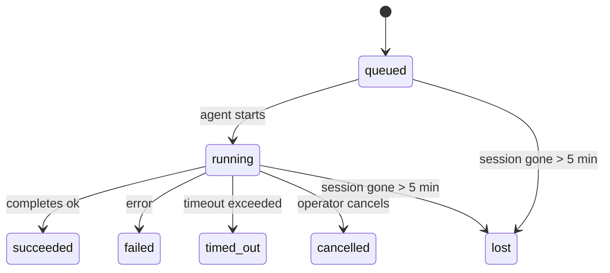

---
read_when:
    - กำลังตรวจสอบงานเบื้องหลังที่กำลังดำเนินอยู่หรือเพิ่งเสร็จสิ้นล่าสุด
    - ดีบักความล้มเหลวในการส่งมอบสำหรับการรันเอเจนต์แบบแยกออกจากกัน
    - ทำความเข้าใจว่าการทำงานเบื้องหลังเชื่อมโยงกับเซสชัน, Cron และ Heartbeat อย่างไร
summary: การติดตามงานเบื้องหลังสำหรับการทำงานของ ACP, subagent, งาน Cron แบบแยกส่วน และการดำเนินการของ CLI
title: งานเบื้องหลัง
x-i18n:
    generated_at: "2026-04-23T05:24:39Z"
    model: gpt-5.4
    provider: openai
    source_hash: a4cd666b3eaffde8df0b5e1533eb337e44a0824824af6f8a240f18a89f71b402
    source_path: automation/tasks.md
    workflow: 15
---

# งานเบื้องหลัง

> **กำลังมองหาการตั้งเวลาอยู่ใช่ไหม?** ดู [Automation & Tasks](/th/automation) เพื่อเลือกกลไกที่เหมาะสม หน้านี้ครอบคลุมเรื่องการ**ติดตาม**งานเบื้องหลัง ไม่ใช่การตั้งเวลาให้มันทำงาน

งานเบื้องหลังใช้ติดตามงานที่รัน**นอกเซสชันการสนทนาหลักของคุณ**:
การทำงานของ ACP, การสร้าง subagent, การรันงาน Cron แบบแยกส่วน และการดำเนินการที่เริ่มจาก CLI

งานต่าง ๆ ไม่ได้มาแทนที่เซสชัน งาน Cron หรือ Heartbeat แต่เป็น**สมุดบันทึกกิจกรรม**ที่บันทึกว่างานแบบแยกส่วนใดเกิดขึ้น เมื่อไร และสำเร็จหรือไม่

<Note>
ไม่ใช่ทุกการทำงานของเอเจนต์จะสร้างงาน Heartbeat turn และการแชตแบบโต้ตอบตามปกติจะไม่สร้างงาน การรัน Cron ทั้งหมด, การสร้าง ACP, การสร้าง subagent และคำสั่งเอเจนต์ผ่าน CLI จะสร้างงาน
</Note>

## สรุปสั้น ๆ

- งานคือ**บันทึกข้อมูล** ไม่ใช่ตัวจัดตารางเวลา — Cron และ Heartbeat เป็นตัวตัดสินว่าเมื่อไรงานจะรัน ส่วนงานจะติดตามว่าเกิดอะไรขึ้น
- ACP, subagent, งาน Cron ทั้งหมด และการดำเนินการผ่าน CLI จะสร้างงาน ส่วน Heartbeat turn จะไม่สร้าง
- แต่ละงานจะเปลี่ยนผ่านสถานะ `queued → running → terminal` (succeeded, failed, timed_out, cancelled หรือ lost)
- งาน Cron จะยังคง active อยู่ตราบใดที่รันไทม์ Cron ยังเป็นเจ้าของงานนั้นอยู่ ส่วนงาน CLI ที่มีแชตรองรับจะคง active อยู่เฉพาะขณะที่บริบทการรันเจ้าของยังทำงานอยู่
- การเสร็จสิ้นเป็นแบบ push-driven: งานแบบแยกส่วนสามารถแจ้งได้โดยตรง หรือปลุกเซสชัน/Heartbeat ของผู้ขอเมื่อเสร็จสิ้น ดังนั้นลูป polling เพื่อตรวจสถานะจึงมักไม่ใช่รูปแบบที่เหมาะสม
- การรัน Cron แบบแยกส่วนและการเสร็จสิ้นของ subagent จะพยายามอย่างดีที่สุดในการล้างแท็บเบราว์เซอร์/โปรเซสที่ติดตามไว้สำหรับ child session ก่อนทำงานล้างข้อมูลขั้นสุดท้าย
- การส่งมอบจาก Cron แบบแยกส่วนจะระงับการตอบกลับระหว่างทางจาก parent ที่ล้าสมัย ขณะที่งาน subagent ลูกหลานยังคงค้างอยู่ และจะเลือกเอาต์พุตสุดท้ายจาก descendant หากมาถึงก่อนการส่งมอบ
- การแจ้งเตือนเมื่อเสร็จสิ้นจะถูกส่งตรงไปยังช่องทาง หรือเข้าคิวไว้สำหรับ Heartbeat ครั้งถัดไป
- `openclaw tasks list` แสดงงานทั้งหมด; `openclaw tasks audit` แสดงปัญหาต่าง ๆ
- บันทึกที่อยู่ในสถานะ terminal จะถูกเก็บไว้ 7 วัน จากนั้นจะถูกลบอัตโนมัติ

## เริ่มต้นอย่างรวดเร็ว

```bash
# แสดงงานทั้งหมด (ใหม่สุดก่อน)
openclaw tasks list

# กรองตามรันไทม์หรือสถานะ
openclaw tasks list --runtime acp
openclaw tasks list --status running

# แสดงรายละเอียดของงานที่ระบุ (ด้วย ID, run ID หรือ session key)
openclaw tasks show <lookup>

# ยกเลิกงานที่กำลังรันอยู่ (จะ kill child session)
openclaw tasks cancel <lookup>

# เปลี่ยนนโยบายการแจ้งเตือนสำหรับงาน
openclaw tasks notify <lookup> state_changes

# รันการตรวจสอบสุขภาพระบบ
openclaw tasks audit

# ดูตัวอย่างหรือปรับใช้การบำรุงรักษา
openclaw tasks maintenance
openclaw tasks maintenance --apply

# ตรวจสอบสถานะของ TaskFlow
openclaw tasks flow list
openclaw tasks flow show <lookup>
openclaw tasks flow cancel <lookup>
```

## อะไรบ้างที่ทำให้เกิดงาน

| แหล่งที่มา              | ประเภทรันไทม์ | เวลาที่สร้างบันทึกงาน                               | นโยบายการแจ้งเตือนเริ่มต้น |
| ----------------------- | ------------- | ---------------------------------------------------- | --------------------------- |
| การทำงานเบื้องหลังของ ACP | `acp`         | เมื่อสร้าง child ACP session                         | `done_only`                 |
| การประสานงาน subagent   | `subagent`    | เมื่อสร้าง subagent ผ่าน `sessions_spawn`            | `done_only`                 |
| งาน Cron (ทุกประเภท)    | `cron`        | ทุกครั้งที่รัน Cron (ทั้ง main-session และ isolated) | `silent`                    |
| การดำเนินการผ่าน CLI    | `cli`         | คำสั่ง `openclaw agent` ที่รันผ่าน Gateway          | `silent`                    |
| งานสื่อของเอเจนต์       | `cli`         | การรัน `video_generate` ที่มี session รองรับ         | `silent`                    |

งาน Cron ใน main-session ใช้นโยบายการแจ้งเตือน `silent` เป็นค่าเริ่มต้น — จะสร้างบันทึกไว้เพื่อติดตาม แต่จะไม่สร้างการแจ้งเตือน งาน Cron แบบแยกส่วนก็ใช้ `silent` เป็นค่าเริ่มต้นเช่นกัน แต่จะมองเห็นได้ชัดกว่าเพราะรันในเซสชันของตัวเอง

การรัน `video_generate` ที่มี session รองรับก็ใช้นโยบายการแจ้งเตือน `silent` เช่นกัน โดยยังคงสร้างบันทึกงาน แต่การจัดการเมื่อเสร็จสิ้นจะถูกส่งกลับไปยังเซสชันเอเจนต์ต้นทางในรูป internal wake เพื่อให้เอเจนต์สามารถเขียนข้อความติดตามผลและแนบวิดีโอที่เสร็จแล้วได้เอง หากคุณเลือกใช้ `tools.media.asyncCompletion.directSend` การเสร็จสิ้นแบบ async ของ `music_generate` และ `video_generate` จะพยายามส่งตรงไปยังช่องทางก่อน แล้วจึงค่อย fallback ไปยังเส้นทางปลุก requester session

ขณะที่งาน `video_generate` ที่มี session รองรับยัง active อยู่ ตัวเครื่องมือจะทำหน้าที่เป็น guardrail ด้วย: การเรียก `video_generate` ซ้ำในเซสชันเดียวกันนั้นจะคืนค่าสถานะของงานที่ยัง active แทนที่จะเริ่มการสร้างพร้อมกันครั้งที่สอง ใช้ `action: "status"` เมื่อต้องการตรวจสอบความคืบหน้า/สถานะอย่างชัดเจนจากฝั่งเอเจนต์

**สิ่งที่ไม่ทำให้เกิดงาน:**

- Heartbeat turn — main-session; ดู [Heartbeat](/th/gateway/heartbeat)
- การแชตแบบโต้ตอบตามปกติ
- การตอบกลับ `/command` โดยตรง

## วงจรชีวิตของงาน



| สถานะ       | ความหมาย                                                                 |
| ----------- | ------------------------------------------------------------------------ |
| `queued`    | ถูกสร้างแล้ว กำลังรอให้เอเจนต์เริ่มทำงาน                                  |
| `running`   | agent turn กำลังทำงานอยู่                                                 |
| `succeeded` | เสร็จสมบูรณ์เรียบร้อย                                                     |
| `failed`    | เสร็จสิ้นพร้อมข้อผิดพลาด                                                  |
| `timed_out` | เกินเวลาที่กำหนดไว้                                                       |
| `cancelled` | ถูกหยุดโดยผู้ปฏิบัติงานผ่าน `openclaw tasks cancel`                      |
| `lost`      | รันไทม์สูญเสียสถานะ backing ที่เป็นข้อมูลอ้างอิงหลังช่วงผ่อนผัน 5 นาที |

การเปลี่ยนสถานะเกิดขึ้นโดยอัตโนมัติ — เมื่อการรันของเอเจนต์ที่เกี่ยวข้องสิ้นสุดลง สถานะงานจะอัปเดตให้ตรงกัน

`lost` รับรู้ตามรันไทม์:

- งาน ACP: เมทาดาทาของ ACP child session ที่ใช้เป็น backing หายไป
- งาน subagent: child session ที่ใช้เป็น backing หายไปจาก target agent store
- งาน Cron: รันไทม์ Cron ไม่ได้ติดตามงานนั้นว่า active อีกต่อไป
- งาน CLI: งาน child-session แบบ isolated จะใช้ child session; งาน CLI ที่มีแชตรองรับจะใช้บริบทการรันสดแทน ดังนั้นแถว session ของช่องทาง/กลุ่ม/ข้อความโดยตรงที่ยังค้างอยู่จะไม่ทำให้งานยังคง active ต่อไป

## การส่งมอบและการแจ้งเตือน

เมื่องานเข้าสู่สถานะ terminal แล้ว OpenClaw จะแจ้งให้คุณทราบ มีเส้นทางการส่งมอบสองแบบ:

**การส่งมอบโดยตรง** — หากงานมีเป้าหมายเป็นช่องทาง ( `requesterOrigin` ) ข้อความแจ้งการเสร็จสิ้นจะถูกส่งตรงไปยังช่องทางนั้นทันที (Telegram, Discord, Slack ฯลฯ) สำหรับการเสร็จสิ้นของ subagent นั้น OpenClaw จะคงการกำหนดเส้นทาง thread/topic ที่ผูกไว้เมื่อมีข้อมูลพร้อม และยังสามารถเติมค่า `to` / account ที่หายไปจากเส้นทางที่เก็บไว้ของ requester session (`lastChannel` / `lastTo` / `lastAccountId`) ก่อนจะยอมแพ้กับการส่งตรง

**การส่งมอบแบบเข้าคิวในเซสชัน** — หากการส่งตรงล้มเหลว หรือไม่ได้ตั้งค่า origin ไว้ การอัปเดตจะถูกเข้าคิวเป็น system event ใน requester session และจะแสดงขึ้นมาใน Heartbeat ครั้งถัดไป

<Tip>
การเสร็จสิ้นของงานจะกระตุ้นการปลุก Heartbeat ทันที เพื่อให้คุณเห็นผลลัพธ์ได้อย่างรวดเร็ว — คุณไม่จำเป็นต้องรอจนถึงรอบ Heartbeat ที่ตั้งเวลาไว้ครั้งถัดไป
</Tip>

นั่นหมายความว่าเวิร์กโฟลว์ปกติจะเป็นแบบ push-based: เริ่มงานแบบแยกส่วนเพียงครั้งเดียว แล้วปล่อยให้รันไทม์ปลุกหรือแจ้งคุณเมื่อเสร็จสิ้น ให้ polling สถานะงานเฉพาะเมื่อคุณต้องการดีบัก แทรกแซง หรือทำการตรวจสอบอย่างชัดเจนเท่านั้น

### นโยบายการแจ้งเตือน

ควบคุมว่าคุณจะได้รับข้อมูลของแต่ละงานมากน้อยเพียงใด:

| นโยบาย               | สิ่งที่จะถูกส่งมอบ                                                         |
| -------------------- | --------------------------------------------------------------------------- |
| `done_only` (ค่าเริ่มต้น) | เฉพาะสถานะ terminal (succeeded, failed ฯลฯ) — **นี่คือค่าเริ่มต้น** |
| `state_changes`      | ทุกการเปลี่ยนสถานะและการอัปเดตความคืบหน้า                                  |
| `silent`             | ไม่ส่งอะไรเลย                                                               |

เปลี่ยนนโยบายขณะที่งานกำลังรัน:

```bash
openclaw tasks notify <lookup> state_changes
```

## อ้างอิง CLI

### `tasks list`

```bash
openclaw tasks list [--runtime <acp|subagent|cron|cli>] [--status <status>] [--json]
```

คอลัมน์ผลลัพธ์: Task ID, Kind, Status, Delivery, Run ID, Child Session, Summary

### `tasks show`

```bash
openclaw tasks show <lookup>
```

โทเค็น lookup รองรับ task ID, run ID หรือ session key แสดงระเบียนทั้งหมด รวมถึงเวลา สถานะการส่งมอบ ข้อผิดพลาด และสรุป terminal

### `tasks cancel`

```bash
openclaw tasks cancel <lookup>
```

สำหรับงาน ACP และ subagent คำสั่งนี้จะ kill child session สำหรับงานที่ติดตามผ่าน CLI การยกเลิกจะถูกบันทึกไว้ใน registry ของงาน (ไม่มี handle ของ child runtime แยกต่างหาก) สถานะจะเปลี่ยนเป็น `cancelled` และจะมีการส่งการแจ้งเตือนเมื่อเหมาะสม

### `tasks notify`

```bash
openclaw tasks notify <lookup> <done_only|state_changes|silent>
```

### `tasks audit`

```bash
openclaw tasks audit [--json]
```

แสดงปัญหาเชิงปฏิบัติการ Findings จะแสดงใน `openclaw status` ด้วยเมื่อมีการตรวจพบปัญหา

| Finding                   | ระดับความรุนแรง | ตัวกระตุ้น                                            |
| ------------------------- | --------------- | ----------------------------------------------------- |
| `stale_queued`            | warn            | อยู่ในสถานะ queued นานเกิน 10 นาที                    |
| `stale_running`           | error           | อยู่ในสถานะ running นานเกิน 30 นาที                   |
| `lost`                    | error           | ความเป็นเจ้าของงานที่มีรันไทม์รองรับหายไป            |
| `delivery_failed`         | warn            | การส่งมอบล้มเหลว และนโยบายการแจ้งเตือนไม่ใช่ `silent` |
| `missing_cleanup`         | warn            | งาน terminal ที่ไม่มี timestamp ของการ cleanup        |
| `inconsistent_timestamps` | warn            | ลำดับเวลาไม่สอดคล้องกัน (เช่น ended ก่อน started)   |

### `tasks maintenance`

```bash
openclaw tasks maintenance [--json]
openclaw tasks maintenance --apply [--json]
```

ใช้คำสั่งนี้เพื่อดูตัวอย่างหรือปรับใช้การกระทบยอด การประทับเวลาการ cleanup และการลบข้อมูลเก่าสำหรับงานและสถานะ Task Flow

การกระทบยอดรับรู้ตามรันไทม์:

- งาน ACP/subagent ตรวจสอบ child session ที่ใช้เป็น backing
- งาน Cron ตรวจสอบว่ารันไทม์ Cron ยังเป็นเจ้าของงานนั้นอยู่หรือไม่
- งาน CLI ที่มีแชตรองรับตรวจสอบบริบทการรันสดของเจ้าของ ไม่ได้ดูแค่แถว chat session เท่านั้น

การ cleanup หลังเสร็จสิ้นก็รับรู้ตามรันไทม์เช่นกัน:

- เมื่อ subagent เสร็จสิ้น จะพยายามอย่างดีที่สุดในการปิดแท็บเบราว์เซอร์/โปรเซสที่ติดตามไว้สำหรับ child session ก่อนที่การ cleanup ประกาศผลจะดำเนินต่อไป
- เมื่อ Cron แบบแยกส่วนเสร็จสิ้น จะพยายามอย่างดีที่สุดในการปิดแท็บเบราว์เซอร์/โปรเซสที่ติดตามไว้สำหรับ cron session ก่อนที่การรันจะปิดตัวลงทั้งหมด
- การส่งมอบจาก Cron แบบแยกส่วนจะรอการติดตามผลของ subagent ลูกหลานเมื่อจำเป็น และจะระงับข้อความตอบรับของ parent ที่ล้าสมัยแทนการประกาศข้อความนั้น
- การส่งมอบเมื่อ subagent เสร็จสิ้นจะเลือกข้อความ assistant ล่าสุดที่มองเห็นได้เป็นหลัก; หากว่างเปล่าจะ fallback ไปใช้ข้อความ tool/toolResult ล่าสุดที่ผ่านการ sanitize แล้ว และการรันแบบ tool-call ที่หมดเวลาเพียงอย่างเดียวอาจยุบเหลือสรุปความคืบหน้าบางส่วนแบบสั้น ๆ การรันที่ล้มเหลวในสถานะ terminal จะประกาศสถานะความล้มเหลวโดยไม่เล่นข้อความตอบกลับที่บันทึกไว้ซ้ำ
- ความล้มเหลวของการ cleanup จะไม่บดบังผลลัพธ์ที่แท้จริงของงาน

### `tasks flow list|show|cancel`

```bash
openclaw tasks flow list [--status <status>] [--json]
openclaw tasks flow show <lookup> [--json]
openclaw tasks flow cancel <lookup>
```

ใช้คำสั่งเหล่านี้เมื่อสิ่งที่คุณสนใจคือ TaskFlow ที่ทำหน้าที่ orchestration มากกว่าบันทึกงานเบื้องหลังรายงานเดียว

## กระดานงานแชต (`/tasks`)

ใช้ `/tasks` ในเซสชันแชตใดก็ได้เพื่อดูงานเบื้องหลังที่เชื่อมโยงกับเซสชันนั้น กระดานจะแสดงงานที่กำลัง active และงานที่เพิ่งเสร็จล่าสุด พร้อมรันไทม์ สถานะ เวลา และรายละเอียดความคืบหน้าหรือข้อผิดพลาด

เมื่อเซสชันปัจจุบันไม่มีงานที่ลิงก์ไว้ซึ่งมองเห็นได้ `/tasks` จะ fallback ไปใช้จำนวนงานในระดับเอเจนต์ภายในเครื่อง
เพื่อให้คุณยังคงเห็นภาพรวมได้โดยไม่เปิดเผยรายละเอียดของเซสชันอื่น

สำหรับ ledger ของผู้ปฏิบัติงานแบบเต็ม ให้ใช้ CLI: `openclaw tasks list`

## การผสานรวมกับสถานะ (task pressure)

`openclaw status` มีสรุปงานแบบดูได้ในพริบตา:

```
Tasks: 3 queued · 2 running · 1 issues
```

สรุปรายงานสิ่งต่อไปนี้:

- **active** — จำนวนของ `queued` + `running`
- **failures** — จำนวนของ `failed` + `timed_out` + `lost`
- **byRuntime** — การแจกแจงตาม `acp`, `subagent`, `cron`, `cli`

ทั้ง `/status` และเครื่องมือ `session_status` ใช้สแนปชอตงานที่รับรู้การ cleanup: ระบบจะให้ความสำคัญกับงานที่ active ซ่อนแถวงานที่เสร็จสิ้นแล้วแต่ล้าสมัย และจะแสดงความล้มเหลวล่าสุดเฉพาะเมื่อไม่มีงาน active เหลืออยู่เท่านั้น วิธีนี้ช่วยให้การ์ดสถานะโฟกัสกับสิ่งที่สำคัญในตอนนี้

## การจัดเก็บและการบำรุงรักษา

### ตำแหน่งที่เก็บงาน

บันทึกงานจะถูกเก็บถาวรใน SQLite ที่:

```
$OPENCLAW_STATE_DIR/tasks/runs.sqlite
```

registry จะถูกโหลดเข้า memory เมื่อ Gateway เริ่มทำงาน และซิงก์การเขียนลง SQLite เพื่อความคงทนข้ามการรีสตาร์ต

### การบำรุงรักษาอัตโนมัติ

ตัว sweeper จะทำงานทุก ๆ **60 วินาที** และจัดการ 3 อย่าง:

1. **การกระทบยอด** — ตรวจสอบว่างานที่ active ยังมี backing ของรันไทม์ที่เป็นข้อมูลอ้างอิงอยู่หรือไม่ งาน ACP/subagent ใช้สถานะ child session, งาน Cron ใช้ความเป็นเจ้าของงานที่ active และงาน CLI ที่มีแชตรองรับใช้บริบทการรันของเจ้าของ หากสถานะ backing นั้นหายไปนานเกิน 5 นาที งานจะถูกทำเครื่องหมายเป็น `lost`
2. **การประทับเวลาการ cleanup** — ตั้งค่า timestamp `cleanupAfter` บนงานที่อยู่ในสถานะ terminal (`endedAt + 7 days`)
3. **การลบข้อมูลเก่า** — ลบบันทึกที่เลยวันที่ `cleanupAfter` ไปแล้ว

**การเก็บรักษา**: บันทึกงานในสถานะ terminal จะถูกเก็บไว้ **7 วัน** จากนั้นจะถูกลบอัตโนมัติ ไม่ต้องมีการตั้งค่าใด ๆ

## งานสัมพันธ์กับระบบอื่นอย่างไร

### งานและ TaskFlow

[TaskFlow](/th/automation/taskflow) คือชั้น orchestration ของ flow ที่อยู่เหนือกว่างานเบื้องหลัง ตลอดอายุการทำงาน flow เดียวอาจประสานงานหลายงานโดยใช้โหมด sync แบบ managed หรือ mirrored ใช้ `openclaw tasks` เพื่อตรวจสอบบันทึกงานแต่ละรายการ และใช้ `openclaw tasks flow` เพื่อตรวจสอบ flow ที่ทำ orchestration

ดูรายละเอียดได้ที่ [TaskFlow](/th/automation/taskflow)

### งานและ Cron

**นิยาม**ของงาน Cron อยู่ใน `~/.openclaw/cron/jobs.json`; สถานะการทำงานระหว่างรันไทม์จะอยู่ข้างกันใน `~/.openclaw/cron/jobs-state.json` การรัน Cron **ทุกครั้ง** จะสร้างบันทึกงาน ทั้งแบบ main-session และแบบ isolated งาน Cron ใน main-session ใช้นโยบายการแจ้งเตือน `silent` เป็นค่าเริ่มต้น เพื่อให้ติดตามได้โดยไม่สร้างการแจ้งเตือน

ดู [งาน Cron](/th/automation/cron-jobs)

### งานและ Heartbeat

การทำงานของ Heartbeat เป็น turn ของ main-session — จึงไม่สร้างบันทึกงาน เมื่องานเสร็จสิ้น ก็สามารถกระตุ้นการปลุก Heartbeat เพื่อให้คุณเห็นผลลัพธ์ได้อย่างรวดเร็ว

ดู [Heartbeat](/th/gateway/heartbeat)

### งานและเซสชัน

งานอาจอ้างอิงถึง `childSessionKey` (ตำแหน่งที่งานรัน) และ `requesterSessionKey` (ผู้ที่เริ่มงาน) เซสชันคือบริบทของการสนทนา ส่วนงานคือการติดตามกิจกรรมที่อยู่เหนือบริบทนั้น

### งานและการทำงานของเอเจนต์

`runId` ของงานจะเชื่อมโยงไปยังการทำงานของเอเจนต์ที่กำลังทำงานนั้นอยู่ เหตุการณ์ในวงจรชีวิตของเอเจนต์ (เริ่มต้น สิ้นสุด ข้อผิดพลาด) จะอัปเดตสถานะงานโดยอัตโนมัติ — คุณไม่จำเป็นต้องจัดการวงจรชีวิตเองด้วยตนเอง

## ที่เกี่ยวข้อง

- [Automation & Tasks](/th/automation) — ภาพรวมของกลไกอัตโนมัติทั้งหมด
- [TaskFlow](/th/automation/taskflow) — orchestration ของ flow ที่อยู่เหนือระดับงาน
- [Scheduled Tasks](/th/automation/cron-jobs) — การตั้งเวลาให้งานเบื้องหลัง
- [Heartbeat](/th/gateway/heartbeat) — turn ของ main-session แบบเป็นระยะ
- [CLI: Tasks](/cli/index#tasks) — เอกสารอ้างอิงคำสั่ง CLI
