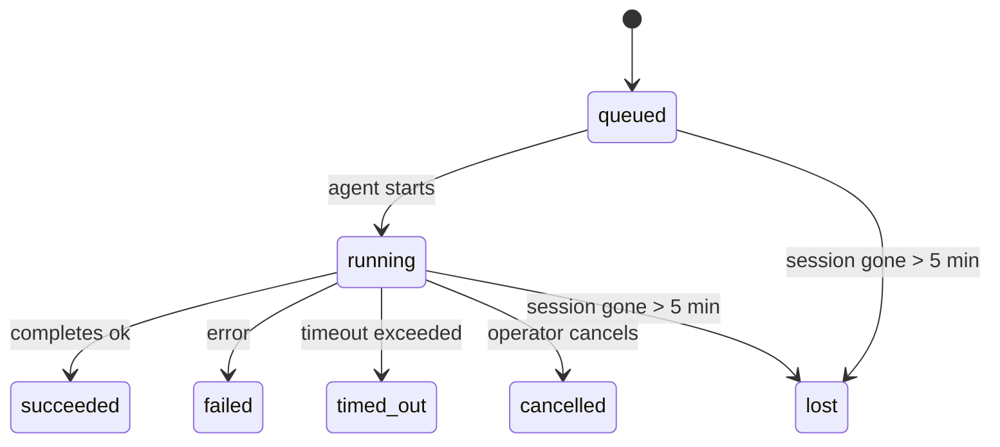

---
read_when:
    - การตรวจสอบงานเบื้องหลังที่กำลังดำเนินอยู่หรือเพิ่งเสร็จสิ้น recently
    - การดีบักความล้มเหลวในการส่งมอบสำหรับการรัน agent แบบแยกออกมา
    - ทำความเข้าใจว่าการรันเบื้องหลังเกี่ยวข้องกับเซสชัน Cron และ Heartbeat อย่างไร
summary: การติดตามงานเบื้องหลังสำหรับการทำงานของ ACP, subagents, งาน Cron แบบแยกออกมา, และการดำเนินการของ CLI
title: งานเบื้องหลัง
x-i18n:
    generated_at: "2026-04-23T06:08:18Z"
    model: gpt-5.4
    provider: openai
    source_hash: 5cd0b0db6c20cc677aa5cc50c42e09043d4354e026ca33c020d804761c331413
    source_path: automation/tasks.md
    workflow: 15
---

# งานเบื้องหลัง

> **กำลังมองหาการตั้งเวลาอยู่ใช่ไหม?** ดู [Automation & Tasks](/th/automation) เพื่อเลือกกลไกที่เหมาะสม หน้านี้ครอบคลุมเรื่องการ**ติดตาม**งานเบื้องหลัง ไม่ใช่การตั้งเวลาให้มันทำงาน

งานเบื้องหลังใช้ติดตามงานที่ทำงานอยู่**นอกเซสชันการสนทนาหลักของคุณ**:
การทำงานของ ACP, การสปอน subagent, การรันงาน Cron แบบแยกออกมา, และการดำเนินการที่เริ่มจาก CLI

Tasks **ไม่ได้**มาแทนที่เซสชัน งาน Cron หรือ Heartbeat — แต่เป็น**สมุดบันทึกกิจกรรม**ที่บันทึกว่างานแบบแยกออกมานั้นเกิดอะไรขึ้น เมื่อไร และสำเร็จหรือไม่

<Note>
ไม่ใช่ทุกการรันของ agent จะสร้าง task เสมอไป การวนของ Heartbeat และการแชตแบบโต้ตอบปกติจะไม่สร้าง task แต่การรัน Cron ทั้งหมด การสปอน ACP การสปอน subagent และคำสั่ง agent ผ่าน CLI จะสร้าง task
</Note>

## สรุปสั้นๆ

- Tasks เป็น**บันทึกข้อมูล** ไม่ใช่ตัวตั้งเวลา — Cron และ Heartbeat เป็นตัวตัดสินใจว่า _เมื่อไร_ งานจะรัน ส่วน tasks ใช้ติดตามว่า _เกิดอะไรขึ้น_
- ACP, subagents, งาน Cron ทั้งหมด และการดำเนินการผ่าน CLI จะสร้าง task ส่วนการวนของ Heartbeat จะไม่สร้าง
- แต่ละ task จะเปลี่ยนสถานะผ่าน `queued → running → terminal` (succeeded, failed, timed_out, cancelled, หรือ lost)
- Cron tasks จะยังคง active อยู่ตราบใดที่ Cron runtime ยังเป็นเจ้าของงานนั้น ส่วน chat-backed CLI tasks จะยังคง active อยู่เฉพาะเมื่อ run context ที่เป็นเจ้าของยังทำงานอยู่
- การเสร็จสิ้นเป็นแบบ push-driven: งานแบบแยกออกมาสามารถแจ้งได้โดยตรงหรือปลุกเซสชัน/Heartbeat ของผู้ร้องขอเมื่อเสร็จสิ้น ดังนั้นลูป polling เพื่อตรวจสถานะจึงมักไม่ใช่รูปแบบที่เหมาะสม
- การรัน Cron แบบแยกออกมาและการเสร็จสิ้นของ subagent จะพยายามอย่างดีที่สุดในการปิดแท็บ/โปรเซสของเบราว์เซอร์ที่ถูกติดตามไว้สำหรับ child session ก่อนทำงาน bookkeeping ขั้นสุดท้าย
- การส่งมอบของ Cron แบบแยกออกมาจะระงับข้อความตอบกลับชั่วคราวจาก parent ที่ล้าสมัย ขณะที่งาน subagent ลูกหลานยังคงกำลังระบายงานอยู่ และจะเลือกผลลัพธ์สุดท้ายจากลูกหลานหากมาถึงก่อนการส่งมอบ
- การแจ้งเตือนเมื่อเสร็จสิ้นจะถูกส่งตรงไปยังช่องทางหรือเข้าคิวไว้สำหรับ Heartbeat ครั้งถัดไป
- `openclaw tasks list` แสดง tasks ทั้งหมด; `openclaw tasks audit` แสดงปัญหาที่พบ
- ระบบจะเก็บเรกคอร์ดสถานะ terminal ไว้ 7 วัน แล้วลบอัตโนมัติ

## เริ่มต้นอย่างรวดเร็ว

```bash
# แสดง tasks ทั้งหมด (ใหม่สุดก่อน)
openclaw tasks list

# กรองตาม runtime หรือสถานะ
openclaw tasks list --runtime acp
openclaw tasks list --status running

# แสดงรายละเอียดของ task ที่ระบุ (ตาม ID, run ID หรือ session key)
openclaw tasks show <lookup>

# ยกเลิก task ที่กำลังรันอยู่ (จะ kill child session)
openclaw tasks cancel <lookup>

# เปลี่ยนนโยบายการแจ้งเตือนของ task
openclaw tasks notify <lookup> state_changes

# รันการตรวจสอบสุขภาพของระบบ
openclaw tasks audit

# แสดงตัวอย่างหรือใช้การบำรุงรักษา
openclaw tasks maintenance
openclaw tasks maintenance --apply

# ตรวจสอบสถานะ TaskFlow
openclaw tasks flow list
openclaw tasks flow show <lookup>
openclaw tasks flow cancel <lookup>
```

## อะไรบ้างที่ทำให้เกิด task

| แหล่งที่มา               | ประเภท runtime | เวลาที่สร้างเรกคอร์ด task                          | นโยบายการแจ้งเตือนเริ่มต้น |
| ------------------------ | -------------- | --------------------------------------------------- | --------------------------- |
| การรัน ACP เบื้องหลัง    | `acp`          | เมื่อสปอน child ACP session                         | `done_only`                 |
| การ orchestrate subagent | `subagent`     | เมื่อสปอน subagent ผ่าน `sessions_spawn`            | `done_only`                 |
| งาน Cron (ทุกประเภท)     | `cron`         | ทุกครั้งที่มีการรัน Cron (ทั้ง main-session และแบบแยกออกมา) | `silent`                    |
| การดำเนินการผ่าน CLI     | `cli`          | คำสั่ง `openclaw agent` ที่รันผ่าน Gateway         | `silent`                    |
| งานสื่อของ agent         | `cli`          | การรัน `video_generate` ที่อิงกับเซสชัน             | `silent`                    |

Main-session Cron tasks ใช้นโยบายการแจ้งเตือน `silent` เป็นค่าเริ่มต้น — ระบบจะสร้างเรกคอร์ดไว้เพื่อติดตาม แต่จะไม่สร้างการแจ้งเตือน ส่วน isolated Cron tasks ก็ใช้ `silent` เป็นค่าเริ่มต้นเช่นกัน แต่มองเห็นได้ชัดกว่าเพราะทำงานในเซสชันของตัวเอง

การรัน `video_generate` ที่อิงกับเซสชันก็ใช้นโยบายการแจ้งเตือน `silent` เช่นกัน โดยยังคงสร้างเรกคอร์ด task แต่การเสร็จสิ้นจะถูกส่งกลับไปยังเซสชัน agent ต้นทางในรูปแบบ internal wake เพื่อให้ agent สามารถเขียนข้อความติดตามผลและแนบวิดีโอที่เสร็จแล้วได้ด้วยตัวเอง หากคุณเลือกใช้ `tools.media.asyncCompletion.directSend` การเสร็จสิ้นแบบ async ของ `music_generate` และ `video_generate` จะพยายามส่งตรงไปยังช่องทางก่อน แล้วจึงค่อย fallback ไปยังเส้นทางปลุก requester session

ขณะที่ task `video_generate` ที่อิงกับเซสชันยังทำงานอยู่ tool นี้ยังทำหน้าที่เป็น guardrail ด้วย: การเรียก `video_generate` ซ้ำในเซสชันเดียวกันนั้นจะส่งกลับสถานะของ task ที่กำลังทำงานอยู่ แทนที่จะเริ่มการสร้างพร้อมกันรอบที่สอง ใช้ `action: "status"` เมื่อต้องการค้นหาความคืบหน้า/สถานะแบบชัดเจนจากฝั่ง agent

**สิ่งที่ไม่สร้าง tasks:**

- การวนของ Heartbeat — main-session; ดู [Heartbeat](/th/gateway/heartbeat)
- การแชตแบบโต้ตอบตามปกติ
- การตอบกลับ `/command` โดยตรง

## วงจรชีวิตของ task



| สถานะ       | ความหมาย                                                                 |
| ----------- | ------------------------------------------------------------------------ |
| `queued`    | ถูกสร้างแล้ว กำลังรอให้ agent เริ่มทำงาน                                 |
| `running`   | agent turn กำลังทำงานอยู่                                                |
| `succeeded` | เสร็จสมบูรณ์เรียบร้อย                                                    |
| `failed`    | จบการทำงานพร้อมข้อผิดพลาด                                                |
| `timed_out` | ใช้เวลานานเกิน timeout ที่กำหนด                                          |
| `cancelled` | ถูกหยุดโดยผู้ปฏิบัติงานผ่าน `openclaw tasks cancel`                     |
| `lost`      | runtime สูญเสียสถานะ backing ที่เชื่อถือได้หลังจากช่วงผ่อนผัน 5 นาที     |

การเปลี่ยนสถานะจะเกิดขึ้นโดยอัตโนมัติ — เมื่อการรัน agent ที่เกี่ยวข้องสิ้นสุดลง สถานะของ task จะอัปเดตให้ตรงกัน

`lost` รับรู้ตาม runtime:

- ACP tasks: metadata ของ ACP child session ที่เป็น backing หายไป
- Subagent tasks: child session ที่เป็น backing หายไปจาก agent store เป้าหมาย
- Cron tasks: Cron runtime ไม่ได้ติดตามงานนั้นว่า active อีกต่อไป
- CLI tasks: isolated child-session tasks ใช้ child session; chat-backed CLI tasks ใช้ live run context โดยตรงแทน ดังนั้นแถวของ channel/group/direct session ที่ยังค้างอยู่จึงไม่ทำให้มันยังคง active

## การส่งมอบและการแจ้งเตือน

เมื่อ task เข้าสู่สถานะ terminal แล้ว OpenClaw จะส่งการแจ้งเตือนให้คุณ มี 2 เส้นทางการส่งมอบ:

**การส่งมอบโดยตรง** — หาก task มีเป้าหมายเป็นช่องทาง (คือ `requesterOrigin`) ข้อความแจ้งการเสร็จสิ้นจะถูกส่งตรงไปยังช่องทางนั้น (Telegram, Discord, Slack ฯลฯ) สำหรับการเสร็จสิ้นของ subagent นั้น OpenClaw จะคงการกำหนดเส้นทาง thread/topic ที่ผูกไว้ด้วยเมื่อมี และสามารถเติม `to` / บัญชีที่หายไปจาก route ที่เก็บไว้ใน requester session (`lastChannel` / `lastTo` / `lastAccountId`) ก่อนจะยอมแพ้ต่อการส่งตรง

**การส่งมอบแบบเข้าคิวในเซสชัน** — หากการส่งตรงล้มเหลวหรือไม่ได้ตั้ง origin ไว้ การอัปเดตจะถูกเข้าคิวเป็น system event ใน requester session และจะแสดงผลในการวน Heartbeat ครั้งถัดไป

<Tip>
เมื่อ task เสร็จสิ้น ระบบจะกระตุ้น Heartbeat ทันทีเพื่อให้คุณเห็นผลลัพธ์อย่างรวดเร็ว — คุณไม่จำเป็นต้องรอรอบ Heartbeat ตามกำหนดครั้งถัดไป
</Tip>

นั่นหมายความว่า workflow ปกติจะเป็นแบบ push-based: เริ่มงานแบบแยกออกมาเพียงครั้งเดียว จากนั้นปล่อยให้ runtime ปลุกหรือแจ้งเตือนคุณเมื่อเสร็จสิ้น ให้ polling สถานะของ task เฉพาะเมื่อคุณต้องการดีบัก แทรกแซง หรือทำการตรวจสอบอย่างชัดเจนเท่านั้น

### นโยบายการแจ้งเตือน

ควบคุมได้ว่าคุณต้องการรับรู้เรื่องของแต่ละ task มากแค่ไหน:

| นโยบาย                | สิ่งที่จะถูกส่งมอบ                                                        |
| --------------------- | ------------------------------------------------------------------------- |
| `done_only` (ค่าเริ่มต้น) | เฉพาะสถานะ terminal (succeeded, failed ฯลฯ) — **นี่คือค่าเริ่มต้น** |
| `state_changes`       | ทุกการเปลี่ยนสถานะและความคืบหน้า                                         |
| `silent`              | ไม่ส่งอะไรเลย                                                              |

เปลี่ยนนโยบายได้ระหว่างที่ task กำลังรัน:

```bash
openclaw tasks notify <lookup> state_changes
```

## เอกสารอ้างอิง CLI

### `tasks list`

```bash
openclaw tasks list [--runtime <acp|subagent|cron|cli>] [--status <status>] [--json]
```

คอลัมน์ผลลัพธ์: Task ID, Kind, Status, Delivery, Run ID, Child Session, Summary

### `tasks show`

```bash
openclaw tasks show <lookup>
```

โทเคน lookup รับได้ทั้ง task ID, run ID หรือ session key โดยจะแสดงเรกคอร์ดเต็ม รวมถึงเวลา สถานะการส่งมอบ ข้อผิดพลาด และสรุปสถานะ terminal

### `tasks cancel`

```bash
openclaw tasks cancel <lookup>
```

สำหรับ ACP และ subagent tasks คำสั่งนี้จะ kill child session สำหรับ tasks ที่ติดตามผ่าน CLI การยกเลิกจะถูกบันทึกใน task registry (ไม่มี handle ของ child runtime แยกต่างหาก) สถานะจะเปลี่ยนเป็น `cancelled` และจะส่งการแจ้งเตือนการส่งมอบเมื่อเหมาะสม

### `tasks notify`

```bash
openclaw tasks notify <lookup> <done_only|state_changes|silent>
```

### `tasks audit`

```bash
openclaw tasks audit [--json]
```

แสดงปัญหาด้านปฏิบัติการ Findings จะปรากฏใน `openclaw status` ด้วยเมื่อระบบตรวจพบปัญหา

| Finding                   | ความรุนแรง | ตัวกระตุ้น                                                |
| ------------------------- | ---------- | ---------------------------------------------------------- |
| `stale_queued`            | เตือน      | อยู่ในคิวเกิน 10 นาที                                       |
| `stale_running`           | ผิดพลาด    | กำลังรันนานเกิน 30 นาที                                     |
| `lost`                    | ผิดพลาด    | ความเป็นเจ้าของ task ที่อิง runtime หายไป                  |
| `delivery_failed`         | เตือน      | การส่งมอบล้มเหลวและนโยบายการแจ้งเตือนไม่ใช่ `silent`      |
| `missing_cleanup`         | เตือน      | task สถานะ terminal ที่ไม่มี timestamp ของ cleanup         |
| `inconsistent_timestamps` | เตือน      | ลำดับเวลาไม่สอดคล้องกัน (เช่น จบก่อนเริ่ม)                 |

### `tasks maintenance`

```bash
openclaw tasks maintenance [--json]
openclaw tasks maintenance --apply [--json]
```

ใช้คำสั่งนี้เพื่อดูตัวอย่างหรือใช้การ reconcile, การประทับตรา cleanup และการลบข้อมูลเก่าสำหรับ tasks และสถานะ Task Flow

การ reconcile รับรู้ตาม runtime:

- ACP/subagent tasks ตรวจสอบ child session ที่เป็น backing
- Cron tasks ตรวจสอบว่า Cron runtime ยังเป็นเจ้าของงานอยู่หรือไม่
- chat-backed CLI tasks ตรวจสอบ live run context ที่เป็นเจ้าของ ไม่ใช่แค่แถว chat session เท่านั้น

cleanup หลังงานเสร็จสิ้นก็รับรู้ตาม runtime เช่นกัน:

- เมื่อ subagent เสร็จสิ้น ระบบจะพยายามอย่างดีที่สุดในการปิดแท็บ/โปรเซสของเบราว์เซอร์ที่ถูกติดตามไว้สำหรับ child session ก่อนที่ cleanup สำหรับการประกาศจะดำเนินต่อไป
- เมื่อ Cron แบบแยกออกมาเสร็จสิ้น ระบบจะพยายามอย่างดีที่สุดในการปิดแท็บ/โปรเซสของเบราว์เซอร์ที่ถูกติดตามไว้สำหรับ cron session ก่อนที่รันนั้นจะถูกปิดลงอย่างสมบูรณ์
- การส่งมอบของ Cron แบบแยกออกมาจะรอให้การติดตามผลจาก subagent ลูกหลานเสร็จเมื่อจำเป็น และจะระงับข้อความตอบรับจาก parent ที่ล้าสมัยแทนที่จะประกาศมัน
- การส่งมอบเมื่อ subagent เสร็จสิ้นจะเลือกข้อความ assistant ล่าสุดที่มองเห็นได้; หากว่างเปล่าจะ fallback ไปใช้ข้อความ tool/toolResult ล่าสุดที่ผ่านการ sanitize แล้ว และการรันที่มีแต่ tool-call แล้ว timeout อาจถูกย่อเป็นสรุปความคืบหน้าบางส่วนแบบสั้นๆ การรันที่ failed ในสถานะ terminal จะประกาศสถานะความล้มเหลวโดยไม่เล่นซ้ำข้อความตอบกลับที่จับไว้
- ความล้มเหลวของ cleanup จะไม่บดบังผลลัพธ์ที่แท้จริงของ task

### `tasks flow list|show|cancel`

```bash
openclaw tasks flow list [--status <status>] [--json]
openclaw tasks flow show <lookup> [--json]
openclaw tasks flow cancel <lookup>
```

ใช้คำสั่งเหล่านี้เมื่อสิ่งที่คุณสนใจคือ Task Flow ที่ทำหน้าที่ orchestrate แทนที่จะเป็นเรกคอร์ดงานเบื้องหลังรายตัว

## กระดานงานแชต (`/tasks`)

ใช้ `/tasks` ในเซสชันแชตใดก็ได้เพื่อดูงานเบื้องหลังที่เชื่อมโยงกับเซสชันนั้น กระดานจะแสดง tasks ที่กำลังทำงานและเพิ่งเสร็จสิ้นพร้อม runtime, สถานะ, เวลา, และรายละเอียดความคืบหน้าหรือข้อผิดพลาด

เมื่อเซสชันปัจจุบันไม่มี tasks ที่ลิงก์อยู่ซึ่งมองเห็นได้ `/tasks` จะ fallback ไปใช้จำนวน task ภายใน agent
เพื่อให้คุณยังเห็นภาพรวมได้โดยไม่เปิดเผยรายละเอียดของเซสชันอื่น

สำหรับ ledger ของผู้ปฏิบัติงานแบบเต็ม ให้ใช้ CLI: `openclaw tasks list`

## การผสานรวมกับสถานะ (แรงกดดันจาก task)

`openclaw status` มีสรุป task แบบดูได้ทันที:

```
Tasks: 3 queued · 2 running · 1 issues
```

สรุปนี้รายงานข้อมูลดังนี้:

- **active** — จำนวนของ `queued` + `running`
- **failures** — จำนวนของ `failed` + `timed_out` + `lost`
- **byRuntime** — การแจกแจงตาม `acp`, `subagent`, `cron`, `cli`

ทั้ง `/status` และ tool `session_status` ใช้สแนปช็อต task ที่รับรู้การ cleanup: ระบบจะให้ความสำคัญกับ active tasks ซ่อนแถวที่เสร็จสิ้นแล้วแต่ล้าสมัย และจะแสดงความล้มเหลวล่าสุดเฉพาะเมื่อไม่มีงานที่ยังทำงานอยู่เท่านั้น วิธีนี้ช่วยให้การ์ดสถานะโฟกัสกับสิ่งที่สำคัญในตอนนี้

## การจัดเก็บและการบำรุงรักษา

### tasks อยู่ที่ไหน

เรกคอร์ด task จะถูกเก็บถาวรใน SQLite ที่:

```
$OPENCLAW_STATE_DIR/tasks/runs.sqlite
```

registry จะถูกโหลดเข้าหน่วยความจำเมื่อ Gateway เริ่มทำงาน และซิงก์การเขียนลง SQLite เพื่อความทนทานข้ามการรีสตาร์ต

### การบำรุงรักษาอัตโนมัติ

มี sweeper ทำงานทุก **60 วินาที** และจัดการ 3 อย่างดังนี้:

1. **การ reconcile** — ตรวจสอบว่า active tasks ยังมี runtime backing ที่เชื่อถือได้อยู่หรือไม่ ACP/subagent tasks ใช้สถานะ child session, Cron tasks ใช้ความเป็นเจ้าของ active job, และ chat-backed CLI tasks ใช้ run context ที่เป็นเจ้าของ หากสถานะ backing นั้นหายไปเกิน 5 นาที task จะถูกทำเครื่องหมายเป็น `lost`
2. **การประทับตรา cleanup** — ตั้ง timestamp `cleanupAfter` ให้กับ tasks ที่อยู่ในสถานะ terminal (`endedAt + 7 วัน`)
3. **การลบข้อมูลเก่า** — ลบเรกคอร์ดที่เลยวันที่ `cleanupAfter` ไปแล้ว

**ระยะเวลาเก็บรักษา**: เรกคอร์ด task ในสถานะ terminal จะถูกเก็บไว้ **7 วัน** แล้วลบอัตโนมัติ ไม่ต้องตั้งค่าเพิ่มเติม

## tasks เกี่ยวข้องกับระบบอื่นอย่างไร

### Tasks และ Task Flow

[Task Flow](/th/automation/taskflow) คือชั้น orchestration ของ flow ที่อยู่เหนือ background tasks โดยหนึ่ง flow สามารถประสานหลาย tasks ตลอดอายุการทำงานของมันผ่านโหมดซิงก์แบบ managed หรือ mirrored ใช้ `openclaw tasks` เพื่อตรวจสอบเรกคอร์ด task รายตัว และใช้ `openclaw tasks flow` เพื่อตรวจสอบ flow ที่ทำหน้าที่ orchestration

ดูรายละเอียดได้ที่ [Task Flow](/th/automation/taskflow)

### Tasks และ Cron

**definition** ของงาน Cron จะอยู่ใน `~/.openclaw/cron/jobs.json`; สถานะ runtime execution จะอยู่ข้างกันใน `~/.openclaw/cron/jobs-state.json` การรัน Cron **ทุกครั้ง** จะสร้างเรกคอร์ด task ทั้งแบบ main-session และแบบแยกออกมา Main-session Cron tasks ใช้นโยบายการแจ้งเตือน `silent` เป็นค่าเริ่มต้น เพื่อให้ติดตามได้โดยไม่สร้างการแจ้งเตือน

ดู [Cron Jobs](/th/automation/cron-jobs)

### Tasks และ Heartbeat

การรัน Heartbeat เป็น turn ของ main-session — จึงไม่สร้างเรกคอร์ด task เมื่อ task เสร็จสิ้น มันสามารถกระตุ้น Heartbeat wake เพื่อให้คุณเห็นผลลัพธ์ได้อย่างรวดเร็ว

ดู [Heartbeat](/th/gateway/heartbeat)

### Tasks และเซสชัน

task อาจอ้างอิง `childSessionKey` (ที่ซึ่งงานรันอยู่) และ `requesterSessionKey` (ผู้ที่เริ่มมัน) เซสชันคือบริบทของการสนทนา ส่วน tasks คือการติดตามกิจกรรมที่อยู่บนบริบทนั้น

### Tasks และการรัน agent

`runId` ของ task จะลิงก์ไปยังการรัน agent ที่กำลังทำงาน เหตุการณ์ในวงจรชีวิตของ agent (เริ่มต้น สิ้นสุด ข้อผิดพลาด) จะอัปเดตสถานะของ task โดยอัตโนมัติ — คุณไม่จำเป็นต้องจัดการวงจรชีวิตด้วยตนเอง

## ที่เกี่ยวข้อง

- [Automation & Tasks](/th/automation) — ภาพรวมของกลไก automation ทั้งหมด
- [Task Flow](/th/automation/taskflow) — orchestration ของ flow ที่อยู่เหนือ tasks
- [Scheduled Tasks](/th/automation/cron-jobs) — การตั้งเวลางานเบื้องหลัง
- [Heartbeat](/th/gateway/heartbeat) — turn ของ main-session แบบเป็นคาบ
- [CLI: Tasks](/cli/tasks) — เอกสารอ้างอิงคำสั่ง CLI
