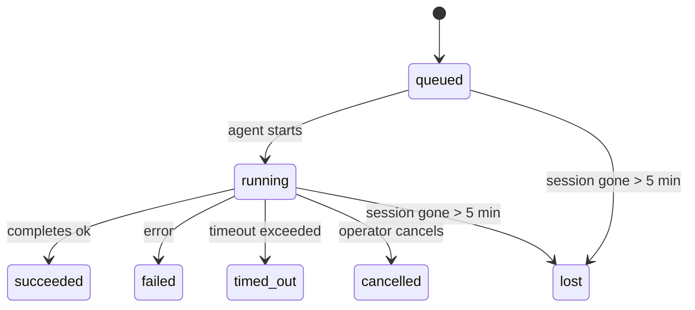

---
read_when:
    - การตรวจสอบงานเบื้องหลังที่กำลังดำเนินอยู่หรือเพิ่งเสร็จสิ้น recent
    - การดีบักความล้มเหลวในการส่งมอบสำหรับการทำงานของเอเจนต์แบบแยกออกจากกัน
    - ทำความเข้าใจว่าการทำงานเบื้องหลังเกี่ยวข้องกับเซสชัน Cron และ Heartbeat อย่างไร
summary: การติดตามงานเบื้องหลังสำหรับการทำงานของ ACP, subagent, งาน Cron แบบแยกส่วน และการดำเนินการ CLI
title: งานเบื้องหลัง
x-i18n:
    generated_at: "2026-04-24T08:57:17Z"
    model: gpt-5.4
    provider: openai
    source_hash: 10f16268ab5cce8c3dfd26c54d8d913c0ac0f9bfb4856ed1bb28b085ddb78528
    source_path: automation/tasks.md
    workflow: 15
---

> **กำลังมองหาการตั้งเวลาอยู่ใช่ไหม?** ดู [Automation & Tasks](/th/automation) เพื่อเลือกกลไกที่เหมาะสม หน้านี้ครอบคลุมเรื่องการ**ติดตาม**งานเบื้องหลัง ไม่ใช่การตั้งเวลาให้กับงาน

งานเบื้องหลังใช้ติดตามงานที่ทำงาน**นอกเซสชันการสนทนาหลักของคุณ**:
การทำงานของ ACP, การสร้าง subagent, การรันงาน Cron แบบแยกส่วน, และการดำเนินการที่เริ่มต้นผ่าน CLI

งานเหล่านี้**ไม่ได้**มาแทนที่เซสชัน, งาน Cron, หรือ Heartbeat — แต่เป็น**บันทึกกิจกรรม**ที่เก็บว่างานแบบแยกส่วนใดเกิดขึ้น เมื่อใด และสำเร็จหรือไม่

<Note>
ไม่ใช่ทุกการทำงานของเอเจนต์จะสร้างงาน Heartbeat turn และการแชตโต้ตอบตามปกติจะไม่สร้างงาน แต่การรัน Cron ทุกครั้ง, การสร้าง ACP, การสร้าง subagent และคำสั่งเอเจนต์ผ่าน CLI จะสร้างงาน
</Note>

## สรุปสั้น ๆ

- งานคือ**ระเบียนบันทึก** ไม่ใช่ตัวตั้งเวลา — Cron และ Heartbeat เป็นตัวตัดสินว่าเมื่อใดงานจะทำงาน ส่วนงานใช้ติดตามว่า_เกิดอะไรขึ้น_
- ACP, subagent, งาน Cron ทั้งหมด และการดำเนินการผ่าน CLI จะสร้างงาน แต่ Heartbeat turn จะไม่สร้าง
- แต่ละงานจะเคลื่อนผ่าน `queued → running → terminal` (succeeded, failed, timed_out, cancelled หรือ lost)
- งาน Cron จะยังคง active ตราบใดที่ runtime ของ Cron ยังเป็นเจ้าของงานนั้นอยู่ ส่วนงาน CLI ที่อิงแชตจะยังคง active เฉพาะขณะที่บริบทการรันเจ้าของงานยัง active อยู่
- การเสร็จสิ้นเป็นแบบ push-driven: งานแบบแยกส่วนสามารถแจ้งได้โดยตรงหรือปลุก
  requester session/Heartbeat เมื่อเสร็จสิ้น ดังนั้นการวนลูป polling สถานะ
  มักไม่ใช่รูปแบบที่เหมาะสม
- การรัน Cron แบบแยกส่วนและการเสร็จสิ้นของ subagent จะพยายามล้างแท็บ/โปรเซสของเบราว์เซอร์ที่ติดตามไว้สำหรับ child session ก่อนทำ bookkeeping ขั้นสุดท้าย
- การส่งมอบของ Cron แบบแยกส่วนจะระงับข้อความตอบกลับชั่วคราวจาก parent ที่ล้าสมัยในขณะที่
  งาน subagent ลูกหลานยังระบายงานไม่เสร็จ และจะเลือกเอาต์พุตสุดท้ายของลูกหลาน
  หากมาถึงก่อนการส่งมอบ
- การแจ้งเตือนเมื่อเสร็จสิ้นจะถูกส่งตรงไปยังช่องทาง หรือเข้าคิวไว้สำหรับ Heartbeat ถัดไป
- `openclaw tasks list` แสดงงานทั้งหมด; `openclaw tasks audit` แสดงปัญหาต่าง ๆ
- ระเบียน terminal จะถูกเก็บไว้ 7 วัน แล้วลบออกโดยอัตโนมัติ

## เริ่มต้นอย่างรวดเร็ว

```bash
# แสดงรายการงานทั้งหมด (ใหม่สุดก่อน)
openclaw tasks list

# กรองตาม runtime หรือสถานะ
openclaw tasks list --runtime acp
openclaw tasks list --status running

# แสดงรายละเอียดของงานที่ระบุ (ด้วย ID, run ID หรือ session key)
openclaw tasks show <lookup>

# ยกเลิกงานที่กำลังรันอยู่ (ยุติ child session)
openclaw tasks cancel <lookup>

# เปลี่ยนนโยบายการแจ้งเตือนของงาน
openclaw tasks notify <lookup> state_changes

# เรียกใช้การตรวจสอบสุขภาพระบบ
openclaw tasks audit

# ดูตัวอย่างหรือใช้การบำรุงรักษา
openclaw tasks maintenance
openclaw tasks maintenance --apply

# ตรวจสอบสถานะ TaskFlow
openclaw tasks flow list
openclaw tasks flow show <lookup>
openclaw tasks flow cancel <lookup>
```

## อะไรที่ทำให้เกิดงาน

| แหล่งที่มา              | ประเภท runtime | เมื่อใดที่สร้างระเบียนงาน                         | นโยบายการแจ้งเตือนเริ่มต้น |
| ----------------------- | -------------- | -------------------------------------------------- | --------------------------- |
| การทำงานเบื้องหลังของ ACP | `acp`          | การสร้าง child ACP session                         | `done_only`                 |
| การจัดการ subagent      | `subagent`     | การสร้าง subagent ผ่าน `sessions_spawn`            | `done_only`                 |
| งาน Cron (ทุกประเภท)    | `cron`         | ทุกการรันของ Cron (ทั้ง main-session และ isolated) | `silent`                    |
| การดำเนินการผ่าน CLI    | `cli`          | คำสั่ง `openclaw agent` ที่รันผ่าน Gateway         | `silent`                    |
| งานสื่อของเอเจนต์       | `cli`          | การรัน `video_generate` ที่อิง session             | `silent`                    |

งาน Cron แบบ main-session ใช้นโยบายแจ้งเตือน `silent` เป็นค่าเริ่มต้น — งานเหล่านี้จะสร้างระเบียนเพื่อการติดตาม แต่จะไม่สร้างการแจ้งเตือน งาน Cron แบบแยกส่วนก็ใช้ `silent` เป็นค่าเริ่มต้นเช่นกัน แต่มองเห็นได้ชัดเจนกว่าเพราะทำงานในเซสชันของตัวเอง

การรัน `video_generate` ที่อิง session ก็ใช้นโยบายแจ้งเตือน `silent` เช่นกัน โดยยังคงสร้างระเบียนงาน แต่การจัดการเมื่อเสร็จสิ้นจะถูกส่งกลับไปยังเซสชันเอเจนต์ต้นทางในรูปแบบ internal wake เพื่อให้เอเจนต์สามารถเขียนข้อความติดตามผลและแนบวิดีโอที่เสร็จแล้วได้ด้วยตนเอง หากคุณเปิดใช้ `tools.media.asyncCompletion.directSend` การเสร็จสิ้นแบบ async ของ `music_generate` และ `video_generate` จะพยายามส่งตรงไปยังช่องทางก่อน แล้วจึง fallback ไปยังเส้นทางปลุก requester-session

ขณะที่งาน `video_generate` ที่อิง session ยัง active อยู่ เครื่องมือนี้ยังทำหน้าที่เป็น guardrail ด้วย: การเรียก `video_generate` ซ้ำในเซสชันเดียวกันจะคืนค่าสถานะของงานที่กำลัง active แทนที่จะเริ่มการสร้างพร้อมกันรายการที่สอง ใช้ `action: "status"` เมื่อต้องการค้นหาความคืบหน้า/สถานะอย่างชัดเจนจากฝั่งเอเจนต์

**สิ่งที่ไม่ทำให้เกิดงาน:**

- Heartbeat turn — main-session; ดู [Heartbeat](/th/gateway/heartbeat)
- การแชตโต้ตอบตามปกติ
- การตอบกลับ `/command` โดยตรง

## วงจรชีวิตของงาน



| สถานะ      | ความหมาย                                                                 |
| ---------- | ------------------------------------------------------------------------ |
| `queued`   | ถูกสร้างแล้ว กำลังรอให้เอเจนต์เริ่มทำงาน                                  |
| `running`  | agent turn กำลังดำเนินการอยู่                                              |
| `succeeded` | เสร็จสมบูรณ์สำเร็จ                                                        |
| `failed`   | เสร็จสิ้นพร้อมข้อผิดพลาด                                                   |
| `timed_out` | เกินเวลาที่กำหนดไว้                                                        |
| `cancelled` | ถูกหยุดโดยผู้ปฏิบัติงานผ่าน `openclaw tasks cancel`                       |
| `lost`     | runtime สูญเสีย authoritative backing state หลังจากช่วงผ่อนผัน 5 นาที     |

การเปลี่ยนสถานะจะเกิดขึ้นโดยอัตโนมัติ — เมื่อการทำงานของเอเจนต์ที่เกี่ยวข้องสิ้นสุดลง สถานะของงานจะอัปเดตให้ตรงกัน

`lost` รับรู้ตาม runtime:

- งาน ACP: metadata ของ ACP child session ที่รองรับอยู่หายไป
- งาน subagent: child session ที่รองรับอยู่หายไปจาก agent store เป้าหมาย
- งาน Cron: runtime ของ Cron ไม่ได้ติดตามงานว่า active อยู่อีกต่อไป
- งาน CLI: งาน child-session แบบ isolated จะใช้ child session; งาน CLI ที่อิงแชตจะใช้ live run context แทน ดังนั้นแถว session ของ channel/group/direct ที่ค้างอยู่จะไม่ทำให้งานยัง active ต่อไป

## การส่งมอบและการแจ้งเตือน

เมื่องานเข้าสู่สถานะ terminal แล้ว OpenClaw จะแจ้งให้คุณทราบ โดยมีเส้นทางการส่งมอบ 2 แบบ:

**การส่งมอบโดยตรง** — หากงานมีเป้าหมายเป็นช่องทาง (คือ `requesterOrigin`) ข้อความแจ้งเมื่อเสร็จสิ้นจะถูกส่งตรงไปยังช่องทางนั้น (Telegram, Discord, Slack ฯลฯ) สำหรับการเสร็จสิ้นของ subagent นั้น OpenClaw จะคงเส้นทาง thread/topic ที่ผูกไว้เมื่อมีให้ใช้ และสามารถเติมค่า `to` / บัญชีที่หายไปจาก route ที่เก็บไว้ของ requester session (`lastChannel` / `lastTo` / `lastAccountId`) ก่อนจะยอมแพ้การส่งแบบตรง

**การส่งมอบผ่านคิวของเซสชัน** — หากการส่งตรงล้มเหลวหรือไม่ได้ตั้ง origin ไว้ การอัปเดตจะถูกเข้าคิวเป็น system event ในเซสชันของผู้ร้องขอ และจะแสดงขึ้นมาใน Heartbeat ถัดไป

<Tip>
เมื่อ task เสร็จสิ้นจะมีการปลุก Heartbeat ทันทีเพื่อให้คุณเห็นผลลัพธ์อย่างรวดเร็ว — คุณไม่จำเป็นต้องรอ Heartbeat tick ถัดไปตามกำหนด
</Tip>

นั่นหมายความว่าเวิร์กโฟลว์ตามปกติจะเป็นแบบ push-based: เริ่มงานแบบแยกส่วนหนึ่งครั้ง แล้ว
ปล่อยให้ runtime ปลุกหรือแจ้งคุณเมื่อเสร็จสิ้น ให้ polling สถานะงานเฉพาะเมื่อคุณ
ต้องการดีบัก แทรกแซง หรือทำ audit อย่างชัดเจน

### นโยบายการแจ้งเตือน

กำหนดว่าคุณต้องการรับรู้เกี่ยวกับแต่ละงานมากแค่ไหน:

| นโยบาย               | สิ่งที่จะถูกส่งมอบ                                                       |
| -------------------- | ------------------------------------------------------------------------ |
| `done_only` (ค่าเริ่มต้น) | เฉพาะสถานะ terminal (succeeded, failed ฯลฯ) — **นี่คือค่าเริ่มต้น** |
| `state_changes`      | ทุกการเปลี่ยนสถานะและการอัปเดตความคืบหน้า                               |
| `silent`             | ไม่มีอะไรเลย                                                              |

เปลี่ยนนโยบายระหว่างที่งานกำลังรันอยู่:

```bash
openclaw tasks notify <lookup> state_changes
```

## ข้อมูลอ้างอิง CLI

### `tasks list`

```bash
openclaw tasks list [--runtime <acp|subagent|cron|cli>] [--status <status>] [--json]
```

คอลัมน์เอาต์พุต: Task ID, Kind, Status, Delivery, Run ID, Child Session, Summary

### `tasks show`

```bash
openclaw tasks show <lookup>
```

โทเค็น lookup รองรับ task ID, run ID หรือ session key จะแสดงระเบียนทั้งหมด รวมถึงเวลา สถานะการส่งมอบ ข้อผิดพลาด และสรุป terminal

### `tasks cancel`

```bash
openclaw tasks cancel <lookup>
```

สำหรับงาน ACP และ subagent คำสั่งนี้จะยุติ child session สำหรับงานที่ติดตามผ่าน CLI การยกเลิกจะถูกบันทึกไว้ใน task registry (ไม่มี child runtime handle แยกต่างหาก) สถานะจะเปลี่ยนเป็น `cancelled` และจะมีการส่งการแจ้งเตือนเมื่อเหมาะสม

### `tasks notify`

```bash
openclaw tasks notify <lookup> <done_only|state_changes|silent>
```

### `tasks audit`

```bash
openclaw tasks audit [--json]
```

แสดงปัญหาเชิงปฏิบัติการ ผลการตรวจพบจะปรากฏใน `openclaw status` ด้วยเมื่อมีการตรวจพบปัญหา

| รายการที่ตรวจพบ          | ระดับความรุนแรง | เงื่อนไขกระตุ้น                                       |
| ------------------------ | --------------- | ----------------------------------------------------- |
| `stale_queued`           | warn            | อยู่ในคิวเกิน 10 นาที                                  |
| `stale_running`          | error           | กำลังรันเกิน 30 นาที                                  |
| `lost`                   | error           | การเป็นเจ้าของงานที่รองรับโดย runtime หายไป          |
| `delivery_failed`        | warn            | การส่งมอบล้มเหลวและนโยบายแจ้งเตือนไม่ใช่ `silent`    |
| `missing_cleanup`        | warn            | งาน terminal ที่ไม่มี timestamp ของการ cleanup        |
| `inconsistent_timestamps` | warn           | ลำดับเวลาไม่สอดคล้องกัน (เช่น สิ้นสุดก่อนเริ่มต้น)   |

### `tasks maintenance`

```bash
openclaw tasks maintenance [--json]
openclaw tasks maintenance --apply [--json]
```

ใช้คำสั่งนี้เพื่อดูตัวอย่างหรือใช้การกระทบยอด การประทับ cleanup และการล้างทิ้งสำหรับ
งานและสถานะ Task Flow

การกระทบยอดรับรู้ตาม runtime:

- งาน ACP/subagent จะตรวจสอบ child session ที่รองรับอยู่
- งาน Cron จะตรวจสอบว่า runtime ของ Cron ยังเป็นเจ้าของงานอยู่หรือไม่
- งาน CLI ที่อิงแชตจะตรวจสอบ live run context เจ้าของงาน ไม่ใช่แค่แถว chat session

cleanup เมื่อเสร็จสิ้นก็รับรู้ตาม runtime เช่นกัน:

- เมื่อ subagent เสร็จสิ้น จะพยายามปิดแท็บ/โปรเซสของเบราว์เซอร์ที่ติดตามไว้สำหรับ child session ก่อนดำเนิน cleanup การประกาศต่อ
- เมื่อ Cron แบบแยกส่วนเสร็จสิ้น จะพยายามปิดแท็บ/โปรเซสของเบราว์เซอร์ที่ติดตามไว้สำหรับ cron session ก่อนที่การรันจะปิดตัวลงทั้งหมด
- การส่งมอบของ Cron แบบแยกส่วนจะรอให้การติดตามผลของ subagent ลูกหลานเสร็จสิ้นเมื่อจำเป็น และ
  จะระงับข้อความตอบรับจาก parent ที่ล้าสมัยแทนที่จะประกาศข้อความนั้น
- การส่งมอบเมื่อ subagent เสร็จสิ้นจะเลือกข้อความ assistant ล่าสุดที่มองเห็นได้; หากว่างเปล่าจะ fallback ไปยังข้อความ tool/toolResult ล่าสุดที่ผ่านการทำให้ปลอดภัยแล้ว และการรันที่เป็นเพียง tool-call ที่หมดเวลาอาจยุบเหลือสรุปความคืบหน้าบางส่วนแบบสั้น ๆ สำหรับการรัน terminal failed จะประกาศสถานะความล้มเหลวโดยไม่เล่นข้อความตอบกลับที่บันทึกไว้ซ้ำ
- ความล้มเหลวของ cleanup จะไม่บดบังผลลัพธ์ที่แท้จริงของงาน

### `tasks flow list|show|cancel`

```bash
openclaw tasks flow list [--status <status>] [--json]
openclaw tasks flow show <lookup> [--json]
openclaw tasks flow cancel <lookup>
```

ใช้คำสั่งเหล่านี้เมื่อสิ่งที่คุณสนใจคือการประสานงานของ Task Flow เอง
มากกว่าระเบียนงานเบื้องหลังแต่ละรายการ

## กระดานงานในแชต (`/tasks`)

ใช้ `/tasks` ในเซสชันแชตใดก็ได้เพื่อดูงานเบื้องหลังที่เชื่อมโยงกับเซสชันนั้น กระดานจะแสดง
งานที่กำลัง active และงานที่เพิ่งเสร็จสิ้น พร้อม runtime, สถานะ, เวลา และรายละเอียดความคืบหน้าหรือข้อผิดพลาด

เมื่อเซสชันปัจจุบันไม่มีงานที่เชื่อมโยงแบบมองเห็นได้ `/tasks` จะ fallback ไปใช้จำนวนงานในระดับ agent-local
เพื่อให้คุณยังคงเห็นภาพรวมได้โดยไม่เปิดเผยรายละเอียดของเซสชันอื่น

สำหรับบันทึกภาพรวมทั้งหมดในระดับผู้ปฏิบัติงาน ให้ใช้ CLI: `openclaw tasks list`

## การผสานรวมสถานะ (แรงกดดันจากงาน)

`openclaw status` มีสรุปงานแบบดูได้ทันที:

```
Tasks: 3 queued · 2 running · 1 issues
```

สรุปรายงานสิ่งต่อไปนี้:

- **active** — จำนวนของ `queued` + `running`
- **failures** — จำนวนของ `failed` + `timed_out` + `lost`
- **byRuntime** — การแจกแจงตาม `acp`, `subagent`, `cron`, `cli`

ทั้ง `/status` และเครื่องมือ `session_status` ใช้สแนปช็อตงานที่รับรู้การ cleanup: ระบบจะ
ให้น้ำหนักกับงานที่ active ก่อน ซ่อนแถวงานที่เสร็จสิ้นแล้วแต่ล้าสมัย และจะแสดงความล้มเหลวล่าสุดเฉพาะเมื่อไม่มีงาน active
เหลืออยู่เท่านั้น วิธีนี้ช่วยให้การ์ดสถานะโฟกัสกับสิ่งที่สำคัญในตอนนี้

## ที่เก็บข้อมูลและการบำรุงรักษา

### ตำแหน่งที่เก็บงาน

ระเบียนงานจะถูกเก็บถาวรใน SQLite ที่:

```
$OPENCLAW_STATE_DIR/tasks/runs.sqlite
```

รีจิสทรีจะโหลดเข้าสู่หน่วยความจำเมื่อ Gateway เริ่มทำงาน และซิงก์การเขียนไปยัง SQLite เพื่อความคงทนข้ามการรีสตาร์ต

### การบำรุงรักษาอัตโนมัติ

sweeper จะทำงานทุก **60 วินาที** และจัดการ 3 เรื่อง:

1. **การกระทบยอด** — ตรวจสอบว่างานที่ active ยังมี authoritative runtime backing อยู่หรือไม่ งาน ACP/subagent ใช้สถานะ child-session, งาน Cron ใช้การเป็นเจ้าของ active-job และงาน CLI ที่อิงแชตใช้ owning run context หาก backing state นั้นหายไปเกิน 5 นาที งานจะถูกทำเครื่องหมายเป็น `lost`
2. **การประทับ cleanup** — ตั้ง timestamp `cleanupAfter` ให้กับงาน terminal (endedAt + 7 วัน)
3. **การล้างทิ้ง** — ลบระเบียนที่เลยวันที่ `cleanupAfter` แล้ว

**การเก็บรักษา**: ระเบียนงาน terminal จะถูกเก็บไว้ **7 วัน** แล้วลบออกโดยอัตโนมัติ ไม่ต้องตั้งค่าเพิ่มเติม

## งานสัมพันธ์กับระบบอื่นอย่างไร

### งานและ Task Flow

[Task Flow](/th/automation/taskflow) คือเลเยอร์การประสานงานของโฟลว์ที่อยู่เหนือ งานเบื้องหลัง โฟลว์หนึ่งรายการอาจประสานงานหลายงานตลอดอายุการทำงานของมัน โดยใช้โหมดซิงก์แบบ managed หรือ mirrored ใช้ `openclaw tasks` เพื่อตรวจสอบระเบียนงานแต่ละรายการ และใช้ `openclaw tasks flow` เพื่อตรวจสอบโฟลว์ที่ทำหน้าที่ประสานงาน

ดูรายละเอียดได้ที่ [Task Flow](/th/automation/taskflow)

### งานและ Cron

**คำจำกัดความ**ของงาน Cron อยู่ใน `~/.openclaw/cron/jobs.json`; สถานะการรัน runtime อยู่ถัดจากมันใน `~/.openclaw/cron/jobs-state.json` การรัน Cron **ทุกครั้ง** จะสร้างระเบียนงาน — ทั้งแบบ main-session และแบบ isolated งาน Cron แบบ main-session ใช้นโยบายแจ้งเตือน `silent` เป็นค่าเริ่มต้น เพื่อให้ติดตามได้โดยไม่สร้างการแจ้งเตือน

ดู [งาน Cron](/th/automation/cron-jobs)

### งานและ Heartbeat

การทำงานของ Heartbeat เป็น turn ของ main-session — จึงไม่สร้างระเบียนงาน เมื่องานเสร็จสิ้น มันสามารถปลุก Heartbeat เพื่อให้คุณเห็นผลลัพธ์ได้อย่างรวดเร็ว

ดู [Heartbeat](/th/gateway/heartbeat)

### งานและเซสชัน

งานหนึ่งอาจอ้างอิงถึง `childSessionKey` (ที่ที่งานรัน) และ `requesterSessionKey` (ผู้ที่เริ่มงานนั้น) เซสชันคือบริบทของการสนทนา; งานคือการติดตามกิจกรรมที่อยู่บนพื้นฐานนั้น

### งานและการรันของเอเจนต์

`runId` ของงานเชื่อมโยงไปยังการรันของเอเจนต์ที่กำลังทำงานนั้นอยู่ เหตุการณ์ในวงจรชีวิตของเอเจนต์ (เริ่มต้น สิ้นสุด ข้อผิดพลาด) จะอัปเดตสถานะงานโดยอัตโนมัติ — คุณไม่จำเป็นต้องจัดการวงจรชีวิตด้วยตนเอง

## ที่เกี่ยวข้อง

- [Automation & Tasks](/th/automation) — ภาพรวมของกลไกอัตโนมัติทั้งหมด
- [Task Flow](/th/automation/taskflow) — การประสานงานของโฟลว์ที่อยู่เหนือ งาน
- [งานตามกำหนดเวลา](/th/automation/cron-jobs) — การตั้งเวลางานเบื้องหลัง
- [Heartbeat](/th/gateway/heartbeat) — turn ของ main-session แบบเป็นระยะ
- [CLI: งาน](/th/cli/tasks) — เอกสารอ้างอิงคำสั่ง CLI
