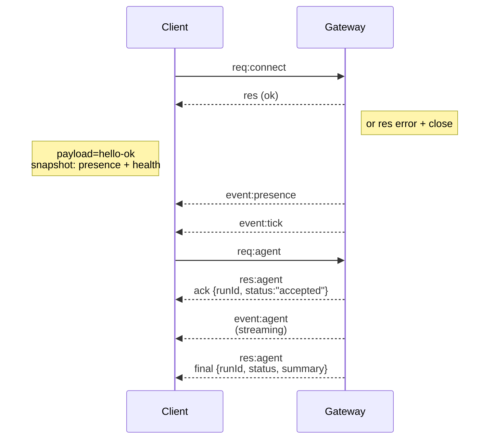

---
read_when:
    - กำลังทำงานกับโปรโตคอล Gateway ไคลเอนต์ หรือ transport
summary: สถาปัตยกรรม Gateway แบบ WebSocket องค์ประกอบ และโฟลว์ของไคลเอนต์
title: สถาปัตยกรรม Gateway
x-i18n:
    generated_at: "2026-04-24T09:05:03Z"
    model: gpt-5.4
    provider: openai
    source_hash: 91c553489da18b6ad83fc860014f5bfb758334e9789cb7893d4d00f81c650f02
    source_path: concepts/architecture.md
    workflow: 15
---

## ภาพรวม

- **Gateway** แบบคงอยู่ยาวนานเพียงตัวเดียวเป็นเจ้าของพื้นผิวการรับส่งข้อความทั้งหมด (WhatsApp ผ่าน Baileys, Telegram ผ่าน grammY, Slack, Discord, Signal, iMessage, WebChat)
- ไคลเอนต์ control-plane (แอป macOS, CLI, เว็บ UI, Automations) เชื่อมต่อกับ Gateway ผ่าน **WebSocket** บน bind host ที่กำหนดค่าไว้ (ค่าเริ่มต้น `127.0.0.1:18789`)
- **Nodes** (macOS/iOS/Android/headless) เชื่อมต่อผ่าน **WebSocket** เช่นกัน แต่ประกาศ `role: node` พร้อม caps/commands แบบ explicit
- หนึ่งโฮสต์มีหนึ่ง Gateway; เป็นที่เดียวที่เปิดเซสชัน WhatsApp
- **canvas host** ถูกเสิร์ฟโดยเซิร์ฟเวอร์ HTTP ของ Gateway ภายใต้:
  - `/__openclaw__/canvas/` (HTML/CSS/JS ที่เอเจนต์แก้ไขได้)
  - `/__openclaw__/a2ui/` (โฮสต์ A2UI)
    โดยใช้พอร์ตเดียวกับ Gateway (ค่าเริ่มต้น `18789`)

## องค์ประกอบและโฟลว์

### Gateway (daemon)

- รักษาการเชื่อมต่อกับผู้ให้บริการ
- เปิดเผย WS API แบบ typed (คำขอ การตอบกลับ เหตุการณ์ server-push)
- ตรวจสอบเฟรมขาเข้ากับ JSON Schema
- ปล่อยเหตุการณ์ เช่น `agent`, `chat`, `presence`, `health`, `heartbeat`, `cron`

### ไคลเอนต์ (แอป mac / CLI / เว็บแอดมิน)

- หนึ่งการเชื่อมต่อ WS ต่อหนึ่งไคลเอนต์
- ส่งคำขอ (`health`, `status`, `send`, `agent`, `system-presence`)
- สมัครรับเหตุการณ์ (`tick`, `agent`, `presence`, `shutdown`)

### Nodes (macOS / iOS / Android / headless)

- เชื่อมต่อกับ **เซิร์ฟเวอร์ WS เดียวกัน** ด้วย `role: node`
- ให้ข้อมูลตัวตนอุปกรณ์ใน `connect`; การจับคู่เป็นแบบ **อิงอุปกรณ์** (`role "node"`) และการอนุมัติอยู่ใน device pairing store
- เปิดเผยคำสั่งเช่น `canvas.*`, `camera.*`, `screen.record`, `location.get`

รายละเอียดโปรโตคอล:

- [โปรโตคอล Gateway](/th/gateway/protocol)

### WebChat

- UI แบบ static ที่ใช้ WS API ของ Gateway สำหรับประวัติแชตและการส่ง
- ในการตั้งค่าแบบ remote จะเชื่อมต่อผ่าน tunnel SSH/Tailscale เดียวกันกับไคลเอนต์อื่น

## วงจรชีวิตการเชื่อมต่อ (ไคลเอนต์เดียว)



## Wire protocol (สรุป)

- Transport: WebSocket, text frame พร้อม payload แบบ JSON
- เฟรมแรก **ต้อง** เป็น `connect`
- หลัง handshake:
  - คำขอ: `{type:"req", id, method, params}` → `{type:"res", id, ok, payload|error}`
  - เหตุการณ์: `{type:"event", event, payload, seq?, stateVersion?}`
- `hello-ok.features.methods` / `events` เป็น metadata สำหรับการค้นพบ ไม่ใช่ dump ที่สร้างขึ้นของทุกเส้นทาง helper ที่เรียกได้
- การยืนยันตัวตนด้วย shared secret ใช้ `connect.params.auth.token` หรือ `connect.params.auth.password` ตามโหมดการยืนยันตัวตนของ Gateway ที่กำหนดไว้
- โหมดที่มีตัวตนกำกับ เช่น Tailscale Serve (`gateway.auth.allowTailscale: true`) หรือ `gateway.auth.mode: "trusted-proxy"` แบบ non-loopback จะทำให้การยืนยันตัวตนสำเร็จจาก request header แทน `connect.params.auth.*`
- `gateway.auth.mode: "none"` สำหรับ private-ingress จะปิดการยืนยันตัวตนด้วย shared secret โดยสมบูรณ์; อย่าเปิดโหมดนี้บน ingress สาธารณะหรือไม่น่าเชื่อถือ
- ต้องใช้ idempotency key สำหรับเมธอดที่มี side effect (`send`, `agent`) เพื่อให้ retry ได้อย่างปลอดภัย; เซิร์ฟเวอร์จะเก็บ dedupe cache อายุสั้น
- Nodes ต้องรวม `role: "node"` พร้อม caps/commands/permissions ใน `connect`

## การจับคู่ + ความเชื่อถือในเครื่อง

- ไคลเอนต์ WS ทุกตัว (operators + nodes) จะรวม **ตัวตนอุปกรณ์** ใน `connect`
- device ID ใหม่ต้องได้รับการอนุมัติการจับคู่; Gateway จะออก **device token** สำหรับการเชื่อมต่อครั้งถัดไป
- การเชื่อมต่อ local loopback โดยตรงสามารถอนุมัติอัตโนมัติได้เพื่อให้ UX บนโฮสต์เดียวกันราบรื่น
- OpenClaw ยังมีเส้นทาง self-connect แบบแคบสำหรับ backend/container-local สำหรับโฟลว์ helper ที่ใช้ shared secret และเชื่อถือได้
- การเชื่อมต่อจาก tailnet และ LAN รวมถึงการ bind tailnet บนโฮสต์เดียวกัน ยังต้องได้รับการอนุมัติการจับคู่อย่างชัดเจน
- ทุกการเชื่อมต่อต้องเซ็น nonce ของ `connect.challenge`
- payload ของลายเซ็น `v3` ยังผูก `platform` + `deviceFamily` ด้วย; Gateway จะ pin metadata ของการจับคู่ไว้เมื่อเชื่อมต่อใหม่ และต้องซ่อมแซมการจับคู่เมื่อ metadata เปลี่ยน
- การเชื่อมต่อแบบ **ไม่ใช่ local** ยังคงต้องได้รับการอนุมัติอย่างชัดเจน
- การยืนยันตัวตนของ Gateway (`gateway.auth.*`) ยังคงมีผลกับ **ทุก** การเชื่อมต่อ ทั้ง local และ remote

รายละเอียด: [โปรโตคอล Gateway](/th/gateway/protocol), [Pairing](/th/channels/pairing),
[Security](/th/gateway/security)

## การกำหนดชนิดของโปรโตคอลและ codegen

- schema ของ TypeBox ใช้กำหนดโปรโตคอล
- JSON Schema ถูกสร้างจาก schema เหล่านั้น
- โมเดล Swift ถูกสร้างจาก JSON Schema

## การเข้าถึงแบบ remote

- แนะนำ: Tailscale หรือ VPN
- ทางเลือก: SSH tunnel

  ```bash
  ssh -N -L 18789:127.0.0.1:18789 user@host
  ```

- handshake + auth token เดียวกันยังคงใช้ผ่าน tunnel
- สามารถเปิดใช้ TLS + optional pinning สำหรับ WS ในการตั้งค่าแบบ remote

## ภาพรวมการปฏิบัติการ

- เริ่มต้น: `openclaw gateway` (foreground, บันทึกลง stdout)
- Health: `health` ผ่าน WS (รวมอยู่ใน `hello-ok` ด้วย)
- การกำกับดูแล: launchd/systemd สำหรับการรีสตาร์ตอัตโนมัติ

## Invariants

- มี Gateway เพียงตัวเดียวที่ควบคุมเซสชัน Baileys เดียวต่อหนึ่งโฮสต์
- Handshake เป็นข้อบังคับ; เฟรมแรกที่ไม่ใช่ JSON หรือไม่ใช่ `connect` จะถูกปิดการเชื่อมต่อทันที
- เหตุการณ์จะไม่ถูกเล่นซ้ำ; ไคลเอนต์ต้องรีเฟรชเมื่อมีช่องว่าง

## ที่เกี่ยวข้อง

- [Agent Loop](/th/concepts/agent-loop) — รอบการทำงานของเอเจนต์โดยละเอียด
- [โปรโตคอล Gateway](/th/gateway/protocol) — สัญญาโปรโตคอล WebSocket
- [Queue](/th/concepts/queue) — คิวคำสั่งและ concurrency
- [Security](/th/gateway/security) — แบบจำลองความเชื่อถือและการทำให้แข็งแรงขึ้น
