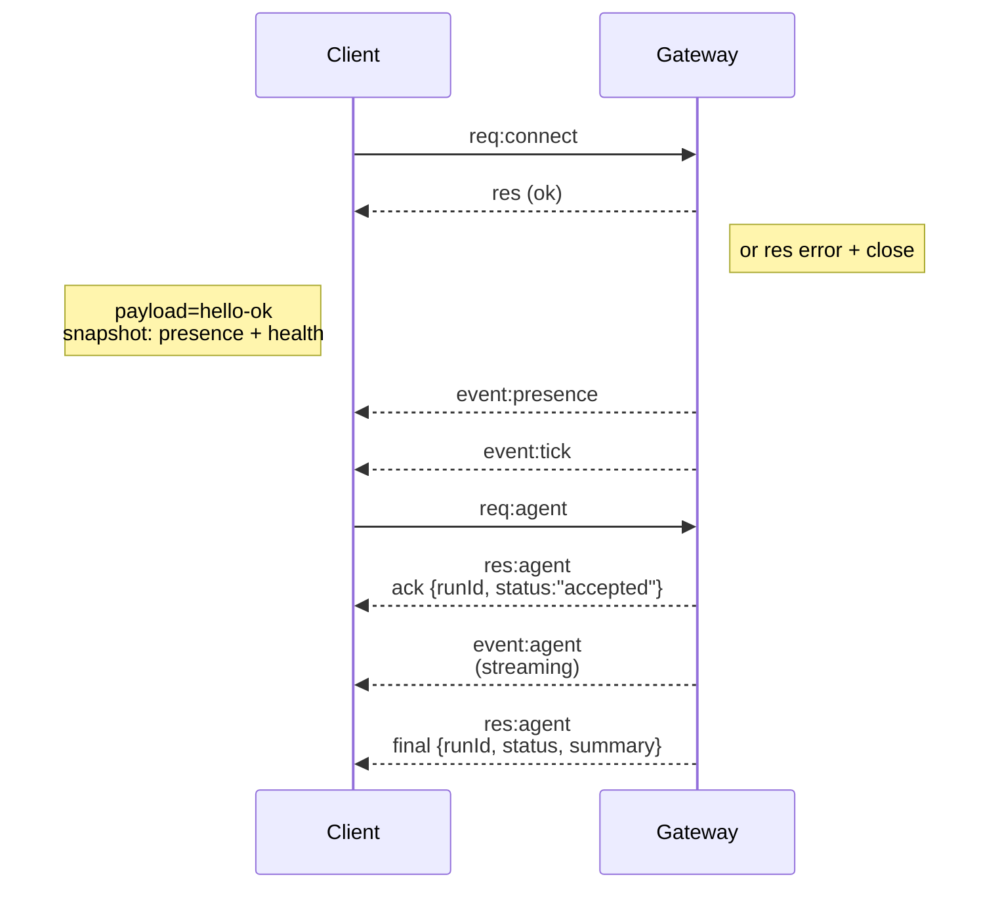

---
read_when:
    - กำลังทำงานกับโปรโตคอล Gateway ไคลเอนต์ หรือทรานสปอร์ต
summary: สถาปัตยกรรม Gateway แบบ WebSocket องค์ประกอบ และโฟลว์ของไคลเอนต์
title: สถาปัตยกรรม Gateway
x-i18n:
    generated_at: "2026-04-23T05:29:21Z"
    model: gpt-5.4
    provider: openai
    source_hash: 2b12a2a29e94334c6d10787ac85c34b5b046f9a14f3dd53be453368ca4a7547d
    source_path: concepts/architecture.md
    workflow: 15
---

# สถาปัตยกรรม Gateway

## ภาพรวม

- **Gateway** แบบ long-lived เดียวดูแลพื้นผิวการรับส่งข้อความทั้งหมด (WhatsApp ผ่าน
  Baileys, Telegram ผ่าน grammY, Slack, Discord, Signal, iMessage, WebChat)
- ไคลเอนต์ control plane (แอป macOS, CLI, web UI, automations) เชื่อมต่อกับ
  Gateway ผ่าน **WebSocket** บน bind host ที่กำหนดค่าไว้ (ค่าเริ่มต้น
  `127.0.0.1:18789`)
- **Node** (macOS/iOS/Android/headless) ก็เชื่อมต่อผ่าน **WebSocket** เช่นกัน แต่
  จะประกาศ `role: node` พร้อม caps/commands แบบชัดเจน
- หนึ่ง Gateway ต่อหนึ่งโฮสต์; นี่คือที่เดียวที่เปิดเซสชัน WhatsApp
- **canvas host** ถูกเสิร์ฟโดย HTTP server ของ Gateway ภายใต้:
  - `/__openclaw__/canvas/` (HTML/CSS/JS ที่เอเจนต์แก้ไขได้)
  - `/__openclaw__/a2ui/` (โฮสต์ A2UI)
    โดยใช้พอร์ตเดียวกับ Gateway (ค่าเริ่มต้น `18789`)

## องค์ประกอบและโฟลว์

### Gateway (daemon)

- รักษาการเชื่อมต่อกับ provider
- เปิดเผย WS API แบบมีชนิดข้อมูล (คำขอ การตอบกลับ เหตุการณ์แบบ server-push)
- ตรวจสอบ frame ขาเข้าด้วย JSON Schema
- ส่งเหตุการณ์ เช่น `agent`, `chat`, `presence`, `health`, `heartbeat`, `cron`

### ไคลเอนต์ (แอป Mac / CLI / ผู้ดูแลระบบเว็บ)

- หนึ่งการเชื่อมต่อ WS ต่อหนึ่งไคลเอนต์
- ส่งคำขอ (`health`, `status`, `send`, `agent`, `system-presence`)
- subscribe เหตุการณ์ (`tick`, `agent`, `presence`, `shutdown`)

### Node (macOS / iOS / Android / headless)

- เชื่อมต่อกับ **WS server เดียวกัน** โดยใช้ `role: node`
- ให้ข้อมูลอุปกรณ์ใน `connect`; การจับคู่เป็นแบบ **อิงอุปกรณ์** (role `node`) และ
  การอนุมัติจะอยู่ใน device pairing store
- เปิดเผยคำสั่งอย่าง `canvas.*`, `camera.*`, `screen.record`, `location.get`

รายละเอียดโปรโตคอล:

- [Gateway protocol](/th/gateway/protocol)

### WebChat

- UI แบบ static ที่ใช้ Gateway WS API สำหรับประวัติแชตและการส่ง
- ในการตั้งค่าแบบรีโมต จะเชื่อมต่อผ่าน SSH/Tailscale tunnel เดียวกันกับ
  ไคลเอนต์อื่น

## วงจรชีวิตการเชื่อมต่อ (ไคลเอนต์เดี่ยว)



## Wire protocol (สรุป)

- ทรานสปอร์ต: WebSocket, text frame ที่มี payload เป็น JSON
- frame แรก **ต้อง**เป็น `connect`
- หลัง handshake:
  - คำขอ: `{type:"req", id, method, params}` → `{type:"res", id, ok, payload|error}`
  - เหตุการณ์: `{type:"event", event, payload, seq?, stateVersion?}`
- `hello-ok.features.methods` / `events` เป็น metadata สำหรับการค้นพบ ไม่ใช่
  dump ที่สร้างขึ้นของทุก helper route ที่เรียกได้
- การยืนยันตัวตนด้วย shared secret ใช้ `connect.params.auth.token` หรือ
  `connect.params.auth.password` ตามโหมด auth ของ gateway ที่กำหนดค่าไว้
- โหมดที่มี identity เช่น Tailscale Serve
  (`gateway.auth.allowTailscale: true`) หรือ `gateway.auth.mode: "trusted-proxy"` ที่ไม่ใช่ loopback
  จะตอบสนอง auth จาก request header
  แทน `connect.params.auth.*`
- `gateway.auth.mode: "none"` สำหรับ private ingress จะปิด shared-secret auth
  ทั้งหมด; หลีกเลี่ยงการใช้โหมดนี้กับ ingress แบบสาธารณะ/ไม่น่าเชื่อถือ
- จำเป็นต้องมี idempotency key สำหรับ method ที่มี side effect (`send`, `agent`) เพื่อ
  retry อย่างปลอดภัย; เซิร์ฟเวอร์จะเก็บแคช dedupe แบบอายุสั้น
- Node ต้องรวม `role: "node"` พร้อม caps/commands/permissions ใน `connect`

## การจับคู่ + ความเชื่อถือในเครื่อง

- ไคลเอนต์ WS ทั้งหมด (operators + node) จะรวม **ข้อมูลประจำอุปกรณ์** ใน `connect`
- device ID ใหม่ต้องได้รับการอนุมัติการจับคู่; Gateway จะออก **device token**
  สำหรับการเชื่อมต่อครั้งถัดไป
- การเชื่อมต่อ local loopback โดยตรงสามารถอนุมัติอัตโนมัติได้เพื่อให้ UX บนโฮสต์เดียวกัน
  ราบรื่น
- OpenClaw ยังมีพาธ self-connect ภายใน backend/container-local แบบแคบสำหรับ
  โฟลว์ helper ที่ใช้ shared secret และเชื่อถือได้
- การเชื่อมต่อผ่าน tailnet และ LAN รวมถึง tailnet bind บนโฮสต์เดียวกัน ยังคงต้องใช้
  การอนุมัติการจับคู่แบบชัดเจน
- การเชื่อมต่อทั้งหมดต้องลงนาม nonce ของ `connect.challenge`
- payload ลายเซ็น `v3` ยัง bind กับ `platform` + `deviceFamily`; gateway
  จะ pin metadata ที่จับคู่แล้วเมื่อ reconnect และต้อง repair pairing หาก metadata เปลี่ยน
- การเชื่อมต่อแบบ **ไม่ใช่ในเครื่อง** ยังคงต้องได้รับการอนุมัติแบบชัดเจน
- auth ของ Gateway (`gateway.auth.*`) ยังคงใช้กับ **ทุก** การเชื่อมต่อ ทั้ง local และ
  remote

รายละเอียด: [Gateway protocol](/th/gateway/protocol), [Pairing](/th/channels/pairing),
[Security](/th/gateway/security)

## การกำหนดชนิดของโปรโตคอลและ codegen

- schema ของ TypeBox ใช้กำหนดโปรโตคอล
- JSON Schema ถูกสร้างจาก schema เหล่านั้น
- โมเดล Swift ถูกสร้างจาก JSON Schema

## การเข้าถึงจากระยะไกล

- แนะนำ: Tailscale หรือ VPN
- ทางเลือก: SSH tunnel

  ```bash
  ssh -N -L 18789:127.0.0.1:18789 user@host
  ```

- handshake + auth token เดียวกันจะใช้ผ่าน tunnel
- สามารถเปิดใช้ TLS + pinning แบบเลือกได้สำหรับ WS ในการตั้งค่าแบบรีโมต

## สnapshot การปฏิบัติการ

- เริ่มต้น: `openclaw gateway` (foreground, บันทึกล็อกไปที่ stdout)
- Health: `health` ผ่าน WS (รวมอยู่ใน `hello-ok` ด้วย)
- การกำกับดูแล: launchd/systemd สำหรับ auto-restart

## Invariants

- มี Gateway เพียงหนึ่งเดียวที่ควบคุมเซสชัน Baileys เดียวต่อหนึ่งโฮสต์
- handshake เป็นสิ่งบังคับ; frame แรกที่ไม่ใช่ JSON หรือไม่ใช่ `connect` จะถูกปิดแบบ hard close
- เหตุการณ์จะไม่ถูก replay; ไคลเอนต์ต้องรีเฟรชเมื่อเกิดช่องว่าง

## ที่เกี่ยวข้อง

- [Agent Loop](/th/concepts/agent-loop) — วงจรการทำงานของเอเจนต์โดยละเอียด
- [Gateway Protocol](/th/gateway/protocol) — สัญญาโปรโตคอล WebSocket
- [Queue](/th/concepts/queue) — คิวคำสั่งและการทำงานพร้อมกัน
- [Security](/th/gateway/security) — โมเดลความเชื่อถือและการเสริมความปลอดภัย
