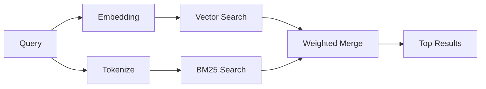

---
read_when:
    - คุณต้องการทำความเข้าใจว่า `memory_search` ทำงานอย่างไร
    - คุณต้องการเลือกผู้ให้บริการ embeddings
    - คุณต้องการปรับจูนคุณภาพการค้นหา
summary: วิธีที่การค้นหา memory ค้นหาโน้ตที่เกี่ยวข้องโดยใช้ embeddings และการดึงข้อมูลแบบไฮบริด
title: การค้นหา memory
x-i18n:
    generated_at: "2026-04-23T05:30:39Z"
    model: gpt-5.4
    provider: openai
    source_hash: f5757aa8fe8f7fec30ef5c826f72230f591ce4cad591d81a091189d50d4262ed
    source_path: concepts/memory-search.md
    workflow: 15
---

# การค้นหา memory

`memory_search` ค้นหาโน้ตที่เกี่ยวข้องจากไฟล์ memory ของคุณ แม้ว่าถ้อยคำจะ
แตกต่างจากข้อความต้นฉบับก็ตาม มันทำงานโดยจัดทำดัชนี memory เป็นชังก์ขนาดเล็ก
และค้นหาชังก์เหล่านั้นด้วย embeddings, คีย์เวิร์ด หรือทั้งสองอย่างร่วมกัน

## เริ่มต้นอย่างรวดเร็ว

หากคุณตั้งค่าคีย์ API ของ GitHub Copilot subscription, OpenAI, Gemini, Voyage หรือ Mistral
ไว้แล้ว การค้นหา memory จะทำงานโดยอัตโนมัติ หากต้องการกำหนดผู้ให้บริการ
อย่างชัดเจน:

```json5
{
  agents: {
    defaults: {
      memorySearch: {
        provider: "openai", // หรือ "gemini", "local", "ollama" เป็นต้น
      },
    },
  },
}
```

สำหรับ embeddings แบบในเครื่องที่ไม่ต้องใช้คีย์ API ให้ใช้ `provider: "local"` (ต้องใช้
node-llama-cpp)

## ผู้ให้บริการที่รองรับ

| ผู้ให้บริการ     | ID               | ต้องใช้ API key | หมายเหตุ                                                |
| ---------------- | ---------------- | --------------- | ------------------------------------------------------- |
| Bedrock          | `bedrock`        | ไม่ต้องใช้       | ตรวจพบอัตโนมัติเมื่อ AWS credential chain ใช้งานได้     |
| Gemini           | `gemini`         | ใช่             | รองรับการทำดัชนีรูปภาพ/เสียง                            |
| GitHub Copilot   | `github-copilot` | ไม่ต้องใช้       | ตรวจพบอัตโนมัติ ใช้ GitHub Copilot subscription         |
| Local            | `local`          | ไม่ต้องใช้       | โมเดล GGUF, ดาวน์โหลดประมาณ ~0.6 GB                    |
| Mistral          | `mistral`        | ใช่             | ตรวจพบอัตโนมัติ                                         |
| Ollama           | `ollama`         | ไม่ต้องใช้       | ในเครื่อง ต้องตั้งค่าอย่างชัดเจน                        |
| OpenAI           | `openai`         | ใช่             | ตรวจพบอัตโนมัติ, เร็ว                                   |
| Voyage           | `voyage`         | ใช่             | ตรวจพบอัตโนมัติ                                         |

## วิธีการทำงานของการค้นหา

OpenClaw รันเส้นทางการดึงข้อมูลสองเส้นทางแบบขนานและรวมผลลัพธ์เข้าด้วยกัน:



- **การค้นหาแบบเวกเตอร์** ค้นหาโน้ตที่มีความหมายคล้ายกัน ("gateway host" ตรงกับ
  "เครื่องที่รัน OpenClaw")
- **การค้นหาคีย์เวิร์ดแบบ BM25** ค้นหาการตรงกันแบบตรงตัว (ID, สตริงข้อผิดพลาด, คีย์
  config)

หากมีเพียงเส้นทางเดียวที่ใช้งานได้ (ไม่มี embeddings หรือไม่มี FTS) อีกเส้นทางหนึ่งจะรันเพียงลำพัง

เมื่อ embeddings ไม่พร้อมใช้งาน OpenClaw ยังคงใช้การจัดอันดับเชิงศัพท์เหนือผลลัพธ์ FTS แทนการ fallback ไปใช้การเรียงลำดับแบบ exact match ดิบเพียงอย่างเดียว โหมดลดความสามารถนี้จะเพิ่มคะแนนให้ชังก์ที่มีความครอบคลุมของคำค้นที่แข็งแรงกว่าและพาธไฟล์ที่เกี่ยวข้อง ซึ่งช่วยให้การเรียกคืนยังคงมีประโยชน์ได้แม้ไม่มี `sqlite-vec` หรือผู้ให้บริการ embedding

## การปรับปรุงคุณภาพการค้นหา

ฟีเจอร์เสริมสองอย่างช่วยได้เมื่อคุณมีประวัติโน้ตจำนวนมาก:

### การลดน้ำหนักตามเวลา

โน้ตเก่าจะค่อย ๆ สูญเสียน้ำหนักการจัดอันดับ เพื่อให้ข้อมูลล่าสุดแสดงขึ้นมาก่อน
ด้วยค่า half-life เริ่มต้น 30 วัน โน้ตจากเดือนที่แล้วจะมีคะแนนอยู่ที่ 50% ของ
น้ำหนักเดิม ไฟล์ถาวรอย่าง `MEMORY.md` จะไม่ถูกลดน้ำหนักเลย

<Tip>
เปิดใช้การลดน้ำหนักตามเวลา หากเอเจนต์ของคุณมีโน้ตรายวันต่อเนื่องหลายเดือน และข้อมูลเก่ายังคงมีอันดับสูงกว่าบริบทล่าสุด
</Tip>

### MMR (ความหลากหลาย)

ลดผลลัพธ์ที่ซ้ำซ้อน หากมีโน้ตห้ารายการที่กล่าวถึง config ของเราเตอร์เดียวกัน MMR
จะทำให้ผลลัพธ์อันดับต้น ๆ ครอบคลุมหัวข้อที่ต่างกันแทนการซ้ำกัน

<Tip>
เปิดใช้ MMR หาก `memory_search` มักส่งคืน snippet ที่เกือบซ้ำกันจาก
โน้ตรายวันต่าง ๆ
</Tip>

### เปิดใช้ทั้งสองอย่าง

```json5
{
  agents: {
    defaults: {
      memorySearch: {
        query: {
          hybrid: {
            mmr: { enabled: true },
            temporalDecay: { enabled: true },
          },
        },
      },
    },
  },
}
```

## memory หลายรูปแบบข้อมูล

ด้วย Gemini Embedding 2 คุณสามารถจัดทำดัชนีรูปภาพและไฟล์เสียงควบคู่ไปกับ
Markdown ได้ คำค้นหายังคงเป็นข้อความ แต่จะจับคู่กับเนื้อหาภาพและเสียง ดู
[เอกสารอ้างอิงการกำหนดค่า Memory](/th/reference/memory-config) สำหรับ
การตั้งค่า

## การค้นหา memory ของเซสชัน

คุณสามารถเลือกจัดทำดัชนี transcript ของเซสชันเพื่อให้ `memory_search`
เรียกคืนบทสนทนาก่อนหน้าได้ นี่เป็นฟีเจอร์แบบ opt-in ผ่าน
`memorySearch.experimental.sessionMemory` ดู
[เอกสารอ้างอิงการกำหนดค่า](/th/reference/memory-config) สำหรับรายละเอียด

## การแก้ไขปัญหา

**ไม่พบผลลัพธ์?** รัน `openclaw memory status` เพื่อตรวจสอบดัชนี หากว่างเปล่า ให้รัน
`openclaw memory index --force`

**พบเฉพาะคีย์เวิร์ดที่ตรงกัน?** ผู้ให้บริการ embedding ของคุณอาจยังไม่ได้ตั้งค่า ตรวจสอบ
`openclaw memory status --deep`

**หาข้อความ CJK ไม่เจอ?** สร้างดัชนี FTS ใหม่ด้วย
`openclaw memory index --force`

## อ่านเพิ่มเติม

- [Active Memory](/th/concepts/active-memory) -- memory ของ sub-agent สำหรับเซสชันแชตแบบโต้ตอบ
- [Memory](/th/concepts/memory) -- โครงสร้างไฟล์, backends, tools
- [เอกสารอ้างอิงการกำหนดค่า Memory](/th/reference/memory-config) -- ตัวเลือก config ทั้งหมด
