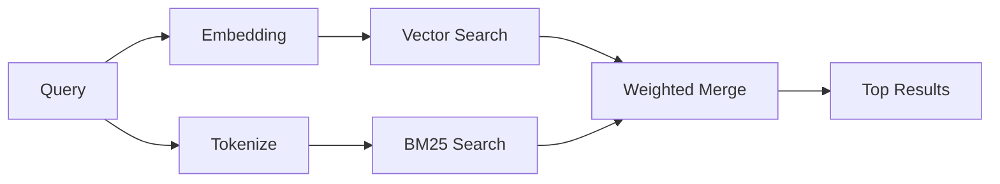

---
read_when:
    - คุณต้องการเข้าใจว่า `memory_search` ทำงานอย่างไร
    - คุณต้องการเลือกผู้ให้บริการ embedding
    - คุณต้องการปรับคุณภาพการค้นหา
summary: วิธีที่การค้นหาในหน่วยความจำค้นหาบันทึกที่เกี่ยวข้องโดยใช้ embeddings และการดึงข้อมูลแบบไฮบริด
title: การค้นหาในหน่วยความจำ
x-i18n:
    generated_at: "2026-04-24T09:06:25Z"
    model: gpt-5.4
    provider: openai
    source_hash: 04db62e519a691316ce40825c082918094bcaa9c36042cc8101c6504453d238e
    source_path: concepts/memory-search.md
    workflow: 15
---

`memory_search` ค้นหาบันทึกที่เกี่ยวข้องจากไฟล์หน่วยความจำของคุณ แม้ว่าการใช้ถ้อยคำจะแตกต่างจากข้อความต้นฉบับก็ตาม มันทำงานโดยการทำดัชนีหน่วยความจำเป็นชิ้นเล็ก ๆ แล้วค้นหาชิ้นเหล่านั้นโดยใช้ embeddings, คีย์เวิร์ด หรือทั้งสองอย่างร่วมกัน

## เริ่มต้นอย่างรวดเร็ว

หากคุณมีการสมัครใช้ GitHub Copilot หรือกำหนดค่า OpenAI, Gemini, Voyage หรือคีย์ API ของ Mistral ไว้แล้ว การค้นหาในหน่วยความจำจะทำงานโดยอัตโนมัติ หากต้องการตั้งค่าผู้ให้บริการอย่างชัดเจน:

```json5
{
  agents: {
    defaults: {
      memorySearch: {
        provider: "openai", // หรือ "gemini", "local", "ollama" เป็นต้น
      },
    },
  },
}
```

สำหรับ embeddings แบบ local ที่ไม่มีคีย์ API ให้ใช้ `provider: "local"` (ต้องใช้ `node-llama-cpp`)

## ผู้ให้บริการที่รองรับ

| ผู้ให้บริการ | ID | ต้องใช้คีย์ API | หมายเหตุ |
| -------------- | ---------------- | ------------- | ---------------------------------------------------- |
| Bedrock        | `bedrock`        | ไม่ต้องใช้            | ตรวจพบอัตโนมัติเมื่อ AWS credential chain resolve ได้ |
| Gemini         | `gemini`         | ใช่           | รองรับการทำดัชนีรูปภาพ/เสียง                        |
| GitHub Copilot | `github-copilot` | ไม่ต้องใช้            | ตรวจพบอัตโนมัติ ใช้การสมัครสมาชิก Copilot             |
| Local          | `local`          | ไม่ต้องใช้            | โมเดล GGUF, ดาวน์โหลดประมาณ 0.6 GB                         |
| Mistral        | `mistral`        | ใช่           | ตรวจพบอัตโนมัติ                                        |
| Ollama         | `ollama`         | ไม่ต้องใช้            | ทำงานแบบ local ต้องตั้งค่าอย่างชัดเจน                           |
| OpenAI         | `openai`         | ใช่           | ตรวจพบอัตโนมัติ เร็ว                                  |
| Voyage         | `voyage`         | ใช่           | ตรวจพบอัตโนมัติ                                        |

## การค้นหาทำงานอย่างไร

OpenClaw รันเส้นทางการดึงข้อมูลสองเส้นทางแบบขนานและรวมผลลัพธ์เข้าด้วยกัน:



- **การค้นหาแบบเวกเตอร์** จะพบบันทึกที่มีความหมายคล้ายกัน ("gateway host" ตรงกับ "เครื่องที่รัน OpenClaw")
- **การค้นหาแบบคีย์เวิร์ด BM25** จะพบการตรงกันแบบตรงตัว (ID, สตริงข้อผิดพลาด, คีย์ config)

หากมีเพียงเส้นทางเดียวที่พร้อมใช้งาน (ไม่มี embeddings หรือไม่มี FTS) อีกเส้นทางหนึ่งจะทำงานเพียงลำพัง

เมื่อไม่สามารถใช้ embeddings ได้ OpenClaw ยังใช้การจัดอันดับเชิงศัพท์เหนือผลลัพธ์ FTS แทนที่จะ fallback ไปใช้การเรียงลำดับแบบ exact-match ดิบเพียงอย่างเดียว โหมดเสื่อมนี้จะเพิ่มคะแนนให้ chunk ที่มีการครอบคลุมคำค้นที่แข็งแรงกว่าและพาธไฟล์ที่เกี่ยวข้อง ซึ่งช่วยให้ recall ยังมีประโยชน์แม้ไม่มี `sqlite-vec` หรือผู้ให้บริการ embedding

## การปรับปรุงคุณภาพการค้นหา

มีฟีเจอร์เสริมสองอย่างที่ช่วยได้เมื่อคุณมีประวัติบันทึกจำนวนมาก:

### Temporal decay

บันทึกเก่าจะค่อย ๆ สูญเสียน้ำหนักการจัดอันดับเพื่อให้ข้อมูลล่าสุดถูกแสดงก่อน ด้วย half-life เริ่มต้นที่ 30 วัน บันทึกจากเดือนที่แล้วจะมีคะแนนเหลือ 50% ของน้ำหนักเดิม ไฟล์ถาวรอย่าง `MEMORY.md` จะไม่ถูก decay

<Tip>
เปิดใช้ temporal decay หากเอเจนต์ของคุณมีบันทึกรายวันสะสมหลายเดือนและข้อมูลเก่ามักมีอันดับสูงกว่าบริบทล่าสุด
</Tip>

### MMR (ความหลากหลาย)

ช่วยลดผลลัพธ์ที่ซ้ำซ้อน หากมีบันทึกห้ารายการที่กล่าวถึง config ของเราเตอร์เดียวกัน MMR จะทำให้ผลลัพธ์บนสุดครอบคลุมหัวข้อที่ต่างกันแทนที่จะซ้ำกัน

<Tip>
เปิดใช้ MMR หาก `memory_search` มักส่งคืน snippet ที่เกือบซ้ำกันจากบันทึกรายวันที่ต่างกัน
</Tip>

### เปิดใช้ทั้งสองอย่าง

```json5
{
  agents: {
    defaults: {
      memorySearch: {
        query: {
          hybrid: {
            mmr: { enabled: true },
            temporalDecay: { enabled: true },
          },
        },
      },
    },
  },
}
```

## หน่วยความจำแบบหลายสื่อ

ด้วย Gemini Embedding 2 คุณสามารถทำดัชนีไฟล์รูปภาพและเสียงควบคู่กับ Markdown ได้ คำค้นหายังคงเป็นข้อความ แต่จะจับคู่กับเนื้อหาภาพและเสียง ดู [เอกสารอ้างอิงการกำหนดค่า Memory](/th/reference/memory-config) สำหรับการตั้งค่า

## การค้นหาหน่วยความจำของเซสชัน

คุณสามารถเลือกทำดัชนี transcript ของเซสชันเพื่อให้ `memory_search` สามารถระลึกถึงบทสนทนาก่อนหน้าได้ นี่เป็นฟีเจอร์แบบ opt-in ผ่าน
`memorySearch.experimental.sessionMemory` ดู
[เอกสารอ้างอิงการกำหนดค่า](/th/reference/memory-config) สำหรับรายละเอียด

## การแก้ไขปัญหา

**ไม่มีผลลัพธ์?** รัน `openclaw memory status` เพื่อตรวจสอบดัชนี หากว่างอยู่ ให้รัน
`openclaw memory index --force`

**มีแต่การจับคู่คีย์เวิร์ด?** ผู้ให้บริการ embedding ของคุณอาจยังไม่ได้รับการกำหนดค่า ตรวจสอบด้วย
`openclaw memory status --deep`

**หาข้อความ CJK ไม่เจอ?** สร้างดัชนี FTS ใหม่ด้วย
`openclaw memory index --force`

## อ่านเพิ่มเติม

- [Active Memory](/th/concepts/active-memory) -- หน่วยความจำของ sub-agent สำหรับเซสชันแชตแบบโต้ตอบ
- [Memory](/th/concepts/memory) -- เค้าโครงไฟล์, backend, เครื่องมือ
- [เอกสารอ้างอิงการกำหนดค่า Memory](/th/reference/memory-config) -- ตัวเลือก config ทั้งหมด

## ที่เกี่ยวข้อง

- [ภาพรวม Memory](/th/concepts/memory)
- [Active Memory](/th/concepts/active-memory)
- [Builtin memory engine](/th/concepts/memory-builtin)
