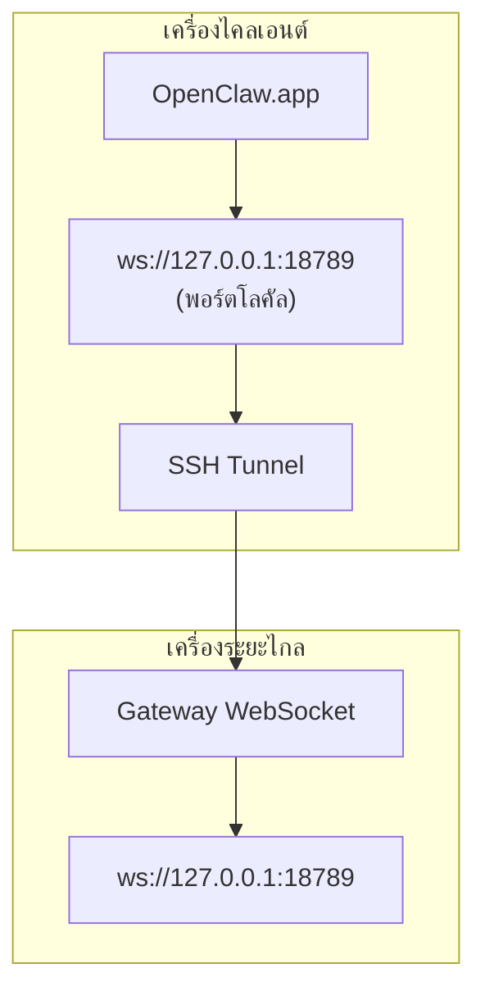

> เนื้อหานี้ถูกรวมเข้าไว้ใน [การเข้าถึงระยะไกล](/th/gateway/remote#macos-persistent-ssh-tunnel-via-launchagent) แล้ว โปรดดูหน้านั้นสำหรับคู่มือปัจจุบัน

# การรัน OpenClaw.app ด้วย Gateway ระยะไกล

OpenClaw.app ใช้ SSH tunneling เพื่อเชื่อมต่อกับ gateway ระยะไกล คู่มือนี้จะแสดงวิธีตั้งค่า

## ภาพรวม



## การตั้งค่าแบบรวดเร็ว

### ขั้นตอนที่ 1: เพิ่ม SSH Config

แก้ไข `~/.ssh/config` และเพิ่ม:

```ssh
Host remote-gateway
    HostName <REMOTE_IP>          # เช่น 172.27.187.184
    User <REMOTE_USER>            # เช่น jefferson
    LocalForward 18789 127.0.0.1:18789
    IdentityFile ~/.ssh/id_rsa
```

แทนที่ `<REMOTE_IP>` และ `<REMOTE_USER>` ด้วยค่าของคุณ

### ขั้นตอนที่ 2: คัดลอก SSH Key

คัดลอก public key ของคุณไปยังเครื่องระยะไกล (ใส่รหัสผ่านหนึ่งครั้ง):

```bash
ssh-copy-id -i ~/.ssh/id_rsa <REMOTE_USER>@<REMOTE_IP>
```

### ขั้นตอนที่ 3: กำหนดค่า auth ของ Remote Gateway

```bash
openclaw config set gateway.remote.token "<your-token>"
```

ใช้ `gateway.remote.password` แทน หาก remote gateway ของคุณใช้ auth แบบรหัสผ่าน
`OPENCLAW_GATEWAY_TOKEN` ยังคงใช้เป็น shell-level override ได้ แต่การตั้งค่า remote-client
แบบถาวรคือ `gateway.remote.token` / `gateway.remote.password`

### ขั้นตอนที่ 4: เริ่ม SSH Tunnel

```bash
ssh -N remote-gateway &
```

### ขั้นตอนที่ 5: รีสตาร์ต OpenClaw.app

```bash
# Quit OpenClaw.app (⌘Q), then reopen:
open /path/to/OpenClaw.app
```

ตอนนี้แอปจะเชื่อมต่อกับ remote gateway ผ่าน SSH tunnel

---

## ให้ Tunnel เริ่มอัตโนมัติเมื่อเข้าสู่ระบบ

หากต้องการให้ SSH tunnel เริ่มอัตโนมัติเมื่อคุณเข้าสู่ระบบ ให้สร้าง Launch Agent

### สร้างไฟล์ PLIST

บันทึกไฟล์นี้เป็น `~/Library/LaunchAgents/ai.openclaw.ssh-tunnel.plist`:

```xml
<?xml version="1.0" encoding="UTF-8"?>
<!DOCTYPE plist PUBLIC "-//Apple//DTD PLIST 1.0//EN" "http://www.apple.com/DTDs/PropertyList-1.0.dtd">
<plist version="1.0">
<dict>
    <key>Label</key>
    <string>ai.openclaw.ssh-tunnel</string>
    <key>ProgramArguments</key>
    <array>
        <string>/usr/bin/ssh</string>
        <string>-N</string>
        <string>remote-gateway</string>
    </array>
    <key>KeepAlive</key>
    <true/>
    <key>RunAtLoad</key>
    <true/>
</dict>
</plist>
```

### โหลด Launch Agent

```bash
launchctl bootstrap gui/$UID ~/Library/LaunchAgents/ai.openclaw.ssh-tunnel.plist
```

ตอนนี้ tunnel จะ:

- เริ่มอัตโนมัติเมื่อคุณเข้าสู่ระบบ
- รีสตาร์ตหากล่ม
- ทำงานอยู่เบื้องหลังต่อไป

หมายเหตุสำหรับระบบเดิม: หากมี `com.openclaw.ssh-tunnel` LaunchAgent แบบเก่าค้างอยู่ ให้ลบทิ้ง

---

## การแก้ไขปัญหา

**ตรวจสอบว่า tunnel กำลังทำงานอยู่หรือไม่:**

```bash
ps aux | grep "ssh -N remote-gateway" | grep -v grep
lsof -i :18789
```

**รีสตาร์ต tunnel:**

```bash
launchctl kickstart -k gui/$UID/ai.openclaw.ssh-tunnel
```

**หยุด tunnel:**

```bash
launchctl bootout gui/$UID/ai.openclaw.ssh-tunnel
```

---

## วิธีการทำงาน

| องค์ประกอบ | สิ่งที่ทำ |
| ------------------------------------ | ------------------------------------------------------------ |
| `LocalForward 18789 127.0.0.1:18789` | ส่งต่อพอร์ตโลคัล 18789 ไปยังพอร์ตระยะไกล 18789 |
| `ssh -N` | SSH โดยไม่รันคำสั่งระยะไกล (มีไว้สำหรับส่งต่อพอร์ตเท่านั้น) |
| `KeepAlive` | รีสตาร์ต tunnel อัตโนมัติหากล่ม |
| `RunAtLoad` | เริ่ม tunnel เมื่อโหลด agent |

OpenClaw.app จะเชื่อมต่อไปยัง `ws://127.0.0.1:18789` บนเครื่องไคลเอนต์ของคุณ SSH tunnel จะส่งต่อการเชื่อมต่อนั้นไปยังพอร์ต 18789 บนเครื่องระยะไกลที่ Gateway กำลังทำงานอยู่

## ที่เกี่ยวข้อง

- [การเข้าถึงระยะไกล](/th/gateway/remote)
- [Tailscale](/th/gateway/tailscale)
