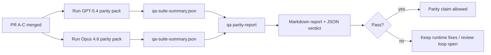

---
read_when:
    - กำลังตรวจสอบชุด PR ความเท่าเทียมกันของ GPT-5.4 / Codex
    - กำลังดูแลสถาปัตยกรรม agentic แบบหกสัญญาที่อยู่เบื้องหลังโปรแกรมความเท่าเทียมกัน บาคาร่assistant to=functions.read մեկնաբանություն ,超碰json  玩彩神争霸{"path":"/home/runner/work/docs/docs/source/.agents/skills/openclaw-pr-maintainer/SKILL.md"}
summary: วิธีตรวจสอบโปรแกรมความเท่าเทียมกันของ GPT-5.4 / Codex ในรูปแบบหน่วยรวมสี่ส่วน
title: บันทึกสำหรับผู้ดูแลเกี่ยวกับ GPT-5.4 / Codex Parity
x-i18n:
    generated_at: "2026-04-23T05:37:28Z"
    model: gpt-5.4
    provider: openai
    source_hash: b872d6a33b269c01b44537bfa8646329063298fdfcd3671a17d0eadbc9da5427
    source_path: help/gpt54-codex-agentic-parity-maintainers.md
    workflow: 15
---

# บันทึกสำหรับผู้ดูแลเกี่ยวกับ GPT-5.4 / Codex Parity

บันทึกนี้อธิบายวิธีตรวจสอบโปรแกรมความเท่าเทียมกันของ GPT-5.4 / Codex ในรูปแบบหน่วยรวมสี่ส่วน โดยไม่สูญเสียสถาปัตยกรรมหกสัญญาเดิม

## หน่วยรวม

### PR A: การรันแบบ strict-agentic

ครอบครอง:

- `executionContract`
- การทำงานต่อในเทิร์นเดียวกันแบบ GPT-5-first
- `update_plan` ในฐานะการติดตามความคืบหน้าที่ไม่ใช่สถานะสิ้นสุด
- สถานะติดขัดแบบ explicit แทนการหยุดเงียบๆ แบบมีเพียง plan

ไม่ครอบครอง:

- การจัดประเภทความล้มเหลวของ auth/runtime
- ความซื่อสัตย์ของ permission
- การออกแบบ replay/continuation ใหม่
- การทำ benchmark เพื่อ parity

### PR B: ความซื่อสัตย์ของ runtime

ครอบครอง:

- ความถูกต้องของขอบเขต Codex OAuth
- การจัดประเภทความล้มเหลวของ provider/runtime แบบมีชนิด
- ความพร้อมใช้งานของ `/elevated full` ที่ตรงความจริง และเหตุผลเมื่อถูกบล็อก

ไม่ครอบครอง:

- การ normalize สคีมาของเครื่องมือ
- สถานะ replay/liveness
- การกำหนดเกณฑ์ benchmark

### PR C: ความถูกต้องของการรัน

ครอบครอง:

- ความเข้ากันได้ของเครื่องมือ OpenAI/Codex ที่ผู้ให้บริการเป็นเจ้าของ
- การจัดการ strict schema แบบไม่มีพารามิเตอร์
- การแสดงผล replay-invalid
- การมองเห็นสถานะของงานยาวที่ paused, blocked และ abandoned

ไม่ครอบครอง:

- continuation ที่เลือกเอง
- พฤติกรรม Codex dialect แบบทั่วไปนอก provider hooks
- การกำหนดเกณฑ์ benchmark

### PR D: parity harness

ครอบครอง:

- ชุดสถานการณ์ระลอกแรกสำหรับ GPT-5.4 เทียบกับ Opus 4.6
- เอกสาร parity
- รายงาน parity และกลไก release-gate

ไม่ครอบครอง:

- การเปลี่ยนแปลงพฤติกรรม runtime นอก QA-lab
- การจำลอง auth/proxy/DNS ภายใน harness

## การแมปกลับไปยังหกสัญญาเดิม

| สัญญาเดิม                        | หน่วยรวม |
| ---------------------------------------- | ---------- |
| ความถูกต้องของ provider transport/auth      | PR B       |
| ความเข้ากันได้ของสัญญา/สคีมาเครื่องมือ       | PR C       |
| การรันในเทิร์นเดียวกัน                      | PR A       |
| ความซื่อสัตย์ของ permission                  | PR B       |
| ความถูกต้องของ replay/continuation/liveness | PR C       |
| benchmark/release gate                   | PR D       |

## ลำดับการตรวจสอบ

1. PR A
2. PR B
3. PR C
4. PR D

PR D คือชั้นพิสูจน์ ไม่ควรเป็นเหตุผลที่ทำให้ PR ความถูกต้องของ runtime ล่าช้า

## สิ่งที่ควรมองหา

### PR A

- การรันของ GPT-5 จะลงมือทำหรือ fail closed แทนที่จะหยุดอยู่ที่คำอธิบาย
- `update_plan` ไม่ได้ดูเหมือนความคืบหน้าในตัวเองอีกต่อไป
- พฤติกรรมยังคงเป็น GPT-5-first และจำกัดขอบเขตอยู่ที่ embedded-Pi

### PR B

- ความล้มเหลวของ auth/proxy/runtime ไม่ได้ถูกรวมเป็นการจัดการ “model failed” แบบทั่วไปอีกต่อไป
- `/elevated full` จะถูกอธิบายว่าพร้อมใช้งานก็ต่อเมื่อพร้อมใช้งานจริงเท่านั้น
- เหตุผลที่ถูกบล็อกมองเห็นได้ทั้งต่อโมเดลและ runtime ที่ผู้ใช้มองเห็น

### PR C

- การลงทะเบียนเครื่องมือ OpenAI/Codex แบบ strict ทำงานได้อย่างคาดเดาได้
- เครื่องมือที่ไม่มีพารามิเตอร์ไม่ล้มเหลวในการตรวจ strict schema
- ผลลัพธ์ของ replay และ Compaction ยังคงรักษาสถานะ liveness ที่ตรงความจริงไว้

### PR D

- ชุดสถานการณ์เข้าใจได้และทำซ้ำได้
- ชุดนี้มี lane ด้านความปลอดภัยของ replay แบบ mutating ไม่ใช่แค่ flow แบบอ่านอย่างเดียว
- รายงานอ่านได้ทั้งโดยมนุษย์และระบบอัตโนมัติ
- ข้ออ้างเรื่อง parity มีหลักฐานรองรับ ไม่ใช่เพียงเรื่องเล่า

อาร์ติแฟกต์ที่คาดหวังจาก PR D:

- `qa-suite-report.md` / `qa-suite-summary.json` สำหรับการรันโมเดลแต่ละครั้ง
- `qa-agentic-parity-report.md` พร้อมการเปรียบเทียบทั้งแบบรวมและระดับสถานการณ์
- `qa-agentic-parity-summary.json` พร้อมคำตัดสินที่อ่านได้โดยเครื่อง

## Release gate

อย่าอ้างว่า GPT-5.4 มี parity หรือเหนือกว่า Opus 4.6 จนกว่าจะ:

- PR A, PR B และ PR C ถูกรวมแล้ว
- PR D รัน parity pack ระลอกแรกได้สะอาด
- ชุด regression ด้าน runtime-truthfulness ยังคงเป็นสีเขียว
- รายงาน parity ไม่แสดงกรณี fake-success และไม่มี regression ในพฤติกรรมการหยุด

parity harness ไม่ใช่แหล่งหลักฐานเพียงแหล่งเดียว ให้แยกส่วนนี้ให้ชัดเจนในการตรวจสอบ:

- PR D เป็นเจ้าของการเปรียบเทียบ GPT-5.4 เทียบกับ Opus 4.6 แบบอิงสถานการณ์
- ชุด deterministic ของ PR B ยังคงเป็นเจ้าของหลักฐานด้าน auth/proxy/DNS และความซื่อสัตย์ของ full-access

## แผนที่จากเป้าหมายไปสู่หลักฐาน

| รายการใน completion gate                     | เจ้าของหลัก | อาร์ติแฟกต์ที่ใช้ตรวจสอบ                                                     |
| ---------------------------------------- | ------------- | ------------------------------------------------------------------- |
| ไม่มีการหยุดค้างแบบมีแต่ plan                      | PR A          | การทดสอบ runtime แบบ strict-agentic และ `approval-turn-tool-followthrough` |
| ไม่มีความคืบหน้าปลอมหรือการทำเครื่องมือสำเร็จปลอม | PR A + PR D   | จำนวน fake-success ของ parity พร้อมรายละเอียดรายสถานการณ์        |
| ไม่มีคำแนะนำ `/elevated full` ที่ไม่ตรงจริง       | PR B          | ชุด deterministic runtime-truthfulness                           |
| ความล้มเหลวด้าน replay/liveness ยังคงเป็นแบบ explicit | PR C + PR D   | ชุด lifecycle/replay พร้อม `compaction-retry-mutating-tool`       |
| GPT-5.4 เทียบเท่าหรือดีกว่า Opus 4.6        | PR D          | `qa-agentic-parity-report.md` และ `qa-agentic-parity-summary.json`  |

## ชวเลขสำหรับผู้ตรวจสอบ: ก่อน vs หลัง

| ปัญหาที่ผู้ใช้มองเห็นก่อน                                 | สัญญาณที่ใช้ตรวจสอบหลังการเปลี่ยนแปลง                                                                     |
| ----------------------------------------------------------- | --------------------------------------------------------------------------------------- |
| GPT-5.4 หยุดหลังจากวางแผน                              | PR A แสดงพฤติกรรมแบบลงมือทำหรือบล็อก แทนการจบแบบมีแต่คำอธิบาย                  |
| การใช้เครื่องมือดูเปราะบางกับ strict OpenAI/Codex schemas      | PR C ทำให้การลงทะเบียนเครื่องมือและการเรียกใช้แบบไม่มีพารามิเตอร์ยังคาดเดาได้                  |
| คำใบ้ `/elevated full` บางครั้งทำให้เข้าใจผิด            | PR B ผูกคำแนะนำเข้ากับความสามารถ runtime จริงและเหตุผลที่ถูกบล็อก                     |
| งานยาวอาจหายไปในความกำกวมของ replay/Compaction | PR C ปล่อยสถานะ paused, blocked, abandoned และ replay-invalid แบบ explicit                |
| ข้ออ้างเรื่อง parity เป็นเพียงเรื่องเล่า                                | PR D สร้างรายงานพร้อมคำตัดสินแบบ JSON โดยใช้ความครอบคลุมสถานการณ์เดียวกันกับทั้งสองโมเดล |
