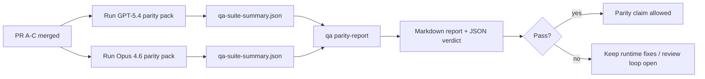

---
read_when:
    - การตรวจสอบชุด PR สำหรับความสอดคล้องของ GPT-5.4 / Codex
    - การดูแลสถาปัตยกรรมแบบ agentic หกสัญญาที่อยู่เบื้องหลังโปรแกรมความสอดคล้องนี้
summary: วิธีตรวจสอบโปรแกรมความสอดคล้องของ GPT-5.4 / Codex เป็น 4 หน่วยสำหรับการรวมโค้ด
title: บันทึกสำหรับผู้ดูแลความสอดคล้องของ GPT-5.4 / Codex
x-i18n:
    generated_at: "2026-04-24T09:14:36Z"
    model: gpt-5.4
    provider: openai
    source_hash: 803b62bf5bb6b00125f424fa733e743ecdec7f8410dec0782096f9d1ddbed6c0
    source_path: help/gpt54-codex-agentic-parity-maintainers.md
    workflow: 15
---

บันทึกนี้อธิบายวิธีตรวจสอบโปรแกรมความสอดคล้องของ GPT-5.4 / Codex เป็น 4 หน่วยสำหรับการรวมโค้ด โดยไม่สูญเสียสถาปัตยกรรมแบบหกสัญญาดั้งเดิม

## หน่วยสำหรับการรวมโค้ด

### PR A: strict-agentic execution

รับผิดชอบ:

- `executionContract`
- การทำงานต่อในเทิร์นเดียวกันแบบ GPT-5-first
- `update_plan` ในฐานะการติดตามความคืบหน้าแบบไม่สิ้นสุดการทำงาน
- สถานะ blocked แบบชัดเจน แทนการหยุดเงียบ ๆ แบบมีแค่แผน

ไม่รับผิดชอบ:

- การจัดประเภทความล้มเหลวด้าน auth/runtime
- ความซื่อสัตย์ของ permission
- การออกแบบใหม่ของ replay/continuation
- การเปรียบเทียบประสิทธิภาพเพื่อความสอดคล้อง

### PR B: runtime truthfulness

รับผิดชอบ:

- ความถูกต้องของ Codex OAuth scope
- การจัดประเภทความล้มเหลวของ provider/runtime แบบมีชนิด
- ความถูกต้องของการใช้ `/elevated full` และเหตุผลที่ถูกบล็อก

ไม่รับผิดชอบ:

- การ normalize schema ของเครื่องมือ
- สถานะ replay/liveness
- benchmark gating

### PR C: execution correctness

รับผิดชอบ:

- ความเข้ากันได้ของเครื่องมือ OpenAI/Codex ที่เป็นของ provider
- การจัดการ strict schema สำหรับเครื่องมือที่ไม่มีพารามิเตอร์
- การแสดงผล replay-invalid
- การมองเห็นสถานะงานยาวแบบ paused, blocked และ abandoned

ไม่รับผิดชอบ:

- continuation ที่เลือกเองโดยตัวระบบ
- พฤติกรรมของ Codex dialect ทั่วไปนอก provider hooks
- benchmark gating

### PR D: parity harness

รับผิดชอบ:

- ชุดสถานการณ์ระลอกแรกของ GPT-5.4 เทียบกับ Opus 4.6
- เอกสารความสอดคล้อง
- กลไกรายงานความสอดคล้องและ release-gate

ไม่รับผิดชอบ:

- การเปลี่ยนแปลงพฤติกรรมของ runtime นอก QA-lab
- การจำลอง auth/proxy/DNS ภายใน harness

## การแมปกลับไปยังหกสัญญาดั้งเดิม

| สัญญาดั้งเดิม | หน่วยสำหรับการรวมโค้ด |
| ---------------------------------------- | ---------- |
| ความถูกต้องของ transport/auth ของ provider | PR B |
| ความเข้ากันได้ของสัญญา/schema ของเครื่องมือ | PR C |
| การทำงานในเทิร์นเดียวกัน | PR A |
| ความซื่อสัตย์ของ permission | PR B |
| ความถูกต้องของ replay/continuation/liveness | PR C |
| benchmark/release gate | PR D |

## ลำดับการตรวจสอบ

1. PR A
2. PR B
3. PR C
4. PR D

PR D คือชั้นพิสูจน์หลัก ไม่ควรเป็นเหตุผลที่ทำให้ PR ด้านความถูกต้องของ runtime ต้องล่าช้า

## สิ่งที่ควรมองหา

### PR A

- การรันของ GPT-5 จะลงมือทำจริงหรือ fail closed แทนที่จะหยุดที่คำอธิบาย
- `update_plan` จะไม่ดูเหมือนความคืบหน้าในตัวมันเองอีกต่อไป
- พฤติกรรมยังคงเป็น GPT-5-first และอยู่ในขอบเขตของ embedded-Pi

### PR B

- ความล้มเหลวด้าน auth/proxy/runtime จะไม่ถูกรวมเป็นการจัดการ “model failed” แบบทั่วไปอีกต่อไป
- `/elevated full` จะถูกอธิบายว่าพร้อมใช้งานก็ต่อเมื่อพร้อมใช้งานจริงเท่านั้น
- เหตุผลที่ถูกบล็อกจะมองเห็นได้ทั้งต่อโมเดลและ runtime ฝั่งผู้ใช้

### PR C

- การลงทะเบียนเครื่องมือแบบ strict ของ OpenAI/Codex ทำงานได้อย่างคาดเดาได้
- เครื่องมือที่ไม่มีพารามิเตอร์จะไม่ล้มเหลวจาก strict schema checks
- ผลลัพธ์ของ replay และ Compaction รักษาสถานะ liveness ที่ซื่อสัตย์ไว้ได้

### PR D

- ชุดสถานการณ์เข้าใจได้และทำซ้ำได้
- ชุดนี้มี lane ด้าน replay-safety แบบ mutating ไม่ใช่มีแต่ flow แบบอ่านอย่างเดียว
- รายงานอ่านได้ทั้งโดยมนุษย์และระบบอัตโนมัติ
- ข้ออ้างเรื่องความสอดคล้องมีหลักฐานรองรับ ไม่ใช่เพียงเรื่องเล่า

artifacts ที่คาดหวังจาก PR D:

- `qa-suite-report.md` / `qa-suite-summary.json` สำหรับการรันของแต่ละโมเดล
- `qa-agentic-parity-report.md` พร้อมการเปรียบเทียบทั้งในระดับรวมและระดับสถานการณ์
- `qa-agentic-parity-summary.json` พร้อม verdict แบบที่เครื่องอ่านได้

## Release gate

อย่าอ้างว่า GPT-5.4 มีความสอดคล้องหรือเหนือกว่า Opus 4.6 จนกว่าจะ:

- PR A, PR B และ PR C ถูก merge แล้ว
- PR D รัน first-wave parity pack ผ่านอย่างเรียบร้อย
- regression suites ของ runtime-truthfulness ยังคงเป็นสีเขียว
- parity report แสดงว่าไม่มีกรณี fake-success และไม่มี regression ในพฤติกรรมการหยุด

parity harness ไม่ใช่แหล่งหลักฐานเพียงแหล่งเดียว ให้แยกส่วนนี้ให้ชัดเจนในการตรวจสอบ:

- PR D เป็นเจ้าของการเปรียบเทียบ GPT-5.4 กับ Opus 4.6 แบบอิงสถานการณ์
- deterministic suites ของ PR B ยังคงเป็นเจ้าของหลักฐานด้าน auth/proxy/DNS และความซื่อสัตย์ของ full-access

## แผนที่จากเป้าหมายไปยังหลักฐาน

| รายการใน completion gate | เจ้าของหลัก | artifact สำหรับการตรวจสอบ |
| ---------------------------------------- | ------------- | ------------------------------------------------------------------- |
| ไม่มีการค้างที่มีแต่แผน | PR A | การทดสอบ runtime แบบ strict-agentic และ `approval-turn-tool-followthrough` |
| ไม่มีความคืบหน้าปลอมหรือการทำเครื่องมือเสร็จปลอม | PR A + PR D | จำนวน fake-success ใน parity บวกกับรายละเอียดรายงานระดับสถานการณ์ |
| ไม่มีคำแนะนำ `/elevated full` ที่ผิดพลาด | PR B | deterministic runtime-truthfulness suites |
| ความล้มเหลวของ replay/liveness ยังคงถูกแสดงอย่างชัดเจน | PR C + PR D | lifecycle/replay suites บวกกับ `compaction-retry-mutating-tool` |
| GPT-5.4 เทียบเท่าหรือดีกว่า Opus 4.6 | PR D | `qa-agentic-parity-report.md` และ `qa-agentic-parity-summary.json` |

## ชวเลขสำหรับผู้ตรวจสอบ: ก่อนเทียบกับหลัง

| ปัญหาที่ผู้ใช้เห็นก่อนหน้า | สัญญาณที่ใช้ตรวจหลังการแก้ไข |
| ----------------------------------------------------------- | --------------------------------------------------------------------------------------- |
| GPT-5.4 หยุดหลังจากวางแผน | PR A แสดงพฤติกรรมแบบลงมือทำหรือถูกบล็อก แทนการจบด้วยคำอธิบายอย่างเดียว |
| การใช้เครื่องมือดูเปราะบางกับ strict OpenAI/Codex schemas | PR C ทำให้การลงทะเบียนเครื่องมือและการเรียกใช้แบบไม่มีพารามิเตอร์มีความคาดเดาได้ |
| คำใบ้ `/elevated full` บางครั้งทำให้เข้าใจผิด | PR B ผูกคำแนะนำกับความสามารถจริงของ runtime และเหตุผลที่ถูกบล็อก |
| งานยาวอาจหายไปในความกำกวมของ replay/Compaction | PR C ส่งสถานะ paused, blocked, abandoned และ replay-invalid อย่างชัดเจน |
| ข้ออ้างเรื่องความสอดคล้องเป็นเพียงเรื่องเล่า | PR D สร้างรายงานพร้อม JSON verdict โดยครอบคลุมสถานการณ์เดียวกันบนทั้งสองโมเดล |

## ที่เกี่ยวข้อง

- [ความสอดคล้องแบบ agentic ของ GPT-5.4 / Codex](/th/help/gpt54-codex-agentic-parity)
