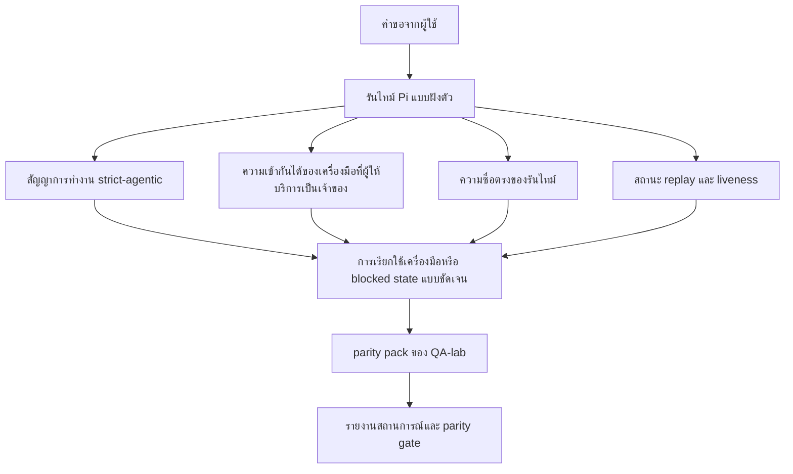
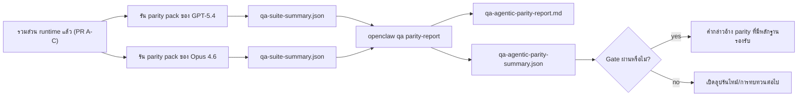

---
read_when:
    - การดีบักพฤติกรรม agent ของ GPT-5.4 หรือ Codex
    - การเปรียบเทียบพฤติกรรม agentic ของ OpenClaw ข้ามโมเดลชั้นนำต่างๆ
    - การทบทวนการแก้ไขด้าน strict-agentic, tool-schema, elevation และ replay
summary: วิธีที่ OpenClaw ปิดช่องว่างของการทำงานแบบ agentic สำหรับ GPT-5.4 และโมเดลสไตล์ Codex
title: ความเท่าเทียมด้าน agentic ของ GPT-5.4 / Codex
x-i18n:
    generated_at: "2026-04-23T05:37:33Z"
    model: gpt-5.4
    provider: openai
    source_hash: 77bc9b8fab289bd35185fa246113503b3f5c94a22bd44739be07d39ae6779056
    source_path: help/gpt54-codex-agentic-parity.md
    workflow: 15
---

# ความเท่าเทียมด้าน agentic ของ GPT-5.4 / Codex ใน OpenClaw

OpenClaw ใช้งานได้ดีกับโมเดลชั้นนำที่ใช้เครื่องมืออยู่แล้ว แต่ GPT-5.4 และโมเดลสไตล์ Codex ยังทำงานได้ต่ำกว่าที่ควรในเชิงปฏิบัติบางจุด:

- อาจหยุดหลังจากวางแผนแทนที่จะลงมือทำงาน
- อาจใช้ strict OpenAI/Codex tool schemas อย่างไม่ถูกต้อง
- อาจขอ `/elevated full` แม้ในกรณีที่ full access เป็นไปไม่ได้
- อาจสูญเสียสถานะของงานระยะยาวระหว่าง replay หรือ Compaction
- การอ้างเรื่องความเท่าเทียมกับ Claude Opus 4.6 อิงจากเรื่องเล่ามากกว่าสถานการณ์ที่ทำซ้ำได้

โครงการ parity นี้แก้ช่องว่างเหล่านั้นในสี่ส่วนที่ทบทวนได้

## สิ่งที่เปลี่ยนไป

### PR A: การทำงาน strict-agentic

ส่วนนี้เพิ่มสัญญาการทำงาน `strict-agentic` แบบเลือกใช้สำหรับการรัน Pi GPT-5 แบบฝังตัว

เมื่อเปิดใช้งาน OpenClaw จะไม่ยอมรับเทิร์นที่มีเพียงแผนว่าเป็นการเสร็จงานที่ “ดีพอ” อีกต่อไป หากโมเดลเพียงบอกว่าตั้งใจจะทำอะไร แต่ไม่ได้ใช้เครื่องมือจริงหรือไม่ได้เกิดความคืบหน้า OpenClaw จะลองใหม่ด้วยการ steer ให้ลงมือทำทันที แล้วจากนั้นจึง fail closed ด้วยสถานะ blocked ที่ชัดเจน แทนที่จะจบงานแบบเงียบๆ

สิ่งนี้ช่วยปรับปรุงประสบการณ์ของ GPT-5.4 ได้มากที่สุดในกรณี:

- การตอบกลับสั้นๆ แบบ “โอเค ทำเลย”
- งานเขียนโค้ดที่ขั้นตอนแรกชัดเจนอยู่แล้ว
- โฟลว์ที่ `update_plan` ควรเป็นการติดตามความคืบหน้า ไม่ใช่ข้อความเติมเนื้อหา

### PR B: ความซื่อตรงของรันไทม์

ส่วนนี้ทำให้ OpenClaw บอกความจริงในสองเรื่อง:

- เพราะเหตุใดการเรียกผู้ให้บริการ/รันไทม์จึงล้มเหลว
- `/elevated full` พร้อมใช้งานจริงหรือไม่

นั่นหมายความว่า GPT-5.4 จะได้รับสัญญาณจากรันไทม์ที่ดีขึ้นสำหรับกรณี scope หาย, auth refresh ล้มเหลว, ความล้มเหลว auth แบบ HTML 403, ปัญหา proxy, ปัญหา DNS หรือ timeout และโหมด full-access ที่ถูกบล็อก โมเดลจะมีโอกาสน้อยลงที่จะหลอนแนวทางแก้ผิด หรือคอยขอโหมดสิทธิ์ที่รันไทม์ไม่สามารถให้ได้

### PR C: ความถูกต้องของการทำงาน

ส่วนนี้ปรับปรุงความถูกต้องสองด้าน:

- ความเข้ากันได้ของ OpenAI/Codex tool-schema ที่ผู้ให้บริการเป็นเจ้าของ
- การแสดงผล replay และสถานะการมีชีวิตของงานระยะยาว

งานด้านความเข้ากันได้ของเครื่องมือช่วยลดแรงเสียดทานของ schema สำหรับการลงทะเบียนเครื่องมือแบบ strict ของ OpenAI/Codex โดยเฉพาะกรณีเครื่องมือที่ไม่มีพารามิเตอร์และความคาดหวังเรื่อง object-root แบบ strict ส่วนงาน replay/liveness ทำให้งานระยะยาวสังเกตได้มากขึ้น ดังนั้นสถานะ paused, blocked และ abandoned จะมองเห็นได้ แทนที่จะหายไปในข้อความล้มเหลวแบบทั่วไป

### PR D: parity harness

ส่วนนี้เพิ่ม parity pack ระลอกแรกของ QA-lab เพื่อให้ GPT-5.4 และ Opus 4.6 ถูกทดสอบผ่านสถานการณ์เดียวกัน และเปรียบเทียบกันด้วยหลักฐานแบบใช้ร่วมกัน

parity pack คือชั้นของหลักฐาน มันไม่ได้เปลี่ยนพฤติกรรมรันไทม์ด้วยตัวเอง

หลังจากคุณมี artifacts `qa-suite-summary.json` สองชุดแล้ว ให้สร้างการเปรียบเทียบ release-gate ด้วย:

```bash
pnpm openclaw qa parity-report \
  --repo-root . \
  --candidate-summary .artifacts/qa-e2e/gpt54/qa-suite-summary.json \
  --baseline-summary .artifacts/qa-e2e/opus46/qa-suite-summary.json \
  --output-dir .artifacts/qa-e2e/parity
```

คำสั่งนั้นจะเขียน:

- รายงาน Markdown แบบอ่านโดยมนุษย์
- verdict แบบ JSON ที่เครื่องอ่านได้
- ผล gate แบบชัดเจนว่า `pass` / `fail`

## เหตุใดสิ่งนี้จึงปรับปรุง GPT-5.4 ได้จริง

ก่อนงานชุดนี้ GPT-5.4 บน OpenClaw อาจให้ความรู้สึก agentic น้อยกว่า Opus ในเซสชันเขียนโค้ดจริง เพราะรันไทม์ยอมรับพฤติกรรมที่เป็นอันตรายกับโมเดลสไตล์ GPT-5 โดยเฉพาะ:

- เทิร์นที่มีแต่คำอธิบาย
- แรงเสียดทานของ schema รอบเครื่องมือ
- ข้อมูลสะท้อนเรื่องสิทธิ์ที่คลุมเครือ
- การเสียหายของ replay หรือ Compaction แบบเงียบๆ

เป้าหมายไม่ใช่ทำให้ GPT-5.4 เลียนแบบ Opus เป้าหมายคือให้ GPT-5.4 มีสัญญารันไทม์ที่ให้รางวัลกับความคืบหน้าจริง, ให้ semantics ของเครื่องมือและสิทธิ์ที่สะอาดขึ้น และเปลี่ยนโหมดความล้มเหลวให้กลายเป็นสถานะที่อ่านได้ทั้งโดยเครื่องและมนุษย์อย่างชัดเจน

สิ่งนี้เปลี่ยนประสบการณ์ผู้ใช้จาก:

- “โมเดลมีแผนที่ดีแต่หยุดไป”

เป็น:

- “โมเดลลงมือทำจริง หรือไม่เช่นนั้น OpenClaw จะแสดงเหตุผลที่แน่ชัดว่าทำไม่ได้”

## ก่อนเทียบกับหลังสำหรับผู้ใช้ GPT-5.4

| ก่อนโครงการนี้                                                                              | หลัง PR A-D                                                                               |
| -------------------------------------------------------------------------------------------- | ----------------------------------------------------------------------------------------- |
| GPT-5.4 อาจหยุดหลังจากวางแผนได้สมเหตุสมผลโดยไม่ก้าวไปสู่ขั้นตอนเครื่องมือถัดไปจริง         | PR A เปลี่ยน “มีแต่แผน” ให้เป็น “ลงมือทำตอนนี้ หรือแสดง blocked state”                 |
| strict tool schemas อาจปฏิเสธเครื่องมือแบบไม่มีพารามิเตอร์หรือรูปแบบ OpenAI/Codex อย่างชวนสับสน | PR C ทำให้การลงทะเบียนและการเรียกใช้เครื่องมือที่ผู้ให้บริการเป็นเจ้าของคาดเดาได้มากขึ้น |
| แนวทาง `/elevated full` อาจคลุมเครือหรือผิดในรันไทม์ที่ถูกบล็อก                            | PR B ให้คำใบ้เรื่องรันไทม์และสิทธิ์ที่ตรงความจริงแก่ GPT-5.4 และผู้ใช้                   |
| ความล้มเหลวของ replay หรือ Compaction อาจให้ความรู้สึกราวกับงานหายไปเงียบๆ                  | PR C แสดงผลลัพธ์แบบ paused, blocked, abandoned และ replay-invalid อย่างชัดเจน           |
| “GPT-5.4 รู้สึกแย่กว่า Opus” ส่วนใหญ่เป็นเพียงเรื่องเล่า                                   | PR D เปลี่ยนสิ่งนี้ให้เป็นสถานการณ์ชุดเดียวกัน เมตริกชุดเดียวกัน และ hard pass/fail gate |

## สถาปัตยกรรม



## โฟลว์การเผยแพร่



## ชุดสถานการณ์

parity pack ระลอกแรกในตอนนี้ครอบคลุมห้าสถานการณ์:

### `approval-turn-tool-followthrough`

ตรวจว่าหลังการอนุมัติสั้นๆ โมเดลจะไม่หยุดแค่ “ฉันจะทำสิ่งนั้น” แต่มันควรดำเนินการ concrete action แรกภายในเทิร์นเดียวกัน

### `model-switch-tool-continuity`

ตรวจว่างานที่ใช้เครื่องมือยังคงมีความต่อเนื่องข้ามขอบเขตการสลับโมเดล/รันไทม์ แทนที่จะรีเซ็ตกลับไปเป็นคำอธิบายหรือสูญเสียบริบทการทำงาน

### `source-docs-discovery-report`

ตรวจว่าโมเดลสามารถอ่าน source และ docs, สังเคราะห์ข้อค้นพบ และทำงานต่อแบบ agentic ได้ แทนที่จะสรุปแบบบางๆ แล้วหยุดเร็วเกินไป

### `image-understanding-attachment`

ตรวจว่างานแบบผสมที่มีไฟล์แนบยังคงนำไปสู่การกระทำได้ และไม่ยุบตัวเหลือเพียงการบรรยายแบบคลุมเครือ

### `compaction-retry-mutating-tool`

ตรวจว่างานที่มีการเขียนแบบ mutating จริงยังคงแสดง replay-unsafety อย่างชัดเจน แทนที่จะดูเหมือน replay-safe อย่างเงียบๆ เมื่อการรันเกิด Compaction, retry หรือตกอยู่ภายใต้แรงกดดันจนสูญเสียสถานะการตอบกลับ

## เมทริกซ์ของสถานการณ์

| สถานการณ์                         | สิ่งที่ทดสอบ                             | พฤติกรรม GPT-5.4 ที่ดี                                                       | สัญญาณความล้มเหลว                                                                  |
| --------------------------------- | ---------------------------------------- | ----------------------------------------------------------------------------- | ------------------------------------------------------------------------------------ |
| `approval-turn-tool-followthrough` | เทิร์นอนุมัติสั้นๆ หลังจากมีแผน          | เริ่ม concrete tool action แรกทันที แทนที่จะทวนความตั้งใจ                    | การตามต่อที่มีแต่แผน, ไม่มีกิจกรรมเครื่องมือ หรือ blocked turn โดยไม่มีตัวบล็อกจริง  |
| `model-switch-tool-continuity`     | การสลับรันไทม์/โมเดลระหว่างใช้งานเครื่องมือ | รักษาบริบทของงานและลงมือทำต่ออย่างสอดคล้อง                                  | รีเซ็ตกลับเป็นคำอธิบาย, สูญเสียบริบทเครื่องมือ หรือหยุดหลังการสลับ                  |
| `source-docs-discovery-report`     | การอ่าน source + สังเคราะห์ + ลงมือทำ    | ค้นหาแหล่งข้อมูล ใช้เครื่องมือ และสร้างรายงานที่มีประโยชน์โดยไม่ค้าง         | สรุปแบบบาง, ขาดงานที่ใช้เครื่องมือ หรือหยุดกลางเทิร์นแบบไม่สมบูรณ์                   |
| `image-understanding-attachment`   | งานแบบ agentic ที่ขับเคลื่อนด้วยไฟล์แนบ   | ตีความไฟล์แนบ เชื่อมโยงกับเครื่องมือ และทำงานต่อ                              | การบรรยายคลุมเครือ, มองข้ามไฟล์แนบ หรือไม่มีการกระทำถัดไปที่เป็นรูปธรรม              |
| `compaction-retry-mutating-tool`   | งานแบบ mutating ภายใต้แรงกดดันจาก Compaction | ทำการเขียนจริงและคง replay-unsafety ไว้อย่างชัดเจนหลัง side effect เกิดขึ้น | มีการเขียนแบบ mutating แต่ความปลอดภัยของ replay ถูกสื่อโดยนัย, หายไป หรือขัดแย้งกัน |

## Release gate

GPT-5.4 จะถือว่าเทียบเท่าหรือดีกว่าได้ก็ต่อเมื่อรันไทม์ที่รวมแล้วผ่าน parity pack และ regression ด้าน runtime-truthfulness พร้อมกัน

ผลลัพธ์ที่จำเป็น:

- ไม่มีการค้างแบบมีแต่แผนเมื่อการกระทำของเครื่องมือถัดไปชัดเจน
- ไม่มีการจบปลอมโดยไม่มีการทำงานจริง
- ไม่มีแนวทาง `/elevated full` ที่ไม่ถูกต้อง
- ไม่มีการ abandon จาก replay หรือ Compaction แบบเงียบๆ
- เมตริกของ parity-pack อย่างน้อยต้องแข็งแรงเท่ากับ baseline Opus 4.6 ที่ตกลงกันไว้

สำหรับ harness ระลอกแรก gate จะเปรียบเทียบ:

- completion rate
- unintended-stop rate
- valid-tool-call rate
- fake-success count

หลักฐานของ parity ถูกแยกโดยตั้งใจออกเป็นสองชั้น:

- PR D พิสูจน์พฤติกรรม GPT-5.4 เทียบกับ Opus 4.6 ในสถานการณ์เดียวกันผ่าน QA-lab
- deterministic suites ของ PR B พิสูจน์ความซื่อตรงด้าน auth, proxy, DNS และ `/elevated full` นอกเหนือจาก harness

## เมทริกซ์เป้าหมายต่อหลักฐาน

| รายการใน completion gate                              | PR เจ้าของ   | แหล่งหลักฐาน                                                       | สัญญาณผ่าน                                                                                |
| ----------------------------------------------------- | ------------ | ------------------------------------------------------------------- | ------------------------------------------------------------------------------------------ |
| GPT-5.4 ไม่ค้างหลังการวางแผนอีกต่อไป                  | PR A         | `approval-turn-tool-followthrough` พร้อม runtime suites ของ PR A   | approval turns ทริกเกอร์งานจริง หรือ blocked state แบบชัดเจน                              |
| GPT-5.4 ไม่ปลอมความคืบหน้าหรือการเสร็จสิ้นของเครื่องมือ | PR A + PR D  | ผลลัพธ์ของสถานการณ์ใน parity report และ fake-success count         | ไม่มีผลลัพธ์ผ่านที่น่าสงสัย และไม่มีการจบแบบมีแต่คำอธิบาย                                  |
| GPT-5.4 ไม่ให้แนวทาง `/elevated full` ที่ผิดอีกต่อไป    | PR B         | deterministic truthfulness suites                                   | blocked reasons และ full-access hints ยังคงตรงกับรันไทม์จริง                              |
| ความล้มเหลวของ replay/liveness ยังคงชัดเจน             | PR C + PR D  | lifecycle/replay suites ของ PR C พร้อม `compaction-retry-mutating-tool` | งาน mutating ยังคงแสดง replay-unsafety อย่างชัดเจน แทนที่จะหายไปแบบเงียบๆ                |
| GPT-5.4 เทียบเท่าหรือดีกว่า Opus 4.6 บนเมตริกที่ตกลงกัน | PR D         | `qa-agentic-parity-report.md` และ `qa-agentic-parity-summary.json` | ครอบคลุมสถานการณ์เท่ากัน และไม่มี regression ด้าน completion, พฤติกรรมการหยุด หรือการใช้เครื่องมือที่ถูกต้อง |

## วิธีอ่าน parity verdict

ใช้ verdict ใน `qa-agentic-parity-summary.json` เป็นการตัดสินแบบ machine-readable ขั้นสุดท้ายสำหรับ parity pack ระลอกแรก

- `pass` หมายความว่า GPT-5.4 ครอบคลุมสถานการณ์ชุดเดียวกับ Opus 4.6 และไม่มี regression บนเมตริกรวมที่ตกลงกันไว้
- `fail` หมายความว่ามี hard gate อย่างน้อยหนึ่งรายการถูกทริก: completion อ่อนกว่า, unintended stops แย่กว่า, valid tool use อ่อนกว่า, มี fake-success กรณีใดกรณีหนึ่ง หรือการครอบคลุมสถานการณ์ไม่ตรงกัน
- “shared/base CI issue” ไม่ใช่ผล parity ในตัวเอง หากสัญญาณรบกวนจาก CI ภายนอก PR D ขัดขวางการรัน verdict ควรรอการรันของ merged-runtime ที่สะอาดแทนที่จะอนุมานจาก logs ในยุคของ branch
- ความซื่อตรงของ auth, proxy, DNS และ `/elevated full` ยังคงมาจาก deterministic suites ของ PR B ดังนั้นคำกล่าวอ้างสำหรับการเผยแพร่ขั้นสุดท้ายจึงต้องมีทั้งสองอย่าง: parity verdict ของ PR D ที่ผ่าน และ truthfulness coverage ของ PR B ที่เป็นสีเขียว

## ใครควรเปิดใช้ `strict-agentic`

ใช้ `strict-agentic` เมื่อ:

- เอเจนต์ถูกคาดหวังให้ลงมือทำทันทีเมื่อขั้นตอนถัดไปชัดเจน
- GPT-5.4 หรือโมเดลในตระกูล Codex เป็นรันไทม์หลัก
- คุณต้องการ blocked states ที่ชัดเจนมากกว่าคำตอบแบบสรุปย้อนทวนที่ดู “ช่วยเหลือ”

คงสัญญาเริ่มต้นไว้เมื่อ:

- คุณต้องการพฤติกรรมแบบหลวมกว่าเดิม
- คุณไม่ได้ใช้โมเดลในตระกูล GPT-5
- คุณกำลังทดสอบพรอมป์ต์มากกว่าการบังคับใช้ระดับรันไทม์
