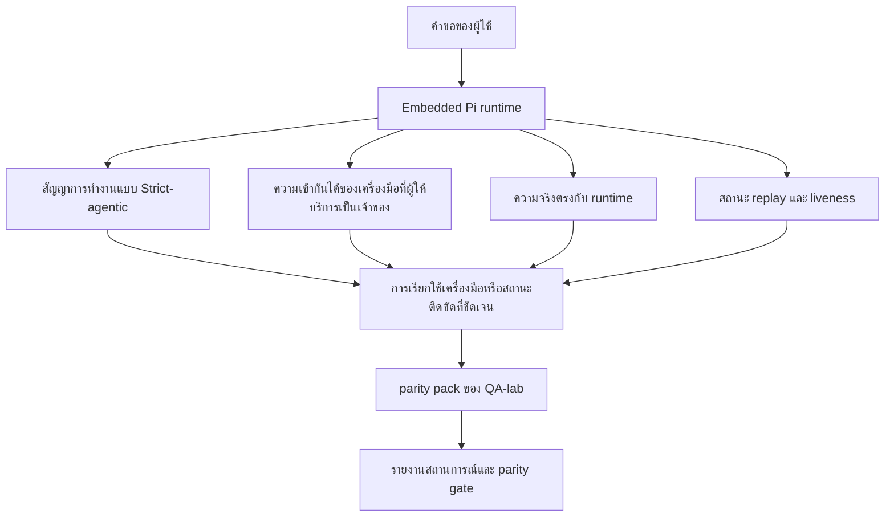
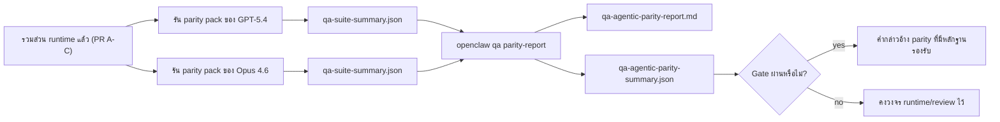

---
read_when:
    - การแก้ไขปัญหาพฤติกรรมเอเจนต์ของ GPT-5.4 หรือ Codex
    - การเปรียบเทียบพฤติกรรมเชิงเอเจนต์ของ OpenClaw ข้ามโมเดล frontier ต่าง ๆ
    - การทบทวนการแก้ไข strict-agentic, schema ของเครื่องมือ, elevation และ replay
summary: วิธีที่ OpenClaw ปิดช่องว่างของการดำเนินการแบบเอเจนต์สำหรับโมเดล GPT-5.4 และสไตล์ Codex
title: ความเท่าเทียมกันของความสามารถเชิงเอเจนต์สำหรับ GPT-5.4 / Codex
x-i18n:
    generated_at: "2026-04-24T09:14:49Z"
    model: gpt-5.4
    provider: openai
    source_hash: 9f8c7dcf21583e6dbac80da9ddd75f2dc9af9b80801072ade8fa14b04258d4dc
    source_path: help/gpt54-codex-agentic-parity.md
    workflow: 15
---

# ความเท่าเทียมกันของความสามารถเชิงเอเจนต์สำหรับ GPT-5.4 / Codex ใน OpenClaw

OpenClaw ทำงานได้ดีกับโมเดล frontier ที่ใช้เครื่องมืออยู่แล้ว แต่โมเดล GPT-5.4 และสไตล์ Codex ยังทำงานต่ำกว่าที่ควรอยู่ในบางจุดที่ใช้งานจริง:

- อาจหยุดหลังจากวางแผนแทนที่จะลงมือทำงาน
- อาจใช้ schema เครื่องมือแบบ strict ของ OpenAI/Codex ได้ไม่ถูกต้อง
- อาจขอ `/elevated full` แม้ในสถานการณ์ที่ full access เป็นไปไม่ได้
- อาจสูญเสียสถานะของงานที่รันยาวระหว่าง replay หรือ Compaction
- การอ้างว่าเทียบเท่ากับ Claude Opus 4.6 ตั้งอยู่บนเรื่องเล่า มากกว่าสถานการณ์ที่ทำซ้ำได้

โปรแกรม parity นี้แก้ช่องว่างเหล่านั้นออกเป็นสี่ส่วนที่ตรวจทานได้

## มีอะไรเปลี่ยนไปบ้าง

### PR A: การดำเนินการแบบ strict-agentic

ส่วนนี้เพิ่มสัญญาการทำงานแบบ `strict-agentic` ที่เปิดใช้ได้ตามต้องการสำหรับการรัน Pi GPT-5 แบบ embedded

เมื่อเปิดใช้งาน OpenClaw จะไม่ยอมรับเทิร์นที่มีแต่แผนว่าเป็นการเสร็จงานที่ “ดีพอ” อีกต่อไป หากโมเดลเพียงบอกสิ่งที่ตั้งใจจะทำแต่ไม่ได้ใช้เครื่องมือจริงหรือสร้างความคืบหน้า OpenClaw จะลองใหม่พร้อม steer แบบให้ลงมือทำทันที จากนั้นจะ fail closed พร้อมสถานะติดขัดที่ชัดเจน แทนที่จะจบงานแบบเงียบ ๆ

สิ่งนี้ช่วยปรับปรุงประสบการณ์ของ GPT-5.4 มากที่สุดในกรณี:

- การติดตามผลสั้น ๆ แบบ “โอเค ทำเลย”
- งานเขียนโค้ดที่ขั้นตอนแรกเห็นได้ชัด
- โฟลว์ที่ `update_plan` ควรเป็นการติดตามความคืบหน้าแทนที่จะเป็นข้อความเติม

### PR B: ความจริงตรงกับ runtime

ส่วนนี้ทำให้ OpenClaw บอกความจริงเกี่ยวกับสองเรื่อง:

- เหตุใดการเรียกผู้ให้บริการ/runtime จึงล้มเหลว
- `/elevated full` ใช้งานได้จริงหรือไม่

นั่นหมายความว่า GPT-5.4 จะได้รับสัญญาณจาก runtime ที่ดีขึ้นสำหรับกรณี missing scope, auth refresh failure, HTML 403 auth failure, ปัญหา proxy, ความล้มเหลวของ DNS หรือ timeout และโหมด full-access ที่ถูกบล็อก โมเดลจะมีโอกาสน้อยลงที่จะหลอนแนวทางแก้ผิด ๆ หรือขอ permission mode ที่ runtime ไม่สามารถให้ได้ซ้ำ ๆ

### PR C: ความถูกต้องของการดำเนินการ

ส่วนนี้ปรับปรุงความถูกต้องสองประเภท:

- ความเข้ากันได้ของ schema เครื่องมือ OpenAI/Codex ที่ผู้ให้บริการเป็นเจ้าของ
- การแสดง replay และสถานะมีชีวิตของงานระยะยาว

งานด้านความเข้ากันได้ของเครื่องมือช่วยลด friction ของ schema สำหรับการลงทะเบียนเครื่องมือแบบ strict ของ OpenAI/Codex โดยเฉพาะรอบ ๆ เครื่องมือที่ไม่มีพารามิเตอร์และความคาดหวัง strict ที่ระดับรากแบบ object งานด้าน replay/liveness ทำให้งานที่รันนานสังเกตได้มากขึ้น ดังนั้นสถานะ paused, blocked และ abandoned จะมองเห็นได้ แทนที่จะหายไปอยู่ในข้อความล้มเหลวทั่วไป

### PR D: parity harness

ส่วนนี้เพิ่ม parity pack ระลอกแรกของ QA-lab เพื่อให้ GPT-5.4 และ Opus 4.6 ถูกทดสอบผ่านสถานการณ์เดียวกันและเปรียบเทียบกันด้วยหลักฐานร่วมกัน

parity pack คือชั้นพิสูจน์ มันไม่ได้เปลี่ยนพฤติกรรมของ runtime โดยตัวมันเอง

หลังจากคุณมี artifact `qa-suite-summary.json` สองชุดแล้ว ให้สร้างการเปรียบเทียบสำหรับ release-gate ด้วย:

```bash
pnpm openclaw qa parity-report \
  --repo-root . \
  --candidate-summary .artifacts/qa-e2e/gpt54/qa-suite-summary.json \
  --baseline-summary .artifacts/qa-e2e/opus46/qa-suite-summary.json \
  --output-dir .artifacts/qa-e2e/parity
```

คำสั่งนั้นจะเขียน:

- รายงาน Markdown แบบอ่านได้โดยมนุษย์
- คำตัดสิน JSON แบบอ่านได้โดยเครื่อง
- ผล gate แบบ `pass` / `fail` ที่ชัดเจน

## เหตุใดสิ่งนี้จึงปรับปรุง GPT-5.4 ในทางปฏิบัติ

ก่อนงานชุดนี้ GPT-5.4 บน OpenClaw อาจให้ความรู้สึกเป็นเอเจนต์น้อยกว่า Opus ในเซสชันเขียนโค้ดจริง เพราะ runtime ยอมรับพฤติกรรมที่เป็นอันตรายอย่างยิ่งสำหรับโมเดลสไตล์ GPT-5:

- เทิร์นที่มีแต่คำอธิบายประกอบ
- friction ด้าน schema รอบเครื่องมือ
- ข้อมูลป้อนกลับด้านสิทธิ์ที่คลุมเครือ
- ความเสียหายของ replay หรือ Compaction แบบเงียบ

เป้าหมายไม่ใช่ทำให้ GPT-5.4 เลียนแบบ Opus เป้าหมายคือให้ GPT-5.4 มีสัญญา runtime ที่ให้รางวัลกับความคืบหน้าจริง จัดหา semantics ของเครื่องมือและสิทธิ์ที่สะอาดขึ้น และเปลี่ยนโหมดความล้มเหลวให้เป็นสถานะที่อ่านได้อย่างชัดเจนทั้งโดยเครื่องและโดยมนุษย์

สิ่งนี้เปลี่ยนประสบการณ์ผู้ใช้จาก:

- “โมเดลมีแผนที่ดีแต่หยุด”

เป็น:

- “โมเดลลงมือทำ หรือ OpenClaw แสดงเหตุผลที่แน่ชัดว่าทำไมจึงทำไม่ได้”

## ก่อนและหลังสำหรับผู้ใช้ GPT-5.4

| ก่อนโปรแกรมนี้ | หลัง PR A-D |
| ---------------------------------------------------------------------------------------------- | ---------------------------------------------------------------------------------------- |
| GPT-5.4 อาจหยุดหลังจากวางแผนที่สมเหตุสมผลโดยไม่ก้าวไปใช้เครื่องมือถัดไป | PR A เปลี่ยน “มีแต่แผน” ให้เป็น “ลงมือเดี๋ยวนี้หรือแสดงสถานะติดขัด” |
| schema เครื่องมือแบบ strict อาจปฏิเสธเครื่องมือที่ไม่มีพารามิเตอร์หรือมีรูปแบบแบบ OpenAI/Codex อย่างชวนสับสน | PR C ทำให้การลงทะเบียนและการเรียกใช้เครื่องมือที่ผู้ให้บริการเป็นเจ้าของคาดเดาได้มากขึ้น |
| คำแนะนำเรื่อง `/elevated full` อาจคลุมเครือหรือผิดใน runtime ที่ถูกบล็อก | PR B ให้คำใบ้ด้าน runtime และสิทธิ์ที่ตรงความจริงแก่ GPT-5.4 และผู้ใช้ |
| ความล้มเหลวของ replay หรือ Compaction อาจให้ความรู้สึกว่างานหายไปอย่างเงียบ ๆ | PR C แสดงผลลัพธ์ paused, blocked, abandoned และ replay-invalid อย่างชัดเจน |
| “GPT-5.4 รู้สึกแย่กว่า Opus” ส่วนใหญ่เป็นเพียงเรื่องเล่า | PR D เปลี่ยนสิ่งนั้นให้เป็นชุดสถานการณ์เดียวกัน เมตริกเดียวกัน และ gate แบบ pass/fail ที่ชัดเจน |

## สถาปัตยกรรม



## โฟลว์การปล่อย



## ชุดสถานการณ์

ตอนนี้ parity pack ระลอกแรกครอบคลุมห้าสถานการณ์:

### `approval-turn-tool-followthrough`

ตรวจสอบว่าโมเดลไม่หยุดอยู่ที่ “ฉันจะทำให้” หลังจากการอนุมัติสั้น ๆ มันควรดำเนินการจริงขั้นแรกในเทิร์นเดียวกัน

### `model-switch-tool-continuity`

ตรวจสอบว่างานที่ใช้เครื่องมือยังคงสอดคล้องกันผ่านขอบเขตการสลับ model/runtime แทนที่จะรีเซ็ตกลับไปเป็นคำอธิบายประกอบหรือสูญเสียบริบทการทำงาน

### `source-docs-discovery-report`

ตรวจสอบว่าโมเดลสามารถอ่าน source และ docs สังเคราะห์สิ่งที่พบ และทำงานต่อแบบ agentic แทนที่จะสร้างเพียงสรุปบาง ๆ แล้วหยุดเร็วเกินไป

### `image-understanding-attachment`

ตรวจสอบว่างานแบบผสมที่มีไฟล์แนบยังคงนำไปสู่การกระทำได้ และไม่ยุบกลายเป็นเพียงการบรรยายคลุมเครือ

### `compaction-retry-mutating-tool`

ตรวจสอบว่างานที่มีการเขียนเปลี่ยนแปลงจริงยังคงทำให้ความไม่ปลอดภัยของ replay ชัดเจน แทนที่จะดูเหมือนปลอดภัยต่อ replay แบบเงียบ ๆ หากการรันเกิด Compaction, retry หรือสูญเสียสถานะการตอบกลับภายใต้แรงกดดัน

## เมทริกซ์ของสถานการณ์

| สถานการณ์ | สิ่งที่ทดสอบ | พฤติกรรม GPT-5.4 ที่ดี | สัญญาณความล้มเหลว |
| ---------------------------------- | --------------------------------------- | ------------------------------------------------------------------------------ | ------------------------------------------------------------------------------ |
| `approval-turn-tool-followthrough` | เทิร์นอนุมัติสั้น ๆ หลังจากมีแผน | เริ่มการกระทำด้วยเครื่องมือจริงขั้นแรกทันทีแทนการทวนเจตนา | การติดตามผลที่มีแต่แผน, ไม่มีกิจกรรมของเครื่องมือ หรือเทิร์นติดขัดโดยไม่มีตัวติดขัดจริง |
| `model-switch-tool-continuity`     | การสลับ runtime/model ระหว่างใช้เครื่องมือ | รักษาบริบทของงานและดำเนินการต่ออย่างสอดคล้อง | รีเซ็ตกลับเป็นคำอธิบายประกอบ, สูญเสียบริบทของเครื่องมือ หรือหยุดหลังสลับ |
| `source-docs-discovery-report`     | การอ่าน source + การสังเคราะห์ + การลงมือทำ | ค้นหาแหล่งข้อมูล ใช้เครื่องมือ และสร้างรายงานที่มีประโยชน์โดยไม่สะดุด | สรุปบาง ๆ, ขาดงานของเครื่องมือ หรือหยุดแบบเทิร์นไม่สมบูรณ์ |
| `image-understanding-attachment`   | งานเชิงเอเจนต์ที่ขับเคลื่อนด้วยไฟล์แนบ | ตีความไฟล์แนบ เชื่อมมันเข้ากับเครื่องมือ และทำงานต่อ | การบรรยายคลุมเครือ, เมินไฟล์แนบ หรือไม่มีการกระทำถัดไปที่เป็นรูปธรรม |
| `compaction-retry-mutating-tool`   | งานที่มีการเปลี่ยนแปลงภายใต้แรงกดดันของ Compaction | ทำการเขียนจริงและคงความไม่ปลอดภัยของ replay ให้ชัดเจนหลัง side effect | มีการเขียนเปลี่ยนแปลงจริงแต่ความปลอดภัยต่อ replay ถูกสื่อว่าใช่ หายไป หรือขัดแย้งกัน |

## Release gate

GPT-5.4 จะถือว่าเทียบเท่าหรือดีกว่าได้ก็ต่อเมื่อ runtime ที่รวมแล้วผ่าน parity pack และ regression ด้าน runtime-truthfulness พร้อมกัน

ผลลัพธ์ที่ต้องการ:

- ไม่มีการหยุดแบบมีแต่แผนเมื่อการกระทำด้วยเครื่องมือถัดไปชัดเจน
- ไม่มีการจบปลอมโดยไม่มีการดำเนินการจริง
- ไม่มีคำแนะนำ `/elevated full` ที่ไม่ถูกต้อง
- ไม่มีการ abandon ระหว่าง replay หรือ Compaction แบบเงียบ
- เมตริกของ parity pack อย่างน้อยต้องแข็งแรงเท่ากับ baseline Opus 4.6 ที่ตกลงกัน

สำหรับ harness ระลอกแรก gate จะเปรียบเทียบ:

- อัตราความสำเร็จ
- อัตราการหยุดโดยไม่ตั้งใจ
- อัตราการเรียกใช้เครื่องมือที่ถูกต้อง
- จำนวน fake-success

หลักฐานของ parity ถูกแยกออกเป็นสองชั้นโดยตั้งใจ:

- PR D พิสูจน์พฤติกรรม GPT-5.4 เทียบกับ Opus 4.6 ในสถานการณ์เดียวกันด้วย QA-lab
- deterministic suite ของ PR B พิสูจน์ความจริงเรื่อง auth, proxy, DNS และ `/elevated full` นอก harness

## เมทริกซ์เป้าหมายต่อหลักฐาน

| รายการใน completion gate | PR ที่เป็นเจ้าของ | แหล่งหลักฐาน | สัญญาณผ่าน |
| -------------------------------------------------------- | ----------- | ------------------------------------------------------------------ | ---------------------------------------------------------------------------------------- |
| GPT-5.4 ไม่หยุดหลังจากวางแผนอีกต่อไป | PR A | `approval-turn-tool-followthrough` พร้อม runtime suite ของ PR A | เทิร์นอนุมัติกระตุ้นงานจริงหรือสถานะติดขัดที่ชัดเจน |
| GPT-5.4 ไม่สร้างความคืบหน้าปลอมหรือการจบด้วยเครื่องมือปลอมอีกต่อไป | PR A + PR D | ผลลัพธ์ของสถานการณ์ใน parity report และจำนวน fake-success | ไม่มีผลผ่านที่น่าสงสัยและไม่มีการจบที่มีแต่คำอธิบายประกอบ |
| GPT-5.4 ไม่ให้คำแนะนำ `/elevated full` ที่เป็นเท็จอีกต่อไป | PR B | deterministic truthfulness suite | เหตุผลการบล็อกและคำใบ้เรื่อง full-access ยังคงตรงกับ runtime |
| ความล้มเหลวของ replay/liveness ยังคงชัดเจน | PR C + PR D | lifecycle/replay suite ของ PR C พร้อม `compaction-retry-mutating-tool` | งานที่มีการเปลี่ยนแปลงจริงคงความไม่ปลอดภัยของ replay ไว้อย่างชัดเจนแทนที่จะหายไปเงียบ ๆ |
| GPT-5.4 เทียบเท่าหรือดีกว่า Opus 4.6 บนเมตริกที่ตกลงกัน | PR D | `qa-agentic-parity-report.md` และ `qa-agentic-parity-summary.json` | ครอบคลุมสถานการณ์เท่ากันและไม่มี regression ด้าน completion, พฤติกรรมการหยุด หรือการใช้เครื่องมือที่ถูกต้อง |

## วิธีอ่านคำตัดสินของ parity

ใช้คำตัดสินใน `qa-agentic-parity-summary.json` เป็นการตัดสินใจแบบอ่านได้โดยเครื่องขั้นสุดท้ายสำหรับ parity pack ระลอกแรก

- `pass` หมายความว่า GPT-5.4 ครอบคลุมสถานการณ์เดียวกันกับ Opus 4.6 และไม่มี regression บนเมตริกรวมที่ตกลงกันไว้
- `fail` หมายความว่ามี hard gate อย่างน้อยหนึ่งรายการถูกกระตุ้น: completion ที่อ่อนกว่า, unintended stop ที่แย่กว่า, valid tool use ที่อ่อนกว่า, มีกรณี fake-success ใด ๆ หรือการครอบคลุมสถานการณ์ไม่ตรงกัน
- “shared/base CI issue” ไม่ใช่ผล parity ในตัวมันเอง หาก noise ของ CI นอก PR D บล็อกรอบการรัน คำตัดสินควรรอการรัน merged-runtime ที่สะอาด แทนที่จะอนุมานจากบันทึกในยุคของ branch
- ความจริงเรื่อง auth, proxy, DNS และ `/elevated full` ยังคงมาจาก deterministic suite ของ PR B ดังนั้นคำกล่าวอ้างการปล่อยขั้นสุดท้ายต้องมีทั้งสองอย่าง: คำตัดสิน parity ของ PR D ที่ผ่าน และ truthfulness coverage ของ PR B ที่เป็นสีเขียว

## ใครควรเปิดใช้ `strict-agentic`

ใช้ `strict-agentic` เมื่อ:

- คาดหวังให้เอเจนต์ลงมือทำทันทีเมื่อขั้นตอนถัดไปชัดเจน
- โมเดลตระกูล GPT-5.4 หรือ Codex เป็น runtime หลัก
- คุณต้องการสถานะติดขัดที่ชัดเจนมากกว่าคำตอบที่มีแต่การสรุปย้อนอย่าง “เป็นประโยชน์”

คงสัญญาแบบค่าเริ่มต้นไว้เมื่อ:

- คุณต้องการพฤติกรรมแบบหลวมที่มีอยู่เดิม
- คุณไม่ได้ใช้โมเดลตระกูล GPT-5
- คุณกำลังทดสอบพรอมป์มากกว่าการบังคับใช้ใน runtime

## ที่เกี่ยวข้อง

- [บันทึกสำหรับผู้ดูแล GPT-5.4 / Codex parity](/th/help/gpt54-codex-agentic-parity-maintainers)
