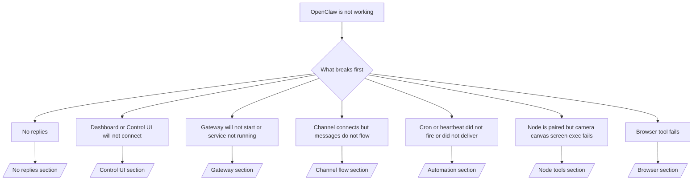

---
read_when:
    - OpenClaw ใช้งานไม่ได้ และคุณต้องการเส้นทางที่เร็วที่สุดในการแก้ไข
    - คุณต้องการโฟลว์คัดกรองปัญหาก่อนลงลึกไปยัง runbooks รายละเอียด
summary: ศูนย์กลางการแก้ไขปัญหา OpenClaw แบบเริ่มจากอาการก่อน
title: การแก้ไขปัญหาทั่วไป
x-i18n:
    generated_at: "2026-04-24T09:15:26Z"
    model: gpt-5.4
    provider: openai
    source_hash: c832c3f7609c56a5461515ed0f693d2255310bf2d3958f69f57c482bcbef97f0
    source_path: help/troubleshooting.md
    workflow: 15
---

หากคุณมีเวลาเพียง 2 นาที ให้ใช้หน้านี้เป็นจุดเริ่มต้นสำหรับคัดกรองปัญหา

## 60 วินาทีแรก

รันลำดับนี้ตามนี้เป๊ะ ๆ:

```bash
openclaw status
openclaw status --all
openclaw gateway probe
openclaw gateway status
openclaw doctor
openclaw channels status --probe
openclaw logs --follow
```

เอาต์พุตที่ดีแบบสรุปบรรทัดเดียว:

- `openclaw status` → แสดงแชนแนลที่กำหนดค่าไว้และไม่มีข้อผิดพลาด auth ที่ชัดเจน
- `openclaw status --all` → มีรายงานแบบเต็มและพร้อมแชร์ได้
- `openclaw gateway probe` → เข้าถึงเป้าหมาย gateway ที่คาดไว้ได้ (`Reachable: yes`) ค่า `Capability: ...` บอกว่าการ probe พิสูจน์ระดับ auth ได้แค่ไหน และ `Read probe: limited - missing scope: operator.read` เป็นการวินิจฉัยที่ลดระดับลง ไม่ใช่ความล้มเหลวในการเชื่อมต่อ
- `openclaw gateway status` → `Runtime: running`, `Connectivity probe: ok` และบรรทัด `Capability: ...` ที่สมเหตุสมผล ใช้ `--require-rpc` หากคุณต้องการหลักฐาน RPC ระดับ read-scope ด้วย
- `openclaw doctor` → ไม่มีข้อผิดพลาดที่บล็อกได้จาก config/service
- `openclaw channels status --probe` → เมื่อเข้าถึง gateway ได้ จะส่งคืนสถานะ transport แบบสดแยกตามบัญชี พร้อมผลการ probe/audit เช่น `works` หรือ `audit ok`; หากเข้าถึง gateway ไม่ได้ คำสั่งจะ fallback ไปใช้สรุปจาก config เท่านั้น
- `openclaw logs --follow` → มีกิจกรรมต่อเนื่อง ไม่มี fatal errors ที่วนซ้ำ

## Anthropic long context 429

หากคุณเห็น:
`HTTP 429: rate_limit_error: Extra usage is required for long context requests`
ไปที่ [/gateway/troubleshooting#anthropic-429-extra-usage-required-for-long-context](/th/gateway/troubleshooting#anthropic-429-extra-usage-required-for-long-context)

## backend แบบ OpenAI-compatible ในเครื่องทำงานตรง ๆ ได้ แต่ล้มเหลวใน OpenClaw

หาก backend `/v1` ภายในเครื่องหรือ self-hosted ของคุณตอบสนองต่อการ probe ตรงไปยัง
`/v1/chat/completions` ขนาดเล็กได้ แต่ล้มเหลวกับ `openclaw infer model run` หรือเทิร์น
ปกติของเอเจนต์:

1. หากข้อผิดพลาดกล่าวถึง `messages[].content` ว่าคาดว่าจะเป็นสตริง ให้ตั้งค่า
   `models.providers.<provider>.models[].compat.requiresStringContent: true`
2. หาก backend ยังล้มเหลวเฉพาะในเทิร์นเอเจนต์ของ OpenClaw ให้ตั้งค่า
   `models.providers.<provider>.models[].compat.supportsTools: false` แล้วลองใหม่
3. หากการเรียกตรงขนาดเล็กยังใช้ได้ แต่ prompts ขนาดใหญ่ขึ้นของ OpenClaw ทำให้ backend ล่ม
   ให้ถือว่าปัญหาที่เหลือเป็นข้อจำกัดของ model/server ฝั่ง upstream และ
   ดำเนินต่อใน deep runbook:
   [/gateway/troubleshooting#local-openai-compatible-backend-passes-direct-probes-but-agent-runs-fail](/th/gateway/troubleshooting#local-openai-compatible-backend-passes-direct-probes-but-agent-runs-fail)

## การติดตั้ง Plugin ล้มเหลวพร้อมข้อความ missing openclaw extensions

หากการติดตั้งล้มเหลวด้วย `package.json missing openclaw.extensions`, แปลว่าแพ็กเกจ Plugin
กำลังใช้รูปแบบเก่าที่ OpenClaw ไม่ยอมรับแล้ว

ให้แก้ในแพ็กเกจ Plugin:

1. เพิ่ม `openclaw.extensions` ลงใน `package.json`
2. ชี้ entries ไปยังไฟล์ runtime ที่ build แล้ว (โดยทั่วไปคือ `./dist/index.js`)
3. เผยแพร่ Plugin ใหม่ แล้วรัน `openclaw plugins install <package>` อีกครั้ง

ตัวอย่าง:

```json
{
  "name": "@openclaw/my-plugin",
  "version": "1.2.3",
  "openclaw": {
    "extensions": ["./dist/index.js"]
  }
}
```

อ้างอิง: [Plugin architecture](/th/plugins/architecture)

## ต้นไม้การตัดสินใจ



<AccordionGroup>
  <Accordion title="ไม่มีคำตอบกลับ">
    ```bash
    openclaw status
    openclaw gateway status
    openclaw channels status --probe
    openclaw pairing list --channel <channel> [--account <id>]
    openclaw logs --follow
    ```

    เอาต์พุตที่ดีมีลักษณะดังนี้:

    - `Runtime: running`
    - `Connectivity probe: ok`
    - `Capability: read-only`, `write-capable` หรือ `admin-capable`
    - แชนแนลของคุณแสดงว่า transport เชื่อมต่ออยู่ และในกรณีที่รองรับ จะมี `works` หรือ `audit ok` ใน `channels status --probe`
    - ผู้ส่งแสดงว่าได้รับการอนุมัติแล้ว (หรือ DM policy เป็น open/allowlist)

    signatures ใน logs ที่พบบ่อย:

    - `drop guild message (mention required` → การควบคุมด้วย mention บล็อกข้อความใน Discord
    - `pairing request` → ผู้ส่งยังไม่ได้รับการอนุมัติและกำลังรอการอนุมัติ DM pairing
    - `blocked` / `allowlist` ใน channel logs → ผู้ส่ง ห้อง หรือกลุ่มถูกกรองออก

    หน้ารายละเอียด:

    - [/gateway/troubleshooting#no-replies](/th/gateway/troubleshooting#no-replies)
    - [/channels/troubleshooting](/th/channels/troubleshooting)
    - [/channels/pairing](/th/channels/pairing)

  </Accordion>

  <Accordion title="Dashboard หรือ Control UI เชื่อมต่อไม่ได้">
    ```bash
    openclaw status
    openclaw gateway status
    openclaw logs --follow
    openclaw doctor
    openclaw channels status --probe
    ```

    เอาต์พุตที่ดีมีลักษณะดังนี้:

    - `Dashboard: http://...` แสดงอยู่ใน `openclaw gateway status`
    - `Connectivity probe: ok`
    - `Capability: read-only`, `write-capable` หรือ `admin-capable`
    - ไม่มี auth loop ใน logs

    signatures ใน logs ที่พบบ่อย:

    - `device identity required` → HTTP/non-secure context ไม่สามารถทำ device auth ให้เสร็จได้
    - `origin not allowed` → browser `Origin` ไม่ได้รับอนุญาตสำหรับ
      เป้าหมาย gateway ของ Control UI
    - `AUTH_TOKEN_MISMATCH` พร้อม retry hints (`canRetryWithDeviceToken=true`) → อาจมีการลองใหม่ด้วย trusted device-token หนึ่งครั้งโดยอัตโนมัติ
    - การลองใหม่ด้วย cached-token นั้นจะใช้ชุด scope ที่แคชไว้และเก็บคู่กับ paired
      device token ซ้ำ ผู้เรียกแบบ explicit `deviceToken` / explicit `scopes`
      จะยังคงใช้ชุด scope ที่ร้องขอไว้เองแทน
    - บนเส้นทาง Control UI แบบ async Tailscale Serve ความพยายามที่ล้มเหลวสำหรับ
      `{scope, ip}` เดียวกันจะถูก serialize ก่อนที่ limiter จะบันทึกความล้มเหลว ดังนั้นการลองใหม่ผิดพร้อมกันครั้งที่สองอาจแสดง `retry later` ได้แล้ว
    - `too many failed authentication attempts (retry later)` จาก localhost
      browser origin → ความล้มเหลวซ้ำจาก `Origin` เดียวกันนั้นจะถูก
      ล็อกชั่วคราว; localhost origin อื่นใช้ bucket แยกต่างหาก
    - `unauthorized` ซ้ำ ๆ หลังจาก retry ดังกล่าว → token/password ผิด, auth mode ไม่ตรงกัน หรือ paired device token ค้างเก่า
    - `gateway connect failed:` → UI กำลังกำหนดเป้าหมาย URL/port ผิด หรือ gateway เข้าถึงไม่ได้

    หน้ารายละเอียด:

    - [/gateway/troubleshooting#dashboard-control-ui-connectivity](/th/gateway/troubleshooting#dashboard-control-ui-connectivity)
    - [/web/control-ui](/th/web/control-ui)
    - [/gateway/authentication](/th/gateway/authentication)

  </Accordion>

  <Accordion title="Gateway ไม่เริ่มทำงาน หรือบริการติดตั้งแล้วแต่ไม่รัน">
    ```bash
    openclaw status
    openclaw gateway status
    openclaw logs --follow
    openclaw doctor
    openclaw channels status --probe
    ```

    เอาต์พุตที่ดีมีลักษณะดังนี้:

    - `Service: ... (loaded)`
    - `Runtime: running`
    - `Connectivity probe: ok`
    - `Capability: read-only`, `write-capable` หรือ `admin-capable`

    signatures ใน logs ที่พบบ่อย:

    - `Gateway start blocked: set gateway.mode=local` หรือ `existing config is missing gateway.mode` → gateway mode เป็น remote หรือไฟล์ config ไม่มี local-mode stamp และควรซ่อมแซม
    - `refusing to bind gateway ... without auth` → bind แบบ non-loopback โดยไม่มีเส้นทาง auth ของ gateway ที่ถูกต้อง (token/password หรือ trusted-proxy เมื่อกำหนดค่าไว้)
    - `another gateway instance is already listening` หรือ `EADDRINUSE` → พอร์ตถูกใช้งานอยู่แล้ว

    หน้ารายละเอียด:

    - [/gateway/troubleshooting#gateway-service-not-running](/th/gateway/troubleshooting#gateway-service-not-running)
    - [/gateway/background-process](/th/gateway/background-process)
    - [/gateway/configuration](/th/gateway/configuration)

  </Accordion>

  <Accordion title="แชนแนลเชื่อมต่อได้ แต่ข้อความไม่ไหล">
    ```bash
    openclaw status
    openclaw gateway status
    openclaw logs --follow
    openclaw doctor
    openclaw channels status --probe
    ```

    เอาต์พุตที่ดีมีลักษณะดังนี้:

    - transport ของแชนแนลเชื่อมต่ออยู่
    - การตรวจ pairing/allowlist ผ่าน
    - ตรวจพบ mentions ตามที่ต้องใช้

    signatures ใน logs ที่พบบ่อย:

    - `mention required` → การควบคุมด้วย mention บล็อกการประมวลผลในกลุ่ม
    - `pairing` / `pending` → ผู้ส่ง DM ยังไม่ได้รับการอนุมัติ
    - `not_in_channel`, `missing_scope`, `Forbidden`, `401/403` → ปัญหา permission token ของแชนแนล

    หน้ารายละเอียด:

    - [/gateway/troubleshooting#channel-connected-messages-not-flowing](/th/gateway/troubleshooting#channel-connected-messages-not-flowing)
    - [/channels/troubleshooting](/th/channels/troubleshooting)

  </Accordion>

  <Accordion title="Cron หรือ Heartbeat ไม่ทำงาน หรือทำงานแล้วไม่ส่งผลลัพธ์">
    ```bash
    openclaw status
    openclaw gateway status
    openclaw cron status
    openclaw cron list
    openclaw cron runs --id <jobId> --limit 20
    openclaw logs --follow
    ```

    เอาต์พุตที่ดีมีลักษณะดังนี้:

    - `cron.status` แสดงว่าเปิดใช้งานและมี next wake
    - `cron runs` แสดงรายการ `ok` ล่าสุด
    - เปิดใช้ Heartbeat อยู่และไม่ได้อยู่นอก active hours

    signatures ใน logs ที่พบบ่อย:

    - `cron: scheduler disabled; jobs will not run automatically` → ปิด cron อยู่
    - `heartbeat skipped` พร้อม `reason=quiet-hours` → อยู่นอก active hours ที่กำหนด
    - `heartbeat skipped` พร้อม `reason=empty-heartbeat-file` → มี `HEARTBEAT.md` อยู่แต่มีเพียงเนื้อหาว่างหรือ header-only scaffolding
    - `heartbeat skipped` พร้อม `reason=no-tasks-due` → โหมด task ของ `HEARTBEAT.md` ทำงานอยู่ แต่ยังไม่มีช่วงเวลาของงานใดถึงกำหนด
    - `heartbeat skipped` พร้อม `reason=alerts-disabled` → ปิดการมองเห็นของ heartbeat ทั้งหมด (`showOk`, `showAlerts` และ `useIndicator` ปิดหมด)
    - `requests-in-flight` → main lane ไม่ว่าง; heartbeat wake ถูกเลื่อน
    - `unknown accountId` → ไม่มี heartbeat delivery target account นั้นอยู่

    หน้ารายละเอียด:

    - [/gateway/troubleshooting#cron-and-heartbeat-delivery](/th/gateway/troubleshooting#cron-and-heartbeat-delivery)
    - [/automation/cron-jobs#troubleshooting](/th/automation/cron-jobs#troubleshooting)
    - [/gateway/heartbeat](/th/gateway/heartbeat)

  </Accordion>

  <Accordion title="Node ถูกจับคู่แล้ว แต่ tool ล้มเหลวที่ camera canvas screen exec">
    ```bash
    openclaw status
    openclaw gateway status
    openclaw nodes status
    openclaw nodes describe --node <idOrNameOrIp>
    openclaw logs --follow
    ```

    เอาต์พุตที่ดีมีลักษณะดังนี้:

    - Node แสดงว่าเชื่อมต่ออยู่และจับคู่แล้วสำหรับ role `node`
    - มี capability สำหรับคำสั่งที่คุณกำลังเรียกใช้
    - สถานะ permission ได้รับอนุญาตแล้วสำหรับ tool

    signatures ใน logs ที่พบบ่อย:

    - `NODE_BACKGROUND_UNAVAILABLE` → นำแอป node ขึ้น foreground
    - `*_PERMISSION_REQUIRED` → สิทธิ์ของ OS ถูกปฏิเสธหรือไม่มี
    - `SYSTEM_RUN_DENIED: approval required` → กำลังรอ exec approval
    - `SYSTEM_RUN_DENIED: allowlist miss` → คำสั่งไม่อยู่ใน exec allowlist

    หน้ารายละเอียด:

    - [/gateway/troubleshooting#node-paired-tool-fails](/th/gateway/troubleshooting#node-paired-tool-fails)
    - [/nodes/troubleshooting](/th/nodes/troubleshooting)
    - [/tools/exec-approvals](/th/tools/exec-approvals)

  </Accordion>

  <Accordion title="Exec อยู่ ๆ ก็ขอ approval">
    ```bash
    openclaw config get tools.exec.host
    openclaw config get tools.exec.security
    openclaw config get tools.exec.ask
    openclaw gateway restart
    ```

    สิ่งที่เปลี่ยนไป:

    - หากไม่ได้ตั้งค่า `tools.exec.host` ค่าเริ่มต้นคือ `auto`
    - `host=auto` จะ resolve เป็น `sandbox` เมื่อมี sandbox runtime ทำงานอยู่ และเป็น `gateway` ในกรณีอื่น
    - `host=auto` เป็นเพียงการกำหนดเส้นทาง; พฤติกรรม no-prompt แบบ "YOLO" มาจาก `security=full` ร่วมกับ `ask=off` บน gateway/node
    - บน `gateway` และ `node`, หากไม่ได้ตั้งค่า `tools.exec.security` ค่าเริ่มต้นคือ `full`
    - หากไม่ได้ตั้งค่า `tools.exec.ask` ค่าเริ่มต้นคือ `off`
    - ผลก็คือ หากคุณเห็นการขอ approvals แสดงว่ามีนโยบาย exec แบบ local หรือแบบต่อเซสชันบางอย่างถูกทำให้เข้มงวดกว่าค่าเริ่มต้นปัจจุบัน

    กู้คืนพฤติกรรม no-approval ตามค่าเริ่มต้นปัจจุบัน:

    ```bash
    openclaw config set tools.exec.host gateway
    openclaw config set tools.exec.security full
    openclaw config set tools.exec.ask off
    openclaw gateway restart
    ```

    ทางเลือกที่ปลอดภัยกว่า:

    - ตั้งค่าเพียง `tools.exec.host=gateway` หากคุณเพียงต้องการการกำหนดเส้นทาง host ที่คงที่
    - ใช้ `security=allowlist` ร่วมกับ `ask=on-miss` หากคุณต้องการ host exec แต่ยังต้องการการตรวจทานเมื่อพลาด allowlist
    - เปิดใช้ sandbox mode หากคุณต้องการให้ `host=auto` resolve กลับไปเป็น `sandbox`

    signatures ใน logs ที่พบบ่อย:

    - `Approval required.` → คำสั่งกำลังรอ `/approve ...`
    - `SYSTEM_RUN_DENIED: approval required` → node-host exec approval กำลังรออยู่
    - `exec host=sandbox requires a sandbox runtime for this session` → มีการเลือก sandbox แบบ implicit/explicit แต่ sandbox mode ปิดอยู่

    หน้ารายละเอียด:

    - [/tools/exec](/th/tools/exec)
    - [/tools/exec-approvals](/th/tools/exec-approvals)
    - [/gateway/security#what-the-audit-checks-high-level](/th/gateway/security#what-the-audit-checks-high-level)

  </Accordion>

  <Accordion title="Browser tool ล้มเหลว">
    ```bash
    openclaw status
    openclaw gateway status
    openclaw browser status
    openclaw logs --follow
    openclaw doctor
    ```

    เอาต์พุตที่ดีมีลักษณะดังนี้:

    - สถานะ browser แสดง `running: true` และมี browser/profile ที่ถูกเลือก
    - `openclaw` เริ่มได้ หรือ `user` มองเห็นแท็บ Chrome ภายในเครื่อง

    signatures ใน logs ที่พบบ่อย:

    - `unknown command "browser"` หรือ `unknown command 'browser'` → มีการตั้ง `plugins.allow` และไม่มี `browser` รวมอยู่ด้วย
    - `Failed to start Chrome CDP on port` → การเปิด browser ภายในเครื่องล้มเหลว
    - `browser.executablePath not found` → พาธไบนารีที่กำหนดค่าไว้ไม่ถูกต้อง
    - `browser.cdpUrl must be http(s) or ws(s)` → `CDP URL` ที่กำหนดค่าไว้ใช้สคีมที่ไม่รองรับ
    - `browser.cdpUrl has invalid port` → `CDP URL` ที่กำหนดค่าไว้มีพอร์ตไม่ถูกต้องหรืออยู่นอกช่วง
    - `No Chrome tabs found for profile="user"` → โปรไฟล์ Chrome MCP แบบ attach ไม่มีแท็บ Chrome ภายในเครื่องที่เปิดอยู่
    - `Remote CDP for profile "<name>" is not reachable` → ปลายทาง remote CDP ที่กำหนดค่าไว้เข้าถึงไม่ได้จากโฮสต์นี้
    - `Browser attachOnly is enabled ... not reachable` หรือ `Browser attachOnly is enabled and CDP websocket ... is not reachable` → โปรไฟล์แบบ attach-only ไม่มี CDP target ที่ทำงานอยู่
    - viewport / dark-mode / locale / offline overrides ที่ค้างอยู่บนโปรไฟล์แบบ attach-only หรือ remote CDP → รัน `openclaw browser stop --browser-profile <name>` เพื่อปิด active control session และปล่อยสถานะ emulation โดยไม่ต้องรีสตาร์ต gateway

    หน้ารายละเอียด:

    - [/gateway/troubleshooting#browser-tool-fails](/th/gateway/troubleshooting#browser-tool-fails)
    - [/tools/browser#missing-browser-command-or-tool](/th/tools/browser#missing-browser-command-or-tool)
    - [/tools/browser-linux-troubleshooting](/th/tools/browser-linux-troubleshooting)
    - [/tools/browser-wsl2-windows-remote-cdp-troubleshooting](/th/tools/browser-wsl2-windows-remote-cdp-troubleshooting)

  </Accordion>

</AccordionGroup>

## ที่เกี่ยวข้อง

- [FAQ](/th/help/faq) — คำถามที่พบบ่อย
- [Gateway Troubleshooting](/th/gateway/troubleshooting) — ปัญหาเฉพาะของ gateway
- [Doctor](/th/gateway/doctor) — การตรวจสุขภาพและการซ่อมแซมอัตโนมัติ
- [Channel Troubleshooting](/th/channels/troubleshooting) — ปัญหาการเชื่อมต่อของแชนแนล
- [Automation Troubleshooting](/th/automation/cron-jobs#troubleshooting) — ปัญหา cron และ heartbeat
