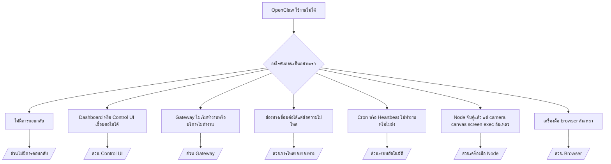

---
read_when:
    - OpenClaw ใช้งานไม่ได้ และคุณต้องการเส้นทางที่เร็วที่สุดไปสู่การแก้ไข
    - คุณต้องการขั้นตอนคัดกรองปัญหาก่อนลงลึกไปยังคู่มือการปฏิบัติงาน დეტailing
summary: ศูนย์กลางการแก้ไขปัญหาแบบเริ่มจากอาการสำหรับ OpenClaw
title: การแก้ไขปัญหาทั่วไป
x-i18n:
    generated_at: "2026-04-23T05:38:05Z"
    model: gpt-5.4
    provider: openai
    source_hash: cc5d8c9f804084985c672c5a003ce866e8142ab99fe81abb7a0d38e22aea4b88
    source_path: help/troubleshooting.md
    workflow: 15
---

# การแก้ไขปัญหา

หากคุณมีเวลาเพียง 2 นาที ให้ใช้หน้านี้เป็นทางเข้าหลักสำหรับการคัดกรองปัญหา

## 60 วินาทีแรก

รันลำดับคำสั่งนี้ตามลำดับแบบตรงตัว:

```bash
openclaw status
openclaw status --all
openclaw gateway probe
openclaw gateway status
openclaw doctor
openclaw channels status --probe
openclaw logs --follow
```

เอาต์พุตที่ดีในหนึ่งบรรทัด:

- `openclaw status` → แสดงช่องทางที่กำหนดค่าไว้และไม่มีข้อผิดพลาดด้าน auth ที่ชัดเจน
- `openclaw status --all` → มีรายงานฉบับเต็มและสามารถนำไปแชร์ได้
- `openclaw gateway probe` → เข้าถึง gateway เป้าหมายที่คาดไว้ได้ (`Reachable: yes`) `Capability: ...` จะบอกว่าการ probe พิสูจน์ระดับ auth ได้ถึงระดับใด และ `Read probe: limited - missing scope: operator.read` หมายถึงการวินิจฉัยแบบลดระดับ ไม่ใช่ความล้มเหลวในการเชื่อมต่อ
- `openclaw gateway status` → `Runtime: running`, `Connectivity probe: ok` และบรรทัด `Capability: ...` ที่สมเหตุสมผล ใช้ `--require-rpc` หากคุณต้องการหลักฐาน RPC ระดับ read-scope ด้วย
- `openclaw doctor` → ไม่มีข้อผิดพลาดด้านคอนฟิก/บริการที่บล็อกอยู่
- `openclaw channels status --probe` → เมื่อเข้าถึง gateway ได้ จะคืนสถานะ transport แบบ live ต่อบัญชี พร้อมผล probe/audit เช่น `works` หรือ `audit ok`; หากเข้าถึง gateway ไม่ได้ คำสั่งจะ fallback ไปใช้สรุปจากคอนฟิกเท่านั้น
- `openclaw logs --follow` → มีกิจกรรมต่อเนื่อง ไม่มีข้อผิดพลาดร้ายแรงที่เกิดซ้ำ

## Anthropic long context 429

หากคุณเห็น:
`HTTP 429: rate_limit_error: Extra usage is required for long context requests`
ให้ไปที่ [/gateway/troubleshooting#anthropic-429-extra-usage-required-for-long-context](/th/gateway/troubleshooting#anthropic-429-extra-usage-required-for-long-context)

## backend ที่เข้ากันได้กับ OpenAI แบบ local ใช้งานตรงได้ แต่ล้มเหลวใน OpenClaw

หาก backend `/v1` แบบ local หรือ self-hosted ของคุณตอบกลับ direct
`/v1/chat/completions` probe ขนาดเล็กได้ แต่ล้มเหลวกับ `openclaw infer model run` หรือเทิร์นของ
เอเจนต์ตามปกติ:

1. หากข้อผิดพลาดระบุว่า `messages[].content` คาดว่าจะเป็นสตริง ให้ตั้ง
   `models.providers.<provider>.models[].compat.requiresStringContent: true`
2. หาก backend ยังล้มเหลวเฉพาะในเทิร์นของเอเจนต์ OpenClaw ให้ตั้ง
   `models.providers.<provider>.models[].compat.supportsTools: false` แล้วลองอีกครั้ง
3. หาก direct call ขนาดเล็กยังทำงานได้ แต่ prompt ที่ใหญ่กว่าของ OpenClaw ทำให้
   backend พัง ให้ถือว่าปัญหาที่เหลือเป็นข้อจำกัดของโมเดล/เซิร์ฟเวอร์ต้นทาง และ
   ไปต่อที่คู่มือแบบลึก:
   [/gateway/troubleshooting#local-openai-compatible-backend-passes-direct-probes-but-agent-runs-fail](/th/gateway/troubleshooting#local-openai-compatible-backend-passes-direct-probes-but-agent-runs-fail)

## การติดตั้ง Plugin ล้มเหลวด้วยข้อความ missing openclaw extensions

หากการติดตั้งล้มเหลวด้วย `package.json missing openclaw.extensions` แปลว่าแพ็กเกจ Plugin
กำลังใช้รูปแบบเก่าที่ OpenClaw ไม่ยอมรับอีกต่อไป

วิธีแก้ในแพ็กเกจ Plugin:

1. เพิ่ม `openclaw.extensions` ลงใน `package.json`
2. ชี้ entries ไปยังไฟล์ runtime ที่ build แล้ว (โดยทั่วไปคือ `./dist/index.js`)
3. เผยแพร่ Plugin ใหม่ และรัน `openclaw plugins install <package>` อีกครั้ง

ตัวอย่าง:

```json
{
  "name": "@openclaw/my-plugin",
  "version": "1.2.3",
  "openclaw": {
    "extensions": ["./dist/index.js"]
  }
}
```

ข้อมูลอ้างอิง: [สถาปัตยกรรม Plugin](/th/plugins/architecture)

## ต้นไม้การตัดสินใจ



<AccordionGroup>
  <Accordion title="ไม่มีการตอบกลับ">
    ```bash
    openclaw status
    openclaw gateway status
    openclaw channels status --probe
    openclaw pairing list --channel <channel> [--account <id>]
    openclaw logs --follow
    ```

    เอาต์พุตที่ดีควรเป็นดังนี้:

    - `Runtime: running`
    - `Connectivity probe: ok`
    - `Capability: read-only`, `write-capable` หรือ `admin-capable`
    - ช่องทางของคุณแสดงว่า transport เชื่อมต่อแล้ว และเมื่อรองรับ จะมี `works` หรือ `audit ok` ใน `channels status --probe`
    - ผู้ส่งได้รับการอนุมัติแล้ว (หรือ DM policy เป็น open/allowlist)

    ลายเซ็น log ที่พบบ่อย:

    - `drop guild message (mention required` → การจำกัดด้วยการ mention บล็อกข้อความใน Discord
    - `pairing request` → ผู้ส่งยังไม่ได้รับการอนุมัติและกำลังรอการอนุมัติ DM pairing
    - `blocked` / `allowlist` ใน channel logs → ผู้ส่ง ห้อง หรือกลุ่มถูกกรองออก

    หน้าแบบลึก:

    - [/gateway/troubleshooting#no-replies](/th/gateway/troubleshooting#no-replies)
    - [/channels/troubleshooting](/th/channels/troubleshooting)
    - [/channels/pairing](/th/channels/pairing)

  </Accordion>

  <Accordion title="Dashboard หรือ Control UI เชื่อมต่อไม่ได้">
    ```bash
    openclaw status
    openclaw gateway status
    openclaw logs --follow
    openclaw doctor
    openclaw channels status --probe
    ```

    เอาต์พุตที่ดีควรเป็นดังนี้:

    - มี `Dashboard: http://...` แสดงใน `openclaw gateway status`
    - `Connectivity probe: ok`
    - `Capability: read-only`, `write-capable` หรือ `admin-capable`
    - ไม่มี auth loop ใน logs

    ลายเซ็น log ที่พบบ่อย:

    - `device identity required` → HTTP/non-secure context ไม่สามารถทำ device auth ให้เสร็จได้
    - `origin not allowed` → `Origin` ของเบราว์เซอร์ไม่ได้รับอนุญาตสำหรับ
      gateway target ของ Control UI
    - `AUTH_TOKEN_MISMATCH` พร้อมคำใบ้ retry (`canRetryWithDeviceToken=true`) → อาจมีการ retry ด้วย trusted device-token ที่แคชไว้หนึ่งครั้งโดยอัตโนมัติ
    - cached-token retry นั้นจะนำชุด scope ที่แคชไว้ซึ่งเก็บพร้อม paired
      device token กลับมาใช้ซ้ำ ผู้เรียกที่ใช้ `deviceToken` แบบ explicit / `scopes` แบบ explicit จะยังคงใช้ชุด scope ที่ร้องขอไว้เอง
    - บนเส้นทาง async Tailscale Serve Control UI ความพยายามที่ล้มเหลวสำหรับ `{scope, ip}` เดียวกันจะถูก serialize ก่อนที่ limiter จะบันทึกความล้มเหลว ดังนั้น bad retry ครั้งที่สองที่เกิดพร้อมกันอาจแสดง `retry later` ได้แล้ว
    - `too many failed authentication attempts (retry later)` จาก localhost
      browser origin → ความล้มเหลวซ้ำๆ จาก `Origin` เดียวกันนั้นจะถูกล็อกชั่วคราว; localhost origin อื่นจะใช้ bucket แยกกัน
    - `unauthorized` ที่เกิดซ้ำหลัง retry ดังกล่าว → token/password ไม่ถูกต้อง, auth mode ไม่ตรงกัน หรือ paired device token เก่า
    - `gateway connect failed:` → UI กำลังชี้ไปยัง URL/พอร์ตที่ผิด หรือเข้าถึง gateway ไม่ได้

    หน้าแบบลึก:

    - [/gateway/troubleshooting#dashboard-control-ui-connectivity](/th/gateway/troubleshooting#dashboard-control-ui-connectivity)
    - [/web/control-ui](/web/control-ui)
    - [/gateway/authentication](/th/gateway/authentication)

  </Accordion>

  <Accordion title="Gateway ไม่เริ่มทำงานหรือมีการติดตั้งบริการแล้วแต่ไม่ทำงาน">
    ```bash
    openclaw status
    openclaw gateway status
    openclaw logs --follow
    openclaw doctor
    openclaw channels status --probe
    ```

    เอาต์พุตที่ดีควรเป็นดังนี้:

    - `Service: ... (loaded)`
    - `Runtime: running`
    - `Connectivity probe: ok`
    - `Capability: read-only`, `write-capable` หรือ `admin-capable`

    ลายเซ็น log ที่พบบ่อย:

    - `Gateway start blocked: set gateway.mode=local` หรือ `existing config is missing gateway.mode` → gateway mode เป็น remote หรือไฟล์คอนฟิกไม่มี local-mode stamp และควรถูกซ่อมแซม
    - `refusing to bind gateway ... without auth` → bind แบบ non-loopback โดยไม่มีเส้นทาง auth ของ gateway ที่ถูกต้อง (token/password หรือ trusted-proxy เมื่อกำหนดค่าไว้)
    - `another gateway instance is already listening` หรือ `EADDRINUSE` → พอร์ตถูกใช้งานอยู่แล้ว

    หน้าแบบลึก:

    - [/gateway/troubleshooting#gateway-service-not-running](/th/gateway/troubleshooting#gateway-service-not-running)
    - [/gateway/background-process](/th/gateway/background-process)
    - [/gateway/configuration](/th/gateway/configuration)

  </Accordion>

  <Accordion title="ช่องทางเชื่อมต่อได้แต่ข้อความไม่ไหล">
    ```bash
    openclaw status
    openclaw gateway status
    openclaw logs --follow
    openclaw doctor
    openclaw channels status --probe
    ```

    เอาต์พุตที่ดีควรเป็นดังนี้:

    - transport ของช่องทางเชื่อมต่อแล้ว
    - การตรวจสอบ pairing/allowlist ผ่าน
    - ตรวจพบ mentions ในจุดที่ต้องใช้

    ลายเซ็น log ที่พบบ่อย:

    - `mention required` → การจำกัดด้วยการ mention ในกลุ่มบล็อกการประมวลผล
    - `pairing` / `pending` → ผู้ส่ง DM ยังไม่ได้รับอนุมัติ
    - `not_in_channel`, `missing_scope`, `Forbidden`, `401/403` → ปัญหา permission token ของช่องทาง

    หน้าแบบลึก:

    - [/gateway/troubleshooting#channel-connected-messages-not-flowing](/th/gateway/troubleshooting#channel-connected-messages-not-flowing)
    - [/channels/troubleshooting](/th/channels/troubleshooting)

  </Accordion>

  <Accordion title="Cron หรือ Heartbeat ไม่ทำงานหรือไม่ส่ง">
    ```bash
    openclaw status
    openclaw gateway status
    openclaw cron status
    openclaw cron list
    openclaw cron runs --id <jobId> --limit 20
    openclaw logs --follow
    ```

    เอาต์พุตที่ดีควรเป็นดังนี้:

    - `cron.status` แสดงว่าเปิดใช้งานอยู่และมีเวลาปลุกครั้งถัดไป
    - `cron runs` แสดงรายการล่าสุดที่เป็น `ok`
    - Heartbeat เปิดใช้งานอยู่และไม่ได้อยู่นอกช่วงเวลาทำงาน

    ลายเซ็น log ที่พบบ่อย:

    - `cron: scheduler disabled; jobs will not run automatically` → ปิด cron อยู่
    - `heartbeat skipped` พร้อม `reason=quiet-hours` → อยู่นอกช่วงเวลาทำงานที่กำหนด
    - `heartbeat skipped` พร้อม `reason=empty-heartbeat-file` → มี `HEARTBEAT.md` อยู่แต่มีเพียงโครงว่าง/ส่วนหัวเท่านั้น
    - `heartbeat skipped` พร้อม `reason=no-tasks-due` → โหมดงานของ `HEARTBEAT.md` เปิดใช้งานอยู่ แต่ยังไม่มีช่วงเวลาของงานใดถึงกำหนด
    - `heartbeat skipped` พร้อม `reason=alerts-disabled` → ปิดการแสดงผล heartbeat ทั้งหมด (`showOk`, `showAlerts` และ `useIndicator` ปิดทั้งหมด)
    - `requests-in-flight` → main lane กำลังยุ่ง; การปลุก heartbeat ถูกเลื่อนออกไป
    - `unknown accountId` → ไม่มีบัญชีเป้าหมายการส่ง heartbeat นี้อยู่จริง

    หน้าแบบลึก:

    - [/gateway/troubleshooting#cron-and-heartbeat-delivery](/th/gateway/troubleshooting#cron-and-heartbeat-delivery)
    - [/automation/cron-jobs#troubleshooting](/th/automation/cron-jobs#troubleshooting)
    - [/gateway/heartbeat](/th/gateway/heartbeat)

    </Accordion>

    <Accordion title="Node จับคู่แล้วแต่เครื่องมือล้มเหลวที่ camera canvas screen exec">
      ```bash
      openclaw status
      openclaw gateway status
      openclaw nodes status
      openclaw nodes describe --node <idOrNameOrIp>
      openclaw logs --follow
      ```

      เอาต์พุตที่ดีควรเป็นดังนี้:

      - Node แสดงว่าเชื่อมต่อและจับคู่แล้วสำหรับ role `node`
      - มี capability สำหรับคำสั่งที่คุณกำลังเรียกใช้
      - สถานะ permission ได้รับอนุญาตสำหรับเครื่องมือนั้น

      ลายเซ็น log ที่พบบ่อย:

      - `NODE_BACKGROUND_UNAVAILABLE` → นำแอป node ขึ้นมาด้านหน้า
      - `*_PERMISSION_REQUIRED` → สิทธิ์ของระบบปฏิบัติการถูกปฏิเสธหรือขาดหาย
      - `SYSTEM_RUN_DENIED: approval required` → การอนุมัติ exec กำลังรออยู่
      - `SYSTEM_RUN_DENIED: allowlist miss` → คำสั่งไม่อยู่ใน exec allowlist

      หน้าแบบลึก:

      - [/gateway/troubleshooting#node-paired-tool-fails](/th/gateway/troubleshooting#node-paired-tool-fails)
      - [/nodes/troubleshooting](/th/nodes/troubleshooting)
      - [/tools/exec-approvals](/th/tools/exec-approvals)

    </Accordion>

    <Accordion title="Exec จู่ๆ ก็ขอการอนุมัติ">
      ```bash
      openclaw config get tools.exec.host
      openclaw config get tools.exec.security
      openclaw config get tools.exec.ask
      openclaw gateway restart
      ```

      สิ่งที่เปลี่ยนไป:

      - หากไม่ได้ตั้ง `tools.exec.host` ค่าเริ่มต้นคือ `auto`
      - `host=auto` จะ resolve เป็น `sandbox` เมื่อมี sandbox runtime ที่ทำงานอยู่ และเป็น `gateway` ในกรณีอื่น
      - `host=auto` เป็นเพียงการกำหนดเส้นทางเท่านั้น; พฤติกรรม "YOLO" แบบไม่ถามจะมาจาก `security=full` ร่วมกับ `ask=off` บน gateway/node
      - บน `gateway` และ `node` หากไม่ได้ตั้ง `tools.exec.security` ค่าเริ่มต้นจะเป็น `full`
      - หากไม่ได้ตั้ง `tools.exec.ask` ค่าเริ่มต้นจะเป็น `off`
      - ผลลัพธ์: หากตอนนี้คุณเห็นการขออนุมัติ แปลว่ามีนโยบายบางอย่างในเครื่องโฮสต์หรือระดับต่อเซสชันทำให้ exec เข้มงวดกว่าค่าเริ่มต้นปัจจุบัน

      กู้คืนพฤติกรรมไม่ต้องขออนุมัติตามค่าเริ่มต้นปัจจุบัน:

      ```bash
      openclaw config set tools.exec.host gateway
      openclaw config set tools.exec.security full
      openclaw config set tools.exec.ask off
      openclaw gateway restart
      ```

      ทางเลือกที่ปลอดภัยกว่า:

      - ตั้งเฉพาะ `tools.exec.host=gateway` หากคุณแค่ต้องการการกำหนดเส้นทางไปยังโฮสต์แบบคงที่
      - ใช้ `security=allowlist` ร่วมกับ `ask=on-miss` หากคุณต้องการ exec บนโฮสต์ แต่ยังต้องการการตรวจสอบเมื่อไม่ตรง allowlist
      - เปิดใช้งาน sandbox mode หากคุณต้องการให้ `host=auto` resolve กลับไปเป็น `sandbox`

      ลายเซ็น log ที่พบบ่อย:

      - `Approval required.` → คำสั่งกำลังรอ `/approve ...`
      - `SYSTEM_RUN_DENIED: approval required` → การอนุมัติ exec บน node-host กำลังรออยู่
      - `exec host=sandbox requires a sandbox runtime for this session` → มีการเลือก sandbox แบบ implicit/explicit แต่ sandbox mode ปิดอยู่

      หน้าแบบลึก:

      - [/tools/exec](/th/tools/exec)
      - [/tools/exec-approvals](/th/tools/exec-approvals)
      - [/gateway/security#what-the-audit-checks-high-level](/th/gateway/security#what-the-audit-checks-high-level)

    </Accordion>

    <Accordion title="เครื่องมือ browser ล้มเหลว">
      ```bash
      openclaw status
      openclaw gateway status
      openclaw browser status
      openclaw logs --follow
      openclaw doctor
      ```

      เอาต์พุตที่ดีควรเป็นดังนี้:

      - สถานะ browser แสดง `running: true` และ browser/profile ที่เลือก
      - `openclaw` เริ่มได้ หรือ `user` มองเห็นแท็บ Chrome ในเครื่อง

      ลายเซ็น log ที่พบบ่อย:

      - `unknown command "browser"` หรือ `unknown command 'browser'` → มีการตั้ง `plugins.allow` และไม่ได้รวม `browser`
      - `Failed to start Chrome CDP on port` → การเปิด browser แบบ local ล้มเหลว
      - `browser.executablePath not found` → พาธไบนารีที่กำหนดไว้ไม่ถูกต้อง
      - `browser.cdpUrl must be http(s) or ws(s)` → CDP URL ที่กำหนดใช้ scheme ที่ไม่รองรับ
      - `browser.cdpUrl has invalid port` → CDP URL ที่กำหนดมีพอร์ตไม่ถูกต้องหรืออยู่นอกช่วง
      - `No Chrome tabs found for profile="user"` → โปรไฟล์ attach ของ Chrome MCP ไม่มีแท็บ Chrome แบบ local ที่เปิดอยู่
      - `Remote CDP for profile "<name>" is not reachable` → endpoint ของ remote CDP ที่กำหนดไม่สามารถเข้าถึงได้จากโฮสต์นี้
      - `Browser attachOnly is enabled ... not reachable` หรือ `Browser attachOnly is enabled and CDP websocket ... is not reachable` → โปรไฟล์ attach-only ไม่มีเป้าหมาย CDP ที่ใช้งานอยู่
      - stale viewport / dark-mode / locale / offline overrides บนโปรไฟล์ attach-only หรือ remote CDP → รัน `openclaw browser stop --browser-profile <name>` เพื่อปิด active control session และปล่อยสถานะ emulation โดยไม่ต้องรีสตาร์ต gateway

      หน้าแบบลึก:

      - [/gateway/troubleshooting#browser-tool-fails](/th/gateway/troubleshooting#browser-tool-fails)
      - [/tools/browser#missing-browser-command-or-tool](/th/tools/browser#missing-browser-command-or-tool)
      - [/tools/browser-linux-troubleshooting](/th/tools/browser-linux-troubleshooting)
      - [/tools/browser-wsl2-windows-remote-cdp-troubleshooting](/th/tools/browser-wsl2-windows-remote-cdp-troubleshooting)

    </Accordion>

  </AccordionGroup>

## ที่เกี่ยวข้อง

- [FAQ](/th/help/faq) — คำถามที่พบบ่อย
- [Gateway Troubleshooting](/th/gateway/troubleshooting) — ปัญหาเฉพาะของ Gateway
- [Doctor](/th/gateway/doctor) — การตรวจสุขภาพและการซ่อมแซมอัตโนมัติ
- [Channel Troubleshooting](/th/channels/troubleshooting) — ปัญหาการเชื่อมต่อของช่องทาง
- [Automation Troubleshooting](/th/automation/cron-jobs#troubleshooting) — ปัญหา Cron และ Heartbeat
