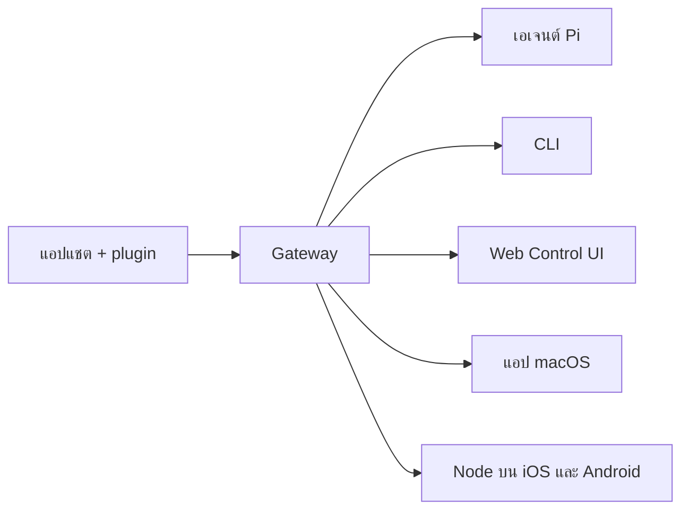

---
read_when:
    - การแนะนำ OpenClaw ให้กับผู้เริ่มต้นใช้งาน
summary: OpenClaw คือ Gateway แบบหลายช่องทางสำหรับเอเจนต์ AI ที่ทำงานได้บนทุกระบบปฏิบัติการ
title: OpenClaw
x-i18n:
    generated_at: "2026-04-23T05:38:01Z"
    model: gpt-5.4
    provider: openai
    source_hash: 923d34fa604051d502e4bc902802d6921a4b89a9447f76123aa8d2ff085f0b99
    source_path: index.md
    workflow: 15
---

# OpenClaw 🦞

<p align="center">
    
    
</p>

> _"EXFOLIATE! EXFOLIATE!"_ — กุ้งมังกรอวกาศสักตัวหนึ่ง คงจะใช่

<p align="center">
  <strong>Gateway สำหรับเอเจนต์ AI ที่ทำงานได้บนทุกระบบปฏิบัติการ ครอบคลุม Discord, Google Chat, iMessage, Matrix, Microsoft Teams, Signal, Slack, Telegram, WhatsApp, Zalo และอีกมากมาย</strong><br />
  ส่งข้อความ แล้วรับคำตอบจากเอเจนต์ได้จากในกระเป๋าของคุณ รัน Gateway เดียวครอบคลุมช่องทางที่มีมาในตัว, channel plugin แบบ bundled, WebChat และ mobile node
</p>

<Columns>
  <Card title="เริ่มต้นใช้งาน" href="/th/start/getting-started" icon="rocket">
    ติดตั้ง OpenClaw และเปิด Gateway ได้ภายในไม่กี่นาที
  </Card>
  <Card title="เรียกใช้ Onboarding" href="/th/start/wizard" icon="sparkles">
    การตั้งค่าแบบมีคำแนะนำด้วย `openclaw onboard` และโฟลว์การจับคู่
  </Card>
  <Card title="เปิด Control UI" href="/web/control-ui" icon="layout-dashboard">
    เปิดแดชบอร์ดในเบราว์เซอร์สำหรับแชต คอนฟิก และเซสชัน
  </Card>
</Columns>

## OpenClaw คืออะไร?

OpenClaw คือ **Gateway แบบ self-hosted** ที่เชื่อมแอปแชตและพื้นผิวของช่องทางที่คุณชื่นชอบ — ทั้งช่องทางที่มีมาในตัว รวมถึง channel plugin แบบ bundled หรือภายนอก เช่น Discord, Google Chat, iMessage, Matrix, Microsoft Teams, Signal, Slack, Telegram, WhatsApp, Zalo และอีกมากมาย — เข้ากับเอเจนต์เขียนโค้ด AI อย่าง Pi คุณรันโปรเซส Gateway เดียวบนเครื่องของคุณเอง (หรือบนเซิร์ฟเวอร์) แล้วมันจะกลายเป็นสะพานเชื่อมระหว่างแอปส่งข้อความของคุณกับผู้ช่วย AI ที่พร้อมใช้งานตลอดเวลา

**เหมาะกับใคร?** นักพัฒนาและผู้ใช้ระดับสูงที่ต้องการผู้ช่วย AI ส่วนตัวที่ส่งข้อความหาได้จากทุกที่ — โดยไม่ต้องเสียการควบคุมข้อมูลของตนหรือพึ่งพาบริการแบบโฮสต์

**อะไรที่ทำให้มันแตกต่าง?**

- **Self-hosted**: รันบนฮาร์ดแวร์ของคุณ ภายใต้กฎของคุณ
- **หลายช่องทาง**: Gateway เดียวให้บริการทั้งช่องทางที่มีมาในตัว รวมถึง channel plugin แบบ bundled หรือภายนอกได้พร้อมกัน
- **ออกแบบมาเพื่อเอเจนต์โดยตรง**: สร้างมาเพื่อเอเจนต์เขียนโค้ดที่มีการใช้เครื่องมือ เซสชัน memory และการกำหนดเส้นทางหลายเอเจนต์
- **โอเพนซอร์ส**: ใช้สัญญาอนุญาต MIT และขับเคลื่อนโดยชุมชน

**ต้องมีอะไรบ้าง?** Node 24 (แนะนำ) หรือ Node 22 LTS (`22.14+`) เพื่อความเข้ากันได้, API key จากผู้ให้บริการที่คุณเลือก และเวลา 5 นาที เพื่อคุณภาพและความปลอดภัยที่ดีที่สุด ให้ใช้โมเดลรุ่นใหม่ล่าสุดที่แข็งแกร่งที่สุดเท่าที่มี

## วิธีการทำงาน



Gateway คือแหล่งข้อมูลจริงเพียงหนึ่งเดียวสำหรับเซสชัน การกำหนดเส้นทาง และการเชื่อมต่อช่องทาง

## ความสามารถหลัก

<Columns>
  <Card title="Gateway แบบหลายช่องทาง" icon="network" href="/th/channels">
    Discord, iMessage, Signal, Slack, Telegram, WhatsApp, WebChat และอีกมากมาย ผ่านโปรเซส Gateway เดียว
  </Card>
  <Card title="ช่องทางแบบ Plugin" icon="plug" href="/th/tools/plugin">
    bundled plugin เพิ่ม Matrix, Nostr, Twitch, Zalo และอีกมากมายในรีลีสปัจจุบันตามปกติ
  </Card>
  <Card title="การกำหนดเส้นทางหลายเอเจนต์" icon="route" href="/th/concepts/multi-agent">
    เซสชันที่แยกจากกันตามเอเจนต์ workspace หรือผู้ส่ง
  </Card>
  <Card title="รองรับสื่อ" icon="image" href="/th/nodes/images">
    ส่งและรับรูปภาพ เสียง และเอกสาร
  </Card>
  <Card title="Web Control UI" icon="monitor" href="/web/control-ui">
    แดชบอร์ดบนเบราว์เซอร์สำหรับแชต คอนฟิก เซสชัน และ Node
  </Card>
  <Card title="Mobile nodes" icon="smartphone" href="/th/nodes">
    จับคู่ Node บน iOS และ Android สำหรับเวิร์กโฟลว์ที่ใช้ Canvas กล้อง และเสียง
  </Card>
</Columns>

## เริ่มต้นอย่างรวดเร็ว

<Steps>
  <Step title="ติดตั้ง OpenClaw">
    ```bash
    npm install -g openclaw@latest
    ```
  </Step>
  <Step title="ทำ Onboard และติดตั้ง service">
    ```bash
    openclaw onboard --install-daemon
    ```
  </Step>
  <Step title="แชต">
    เปิด Control UI ในเบราว์เซอร์ของคุณแล้วส่งข้อความ:

    ```bash
    openclaw dashboard
    ```

    หรือเชื่อมต่อช่องทางหนึ่ง ([Telegram](/th/channels/telegram) เร็วที่สุด) แล้วแชตจากโทรศัพท์ของคุณ

  </Step>
</Steps>

ต้องการการติดตั้งแบบเต็มและการตั้งค่าสำหรับนักพัฒนาใช่ไหม? ดู [Getting Started](/th/start/getting-started)

## แดชบอร์ด

เปิด Control UI บนเบราว์เซอร์หลังจาก Gateway เริ่มทำงาน

- ค่าเริ่มต้นภายในเครื่อง: [http://127.0.0.1:18789/](http://127.0.0.1:18789/)
- การเข้าถึงระยะไกล: [Web surfaces](/web) และ [Tailscale](/th/gateway/tailscale)

<p align="center">
  
</p>

## การตั้งค่า (ไม่บังคับ)

คอนฟิกอยู่ที่ `~/.openclaw/openclaw.json`

- หากคุณ **ไม่ทำอะไรเลย** OpenClaw จะใช้ไบนารี Pi ที่ bundled มาในโหมด RPC พร้อมเซสชันแยกตามผู้ส่ง
- หากคุณต้องการล็อกให้แน่นขึ้น ให้เริ่มจาก `channels.whatsapp.allowFrom` และ (สำหรับกลุ่ม) กฎการกล่าวถึง

ตัวอย่าง:

```json5
{
  channels: {
    whatsapp: {
      allowFrom: ["+15555550123"],
      groups: { "*": { requireMention: true } },
    },
  },
  messages: { groupChat: { mentionPatterns: ["@openclaw"] } },
}
```

## เริ่มจากตรงนี้

<Columns>
  <Card title="ศูนย์รวมเอกสาร" href="/th/start/hubs" icon="book-open">
    เอกสารและคู่มือทั้งหมด จัดตามกรณีการใช้งาน
  </Card>
  <Card title="Configuration" href="/th/gateway/configuration" icon="settings">
    การตั้งค่า Gateway หลัก, token และคอนฟิกของผู้ให้บริการ
  </Card>
  <Card title="การเข้าถึงระยะไกล" href="/th/gateway/remote" icon="globe">
    รูปแบบการเข้าถึงผ่าน SSH และ tailnet
  </Card>
  <Card title="Channels" href="/th/channels/telegram" icon="message-square">
    การตั้งค่าเฉพาะช่องทางสำหรับ Feishu, Microsoft Teams, WhatsApp, Telegram, Discord และอีกมากมาย
  </Card>
  <Card title="Nodes" href="/th/nodes" icon="smartphone">
    Node บน iOS และ Android พร้อมการจับคู่, Canvas, กล้อง และการกระทำของอุปกรณ์
  </Card>
  <Card title="Help" href="/th/help" icon="life-buoy">
    จุดเริ่มต้นสำหรับการแก้ไขปัญหาและวิธีแก้ที่พบบ่อย
  </Card>
</Columns>

## เรียนรู้เพิ่มเติม

<Columns>
  <Card title="รายการฟีเจอร์ทั้งหมด" href="/th/concepts/features" icon="list">
    ความสามารถทั้งหมดด้านช่องทาง การกำหนดเส้นทาง และสื่อ
  </Card>
  <Card title="การกำหนดเส้นทางหลายเอเจนต์" href="/th/concepts/multi-agent" icon="route">
    การแยก workspace และเซสชันแยกตามเอเจนต์
  </Card>
  <Card title="Security" href="/th/gateway/security" icon="shield">
    token, allowlist และตัวควบคุมความปลอดภัย
  </Card>
  <Card title="การแก้ไขปัญหา" href="/th/gateway/troubleshooting" icon="wrench">
    การวินิจฉัย Gateway และข้อผิดพลาดที่พบบ่อย
  </Card>
  <Card title="เกี่ยวกับโครงการและเครดิต" href="/th/reference/credits" icon="info">
    จุดเริ่มต้นของโครงการ ผู้มีส่วนร่วม และสัญญาอนุญาต
  </Card>
</Columns>
