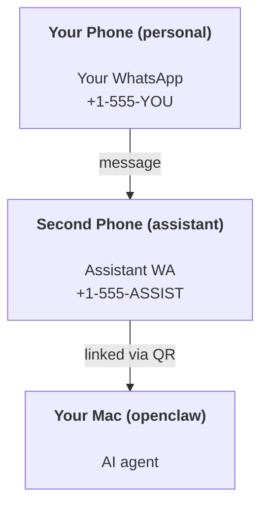

---
read_when:
    - การเริ่มต้นตั้งค่าอินสแตนซ์ผู้ช่วยใหม่
    - การตรวจสอบผลกระทบด้านความปลอดภัย/สิทธิ์การเข้าถึง
summary: คู่มือแบบครบวงจรสำหรับการใช้งาน OpenClaw เป็นผู้ช่วยส่วนตัว พร้อมข้อควรระวังด้านความปลอดภัย
title: การตั้งค่าผู้ช่วยส่วนตัว
x-i18n:
    generated_at: "2026-04-24T09:33:53Z"
    model: gpt-5.4
    provider: openai
    source_hash: 3048f2faae826fc33d962f1fac92da3c0ce464d2de803fee381c897eb6c76436
    source_path: start/openclaw.md
    workflow: 15
---

# การสร้างผู้ช่วยส่วนตัวด้วย OpenClaw

OpenClaw คือ Gateway แบบ self-hosted ที่เชื่อมต่อ Discord, Google Chat, iMessage, Matrix, Microsoft Teams, Signal, Slack, Telegram, WhatsApp, Zalo และอื่น ๆ เข้ากับเอเจนต์ AI คู่มือนี้ครอบคลุมการตั้งค่าแบบ "ผู้ช่วยส่วนตัว": หมายเลข WhatsApp เฉพาะที่ทำงานเป็นผู้ช่วย AI ที่พร้อมใช้งานตลอดเวลาของคุณ

## ⚠️ ให้ความสำคัญกับความปลอดภัยก่อน

คุณกำลังวางเอเจนต์ไว้ในตำแหน่งที่สามารถ:

- รันคำสั่งบนเครื่องของคุณได้ (ขึ้นอยู่กับนโยบายเครื่องมือของคุณ)
- อ่าน/เขียนไฟล์ในพื้นที่ทำงานของคุณ
- ส่งข้อความกลับออกไปผ่าน WhatsApp/Telegram/Discord/Mattermost และช่องทางแบบ bundled อื่น ๆ

เริ่มต้นแบบระมัดระวังไว้ก่อน:

- ตั้งค่า `channels.whatsapp.allowFrom` เสมอ (อย่ารันแบบเปิดให้ทั้งโลกเข้าถึงบน Mac ส่วนตัวของคุณ)
- ใช้หมายเลข WhatsApp แยกต่างหากสำหรับผู้ช่วย
- ตอนนี้ Heartbeat มีค่าเริ่มต้นเป็นทุก 30 นาที ปิดการใช้งานไว้ก่อนจนกว่าคุณจะมั่นใจในการตั้งค่า โดยตั้ง `agents.defaults.heartbeat.every: "0m"`

## ข้อกำหนดเบื้องต้น

- ติดตั้งและตั้งค่าเริ่มต้น OpenClaw แล้ว — ดู [เริ่มต้นใช้งาน](/th/start/getting-started) หากคุณยังไม่ได้ทำ
- หมายเลขโทรศัพท์อีกหนึ่งหมายเลข (SIM/eSIM/เติมเงิน) สำหรับผู้ช่วย

## การตั้งค่าแบบสองโทรศัพท์ (แนะนำ)

คุณควรมีลักษณะดังนี้:



ถ้าคุณเชื่อม WhatsApp ส่วนตัวของคุณเข้ากับ OpenClaw ทุกข้อความที่ส่งถึงคุณจะกลายเป็น “อินพุตของเอเจนต์” ซึ่งมักไม่ใช่สิ่งที่คุณต้องการ

## เริ่มต้นแบบรวดเร็วใน 5 นาที

1. จับคู่ WhatsApp Web (จะแสดง QR; สแกนด้วยโทรศัพท์ของผู้ช่วย):

```bash
openclaw channels login
```

2. เริ่มต้น Gateway (ปล่อยให้ทำงานต่อไป):

```bash
openclaw gateway --port 18789
```

3. ใส่การกำหนดค่าขั้นต่ำใน `~/.openclaw/openclaw.json`:

```json5
{
  gateway: { mode: "local" },
  channels: { whatsapp: { allowFrom: ["+15555550123"] } },
}
```

ตอนนี้ส่งข้อความไปยังหมายเลขผู้ช่วยจากโทรศัพท์ที่อยู่ใน allowlist ของคุณ

เมื่อการตั้งค่าเริ่มต้นเสร็จสิ้น OpenClaw จะเปิดแดชบอร์ดโดยอัตโนมัติและพิมพ์ลิงก์แบบสะอาด (ไม่มีโทเค็น) หากแดชบอร์ดขอการยืนยันตัวตน ให้วาง shared secret ที่กำหนดค่าไว้ลงในค่าตั้ง Control UI การตั้งค่าเริ่มต้นใช้โทเค็นโดยค่าเริ่มต้น (`gateway.auth.token`) แต่ก็ใช้การยืนยันตัวตนแบบรหัสผ่านได้เช่นกัน หากคุณเปลี่ยน `gateway.auth.mode` เป็น `password` หากต้องการเปิดอีกครั้งภายหลัง: `openclaw dashboard`

## ให้เอเจนต์มีพื้นที่ทำงาน (AGENTS)

OpenClaw อ่านคำสั่งการทำงานและ “หน่วยความจำ” จากไดเรกทอรีพื้นที่ทำงานของมัน

โดยค่าเริ่มต้น OpenClaw จะใช้ `~/.openclaw/workspace` เป็นพื้นที่ทำงานของเอเจนต์ และจะสร้างมันขึ้นมา (พร้อม `AGENTS.md`, `SOUL.md`, `TOOLS.md`, `IDENTITY.md`, `USER.md`, `HEARTBEAT.md` เริ่มต้น) โดยอัตโนมัติระหว่างการตั้งค่าหรือเมื่อรันเอเจนต์ครั้งแรก `BOOTSTRAP.md` จะถูกสร้างขึ้นเฉพาะเมื่อพื้นที่ทำงานใหม่จริง ๆ เท่านั้น (ไม่ควรถูกสร้างกลับมาอีกหลังจากคุณลบมัน) `MEMORY.md` เป็นไฟล์ทางเลือก (ไม่ได้สร้างให้อัตโนมัติ); หากมีอยู่ ระบบจะโหลดสำหรับเซสชันปกติ ส่วนเซสชัน Subagent จะ inject เฉพาะ `AGENTS.md` และ `TOOLS.md`

เคล็ดลับ: ให้มองโฟลเดอร์นี้เป็น “หน่วยความจำ” ของ OpenClaw และทำให้มันเป็นรีโป git (ควรเป็นแบบ private) เพื่อให้ `AGENTS.md` และไฟล์หน่วยความจำของคุณมีการสำรองข้อมูล หากติดตั้ง git อยู่ พื้นที่ทำงานที่สร้างใหม่จริงจะถูก initialize อัตโนมัติ

```bash
openclaw setup
```

ผังพื้นที่ทำงานทั้งหมด + คู่มือสำรองข้อมูล: [พื้นที่ทำงานของเอเจนต์](/th/concepts/agent-workspace)
เวิร์กโฟลว์หน่วยความจำ: [หน่วยความจำ](/th/concepts/memory)

ทางเลือก: เลือกพื้นที่ทำงานอื่นด้วย `agents.defaults.workspace` (รองรับ `~`)

```json5
{
  agent: {
    workspace: "~/.openclaw/workspace",
  },
}
```

หากคุณมีไฟล์พื้นที่ทำงานของตัวเองจากรีโปอยู่แล้ว คุณสามารถปิดการสร้างไฟล์เริ่มต้นทั้งหมดได้:

```json5
{
  agent: {
    skipBootstrap: true,
  },
}
```

## การกำหนดค่าที่ทำให้มันกลายเป็น "ผู้ช่วย"

OpenClaw มีค่าเริ่มต้นที่ดีสำหรับการเป็นผู้ช่วยอยู่แล้ว แต่โดยทั่วไปคุณมักต้องการปรับแต่ง:

- persona/คำสั่งใน [`SOUL.md`](/th/concepts/soul)
- ค่าปริยายของการคิด (ถ้าต้องการ)
- Heartbeat (เมื่อคุณมั่นใจในการใช้งานแล้ว)

ตัวอย่าง:

```json5
{
  logging: { level: "info" },
  agent: {
    model: "anthropic/claude-opus-4-6",
    workspace: "~/.openclaw/workspace",
    thinkingDefault: "high",
    timeoutSeconds: 1800,
    // Start with 0; enable later.
    heartbeat: { every: "0m" },
  },
  channels: {
    whatsapp: {
      allowFrom: ["+15555550123"],
      groups: {
        "*": { requireMention: true },
      },
    },
  },
  routing: {
    groupChat: {
      mentionPatterns: ["@openclaw", "openclaw"],
    },
  },
  session: {
    scope: "per-sender",
    resetTriggers: ["/new", "/reset"],
    reset: {
      mode: "daily",
      atHour: 4,
      idleMinutes: 10080,
    },
  },
}
```

## เซสชันและหน่วยความจำ

- ไฟล์เซสชัน: `~/.openclaw/agents/<agentId>/sessions/{{SessionId}}.jsonl`
- เมทาดาทาเซสชัน (การใช้โทเค็น, เส้นทางล่าสุด ฯลฯ): `~/.openclaw/agents/<agentId>/sessions/sessions.json` (แบบเดิม: `~/.openclaw/sessions/sessions.json`)
- `/new` หรือ `/reset` จะเริ่มเซสชันใหม่สำหรับแชตนั้น (กำหนดค่าได้ผ่าน `resetTriggers`) หากส่งเพียงอย่างเดียว เอเจนต์จะตอบกลับด้วยคำทักทายสั้น ๆ เพื่อยืนยันการรีเซ็ต
- `/compact [instructions]` จะทำ Compaction บริบทของเซสชันและรายงานงบบริบทที่เหลืออยู่

## Heartbeat (โหมดเชิงรุก)

โดยค่าเริ่มต้น OpenClaw จะรัน Heartbeat ทุก 30 นาทีด้วยพรอมป์ต์:
`Read HEARTBEAT.md if it exists (workspace context). Follow it strictly. Do not infer or repeat old tasks from prior chats. If nothing needs attention, reply HEARTBEAT_OK.`
ตั้งค่า `agents.defaults.heartbeat.every: "0m"` เพื่อปิดใช้งาน

- หาก `HEARTBEAT.md` มีอยู่แต่แทบว่างเปล่า (มีเพียงบรรทัดว่างและหัวข้อ markdown เช่น `# Heading`) OpenClaw จะข้ามการรัน Heartbeat เพื่อประหยัดการเรียก API
- หากไม่มีไฟล์นี้ Heartbeat ก็ยังจะทำงาน และโมเดลจะตัดสินใจเองว่าควรทำอะไร
- หากเอเจนต์ตอบกลับด้วย `HEARTBEAT_OK` (อาจมีข้อความสั้น ๆ ต่อท้ายได้; ดู `agents.defaults.heartbeat.ackMaxChars`) OpenClaw จะระงับการส่งออกสำหรับ Heartbeat ครั้งนั้น
- โดยค่าเริ่มต้น อนุญาตให้ส่ง Heartbeat ไปยังเป้าหมายแบบ DM สไตล์ `user:<id>` ได้ ตั้งค่า `agents.defaults.heartbeat.directPolicy: "block"` เพื่อระงับการส่งไปยังเป้าหมายโดยตรง ขณะที่ยังคงให้ Heartbeat ทำงานอยู่
- Heartbeat จะรันเป็น agent turn เต็มรูปแบบ — ช่วงเวลาที่สั้นลงจะใช้โทเค็นมากขึ้น

```json5
{
  agent: {
    heartbeat: { every: "30m" },
  },
}
```

## สื่อขาเข้าและขาออก

ไฟล์แนบขาเข้า (รูปภาพ/เสียง/เอกสาร) สามารถส่งต่อไปยังคำสั่งของคุณผ่านเทมเพลตได้:

- `{{MediaPath}}` (พาธไฟล์ชั่วคราวในเครื่อง)
- `{{MediaUrl}}` (pseudo-URL)
- `{{Transcript}}` (หากเปิดใช้การถอดเสียงจากไฟล์เสียง)

ไฟล์แนบขาออกจากเอเจนต์: ให้ใส่ `MEDIA:<path-or-url>` ไว้ในบรรทัดของตัวเอง (ไม่มีเว้นวรรค) ตัวอย่าง:

```
Here’s the screenshot.
MEDIA:https://example.com/screenshot.png
```

OpenClaw จะดึงรายการเหล่านี้ออกมาและส่งเป็นสื่อแนบไปพร้อมกับข้อความ

พฤติกรรมของพาธในเครื่องเป็นไปตามโมเดลความเชื่อถือในการอ่านไฟล์เดียวกับของเอเจนต์:

- หาก `tools.fs.workspaceOnly` เป็น `true`, พาธในเครื่องของ `MEDIA:` ขาออกจะยังถูกจำกัดให้อยู่ภายใน temp root ของ OpenClaw, media cache, พาธพื้นที่ทำงานของเอเจนต์, และไฟล์ที่สร้างจาก sandbox
- หาก `tools.fs.workspaceOnly` เป็น `false`, `MEDIA:` ขาออกสามารถใช้ไฟล์ในเครื่องโฮสต์ที่เอเจนต์ได้รับอนุญาตให้อ่านอยู่แล้ว
- การส่งไฟล์ในเครื่องโฮสต์ยังคงอนุญาตเฉพาะไฟล์สื่อและเอกสารที่ปลอดภัยเท่านั้น (รูปภาพ, เสียง, วิดีโอ, PDF และเอกสาร Office) ไฟล์ข้อความธรรมดาและไฟล์ที่ดูคล้ายความลับจะไม่ถือเป็นสื่อที่ส่งได้

นั่นหมายความว่ารูปภาพ/ไฟล์ที่สร้างขึ้นนอกพื้นที่ทำงานสามารถส่งออกได้แล้ว หากนโยบาย fs ของคุณอนุญาตการอ่านเหล่านั้นอยู่ก่อน โดยไม่เปิดช่องให้มีการดึงไฟล์ข้อความบนโฮสต์ออกไปแบบกว้างเกินจำเป็น

## เช็กลิสต์การปฏิบัติการ

```bash
openclaw status          # สถานะภายในเครื่อง (credentials, sessions, queued events)
openclaw status --all    # การวินิจฉัยเต็มรูปแบบ (อ่านอย่างเดียว, พร้อมวางต่อ)
openclaw status --deep   # ขอ health probe แบบสดจาก gateway พร้อม channel probes เมื่อรองรับ
openclaw health --json   # snapshot สถานะสุขภาพของ gateway (WS; ค่าเริ่มต้นอาจคืน snapshot ที่แคชใหม่ล่าสุด)
```

บันทึกอยู่ภายใต้ `/tmp/openclaw/` (ค่าเริ่มต้น: `openclaw-YYYY-MM-DD.log`)

## ขั้นตอนถัดไป

- WebChat: [WebChat](/th/web/webchat)
- การปฏิบัติการ Gateway: [คู่มือปฏิบัติการ Gateway](/th/gateway)
- Cron + การปลุก: [งาน Cron](/th/automation/cron-jobs)
- แอปคู่หูบนแถบเมนู macOS: [แอป OpenClaw สำหรับ macOS](/th/platforms/macos)
- แอป Node บน iOS: [แอป iOS](/th/platforms/ios)
- แอป Node บน Android: [แอป Android](/th/platforms/android)
- สถานะ Windows: [Windows (WSL2)](/th/platforms/windows)
- สถานะ Linux: [แอป Linux](/th/platforms/linux)
- ความปลอดภัย: [ความปลอดภัย](/th/gateway/security)

## ที่เกี่ยวข้อง

- [เริ่มต้นใช้งาน](/th/start/getting-started)
- [การตั้งค่า](/th/start/setup)
- [ภาพรวมช่องทาง](/th/channels)
