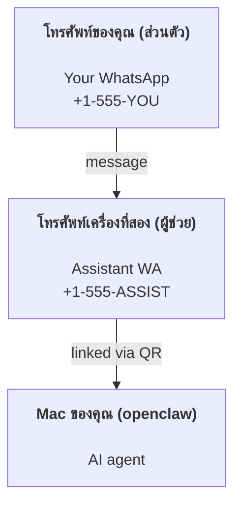

---
read_when:
    - การเริ่มต้นใช้งานอินสแตนซ์ผู้ช่วยใหม่ลดสปีด to=functions.read commentary 】【。】【”】【json  天天送彩票path":"docs/AGENTS.md","offset":1,"limit":200} code
    - การทบทวนผลกระทบด้านความปลอดภัย/สิทธิ์
summary: คู่มือแบบครบวงจรสำหรับการรัน OpenClaw เป็นผู้ช่วยส่วนตัวพร้อมข้อควรระวังด้านความปลอดภัย
title: การตั้งค่าผู้ช่วยส่วนตัว
x-i18n:
    generated_at: "2026-04-23T05:57:48Z"
    model: gpt-5.4
    provider: openai
    source_hash: 02f10a9f7ec08f71143cbae996d91cbdaa19897a40f725d8ef524def41cf2759
    source_path: start/openclaw.md
    workflow: 15
---

# สร้างผู้ช่วยส่วนตัวด้วย OpenClaw

OpenClaw คือ gateway แบบ self-hosted ที่เชื่อม Discord, Google Chat, iMessage, Matrix, Microsoft Teams, Signal, Slack, Telegram, WhatsApp, Zalo และอีกมากมาย เข้ากับเอเจนต์ AI คู่มือนี้ครอบคลุมการตั้งค่าแบบ "ผู้ช่วยส่วนตัว": หมายเลข WhatsApp เฉพาะที่ทำงานเป็นผู้ช่วย AI แบบพร้อมใช้งานตลอดเวลาของคุณ

## ⚠️ ความปลอดภัยมาก่อน

คุณกำลังวางเอเจนต์ไว้ในตำแหน่งที่สามารถ:

- รันคำสั่งบนเครื่องของคุณ (ขึ้นอยู่กับนโยบายเครื่องมือของคุณ)
- อ่าน/เขียนไฟล์ใน workspace ของคุณ
- ส่งข้อความกลับออกไปผ่าน WhatsApp/Telegram/Discord/Mattermost และช่องทางอื่นที่มากับระบบ

เริ่มอย่างระมัดระวัง:

- ตั้งค่า `channels.whatsapp.allowFrom` เสมอ (อย่ารันแบบเปิดให้ทั้งโลกเข้าถึงบน Mac ส่วนตัวของคุณ)
- ใช้หมายเลข WhatsApp แยกสำหรับผู้ช่วย
- ตอนนี้ Heartbeat มีค่าเริ่มต้นทุก 30 นาที ปิดไว้ก่อนจนกว่าคุณจะเชื่อถือการตั้งค่านี้ โดยตั้ง `agents.defaults.heartbeat.every: "0m"`

## ข้อกำหนดเบื้องต้น

- ติดตั้ง OpenClaw และทำ onboarding แล้ว — ดู [Getting Started](/th/start/getting-started) หากคุณยังไม่ได้ทำ
- หมายเลขโทรศัพท์ที่สอง (SIM/eSIM/เติมเงิน) สำหรับผู้ช่วย

## การตั้งค่าแบบสองโทรศัพท์ (แนะนำ)

สิ่งที่คุณต้องการคือแบบนี้:



หากคุณเชื่อม WhatsApp ส่วนตัวของคุณกับ OpenClaw ทุกข้อความที่ส่งถึงคุณจะกลายเป็น “อินพุตของเอเจนต์” ซึ่งโดยมากไม่ใช่สิ่งที่คุณต้องการ

## เริ่มต้นอย่างรวดเร็วภายใน 5 นาที

1. จับคู่ WhatsApp Web (จะแสดง QR; ให้สแกนด้วยโทรศัพท์ของผู้ช่วย):

```bash
openclaw channels login
```

2. เริ่ม Gateway (ปล่อยให้รันค้างไว้):

```bash
openclaw gateway --port 18789
```

3. ใส่ config ขั้นต่ำใน `~/.openclaw/openclaw.json`:

```json5
{
  gateway: { mode: "local" },
  channels: { whatsapp: { allowFrom: ["+15555550123"] } },
}
```

ตอนนี้ให้ส่งข้อความไปยังหมายเลขของผู้ช่วยจากโทรศัพท์ที่อยู่ใน allowlist ของคุณ

เมื่อ onboarding เสร็จ เราจะเปิดแดชบอร์ดอัตโนมัติและพิมพ์ลิงก์ที่สะอาด (ไม่มี token) หากมีการขอ auth ให้ใส่ shared secret ที่กำหนดค่าไว้ลงใน settings ของ Control UI onboarding ใช้ token โดยค่าเริ่มต้น (`gateway.auth.token`) แต่ password auth ก็ใช้ได้เช่นกัน หากคุณเปลี่ยน `gateway.auth.mode` เป็น `password` หากต้องการเปิดใหม่ภายหลัง: `openclaw dashboard`

## ให้เอเจนต์มี workspace (AGENTS)

OpenClaw อ่านคำสั่งการทำงานและ “หน่วยความจำ” จากไดเรกทอรี workspace ของมัน

โดยค่าเริ่มต้น OpenClaw ใช้ `~/.openclaw/workspace` เป็น workspace ของเอเจนต์ และจะสร้างมัน (พร้อม `AGENTS.md`, `SOUL.md`, `TOOLS.md`, `IDENTITY.md`, `USER.md`, `HEARTBEAT.md` เริ่มต้น) ให้อัตโนมัติระหว่างการตั้งค่า/การรันเอเจนต์ครั้งแรก `BOOTSTRAP.md` จะถูกสร้างเฉพาะเมื่อ workspace ใหม่จริง ๆ เท่านั้น (หลังจากคุณลบแล้ว มันไม่ควรกลับมาอีก) `MEMORY.md` เป็นแบบไม่บังคับ (ไม่ได้สร้างอัตโนมัติ); เมื่อมีอยู่ จะถูกโหลดสำหรับเซสชันปกติ เซสชันของ subagent จะฉีดเฉพาะ `AGENTS.md` และ `TOOLS.md`

เคล็ดลับ: ให้ปฏิบัติกับโฟลเดอร์นี้เหมือน “หน่วยความจำ” ของ OpenClaw และทำให้มันเป็น git repo (ควรเป็น private) เพื่อให้ `AGENTS.md` + ไฟล์หน่วยความจำของคุณถูกสำรองไว้ หากติดตั้ง git อยู่ workspace ใหม่เอี่ยมจะถูก initialize ให้อัตโนมัติ

```bash
openclaw setup
```

คู่มือโครงสร้าง workspace + การสำรองข้อมูลแบบเต็ม: [Agent workspace](/th/concepts/agent-workspace)
เวิร์กโฟลว์หน่วยความจำ: [Memory](/th/concepts/memory)

ตัวเลือกเพิ่มเติม: เลือก workspace อื่นด้วย `agents.defaults.workspace` (รองรับ `~`)

```json5
{
  agent: {
    workspace: "~/.openclaw/workspace",
  },
}
```

หากคุณส่งไฟล์ workspace ของตัวเองมาจาก repo อยู่แล้ว คุณสามารถปิดการสร้าง bootstrap file ได้ทั้งหมด:

```json5
{
  agent: {
    skipBootstrap: true,
  },
}
```

## config ที่ทำให้มันกลายเป็น "ผู้ช่วย"

ค่าเริ่มต้นของ OpenClaw เหมาะกับการเป็นผู้ช่วยอยู่แล้ว แต่โดยทั่วไปคุณมักต้องการปรับ:

- persona/คำสั่งใน [`SOUL.md`](/th/concepts/soul)
- ค่าเริ่มต้นของการคิด (หากต้องการ)
- Heartbeat (เมื่อคุณเชื่อถือมันแล้ว)

ตัวอย่าง:

```json5
{
  logging: { level: "info" },
  agent: {
    model: "anthropic/claude-opus-4-6",
    workspace: "~/.openclaw/workspace",
    thinkingDefault: "high",
    timeoutSeconds: 1800,
    // เริ่มต้นด้วย 0; ค่อยเปิดภายหลัง
    heartbeat: { every: "0m" },
  },
  channels: {
    whatsapp: {
      allowFrom: ["+15555550123"],
      groups: {
        "*": { requireMention: true },
      },
    },
  },
  routing: {
    groupChat: {
      mentionPatterns: ["@openclaw", "openclaw"],
    },
  },
  session: {
    scope: "per-sender",
    resetTriggers: ["/new", "/reset"],
    reset: {
      mode: "daily",
      atHour: 4,
      idleMinutes: 10080,
    },
  },
}
```

## เซสชันและหน่วยความจำ

- ไฟล์เซสชัน: `~/.openclaw/agents/<agentId>/sessions/{{SessionId}}.jsonl`
- metadata ของเซสชัน (การใช้ token, route ล่าสุด ฯลฯ): `~/.openclaw/agents/<agentId>/sessions/sessions.json` (แบบเดิม: `~/.openclaw/sessions/sessions.json`)
- `/new` หรือ `/reset` จะเริ่มเซสชันใหม่สำหรับแชตนั้น (กำหนดค่าได้ผ่าน `resetTriggers`) หากส่งเดี่ยว ๆ เอเจนต์จะตอบกลับด้วยคำทักทายสั้น ๆ เพื่อยืนยันการรีเซ็ต
- `/compact [instructions]` จะทำ Compaction บริบทของเซสชันและรายงานงบประมาณบริบทที่เหลืออยู่

## Heartbeat (โหมด proactive)

โดยค่าเริ่มต้น OpenClaw จะรัน Heartbeat ทุก 30 นาทีด้วยพรอมป์:
`Read HEARTBEAT.md if it exists (workspace context). Follow it strictly. Do not infer or repeat old tasks from prior chats. If nothing needs attention, reply HEARTBEAT_OK.`
ตั้ง `agents.defaults.heartbeat.every: "0m"` เพื่อปิดใช้งาน

- หากมี `HEARTBEAT.md` อยู่แต่มีเนื้อหาว่างในทางปฏิบัติ (มีเพียงบรรทัดว่างและหัว Markdown เช่น `# Heading`) OpenClaw จะข้ามการรัน Heartbeat เพื่อประหยัด API call
- หากไม่มีไฟล์นั้น Heartbeat ก็ยังคงรันและให้โมเดลตัดสินใจว่าจะทำอย่างไร
- หากเอเจนต์ตอบกลับด้วย `HEARTBEAT_OK` (อาจมีข้อความเติมสั้น ๆ ได้; ดู `agents.defaults.heartbeat.ackMaxChars`) OpenClaw จะระงับการส่งขาออกสำหรับ Heartbeat นั้น
- โดยค่าเริ่มต้น อนุญาตให้ส่ง Heartbeat ไปยังเป้าหมายแบบ direct-style `user:<id>` ได้ ตั้ง `agents.defaults.heartbeat.directPolicy: "block"` เพื่อระงับการส่งไปยังเป้าหมายโดยตรง ขณะที่ยังคงให้ Heartbeat รันอยู่
- Heartbeat รันเป็นเทิร์นของเอเจนต์เต็มรูปแบบ — ช่วงเวลาที่สั้นลงจะใช้ token มากขึ้น

```json5
{
  agent: {
    heartbeat: { every: "30m" },
  },
}
```

## สื่อขาเข้าและขาออก

ไฟล์แนบขาเข้า (ภาพ/เสียง/เอกสาร) สามารถส่งผ่านไปยังคำสั่งของคุณด้วย template:

- `{{MediaPath}}` (พาธไฟล์ temp ในเครื่อง)
- `{{MediaUrl}}` (pseudo-URL)
- `{{Transcript}}` (หากเปิดใช้การถอดเสียง)

ไฟล์แนบขาออกจากเอเจนต์: ใส่ `MEDIA:<path-or-url>` ในบรรทัดของตัวเอง (ไม่มีช่องว่าง) ตัวอย่าง:

```
Here’s the screenshot.
MEDIA:https://example.com/screenshot.png
```

OpenClaw จะดึงสิ่งเหล่านี้ออกและส่งเป็นสื่อพร้อมกับข้อความ

พฤติกรรมของพาธในเครื่องเป็นไปตามโมเดลความเชื่อถือแบบเดียวกับการอ่านไฟล์ของเอเจนต์:

- หาก `tools.fs.workspaceOnly` เป็น `true`, พาธภายในเครื่องของ `MEDIA:` ขาออกจะยังคงถูกจำกัดอยู่ที่ root ชั่วคราวของ OpenClaw, media cache, พาธ workspace ของเอเจนต์ และไฟล์ที่สร้างโดย sandbox
- หาก `tools.fs.workspaceOnly` เป็น `false`, `MEDIA:` ขาออกสามารถใช้ไฟล์ในเครื่องของโฮสต์ที่เอเจนต์ได้รับอนุญาตให้อ่านอยู่แล้วได้
- การส่งไฟล์ในเครื่องของโฮสต์ยังคงอนุญาตเฉพาะสื่อและเอกสารที่ปลอดภัย (ภาพ, เสียง, วิดีโอ, PDF และเอกสาร Office) ไฟล์ข้อความธรรมดาและไฟล์ที่ดูคล้าย secret จะไม่ถูกถือว่าเป็นสื่อที่ส่งได้

นั่นหมายความว่ารูปภาพ/ไฟล์ที่สร้างขึ้นนอก workspace สามารถส่งได้แล้ว หากนโยบาย fs ของคุณอนุญาตการอ่านเหล่านั้นอยู่แล้ว โดยไม่เปิดทางให้ดึงไฟล์ข้อความในโฮสต์ตามอำเภอใจออกเป็นไฟล์แนบอีกครั้ง

## รายการตรวจสอบการปฏิบัติการ

```bash
openclaw status          # สถานะในเครื่อง (creds, sessions, queued events)
openclaw status --all    # การวินิจฉัยแบบเต็ม (อ่านอย่างเดียว, วางต่อได้)
openclaw status --deep   # ขอ gateway ให้ทำ live health probe พร้อม channel probe เมื่อรองรับ
openclaw health --json   # snapshot สุขภาพของ gateway (WS; ค่าเริ่มต้นอาจคืน snapshot ที่แคชแบบใหม่)
```

ล็อกอยู่ใต้ `/tmp/openclaw/` (ค่าเริ่มต้น: `openclaw-YYYY-MM-DD.log`)

## ขั้นตอนถัดไป

- WebChat: [WebChat](/web/webchat)
- การปฏิบัติการ Gateway: [Gateway runbook](/th/gateway)
- Cron + การปลุกงาน: [Cron jobs](/th/automation/cron-jobs)
- แอปคู่หูบน macOS แบบเมนูบาร์: [OpenClaw macOS app](/th/platforms/macos)
- แอป node บน iOS: [iOS app](/th/platforms/ios)
- แอป node บน Android: [Android app](/th/platforms/android)
- สถานะของ Windows: [Windows (WSL2)](/th/platforms/windows)
- สถานะของ Linux: [Linux app](/th/platforms/linux)
- ความปลอดภัย: [Security](/th/gateway/security)
