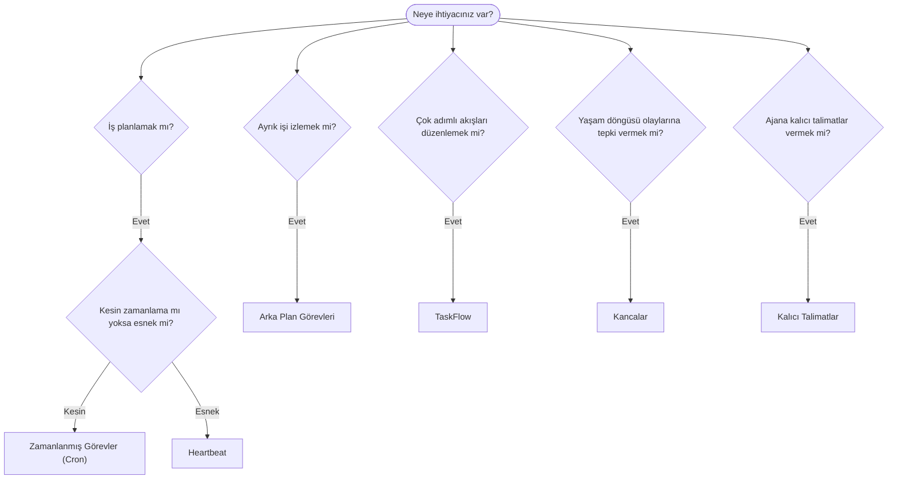

---
read_when:
    - OpenClaw ile işlerin nasıl otomatikleştirileceğine karar verme
    - Heartbeat, Cron, kancalar ve kalıcı talimatlar arasında seçim yapma
    - Doğru otomasyon başlangıç noktasını arama
summary: 'Otomasyon mekanizmalarına genel bakış: görevler, cron, kancalar, kalıcı talimatlar ve Görev Akışı'
title: Otomasyon ve görevler
x-i18n:
    generated_at: "2026-04-25T13:41:09Z"
    model: gpt-5.4
    provider: openai
    source_hash: 54524eb5d1fcb2b2e3e51117339be1949d980afaef1f6ae71fcfd764049f3f47
    source_path: automation/index.md
    workflow: 15
---

OpenClaw, görevler, zamanlanmış işler, olay kancaları ve kalıcı talimatlar aracılığıyla arka planda işler yürütür. Bu sayfa, doğru mekanizmayı seçmenize ve bunların birbirleriyle nasıl uyum içinde çalıştığını anlamanıza yardımcı olur.

## Hızlı karar kılavuzu

| Kullanım durumu                          | Önerilen               | Neden                                            |
| ---------------------------------------- | ---------------------- | ------------------------------------------------ |
| Günlük raporu tam sabah 9'da gönder      | Zamanlanmış Görevler (Cron) | Kesin zamanlama, yalıtılmış yürütme          |
| Bana 20 dakika sonra hatırlat            | Zamanlanmış Görevler (Cron) | Kesin zamanlamalı tek seferlik (`--at`)      |
| Haftalık derin analiz çalıştır           | Zamanlanmış Görevler (Cron) | Bağımsız görev, farklı model kullanabilir    |
| Gelen kutusunu her 30 dakikada bir kontrol et | Heartbeat         | Diğer kontrollerle birlikte toplar, bağlam farkındalığı vardır |
| Takvimde yaklaşan etkinlikleri izle      | Heartbeat              | Periyodik farkındalık için doğal uyum            |
| Bir alt ajan ya da ACP çalışmasının durumunu incele | Arka Plan Görevleri | Görev defteri tüm ayrık işleri izler      |
| Neyin ne zaman çalıştığını denetle       | Arka Plan Görevleri    | `openclaw tasks list` ve `openclaw tasks audit` |
| Çok adımlı araştırma yap, sonra özetle   | TaskFlow               | Revizyon takibiyle kalıcı orkestrasyon           |
| Oturum sıfırlamada bir betik çalıştır    | Kancalar               | Olay güdümlüdür, yaşam döngüsü olaylarında tetiklenir |
| Her araç çağrısında kod çalıştır         | Plugin kancaları       | Süreç içi kancalar araç çağrılarını yakalayabilir |
| Yanıt vermeden önce uyumluluğu her zaman kontrol et | Kalıcı Talimatlar | Her oturuma otomatik olarak eklenir       |

### Zamanlanmış Görevler (Cron) ve Heartbeat karşılaştırması

| Boyut           | Zamanlanmış Görevler (Cron)         | Heartbeat                            |
| --------------- | ----------------------------------- | ------------------------------------ |
| Zamanlama       | Kesin (cron ifadeleri, tek seferlik) | Yaklaşık (varsayılan olarak 30 dakikada bir) |
| Oturum bağlamı  | Yeni (yalıtılmış) veya paylaşılan   | Tam ana oturum bağlamı               |
| Görev kayıtları | Her zaman oluşturulur               | Hiç oluşturulmaz                     |
| Teslim          | Kanal, Webhook veya sessiz          | Ana oturum içinde satır içi          |
| En uygun olduğu durumlar | Raporlar, hatırlatıcılar, arka plan işleri | Gelen kutusu kontrolleri, takvim, bildirimler |

Kesin zamanlama veya yalıtılmış yürütme gerektiğinde Zamanlanmış Görevler (Cron) kullanın. İş, tam oturum bağlamından fayda sağlıyorsa ve yaklaşık zamanlama yeterliyse Heartbeat kullanın.

## Temel kavramlar

### Zamanlanmış görevler (cron)

Cron, Gateway'in kesin zamanlama için yerleşik zamanlayıcısıdır. İşleri kalıcı olarak saklar, ajanı doğru zamanda uyandırır ve çıktıyı bir sohbet kanalına veya Webhook uç noktasına iletebilir. Tek seferlik hatırlatıcıları, yinelenen ifadeleri ve gelen Webhook tetikleyicilerini destekler.

Bkz. [Zamanlanmış Görevler](/tr/automation/cron-jobs).

### Görevler

Arka plan görev defteri tüm ayrık işleri izler: ACP çalışmaları, alt ajan başlatmaları, yalıtılmış cron çalıştırmaları ve CLI işlemleri. Görevler zamanlayıcı değil, kayıttır. Bunları incelemek için `openclaw tasks list` ve `openclaw tasks audit` kullanın.

Bkz. [Arka Plan Görevleri](/tr/automation/tasks).

### TaskFlow

TaskFlow, arka plan görevlerinin üzerinde yer alan akış orkestrasyon katmanıdır. Yönetilen ve yansıtılmış eşitleme modları, revizyon takibi ve inceleme için `openclaw tasks flow list|show|cancel` ile kalıcı çok adımlı akışları yönetir.

Bkz. [TaskFlow](/tr/automation/taskflow).

### Kalıcı talimatlar

Kalıcı talimatlar, tanımlı programlar için ajana kalıcı çalışma yetkisi verir. Çalışma alanı dosyalarında bulunurlar (genellikle `AGENTS.md`) ve her oturuma eklenirler. Zaman tabanlı zorunlu uygulama için cron ile birleştirin.

Bkz. [Kalıcı Talimatlar](/tr/automation/standing-orders).

### Kancalar

Dahili kancalar, ajan yaşam döngüsü olayları
(`/new`, `/reset`, `/stop`), oturum Compaction, gateway başlangıcı ve ileti
akışı tarafından tetiklenen olay güdümlü betiklerdir. Dizinlerden otomatik
olarak bulunurlar ve `openclaw hooks` ile yönetilebilirler. Süreç içi araç çağrısı yakalama için
[Plugin kancaları](/tr/plugins/hooks) kullanın.

Bkz. [Kancalar](/tr/automation/hooks).

### Heartbeat

Heartbeat, periyodik bir ana oturum dönüşüdür (varsayılan olarak her 30 dakikada bir). Tam oturum bağlamıyla bir ajan dönüşünde birden fazla kontrolü (gelen kutusu, takvim, bildirimler) toplar. Heartbeat dönüşleri görev kaydı oluşturmaz. Küçük bir kontrol listesi için `HEARTBEAT.md`, heartbeat içinde yalnızca zamanı gelmiş periyodik kontroller istediğinizde ise bir `tasks:` bloğu kullanın. Boş heartbeat dosyaları `empty-heartbeat-file` olarak atlanır; yalnızca zamanı gelmiş görev modu `no-tasks-due` olarak atlanır.

Bkz. [Heartbeat](/tr/gateway/heartbeat).

## Birlikte nasıl çalışırlar

- **Cron**, kesin zamanlamaları (günlük raporlar, haftalık incelemeler) ve tek seferlik hatırlatıcıları yönetir. Tüm cron yürütmeleri görev kaydı oluşturur.
- **Heartbeat**, rutin izlemeyi (gelen kutusu, takvim, bildirimler) her 30 dakikada bir tek toplu dönüşte yönetir.
- **Kancalar**, özel betiklerle belirli olaylara (oturum sıfırlamaları, Compaction, ileti akışı) tepki verir. Plugin kancaları araç çağrılarını kapsar.
- **Kalıcı talimatlar**, ajana kalıcı bağlam ve yetki sınırları sağlar.
- **TaskFlow**, tekil görevlerin üzerindeki çok adımlı akışları koordine eder.
- **Görevler**, tüm ayrık işleri otomatik olarak izler; böylece bunları inceleyebilir ve denetleyebilirsiniz.

## İlgili

- [Zamanlanmış Görevler](/tr/automation/cron-jobs) — kesin zamanlama ve tek seferlik hatırlatıcılar
- [Arka Plan Görevleri](/tr/automation/tasks) — tüm ayrık işler için görev defteri
- [TaskFlow](/tr/automation/taskflow) — kalıcı çok adımlı akış orkestrasyonu
- [Kancalar](/tr/automation/hooks) — olay güdümlü yaşam döngüsü betikleri
- [Plugin kancaları](/tr/plugins/hooks) — süreç içi araç, istem, ileti ve yaşam döngüsü kancaları
- [Kalıcı Talimatlar](/tr/automation/standing-orders) — kalıcı ajan talimatları
- [Heartbeat](/tr/gateway/heartbeat) — periyodik ana oturum dönüşleri
- [Yapılandırma Başvurusu](/tr/gateway/configuration-reference) — tüm yapılandırma anahtarları
