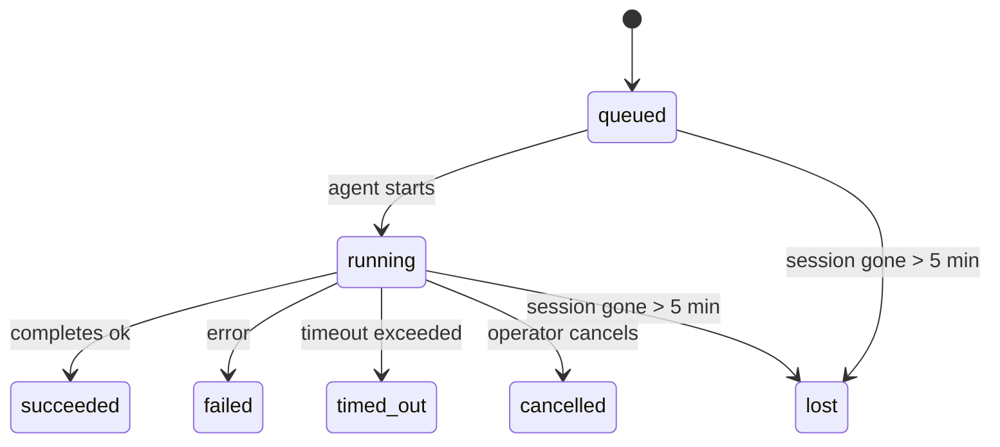

---
read_when:
    - Devam eden veya kısa süre önce tamamlanan arka plan çalışmalarını inceleme
    - Ayrılmış ajan çalıştırmaları için teslimat hatalarını ayıklama
    - Arka plan çalıştırmalarının oturumlar, Cron ve Heartbeat ile nasıl ilişkili olduğunu anlama
summary: ACP çalıştırmaları, alt ajanlar, yalıtılmış Cron işleri ve CLI işlemleri için arka plan görev takibi
title: Arka Plan Görevleri
x-i18n:
    generated_at: "2026-04-23T08:56:54Z"
    model: gpt-5.4
    provider: openai
    source_hash: 5cd0b0db6c20cc677aa5cc50c42e09043d4354e026ca33c020d804761c331413
    source_path: automation/tasks.md
    workflow: 15
---

# Arka Plan Görevleri

> **Zamanlama mı arıyorsunuz?** Doğru mekanizmayı seçmek için [Otomasyon ve Görevler](/tr/automation) sayfasına bakın. Bu sayfa arka plan çalışmalarının **takibini** kapsar, zamanlanmasını değil.

Arka plan görevleri, **ana konuşma oturumunuzun dışında** çalışan işleri izler:
ACP çalıştırmaları, alt ajan başlatmaları, yalıtılmış Cron işi yürütmeleri ve CLI ile başlatılan işlemler.

Görevler oturumların, Cron işlerinin veya Heartbeat'lerin yerini **almaz** — bunlar, ayrılmış olarak hangi işlerin gerçekleştiğini, ne zaman gerçekleştiğini ve başarılı olup olmadığını kaydeden **etkinlik defteridir**.

<Note>
Her ajan çalıştırması bir görev oluşturmaz. Heartbeat dönüşleri ve normal etkileşimli sohbet oluşturmaz. Tüm Cron yürütmeleri, ACP başlatmaları, alt ajan başlatmaları ve CLI ajan komutları görev oluşturur.
</Note>

## Kısa özet

- Görevler zamanlayıcı değil, **kayıtlardır** — işin _ne zaman_ çalışacağını Cron ve Heartbeat belirler, _ne olduğunu_ görevler izler.
- ACP, alt ajanlar, tüm Cron işleri ve CLI işlemleri görev oluşturur. Heartbeat dönüşleri oluşturmaz.
- Her görev `queued → running → terminal` (succeeded, failed, timed_out, cancelled veya lost) akışında ilerler.
- Cron görevleri, Cron çalışma zamanı hâlâ işe sahip olduğu sürece etkin kalır; sohbete bağlı CLI görevleri ise yalnızca sahip oldukları çalıştırma bağlamı hâlâ etkin olduğu sürece etkin kalır.
- Tamamlanma push tabanlıdır: ayrılmış işler doğrudan bildirim gönderebilir veya bittiğinde istekte bulunan oturumu/Heartbeat'i uyandırabilir, bu yüzden durum yoklama döngüleri genellikle yanlış yaklaşımdır.
- Yalıtılmış Cron çalıştırmaları ve alt ajan tamamlanmaları, son temizlik kayıtlarından önce alt oturumları için izlenen tarayıcı sekmelerini/süreçlerini en iyi çabayla temizler.
- Yalıtılmış Cron teslimi, alt soy ajan çalışmaları hâlâ boşaltılırken bayat ara üst yanıtlarını bastırır ve teslimden önce ulaşırsa nihai alt soy çıktısını tercih eder.
- Tamamlanma bildirimleri doğrudan bir kanala gönderilir veya bir sonraki Heartbeat için kuyruğa alınır.
- `openclaw tasks list` tüm görevleri gösterir; `openclaw tasks audit` sorunları ortaya çıkarır.
- Terminal kayıtları 7 gün saklanır, ardından otomatik olarak temizlenir.

## Hızlı başlangıç

```bash
# Tüm görevleri listele (en yeniden başlayarak)
openclaw tasks list

# Çalışma zamanına veya duruma göre filtrele
openclaw tasks list --runtime acp
openclaw tasks list --status running

# Belirli bir görevin ayrıntılarını göster (ID, run ID veya session key ile)
openclaw tasks show <lookup>

# Çalışan bir görevi iptal et (alt oturumu sonlandırır)
openclaw tasks cancel <lookup>

# Bir görevin bildirim ilkesini değiştir
openclaw tasks notify <lookup> state_changes

# Sağlık denetimi çalıştır
openclaw tasks audit

# Bakımı önizle veya uygula
openclaw tasks maintenance
openclaw tasks maintenance --apply

# TaskFlow durumunu incele
openclaw tasks flow list
openclaw tasks flow show <lookup>
openclaw tasks flow cancel <lookup>
```

## Görevi ne oluşturur

| Kaynak                 | Çalışma zamanı türü | Görev kaydının oluşturulduğu an                        | Varsayılan bildirim ilkesi |
| ---------------------- | ------------------- | ------------------------------------------------------ | -------------------------- |
| ACP arka plan çalıştırmaları | `acp`        | Bir alt ACP oturumu başlatılırken                      | `done_only`                |
| Alt ajan orkestrasyonu | `subagent`          | `sessions_spawn` ile bir alt ajan başlatılırken        | `done_only`                |
| Cron işleri (tüm türler) | `cron`            | Her Cron yürütmesinde (ana oturum ve yalıtılmış)       | `silent`                   |
| CLI işlemleri          | `cli`               | Gateway üzerinden çalışan `openclaw agent` komutları   | `silent`                   |
| Ajan medya işleri      | `cli`               | Oturuma bağlı `video_generate` çalıştırmaları          | `silent`                   |

Ana oturum Cron görevleri varsayılan olarak `silent` bildirim ilkesi kullanır — izleme için kayıt oluştururlar ama bildirim üretmezler. Yalıtılmış Cron görevleri de varsayılan olarak `silent` kullanır ancak kendi oturumlarında çalıştıkları için daha görünürdürler.

Oturuma bağlı `video_generate` çalıştırmaları da `silent` bildirim ilkesi kullanır. Yine de görev kaydı oluştururlar, ancak tamamlanma özgün ajan oturumuna dahili bir uyandırma olarak geri verilir; böylece takip mesajını ajan yazabilir ve tamamlanan videoyu kendisi ekleyebilir. `tools.media.asyncCompletion.directSend` seçeneğini etkinleştirirseniz, eşzamansız `music_generate` ve `video_generate` tamamlanmaları önce doğrudan kanal teslimini dener, ardından istekte bulunan oturumu uyandırma yoluna geri düşer.

Oturuma bağlı bir `video_generate` görevi hâlâ etkinken, araç aynı zamanda bir korkuluk görevi görür: aynı oturumda yinelenen `video_generate` çağrıları, ikinci bir eşzamanlı üretim başlatmak yerine etkin görev durumunu döndürür. Ajan tarafından açık bir ilerleme/durum sorgusu istediğinizde `action: "status"` kullanın.

**Görev oluşturmayanlar:**

- Heartbeat dönüşleri — ana oturum; bkz. [Heartbeat](/tr/gateway/heartbeat)
- Normal etkileşimli sohbet dönüşleri
- Doğrudan `/command` yanıtları

## Görev yaşam döngüsü



| Durum       | Anlamı                                                                     |
| ----------- | -------------------------------------------------------------------------- |
| `queued`    | Oluşturuldu, ajanın başlamasını bekliyor                                   |
| `running`   | Ajan dönüşü etkin olarak yürütülüyor                                       |
| `succeeded` | Başarıyla tamamlandı                                                       |
| `failed`    | Bir hatayla tamamlandı                                                     |
| `timed_out` | Yapılandırılmış zaman aşımı aşıldı                                         |
| `cancelled` | Operatör tarafından `openclaw tasks cancel` ile durduruldu                 |
| `lost`      | Çalışma zamanı, 5 dakikalık tolerans süresinden sonra yetkili arka durumunu kaybetti |

Geçişler otomatik gerçekleşir — ilişkili ajan çalıştırması sona erdiğinde görev durumu buna uyacak şekilde güncellenir.

`lost` çalışma zamanına duyarlıdır:

- ACP görevleri: destekleyen ACP alt oturum üst verisi kayboldu.
- Alt ajan görevleri: destekleyen alt oturum hedef ajan deposundan kayboldu.
- Cron görevleri: Cron çalışma zamanı işi artık etkin olarak izlemiyor.
- CLI görevleri: yalıtılmış alt oturum görevleri alt oturumu kullanır; sohbete bağlı CLI görevleri ise onun yerine canlı çalıştırma bağlamını kullanır, bu yüzden kalıcı kanal/grup/doğrudan oturum satırları onları etkin tutmaz.

## Teslim ve bildirimler

Bir görev terminal duruma ulaştığında OpenClaw sizi bilgilendirir. İki teslim yolu vardır:

**Doğrudan teslim** — görevin bir kanal hedefi varsa (`requesterOrigin`), tamamlanma mesajı doğrudan o kanala gider (Telegram, Discord, Slack vb.). Alt ajan tamamlanmaları için OpenClaw, mevcut olduğunda bağlı iş parçacığı/konu yönlendirmesini de korur ve doğrudan teslimden vazgeçmeden önce eksik bir `to` / hesabı istekte bulunan oturumun kayıtlı rotasından (`lastChannel` / `lastTo` / `lastAccountId`) doldurabilir.

**Oturum kuyruğuna alınmış teslim** — doğrudan teslim başarısız olursa veya bir kaynak ayarlı değilse, güncelleme istekte bulunanın oturumunda sistem olayı olarak kuyruğa alınır ve bir sonraki Heartbeat'te görünür.

<Tip>
Görev tamamlanması anında bir Heartbeat uyandırması tetikler, böylece sonucu hızlı görürsünüz — bir sonraki zamanlanmış Heartbeat işaretini beklemeniz gerekmez.
</Tip>

Bu, olağan iş akışının push tabanlı olduğu anlamına gelir: ayrılmış işi bir kez başlatın, ardından çalışma zamanının tamamlandığında sizi uyandırmasına veya bilgilendirmesine izin verin. Görev durumunu yalnızca hata ayıklama, müdahale veya açık bir denetim gerektiğinde yoklayın.

### Bildirim ilkeleri

Her görev hakkında ne kadar bilgi almak istediğinizi kontrol edin:

| İlke                  | Teslim edilenler                                                        |
| --------------------- | ----------------------------------------------------------------------- |
| `done_only` (varsayılan) | Yalnızca terminal durum (succeeded, failed vb.) — **varsayılan budur** |
| `state_changes`       | Her durum geçişi ve ilerleme güncellemesi                              |
| `silent`              | Hiçbir şey                                                             |

Bir görev çalışırken ilkeyi değiştirin:

```bash
openclaw tasks notify <lookup> state_changes
```

## CLI başvurusu

### `tasks list`

```bash
openclaw tasks list [--runtime <acp|subagent|cron|cli>] [--status <status>] [--json]
```

Çıkış sütunları: Görev ID, Tür, Durum, Teslim, Run ID, Alt Oturum, Özet.

### `tasks show`

```bash
openclaw tasks show <lookup>
```

Arama belirteci bir görev ID'si, run ID'si veya oturum anahtarını kabul eder. Zamanlama, teslim durumu, hata ve terminal özet dahil tam kaydı gösterir.

### `tasks cancel`

```bash
openclaw tasks cancel <lookup>
```

ACP ve alt ajan görevleri için bu, alt oturumu sonlandırır. CLI ile izlenen görevlerde iptal görev kayıt defterine kaydedilir (ayrı bir alt çalışma zamanı tanıtıcısı yoktur). Durum `cancelled` olur ve uygunsa teslim bildirimi gönderilir.

### `tasks notify`

```bash
openclaw tasks notify <lookup> <done_only|state_changes|silent>
```

### `tasks audit`

```bash
openclaw tasks audit [--json]
```

Operasyonel sorunları ortaya çıkarır. Sorun tespit edildiğinde bulgular `openclaw status` içinde de görünür.

| Bulgu                     | Önem derecesi | Tetikleyici                                         |
| ------------------------- | ------------- | --------------------------------------------------- |
| `stale_queued`            | warn          | 10 dakikadan uzun süredir kuyrukta                  |
| `stale_running`           | error         | 30 dakikadan uzun süredir çalışıyor                 |
| `lost`                    | error         | Çalışma zamanı destekli görev sahipliği kayboldu    |
| `delivery_failed`         | warn          | Teslim başarısız oldu ve bildirim ilkesi `silent` değil |
| `missing_cleanup`         | warn          | Temizlik zaman damgası olmayan terminal görev       |
| `inconsistent_timestamps` | warn          | Zaman çizelgesi ihlali (örneğin başlamadan önce bitmiş) |

### `tasks maintenance`

```bash
openclaw tasks maintenance [--json]
openclaw tasks maintenance --apply [--json]
```

Bunu görevler ve TaskFlow durumu için uzlaştırma, temizlik damgalama ve temizlemeyi önizlemek veya uygulamak için kullanın.

Uzlaştırma çalışma zamanına duyarlıdır:

- ACP/alt ajan görevleri destekleyen alt oturumu kontrol eder.
- Cron görevleri, Cron çalışma zamanının hâlâ işe sahip olup olmadığını kontrol eder.
- Sohbete bağlı CLI görevleri yalnızca sohbet oturumu satırını değil, sahip canlı çalıştırma bağlamını kontrol eder.

Tamamlanma temizliği de çalışma zamanına duyarlıdır:

- Alt ajan tamamlanması, duyuru temizliği sürmeden önce alt oturum için izlenen tarayıcı sekmelerini/süreçlerini en iyi çabayla kapatır.
- Yalıtılmış Cron tamamlanması, çalıştırma tamamen kapatılmadan önce Cron oturumu için izlenen tarayıcı sekmelerini/süreçlerini en iyi çabayla kapatır.
- Yalıtılmış Cron teslimi gerektiğinde alt soy alt ajan takibini bekler ve bunu duyurmak yerine bayat üst onay metnini bastırır.
- Alt ajan tamamlanma teslimi en son görünür asistan metnini tercih eder; bu boşsa temizlenmiş en son tool/toolResult metnine geri döner ve yalnızca zaman aşımı olan tool-call çalıştırmaları kısa bir kısmi ilerleme özetine indirgenebilir. Terminal failed çalıştırmaları, yakalanan yanıt metnini yeniden oynatmadan başarısızlık durumunu duyurur.
- Temizlik hataları gerçek görev sonucunu gizlemez.

### `tasks flow list|show|cancel`

```bash
openclaw tasks flow list [--status <status>] [--json]
openclaw tasks flow show <lookup> [--json]
openclaw tasks flow cancel <lookup>
```

Tek bir arka plan görev kaydından ziyade sizin için önemli olan şey orkestrasyonu yapan TaskFlow ise bunları kullanın.

## Sohbet görev panosu (`/tasks`)

Herhangi bir sohbet oturumunda o oturuma bağlı arka plan görevlerini görmek için `/tasks` kullanın. Pano; çalışma zamanı, durum, zamanlama ve ilerleme veya hata ayrıntılarıyla birlikte etkin ve kısa süre önce tamamlanmış görevleri gösterir.

Geçerli oturumda görünür bağlı görev yoksa, `/tasks` agent-local görev sayılarına geri döner;
böylece diğer oturumların ayrıntılarını sızdırmadan yine de genel bir görünüm elde edersiniz.

Tam operatör defteri için CLI'yi kullanın: `openclaw tasks list`.

## Durum entegrasyonu (görev baskısı)

`openclaw status`, tek bakışta görülebilen bir görev özeti içerir:

```
Tasks: 3 queued · 2 running · 1 issues
```

Özet şunları raporlar:

- **active** — `queued` + `running` sayısı
- **failures** — `failed` + `timed_out` + `lost` sayısı
- **byRuntime** — `acp`, `subagent`, `cron`, `cli` kırılımı

Hem `/status` hem de `session_status` aracı, temizlik farkındalığı olan bir görev anlık görüntüsü kullanır: etkin görevler tercih edilir, bayat tamamlanmış satırlar gizlenir ve yakın tarihli hatalar yalnızca etkin iş kalmadığında gösterilir. Bu, durum kartının şu anda önemli olana odaklanmasını sağlar.

## Depolama ve bakım

### Görevler nerede yaşar

Görev kayıtları SQLite içinde şu konumda kalıcı olarak tutulur:

```
$OPENCLAW_STATE_DIR/tasks/runs.sqlite
```

Kayıt defteri Gateway başlangıcında belleğe yüklenir ve yeniden başlatmalar arasında dayanıklılık için yazmaları SQLite'a eşzamanlar.

### Otomatik bakım

Her **60 saniyede** bir çalışan bir temizleyici üç şeyi ele alır:

1. **Uzlaştırma** — etkin görevlerin hâlâ yetkili çalışma zamanı dayanağına sahip olup olmadığını kontrol eder. ACP/alt ajan görevleri alt oturum durumunu, Cron görevleri etkin iş sahipliğini, sohbete bağlı CLI görevleri ise sahip oldukları çalıştırma bağlamını kullanır. Bu arka durum 5 dakikadan uzun süre kayıpsa görev `lost` olarak işaretlenir.
2. **Temizlik damgalama** — terminal görevlerde `cleanupAfter` zaman damgasını ayarlar (`endedAt + 7 days`).
3. **Temizleme** — `cleanupAfter` tarihini geçmiş kayıtları siler.

**Saklama süresi**: terminal görev kayıtları **7 gün** tutulur, ardından otomatik olarak temizlenir. Yapılandırma gerekmez.

## Görevlerin diğer sistemlerle ilişkisi

### Görevler ve TaskFlow

[TaskFlow](/tr/automation/taskflow), arka plan görevlerinin üzerindeki akış orkestrasyon katmanıdır. Tek bir akış, ömrü boyunca yönetilen veya yansıtılmış eşzamanlama modlarını kullanarak birden çok görevi koordine edebilir. Tek tek görev kayıtlarını incelemek için `openclaw tasks`, orkestrasyonu yapan akışı incelemek için `openclaw tasks flow` kullanın.

Ayrıntılar için [TaskFlow](/tr/automation/taskflow) sayfasına bakın.

### Görevler ve Cron

Bir Cron işi **tanımı** `~/.openclaw/cron/jobs.json` içinde bulunur; çalışma zamanı yürütme durumu bunun yanında `~/.openclaw/cron/jobs-state.json` içinde bulunur. **Her** Cron yürütmesi bir görev kaydı oluşturur — hem ana oturum hem de yalıtılmış olanlar. Ana oturum Cron görevleri, bildirim üretmeden izleme yapmaları için varsayılan olarak `silent` bildirim ilkesini kullanır.

Bkz. [Cron İşleri](/tr/automation/cron-jobs).

### Görevler ve Heartbeat

Heartbeat çalıştırmaları ana oturum dönüşleridir — görev kaydı oluşturmazlar. Bir görev tamamlandığında, sonucu hızlıca görebilmeniz için bir Heartbeat uyandırması tetikleyebilir.

Bkz. [Heartbeat](/tr/gateway/heartbeat).

### Görevler ve oturumlar

Bir görev `childSessionKey` (işin çalıştığı yer) ve `requesterSessionKey` (işi başlatan kişi) başvurusu içerebilir. Oturumlar konuşma bağlamıdır; görevler ise bunun üzerindeki etkinlik takibidir.

### Görevler ve ajan çalıştırmaları

Bir görevin `runId` değeri, işi yapan ajan çalıştırmasına bağlanır. Ajan yaşam döngüsü olayları (başlangıç, bitiş, hata) görev durumunu otomatik olarak günceller — yaşam döngüsünü manuel olarak yönetmeniz gerekmez.

## İlgili

- [Otomasyon ve Görevler](/tr/automation) — tüm otomasyon mekanizmalarına tek bakışta genel görünüm
- [TaskFlow](/tr/automation/taskflow) — görevlerin üzerindeki akış orkestrasyonu
- [Zamanlanmış Görevler](/tr/automation/cron-jobs) — arka plan çalışmasını zamanlama
- [Heartbeat](/tr/gateway/heartbeat) — periyodik ana oturum dönüşleri
- [CLI: Tasks](/tr/cli/tasks) — CLI komut başvurusu
