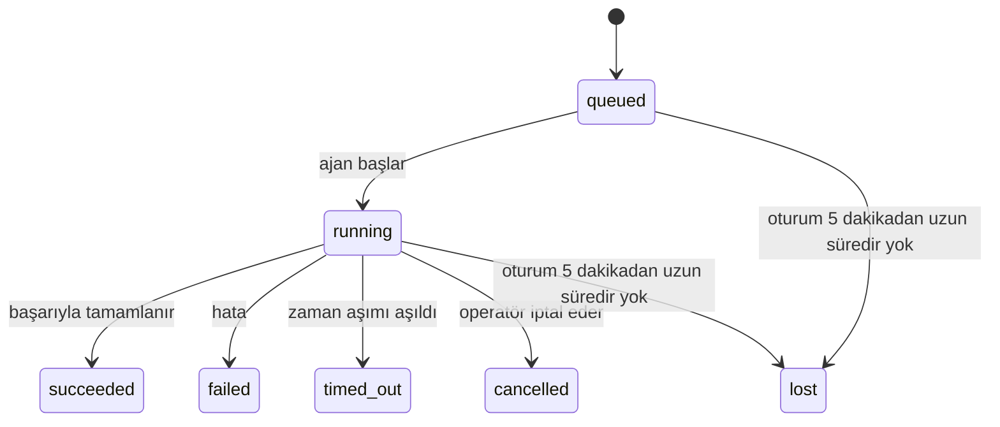

---
read_when:
    - Devam eden veya yakın zamanda tamamlanmış arka plan çalışmalarını inceleme
    - Ayrılmış ajan çalıştırmaları için teslimat hatalarını ayıklama
    - Arka plan çalıştırmalarının oturumlar, Cron ve Heartbeat ile nasıl ilişkili olduğunu anlama
summary: ACP çalıştırmaları, alt ajanlar, izole Cron işleri ve CLI işlemleri için arka plan görev takibi
title: Arka Plan Görevleri
x-i18n:
    generated_at: "2026-04-21T08:56:42Z"
    model: gpt-5.4
    provider: openai
    source_hash: ba5511b1c421bdf505fc7d34f09e453ac44e85213fcb0f082078fa957aa91fe7
    source_path: automation/tasks.md
    workflow: 15
---

# Arka Plan Görevleri

> **Zamanlama mı arıyorsunuz?** Doğru mekanizmayı seçmek için [Otomasyon ve Görevler](/tr/automation) sayfasına bakın. Bu sayfa arka plan çalışmalarını **takip etmeyi** kapsar, zamanlamayı değil.

Arka plan görevleri, **ana konuşma oturumunuzun dışında** çalışan işleri izler:
ACP çalıştırmaları, alt ajan başlatmaları, izole Cron işi yürütmeleri ve CLI tarafından başlatılan işlemler.

Görevler oturumların, Cron işlerinin veya Heartbeat'lerin yerini **almaz** — bunlar, ayrılmış işlerin ne yaptığını, ne zaman yaptığını ve başarılı olup olmadığını kaydeden **etkinlik defteridir**.

<Note>
Her ajan çalıştırması bir görev oluşturmaz. Heartbeat dönüşleri ve normal etkileşimli sohbetler oluşturmaz. Tüm Cron yürütmeleri, ACP başlatmaları, alt ajan başlatmaları ve CLI ajan komutları oluşturur.
</Note>

## Kısaca

- Görevler zamanlayıcı değil, **kaydedicidir** — Cron ve Heartbeat işin _ne zaman_ çalışacağını belirler, görevler _ne olduğunu_ izler.
- ACP, alt ajanlar, tüm Cron işleri ve CLI işlemleri görev oluşturur. Heartbeat dönüşleri oluşturmaz.
- Her görev `queued → running → terminal` aşamalarından geçer (`succeeded`, `failed`, `timed_out`, `cancelled` veya `lost`).
- Cron görevleri, Cron çalışma zamanı işi hâlâ sahipleniyorsa etkin kalır; sohbet destekli CLI görevleri yalnızca sahibi olan çalıştırma bağlamı hâlâ etkinse etkin kalır.
- Tamamlama push odaklıdır: ayrılmış işler doğrudan bildirim gönderebilir veya
  bittiğinde istekte bulunan oturumu/Heartbeat'i uyandırabilir; bu nedenle durum yoklama döngüleri
  genellikle yanlış yaklaşımdır.
- İzole Cron çalıştırmaları ve alt ajan tamamlamaları, son temizleme kayıtlarından önce çocuk oturumlarına ait izlenen tarayıcı sekmelerini/süreçlerini en iyi çabayla temizler.
- İzole Cron teslimatı, alt soy alt ajan işi hâlâ boşalırken eski ara üst yanıtları bastırır ve teslimattan önce gelirse son alt soy çıktısını tercih eder.
- Tamamlama bildirimleri doğrudan bir kanala teslim edilir veya sonraki Heartbeat için kuyruğa alınır.
- `openclaw tasks list` tüm görevleri gösterir; `openclaw tasks audit` sorunları ortaya çıkarır.
- Terminal kayıtlar 7 gün boyunca tutulur, ardından otomatik olarak budanır.

## Hızlı başlangıç

```bash
# Tüm görevleri listele (en yeniden en eskiye)
openclaw tasks list

# Çalışma zamanına veya duruma göre filtrele
openclaw tasks list --runtime acp
openclaw tasks list --status running

# Belirli bir görevin ayrıntılarını göster (kimlik, çalıştırma kimliği veya oturum anahtarına göre)
openclaw tasks show <lookup>

# Çalışan bir görevi iptal et (çocuk oturumu sonlandırır)
openclaw tasks cancel <lookup>

# Bir görev için bildirim ilkesini değiştir
openclaw tasks notify <lookup> state_changes

# Sistem durumu denetimi çalıştır
openclaw tasks audit

# Bakımı önizle veya uygula
openclaw tasks maintenance
openclaw tasks maintenance --apply

# TaskFlow durumunu incele
openclaw tasks flow list
openclaw tasks flow show <lookup>
openclaw tasks flow cancel <lookup>
```

## Bir görevi ne oluşturur

| Kaynak                 | Çalışma zamanı türü | Görev kaydının oluşturulduğu zaman                    | Varsayılan bildirim ilkesi |
| ---------------------- | ------------------- | ----------------------------------------------------- | -------------------------- |
| ACP arka plan çalıştırmaları | `acp`         | Bir çocuk ACP oturumu başlatılırken                   | `done_only`                |
| Alt ajan orkestrasyonu | `subagent`          | `sessions_spawn` ile bir alt ajan başlatılırken       | `done_only`                |
| Cron işleri (tüm türler) | `cron`            | Her Cron yürütmesinde (ana oturum ve izole)           | `silent`                   |
| CLI işlemleri          | `cli`               | Gateway üzerinden çalışan `openclaw agent` komutları  | `silent`                   |
| Ajan medya işleri      | `cli`               | Oturum destekli `video_generate` çalıştırmaları       | `silent`                   |

Ana oturum Cron görevleri varsayılan olarak `silent` bildirim ilkesini kullanır — izleme için kayıt oluştururlar ancak bildirim üretmezler. İzole Cron görevleri de varsayılan olarak `silent` kullanır, ancak kendi oturumlarında çalıştıkları için daha görünürdürler.

Oturum destekli `video_generate` çalıştırmaları da `silent` bildirim ilkesini kullanır. Yine de görev kayıtları oluştururlar, ancak tamamlama iç bir uyandırma olarak özgün ajan oturumuna geri verilir; böylece ajan takip mesajını yazabilir ve tamamlanmış videoyu kendisi ekleyebilir. `tools.media.asyncCompletion.directSend` seçeneğini etkinleştirirseniz, eşzamansız `music_generate` ve `video_generate` tamamlamaları, istekte bulunan oturum uyandırma yoluna geri düşmeden önce önce doğrudan kanal teslimatını dener.

Oturum destekli bir `video_generate` görevi hâlâ etkinken, araç bir koruma rayı olarak da davranır: aynı oturumda yinelenen `video_generate` çağrıları ikinci bir eşzamanlı üretim başlatmak yerine etkin görev durumunu döndürür. Ajan tarafından açık bir ilerleme/durum sorgulaması istediğinizde `action: "status"` kullanın.

**Görev oluşturmayanlar:**

- Heartbeat dönüşleri — ana oturum; bkz. [Heartbeat](/tr/gateway/heartbeat)
- Normal etkileşimli sohbet dönüşleri
- Doğrudan `/command` yanıtları

## Görev yaşam döngüsü



| Durum       | Anlamı                                                                     |
| ----------- | -------------------------------------------------------------------------- |
| `queued`    | Oluşturuldu, ajanın başlaması bekleniyor                                   |
| `running`   | Ajan dönüşü etkin olarak yürütülüyor                                       |
| `succeeded` | Başarıyla tamamlandı                                                       |
| `failed`    | Bir hatayla tamamlandı                                                     |
| `timed_out` | Yapılandırılmış zaman aşımını aştı                                         |
| `cancelled` | Operatör tarafından `openclaw tasks cancel` ile durduruldu                 |
| `lost`      | Çalışma zamanı, 5 dakikalık tolerans süresinden sonra yetkili destek durumunu kaybetti |

Geçişler otomatik olarak gerçekleşir — ilişkili ajan çalıştırması sona erdiğinde görev durumu buna göre güncellenir.

`lost` çalışma zamanı farkındalığına sahiptir:

- ACP görevleri: destekleyen ACP çocuk oturumu meta verisi kayboldu.
- Alt ajan görevleri: destekleyen çocuk oturum hedef ajan deposundan kayboldu.
- Cron görevleri: Cron çalışma zamanı artık işi etkin olarak izlemiyor.
- CLI görevleri: izole çocuk oturum görevleri çocuk oturumu kullanır; sohbet destekli CLI görevleri bunun yerine canlı çalıştırma bağlamını kullanır, bu yüzden kalıcı kanal/grup/doğrudan oturum satırları onları etkin tutmaz.

## Teslimat ve bildirimler

Bir görev terminal duruma ulaştığında OpenClaw size bildirim gönderir. İki teslimat yolu vardır:

**Doğrudan teslimat** — görevin bir kanal hedefi varsa (`requesterOrigin`), tamamlama mesajı doğrudan o kanala gider (Telegram, Discord, Slack vb.). Alt ajan tamamlamalarında OpenClaw, mevcut olduğunda bağlı ileti dizisi/konu yönlendirmesini de korur ve doğrudan teslimattan vazgeçmeden önce istekte bulunan oturumun depolanan rotasından (`lastChannel` / `lastTo` / `lastAccountId`) eksik bir `to` / hesabı doldurabilir.

**Oturum kuyruğuna alınmış teslimat** — doğrudan teslimat başarısız olursa veya kaynak ayarlanmamışsa, güncelleme istekte bulunanın oturumunda sistem olayı olarak kuyruğa alınır ve sonraki Heartbeat'te görünür.

<Tip>
Görev tamamlaması anında bir Heartbeat uyandırması tetikler; böylece sonucu hızlıca görürsünüz — bir sonraki zamanlanmış Heartbeat tikini beklemeniz gerekmez.
</Tip>

Bu, olağan iş akışının push tabanlı olduğu anlamına gelir: ayrılmış işi bir kez başlatın, sonra
tamamlandığında çalışma zamanının sizi uyandırmasına veya bilgilendirmesine izin verin. Görev durumunu yalnızca
hata ayıklama, müdahale veya açık bir denetim gerektiğinde yoklayın.

### Bildirim ilkeleri

Her görev hakkında ne kadar bilgi alacağınızı kontrol edin:

| İlke                  | Teslim edilen içerik                                                     |
| --------------------- | ------------------------------------------------------------------------ |
| `done_only` (varsayılan) | Yalnızca terminal durum (`succeeded`, `failed` vb.) — **varsayılan budur** |
| `state_changes`       | Her durum geçişi ve ilerleme güncellemesi                                |
| `silent`              | Hiçbir şey                                                              |

Bir görev çalışırken ilkeyi değiştirin:

```bash
openclaw tasks notify <lookup> state_changes
```

## CLI başvurusu

### `tasks list`

```bash
openclaw tasks list [--runtime <acp|subagent|cron|cli>] [--status <status>] [--json]
```

Çıktı sütunları: Görev Kimliği, Tür, Durum, Teslimat, Çalıştırma Kimliği, Çocuk Oturum, Özet.

### `tasks show`

```bash
openclaw tasks show <lookup>
```

Arama belirteci bir görev kimliği, çalıştırma kimliği veya oturum anahtarını kabul eder. Zamanlama, teslimat durumu, hata ve terminal özet dahil tam kaydı gösterir.

### `tasks cancel`

```bash
openclaw tasks cancel <lookup>
```

ACP ve alt ajan görevleri için bu, çocuk oturumu sonlandırır. CLI tarafından izlenen görevler için iptal görev kayıt defterine kaydedilir (ayrı bir çocuk çalışma zamanı tanıtıcısı yoktur). Durum `cancelled` olarak değişir ve uygunsa bir teslimat bildirimi gönderilir.

### `tasks notify`

```bash
openclaw tasks notify <lookup> <done_only|state_changes|silent>
```

### `tasks audit`

```bash
openclaw tasks audit [--json]
```

Operasyonel sorunları ortaya çıkarır. Sorun tespit edildiğinde bulgular `openclaw status` içinde de görünür.

| Bulgu                     | Önem derecesi | Tetikleyici                                            |
| ------------------------- | ------------- | ------------------------------------------------------ |
| `stale_queued`            | warn          | 10 dakikadan uzun süredir kuyrukta                     |
| `stale_running`           | error         | 30 dakikadan uzun süredir çalışıyor                    |
| `lost`                    | error         | Çalışma zamanı destekli görev sahipliği kayboldu       |
| `delivery_failed`         | warn          | Teslimat başarısız oldu ve bildirim ilkesi `silent` değil |
| `missing_cleanup`         | warn          | Temizleme zaman damgası olmayan terminal görev         |
| `inconsistent_timestamps` | warn          | Zaman çizelgesi ihlali (örneğin başlamadan bitmiş)     |

### `tasks maintenance`

```bash
openclaw tasks maintenance [--json]
openclaw tasks maintenance --apply [--json]
```

Bunu, görevler ve TaskFlow durumu için mutabakat, temizleme damgalaması ve budamayı
önizlemek veya uygulamak için kullanın.

Mutabakat çalışma zamanı farkındalığına sahiptir:

- ACP/alt ajan görevleri destekleyen çocuk oturumu kontrol eder.
- Cron görevleri Cron çalışma zamanının işi hâlâ sahiplenip sahiplenmediğini kontrol eder.
- Sohbet destekli CLI görevleri yalnızca sohbet oturum satırını değil, sahibi olan canlı çalıştırma bağlamını kontrol eder.

Tamamlama temizliği de çalışma zamanı farkındalığına sahiptir:

- Alt ajan tamamlaması, duyuru temizliği devam etmeden önce çocuk oturum için izlenen tarayıcı sekmelerini/süreçlerini en iyi çabayla kapatır.
- İzole Cron tamamlaması, çalıştırma tamamen kapanmadan önce Cron oturumu için izlenen tarayıcı sekmelerini/süreçlerini en iyi çabayla kapatır.
- İzole Cron teslimatı, gerektiğinde alt soy alt ajan takibini bekler ve
  bunu duyurmak yerine eski üst onay metnini bastırır.
- Alt ajan tamamlama teslimatı en son görünür yardımcı metni tercih eder; bu boşsa temizlenmiş en son `tool`/`toolResult` metnine geri düşer ve yalnızca zaman aşımına uğrayan araç çağrısı çalıştırmaları kısa bir kısmi ilerleme özetine indirgenebilir.
- Temizleme hataları gerçek görev sonucunu gizlemez.

### `tasks flow list|show|cancel`

```bash
openclaw tasks flow list [--status <status>] [--json]
openclaw tasks flow show <lookup> [--json]
openclaw tasks flow cancel <lookup>
```

Bunları, tek bir arka plan görev kaydından ziyade orkestre eden TaskFlow sizin için
önemliyse kullanın.

## Sohbet görev panosu (`/tasks`)

Herhangi bir sohbet oturumunda o oturuma bağlı arka plan görevlerini görmek için `/tasks` kullanın. Pano,
etkin ve yakın zamanda tamamlanmış görevleri çalışma zamanı, durum, zamanlama ve ilerleme veya hata ayrıntılarıyla gösterir.

Geçerli oturumun görünür bağlı görevi yoksa, `/tasks` diğer oturum ayrıntılarını sızdırmadan size yine de genel bir görünüm sunmak için ajan yerel görev sayılarına geri düşer.

Tam operatör defteri için CLI'yi kullanın: `openclaw tasks list`.

## Durum entegrasyonu (görev baskısı)

`openclaw status`, tek bakışta görülebilen bir görev özeti içerir:

```
Tasks: 3 queued · 2 running · 1 issues
```

Özet şunları bildirir:

- **active** — `queued` + `running` sayısı
- **failures** — `failed` + `timed_out` + `lost` sayısı
- **byRuntime** — `acp`, `subagent`, `cron`, `cli` bazında döküm

Hem `/status` hem de `session_status` aracı, temizleme farkındalığına sahip bir görev anlık görüntüsü kullanır: etkin görevler
tercih edilir, eski tamamlanmış satırlar gizlenir ve yakın tarihli hatalar yalnızca etkin çalışma
kalmadığında gösterilir. Bu, durum kartının şu anda önemli olan şeye odaklanmasını sağlar.

## Depolama ve bakım

### Görevlerin bulunduğu yer

Görev kayıtları SQLite içinde şurada kalıcı olarak saklanır:

```
$OPENCLAW_STATE_DIR/tasks/runs.sqlite
```

Kayıt defteri, Gateway başlangıcında belleğe yüklenir ve yeniden başlatmalar arasında dayanıklılık için yazmaları SQLite ile eşzamanlar.

### Otomatik bakım

Bir süpürücü her **60 saniyede** bir çalışır ve üç şeyi yönetir:

1. **Mutabakat** — etkin görevlerin hâlâ yetkili çalışma zamanı desteğine sahip olup olmadığını kontrol eder. ACP/alt ajan görevleri çocuk oturum durumunu, Cron görevleri etkin iş sahipliğini ve sohbet destekli CLI görevleri sahibi olan çalıştırma bağlamını kullanır. Bu destek durumu 5 dakikadan uzun süre yoksa görev `lost` olarak işaretlenir.
2. **Temizleme damgalaması** — terminal görevlerde bir `cleanupAfter` zaman damgası ayarlar (`endedAt + 7 gün`).
3. **Budama** — `cleanupAfter` tarihini geçmiş kayıtları siler.

**Saklama süresi**: terminal görev kayıtları **7 gün** tutulur, ardından otomatik olarak budanır. Yapılandırma gerekmez.

## Görevlerin diğer sistemlerle ilişkisi

### Görevler ve TaskFlow

[TaskFlow](/tr/automation/taskflow), arka plan görevlerinin üstündeki akış orkestrasyon katmanıdır. Tek bir akış, ömrü boyunca yönetilen veya yansıtılmış eşzamanlama modlarını kullanarak birden çok görevi koordine edebilir. Tek tek görev kayıtlarını incelemek için `openclaw tasks`, orkestre eden akışı incelemek için `openclaw tasks flow` kullanın.

Ayrıntılar için [TaskFlow](/tr/automation/taskflow) sayfasına bakın.

### Görevler ve Cron

Bir Cron işi **tanımı** `~/.openclaw/cron/jobs.json` içinde bulunur; çalışma zamanı yürütme durumu onun yanında `~/.openclaw/cron/jobs-state.json` içinde bulunur. **Her** Cron yürütmesi bir görev kaydı oluşturur — hem ana oturum hem de izole olanlar. Ana oturum Cron görevleri varsayılan olarak `silent` bildirim ilkesini kullanır; böylece bildirim üretmeden izleme yaparlar.

Bkz. [Cron İşleri](/tr/automation/cron-jobs).

### Görevler ve Heartbeat

Heartbeat çalıştırmaları ana oturum dönüşleridir — görev kaydı oluşturmazlar. Bir görev tamamlandığında, sonucu hızlıca görmeniz için bir Heartbeat uyandırmasını tetikleyebilir.

Bkz. [Heartbeat](/tr/gateway/heartbeat).

### Görevler ve oturumlar

Bir görev `childSessionKey` (işin çalıştığı yer) ve `requesterSessionKey` (işi kimin başlattığı) değerlerine başvurabilir. Oturumlar konuşma bağlamıdır; görevler bunun üzerindeki etkinlik takibidir.

### Görevler ve ajan çalıştırmaları

Bir görevin `runId` değeri, işi yapan ajan çalıştırmasına bağlanır. Ajan yaşam döngüsü olayları (başlangıç, bitiş, hata) görev durumunu otomatik olarak günceller — yaşam döngüsünü elle yönetmeniz gerekmez.

## İlgili

- [Otomasyon ve Görevler](/tr/automation) — tüm otomasyon mekanizmalarına tek bakışta genel görünüm
- [TaskFlow](/tr/automation/taskflow) — görevlerin üzerindeki akış orkestrasyonu
- [Zamanlanmış Görevler](/tr/automation/cron-jobs) — arka plan çalışmasını zamanlama
- [Heartbeat](/tr/gateway/heartbeat) — periyodik ana oturum dönüşleri
- [CLI: Görevler](/cli/index#tasks) — CLI komut başvurusu
