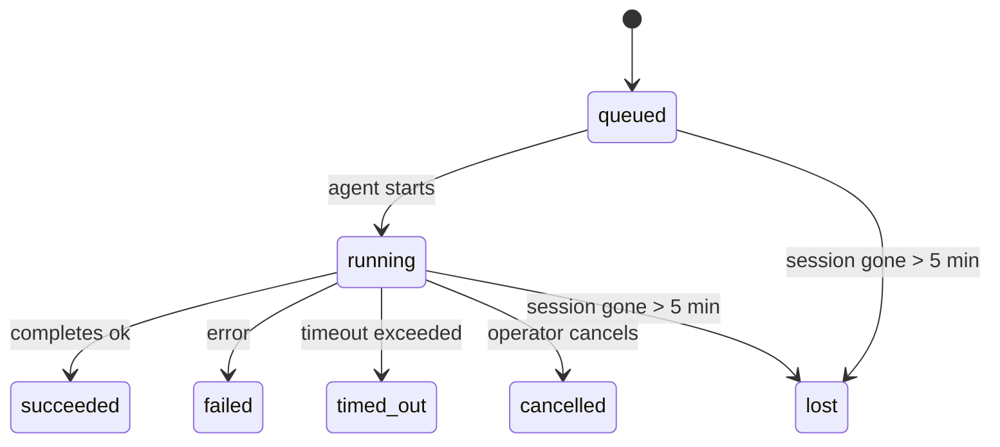

---
read_when:
    - Devam eden veya yakın zamanda tamamlanmış arka plan çalışmasının incelenmesi
    - Ayrılmış aracı çalıştırmaları için teslim başarısızlıklarını ayıklama
    - Arka plan çalıştırmalarının oturumlar, cron ve heartbeat ile nasıl ilişkili olduğunu anlama
summary: ACP çalıştırmaları, alt aracılar, yalıtılmış cron işleri ve CLI işlemleri için arka plan görev takibi
title: Arka Plan Görevleri
x-i18n:
    generated_at: "2026-04-10T08:50:13Z"
    model: gpt-5.4
    provider: openai
    source_hash: d7b5ba41f1025e0089986342ce85698bc62f676439c3ccf03f3ed146beb1b1ac
    source_path: automation/tasks.md
    workflow: 15
---

# Arka Plan Görevleri

> **Zamanlama mı arıyorsunuz?** Doğru mekanizmayı seçmek için [Otomasyon ve Görevler](/tr/automation) sayfasına bakın. Bu sayfa arka plan çalışmalarının **takibini** kapsar, zamanlanmasını değil.

Arka plan görevleri, **ana konuşma oturumunuzun dışında** çalışan işleri izler:
ACP çalıştırmaları, alt aracı başlatmaları, yalıtılmış cron işi yürütmeleri ve CLI tarafından başlatılan işlemler.

Görevler oturumların, cron işlerinin veya heartbeat'lerin **yerini almaz** — bunlar, ayrılmış işlerin ne yaptığını, ne zaman yaptığını ve başarılı olup olmadığını kaydeden **etkinlik defteridir**.

<Note>
Her aracı çalıştırması bir görev oluşturmaz. Heartbeat dönüşleri ve normal etkileşimli sohbet oluşturmaz. Tüm cron yürütmeleri, ACP başlatmaları, alt aracı başlatmaları ve CLI aracı komutları oluşturur.
</Note>

## Kısa özet

- Görevler zamanlayıcı değil, **kayıttır** — işin _ne zaman_ çalışacağına cron ve heartbeat karar verir, görevler _ne olduğunu_ izler.
- ACP, alt aracılar, tüm cron işleri ve CLI işlemleri görev oluşturur. Heartbeat dönüşleri oluşturmaz.
- Her görev `queued → running → terminal` üzerinden ilerler (`succeeded`, `failed`, `timed_out`, `cancelled` veya `lost`).
- Cron görevleri, cron çalışma zamanı işi hâlâ sahipleniyorsa canlı kalır; sohbet destekli CLI görevleri yalnızca sahip olan çalıştırma bağlamı hâlâ etkinken canlı kalır.
- Tamamlanma push tabanlıdır: ayrılmış işler tamamlandığında doğrudan bildirim yapabilir veya istekte bulunan oturumu/heartbeat'i uyandırabilir, bu nedenle durum yoklama döngüleri genellikle yanlış yaklaşımdır.
- Yalıtılmış cron çalıştırmaları ve alt aracı tamamlanmaları, son temizleme kayıtları yapılmadan önce alt oturumları için izlenen tarayıcı sekmelerini/süreçlerini en iyi gayretle temizler.
- Yalıtılmış cron teslimi, alt soy alt aracı işi hâlâ boşalırken eski ara üst yanıtları bastırır ve teslimden önce gelirse son alt soy çıktısını tercih eder.
- Tamamlanma bildirimleri doğrudan bir kanala teslim edilir veya bir sonraki heartbeat için kuyruğa alınır.
- `openclaw tasks list` tüm görevleri gösterir; `openclaw tasks audit` sorunları ortaya çıkarır.
- Terminal kayıtları 7 gün tutulur, ardından otomatik olarak budanır.

## Hızlı başlangıç

```bash
# Tüm görevleri listele (en yeniden başlayarak)
openclaw tasks list

# Çalışma zamanına veya duruma göre filtrele
openclaw tasks list --runtime acp
openclaw tasks list --status running

# Belirli bir görevin ayrıntılarını göster (ID, çalıştırma ID'si veya oturum anahtarıyla)
openclaw tasks show <lookup>

# Çalışan bir görevi iptal et (alt oturumu sonlandırır)
openclaw tasks cancel <lookup>

# Bir görev için bildirim ilkesini değiştir
openclaw tasks notify <lookup> state_changes

# Sağlık denetimi çalıştır
openclaw tasks audit

# Bakımı önizle veya uygula
openclaw tasks maintenance
openclaw tasks maintenance --apply

# TaskFlow durumunu incele
openclaw tasks flow list
openclaw tasks flow show <lookup>
openclaw tasks flow cancel <lookup>
```

## Bir görevi ne oluşturur

| Kaynak                 | Çalışma zamanı türü | Görev kaydının oluşturulduğu an                        | Varsayılan bildirim ilkesi |
| ---------------------- | ------------------- | ------------------------------------------------------ | -------------------------- |
| ACP arka plan çalıştırmaları | `acp`        | Alt ACP oturumu başlatılırken                          | `done_only`                |
| Alt aracı orkestrasyonu | `subagent`         | `sessions_spawn` ile bir alt aracı başlatılırken       | `done_only`                |
| Cron işleri (tüm türler) | `cron`            | Her cron yürütmesinde (ana oturum ve yalıtılmış)       | `silent`                   |
| CLI işlemleri          | `cli`               | Ağ geçidi üzerinden çalışan `openclaw agent` komutları | `silent`                   |
| Aracı medya işleri     | `cli`               | Oturum destekli `video_generate` çalıştırmaları        | `silent`                   |

Ana oturum cron görevleri varsayılan olarak `silent` bildirim ilkesi kullanır — izleme için kayıt oluştururlar ancak bildirim üretmezler. Yalıtılmış cron görevleri de varsayılan olarak `silent` kullanır, ancak kendi oturumlarında çalıştıkları için daha görünürdür.

Oturum destekli `video_generate` çalıştırmaları da `silent` bildirim ilkesi kullanır. Yine de görev kaydı oluştururlar, ancak tamamlanma özgün aracı oturumuna iç uyandırma olarak geri verilir; böylece aracı takip mesajını yazabilir ve tamamlanan videoyu kendisi ekleyebilir. `tools.media.asyncCompletion.directSend` seçeneğini etkinleştirirseniz, eşzamansız `music_generate` ve `video_generate` tamamlanmaları, istek sahibi oturumu uyandırma yoluna geri dönmeden önce önce doğrudan kanal teslimini dener.

Oturum destekli bir `video_generate` görevi hâlâ etkin durumdayken, araç aynı zamanda bir koruma mekanizması gibi davranır: aynı oturumda tekrarlanan `video_generate` çağrıları, ikinci bir eşzamanlı üretim başlatmak yerine etkin görevin durumunu döndürür. Aracı tarafında açık bir ilerleme/durum sorgusu istediğinizde `action: "status"` kullanın.

**Görev oluşturmayanlar:**

- Heartbeat dönüşleri — ana oturum; bkz. [Heartbeat](/tr/gateway/heartbeat)
- Normal etkileşimli sohbet dönüşleri
- Doğrudan `/command` yanıtları

## Görev yaşam döngüsü



| Durum       | Anlamı                                                                     |
| ----------- | -------------------------------------------------------------------------- |
| `queued`    | Oluşturuldu, aracının başlaması bekleniyor                                 |
| `running`   | Aracı dönüşü etkin olarak yürütülüyor                                      |
| `succeeded` | Başarıyla tamamlandı                                                       |
| `failed`    | Bir hatayla tamamlandı                                                     |
| `timed_out` | Yapılandırılan zaman aşımı aşıldı                                          |
| `cancelled` | Operatör tarafından `openclaw tasks cancel` ile durduruldu                 |
| `lost`      | Çalışma zamanı, 5 dakikalık tolerans süresinden sonra yetkili arka durumunu kaybetti |

Geçişler otomatik gerçekleşir — ilişkili aracı çalıştırması bittiğinde görev durumu da buna göre güncellenir.

`lost` çalışma zamanına duyarlıdır:

- ACP görevleri: arka plandaki ACP alt oturum meta verisi kayboldu.
- Alt aracı görevleri: arka plandaki alt oturum hedef aracı deposundan kayboldu.
- Cron görevleri: cron çalışma zamanı işi artık etkin olarak izlemiyor.
- CLI görevleri: yalıtılmış alt oturum görevleri alt oturumu kullanır; sohbet destekli CLI görevleri bunun yerine canlı çalıştırma bağlamını kullanır, bu nedenle uzun süre kalan kanal/grup/doğrudan oturum satırları onları canlı tutmaz.

## Teslim ve bildirimler

Bir görev terminal duruma ulaştığında OpenClaw size bildirim gönderir. İki teslim yolu vardır:

**Doğrudan teslim** — görevin bir kanal hedefi varsa (`requesterOrigin`), tamamlanma mesajı doğrudan o kanala gider (Telegram, Discord, Slack vb.). Alt aracı tamamlanmalarında OpenClaw, varsa bağlı ileti dizisi/konu yönlendirmesini de korur ve doğrudan teslimden vazgeçmeden önce istekte bulunan oturumun kayıtlı rotasından (`lastChannel` / `lastTo` / `lastAccountId`) eksik `to` / hesap bilgisini doldurabilir.

**Oturum kuyruğuna alınmış teslim** — doğrudan teslim başarısız olursa veya bir origin ayarlı değilse, güncelleme istekte bulunan oturumda sistem olayı olarak kuyruğa alınır ve bir sonraki heartbeat'te görünür.

<Tip>
Görev tamamlanması, sonucu hızlıca görebilmeniz için heartbeat'i hemen uyandırır — bir sonraki zamanlanmış heartbeat tikini beklemeniz gerekmez.
</Tip>

Bu, olağan iş akışının push tabanlı olduğu anlamına gelir: ayrılmış işi bir kez başlatın, ardından tamamlanınca çalışma zamanının sizi uyandırmasına veya size bildirim göndermesine izin verin. Görev durumunu yalnızca ayıklama, müdahale veya açık bir denetim gerektiğinde sorgulayın.

### Bildirim ilkeleri

Her görev hakkında ne kadar bilgi almak istediğinizi kontrol edin:

| İlke                  | Teslim edilen                                                              |
| --------------------- | -------------------------------------------------------------------------- |
| `done_only` (varsayılan) | Yalnızca terminal durum (`succeeded`, `failed` vb.) — **varsayılan budur** |
| `state_changes`       | Her durum geçişi ve ilerleme güncellemesi                                  |
| `silent`              | Hiçbir şey                                                                 |

Görev çalışırken ilkeyi değiştirin:

```bash
openclaw tasks notify <lookup> state_changes
```

## CLI başvurusu

### `tasks list`

```bash
openclaw tasks list [--runtime <acp|subagent|cron|cli>] [--status <status>] [--json]
```

Çıktı sütunları: Görev ID'si, Tür, Durum, Teslim, Çalıştırma ID'si, Alt Oturum, Özet.

### `tasks show`

```bash
openclaw tasks show <lookup>
```

Arama belirteci bir görev ID'si, çalıştırma ID'si veya oturum anahtarı kabul eder. Zamanlama, teslim durumu, hata ve terminal özet dahil tam kaydı gösterir.

### `tasks cancel`

```bash
openclaw tasks cancel <lookup>
```

ACP ve alt aracı görevlerinde bu, alt oturumu sonlandırır. CLI tarafından izlenen görevlerde iptal görev kayıt defterine kaydedilir (ayrı bir alt çalışma zamanı tanıtıcısı yoktur). Durum `cancelled` durumuna geçer ve uygulanabilirse bir teslim bildirimi gönderilir.

### `tasks notify`

```bash
openclaw tasks notify <lookup> <done_only|state_changes|silent>
```

### `tasks audit`

```bash
openclaw tasks audit [--json]
```

Operasyonel sorunları ortaya çıkarır. Sorun tespit edildiğinde bulgular `openclaw status` içinde de görünür.

| Bulgu                     | Önem derecesi | Tetikleyici                                          |
| ------------------------- | ------------- | ---------------------------------------------------- |
| `stale_queued`            | warn          | 10 dakikadan uzun süredir kuyrukta                   |
| `stale_running`           | error         | 30 dakikadan uzun süredir çalışıyor                  |
| `lost`                    | error         | Çalışma zamanı destekli görev sahipliği kayboldu     |
| `delivery_failed`         | warn          | Teslim başarısız oldu ve bildirim ilkesi `silent` değil |
| `missing_cleanup`         | warn          | Temizleme zaman damgası olmayan terminal görev       |
| `inconsistent_timestamps` | warn          | Zaman çizelgesi ihlali (örneğin başlamadan bitmiş)   |

### `tasks maintenance`

```bash
openclaw tasks maintenance [--json]
openclaw tasks maintenance --apply [--json]
```

Bunu görevler ve Task Flow durumu için uzlaştırma, temizleme damgalaması ve budamayı önizlemek veya uygulamak için kullanın.

Uzlaştırma çalışma zamanına duyarlıdır:

- ACP/alt aracı görevleri arka plandaki alt oturumlarını kontrol eder.
- Cron görevleri, cron çalışma zamanının işe hâlâ sahip olup olmadığını kontrol eder.
- Sohbet destekli CLI görevleri yalnızca sohbet oturumu satırını değil, sahip olan canlı çalıştırma bağlamını kontrol eder.

Tamamlanma temizliği de çalışma zamanına duyarlıdır:

- Alt aracı tamamlanması, duyuru temizliği devam etmeden önce alt oturum için izlenen tarayıcı sekmelerini/süreçlerini en iyi gayretle kapatır.
- Yalıtılmış cron tamamlanması, çalıştırma tamamen sonlanmadan önce cron oturumu için izlenen tarayıcı sekmelerini/süreçlerini en iyi gayretle kapatır.
- Yalıtılmış cron teslimi, gerektiğinde alt soy alt aracı takibini bekler ve eski üst onay metnini duyurmak yerine bastırır.
- Alt aracı tamamlanma teslimi en son görünür yardımcı metni tercih eder; bu boşsa temizlenmiş en son tool/toolResult metnine geri döner ve yalnızca zaman aşımına uğramış tool-call çalıştırmaları kısa bir kısmi ilerleme özetine indirgenebilir.
- Temizleme hataları gerçek görev sonucunu maskelemez.

### `tasks flow list|show|cancel`

```bash
openclaw tasks flow list [--status <status>] [--json]
openclaw tasks flow show <lookup> [--json]
openclaw tasks flow cancel <lookup>
```

Bunları, tek bir arka plan görev kaydından ziyade ilgilendiğiniz şey orkestrasyon yapan Task Flow olduğunda kullanın.

## Sohbet görev panosu (`/tasks`)

Herhangi bir sohbet oturumunda, o oturuma bağlı arka plan görevlerini görmek için `/tasks` kullanın. Pano etkin ve yakın zamanda tamamlanmış görevleri çalışma zamanı, durum, zamanlama ve ilerleme veya hata ayrıntısıyla gösterir.

Geçerli oturumda görünür bağlı görev yoksa, `/tasks` diğer oturum ayrıntılarını sızdırmadan yine de genel bir görünüm elde edebilmeniz için aracı yerel görev sayılarına geri döner.

Tam operatör defteri için CLI'yi kullanın: `openclaw tasks list`.

## Durum entegrasyonu (görev baskısı)

`openclaw status`, tek bakışta görülebilen bir görev özeti içerir:

```
Tasks: 3 queued · 2 running · 1 issues
```

Özet şunları bildirir:

- **active** — `queued` + `running` sayısı
- **failures** — `failed` + `timed_out` + `lost` sayısı
- **byRuntime** — `acp`, `subagent`, `cron`, `cli` kırılımı

Hem `/status` hem de `session_status` aracı, temizleme farkındalığı olan bir görev anlık görüntüsü kullanır: etkin görevler
tercih edilir, eski tamamlanmış satırlar gizlenir ve yakın tarihli başarısızlıklar yalnızca etkin çalışma
kalmadığında gösterilir. Bu, durum kartının şu anda önemli olana odaklı kalmasını sağlar.

## Depolama ve bakım

### Görevlerin bulunduğu yer

Görev kayıtları SQLite içinde şu konumda kalıcı olarak saklanır:

```
$OPENCLAW_STATE_DIR/tasks/runs.sqlite
```

Kayıt defteri, ağ geçidi başlatılırken belleğe yüklenir ve yeniden başlatmalar arasında dayanıklılık sağlamak için yazmaları SQLite ile eşzamanlar.

### Otomatik bakım

Bir süpürücü her **60 saniyede** bir çalışır ve üç işi yerine getirir:

1. **Uzlaştırma** — etkin görevlerin hâlâ yetkili çalışma zamanı arka durumuna sahip olup olmadığını kontrol eder. ACP/alt aracı görevleri alt oturum durumunu, cron görevleri etkin iş sahipliğini ve sohbet destekli CLI görevleri sahip olan çalıştırma bağlamını kullanır. Bu arka durum 5 dakikadan uzun süre yoksa, görev `lost` olarak işaretlenir.
2. **Temizleme damgalaması** — terminal görevlerde `cleanupAfter` zaman damgasını ayarlar (`endedAt + 7 days`).
3. **Budama** — `cleanupAfter` tarihini geçmiş kayıtları siler.

**Saklama süresi**: terminal görev kayıtları **7 gün** tutulur, ardından otomatik olarak budanır. Yapılandırma gerekmez.

## Görevlerin diğer sistemlerle ilişkisi

### Görevler ve Task Flow

[Task Flow](/tr/automation/taskflow), arka plan görevlerinin üzerindeki akış orkestrasyon katmanıdır. Tek bir akış, yönetilen veya yansıtılmış senkronizasyon kiplerini kullanarak yaşam döngüsü boyunca birden çok görevi koordine edebilir. Tek tek görev kayıtlarını incelemek için `openclaw tasks`, orkestrasyonu yapan akışı incelemek için `openclaw tasks flow` kullanın.

Ayrıntılar için [Task Flow](/tr/automation/taskflow) bölümüne bakın.

### Görevler ve cron

Bir cron işi **tanımı** `~/.openclaw/cron/jobs.json` içinde bulunur. **Her** cron yürütmesi bir görev kaydı oluşturur — hem ana oturum hem de yalıtılmış olanlar. Ana oturum cron görevleri varsayılan olarak `silent` bildirim ilkesi kullanır; böylece bildirim üretmeden izleme yapılır.

Bkz. [Cron İşleri](/tr/automation/cron-jobs).

### Görevler ve heartbeat

Heartbeat çalıştırmaları ana oturum dönüşleridir — görev kaydı oluşturmazlar. Bir görev tamamlandığında, sonucu hızlıca görebilmeniz için bir heartbeat uyandırmasını tetikleyebilir.

Bkz. [Heartbeat](/tr/gateway/heartbeat).

### Görevler ve oturumlar

Bir görev `childSessionKey` (işin çalıştığı yer) ve `requesterSessionKey` (onu kimin başlattığı) değerlerine başvurabilir. Oturumlar konuşma bağlamıdır; görevler ise bunun üzerindeki etkinlik takibidir.

### Görevler ve aracı çalıştırmaları

Bir görevin `runId` değeri, işi yapan aracı çalıştırmasına bağlanır. Aracı yaşam döngüsü olayları (başlangıç, bitiş, hata) görev durumunu otomatik olarak günceller — yaşam döngüsünü elle yönetmeniz gerekmez.

## İlgili

- [Otomasyon ve Görevler](/tr/automation) — tüm otomasyon mekanizmaları tek bakışta
- [Task Flow](/tr/automation/taskflow) — görevlerin üzerindeki akış orkestrasyonu
- [Zamanlanmış Görevler](/tr/automation/cron-jobs) — arka plan çalışmasını zamanlama
- [Heartbeat](/tr/gateway/heartbeat) — periyodik ana oturum dönüşleri
- [CLI: Görevler](/cli/index#tasks) — CLI komut başvurusu
