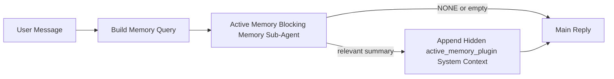

---
read_when:
    - Etkin belleğin ne için olduğunu anlamak istiyorsunuz
    - Bir konuşma aracısı için etkin belleği açmak istiyorsunuz
    - Etkin bellek davranışını her yerde etkinleştirmeden ayarlamak istiyorsunuz
summary: İlgili belleği etkileşimli sohbet oturumlarına enjekte eden eklentiye ait engelleyici bellek alt aracısı
title: Etkin Bellek
x-i18n:
    generated_at: "2026-04-12T08:32:54Z"
    model: gpt-5.4
    provider: openai
    source_hash: 59456805c28daaab394ba2a7f87e1104a1334a5cf32dbb961d5d232d9c471d84
    source_path: concepts/active-memory.md
    workflow: 15
---

# Etkin Bellek

Etkin bellek, uygun konuşma oturumlarında ana yanıttan önce çalışan, eklentiye ait isteğe bağlı bir engelleyici bellek alt aracısıdır.

Bunun var olma nedeni, çoğu bellek sisteminin yetenekli ama tepkisel olmasıdır. Ana aracının bellekte ne zaman arama yapacağına karar vermesine veya kullanıcının "bunu hatırla" ya da "bellekte ara" gibi şeyler söylemesine dayanırlar. O noktaya gelindiğinde, belleğin yanıtı doğal hissettireceği an çoktan geçmiş olur.

Etkin bellek, ana yanıt oluşturulmadan önce sisteme ilgili belleği ortaya çıkarma konusunda sınırlı bir fırsat verir.

## Bunu Aracınıza Yapıştırın

Etkin Belleği kendi içinde yeterli, güvenli varsayılanlara sahip bir kurulumla etkinleştirmek istiyorsanız bunu aracınıza yapıştırın:

```json5
{
  plugins: {
    entries: {
      "active-memory": {
        enabled: true,
        config: {
          enabled: true,
          agents: ["main"],
          allowedChatTypes: ["direct"],
          modelFallback: "google/gemini-3-flash",
          queryMode: "recent",
          promptStyle: "balanced",
          timeoutMs: 15000,
          maxSummaryChars: 220,
          persistTranscripts: false,
          logging: true,
        },
      },
    },
  },
}
```

Bu, eklentiyi `main` aracısı için açar, varsayılan olarak bunu yalnızca doğrudan mesaj tarzı oturumlarla sınırlar, önce geçerli oturum modelini devralmasına izin verir ve yalnızca açıkça belirtilmiş veya devralınmış bir model yoksa yapılandırılmış geri dönüş modelini kullanır.

Ardından gateway'i yeniden başlatın:

```bash
openclaw gateway
```

Bunu bir konuşmada canlı olarak incelemek için:

```text
/verbose on
```

## Etkin belleği açın

En güvenli kurulum şudur:

1. eklentiyi etkinleştirin
2. bir konuşma aracısını hedefleyin
3. ayarlama yaparken günlük kaydını açık tutun

`openclaw.json` içinde şununla başlayın:

```json5
{
  plugins: {
    entries: {
      "active-memory": {
        enabled: true,
        config: {
          agents: ["main"],
          allowedChatTypes: ["direct"],
          modelFallback: "google/gemini-3-flash",
          queryMode: "recent",
          promptStyle: "balanced",
          timeoutMs: 15000,
          maxSummaryChars: 220,
          persistTranscripts: false,
          logging: true,
        },
      },
    },
  },
}
```

Ardından gateway'i yeniden başlatın:

```bash
openclaw gateway
```

Bunun anlamı şudur:

- `plugins.entries.active-memory.enabled: true` eklentiyi açar
- `config.agents: ["main"]` yalnızca `main` aracısını etkin belleğe dahil eder
- `config.allowedChatTypes: ["direct"]` varsayılan olarak etkin belleği yalnızca doğrudan mesaj tarzı oturumlar için açık tutar
- `config.model` ayarlanmamışsa, etkin bellek önce geçerli oturum modelini devralır
- `config.modelFallback` isteğe bağlı olarak geri çağırma için kendi geri dönüş sağlayıcınızı/modelinizi sunar
- `config.promptStyle: "balanced"` `recent` modu için varsayılan genel amaçlı istem stilini kullanır
- etkin bellek yine de yalnızca uygun etkileşimli kalıcı sohbet oturumlarında çalışır

## Nasıl görebilirsiniz

Etkin bellek, model için gizli sistem bağlamı enjekte eder. Ham `<active_memory_plugin>...</active_memory_plugin>` etiketlerini istemciye göstermez.

## Oturum geçişi

Yapılandırmayı düzenlemeden geçerli sohbet oturumu için etkin belleği duraklatmak veya sürdürmek istediğinizde eklenti komutunu kullanın:

```text
/active-memory status
/active-memory off
/active-memory on
```

Bu oturum kapsamındadır. Şunları değiştirmez:
`plugins.entries.active-memory.enabled`, aracı hedefleme veya diğer genel
yapılandırmalar.

Komutun yapılandırmaya yazmasını ve tüm oturumlar için etkin belleği duraklatmasını veya sürdürmesini istiyorsanız, açık genel biçimi kullanın:

```text
/active-memory status --global
/active-memory off --global
/active-memory on --global
```

Genel biçim `plugins.entries.active-memory.config.enabled` değerini yazar. `plugins.entries.active-memory.enabled` değerini açık bırakır; böylece komut, etkin belleği daha sonra yeniden açmak için kullanılabilir kalır.

Etkin belleğin canlı bir oturumda ne yaptığını görmek istiyorsanız, o oturum için ayrıntılı modu açın:

```text
/verbose on
```

Ayrıntılı mod etkinleştirildiğinde, OpenClaw şunları gösterebilir:

- `Active Memory: ok 842ms recent 34 chars` gibi bir etkin bellek durum satırı
- `Active Memory Debug: Lemon pepper wings with blue cheese.` gibi okunabilir bir hata ayıklama özeti

Bu satırlar, gizli sistem bağlamını besleyen aynı etkin bellek geçişinden türetilir, ancak ham istem işaretlemesini açığa çıkarmak yerine insanlar için biçimlendirilir.

Varsayılan olarak, engelleyici bellek alt aracısı dökümü geçicidir ve çalıştırma tamamlandıktan sonra silinir.

Örnek akış:

```text
/verbose on
hangi kanatları sipariş etmeliyim?
```

Beklenen görünür yanıt biçimi:

```text
...normal assistant reply...

🧩 Active Memory: ok 842ms recent 34 chars
🔎 Active Memory Debug: Lemon pepper wings with blue cheese.
```

## Ne zaman çalışır

Etkin bellek iki eşik kullanır:

1. **Yapılandırma ile katılım**
   Eklenti etkin olmalıdır ve geçerli aracı kimliği
   `plugins.entries.active-memory.config.agents` içinde görünmelidir.
2. **Sıkı çalışma zamanı uygunluğu**
   Etkinleştirilmiş ve hedeflenmiş olsa bile, etkin bellek yalnızca uygun
   etkileşimli kalıcı sohbet oturumları için çalışır.

Asıl kural şudur:

```text
eklenti etkin
+
aracı kimliği hedeflenmiş
+
izin verilen sohbet türü
+
uygun etkileşimli kalıcı sohbet oturumu
=
etkin bellek çalışır
```

Bunlardan herhangi biri başarısız olursa, etkin bellek çalışmaz.

## Oturum türleri

`config.allowedChatTypes`, hangi konuşma türlerinin Etkin Belleği
çalıştırabileceğini kontrol eder.

Varsayılan değer şudur:

```json5
allowedChatTypes: ["direct"]
```

Bu, Etkin Belleğin varsayılan olarak doğrudan mesaj tarzı oturumlarda çalıştığı, ancak siz açıkça dahil etmedikçe grup veya kanal oturumlarında çalışmadığı anlamına gelir.

Örnekler:

```json5
allowedChatTypes: ["direct"]
```

```json5
allowedChatTypes: ["direct", "group"]
```

```json5
allowedChatTypes: ["direct", "group", "channel"]
```

## Nerede çalışır

Etkin bellek, platform genelinde bir çıkarım özelliği değil, konuşmaları zenginleştirme özelliğidir.

| Surface                                                             | Etkin bellek çalışır mı?                                |
| ------------------------------------------------------------------- | ------------------------------------------------------- |
| Control UI / web chat persistent sessions                           | Evet, eklenti etkinse ve aracı hedeflenmişse            |
| Other interactive channel sessions on the same persistent chat path | Evet, eklenti etkinse ve aracı hedeflenmişse            |
| Headless one-shot runs                                              | Hayır                                                   |
| Heartbeat/background runs                                           | Hayır                                                   |
| Generic internal `agent-command` paths                              | Hayır                                                   |
| Sub-agent/internal helper execution                                 | Hayır                                                   |

## Neden kullanılır

Etkin belleği şu durumlarda kullanın:

- oturum kalıcı ve kullanıcıya dönükse
- aracının aranacak anlamlı uzun vadeli belleği varsa
- süreklilik ve kişiselleştirme, ham istem belirlenimciliğinden daha önemliyse

Özellikle şunlar için iyi çalışır:

- istikrarlı tercihler
- tekrar eden alışkanlıklar
- doğal biçimde ortaya çıkması gereken uzun vadeli kullanıcı bağlamı

Şunlar için kötü bir seçimdir:

- otomasyon
- iç çalışanlar
- tek seferlik API görevleri
- gizli kişiselleştirmenin şaşırtıcı olacağı yerler

## Nasıl çalışır

Çalışma zamanı biçimi şöyledir:



Engelleyici bellek alt aracısı yalnızca şunları kullanabilir:

- `memory_search`
- `memory_get`

Bağlantı zayıfsa `NONE` döndürmelidir.

## Sorgu modları

`config.queryMode`, engelleyici bellek alt aracısının konuşmanın ne kadarını gördüğünü kontrol eder.

## İstem stilleri

`config.promptStyle`, engelleyici bellek alt aracısının belleği döndürüp döndürmeye karar verirken ne kadar istekli veya katı olduğunu kontrol eder.

Kullanılabilir stiller:

- `balanced`: `recent` modu için genel amaçlı varsayılan
- `strict`: en az istekli; yakın bağlamdan çok az sızıntı istediğinizde en iyisi
- `contextual`: sürekliliğe en uygun; konuşma geçmişinin daha önemli olması gerektiğinde en iyisi
- `recall-heavy`: daha zayıf ama yine de makul eşleşmelerde belleği ortaya çıkarmaya daha isteklidir
- `precision-heavy`: eşleşme bariz olmadıkça agresif biçimde `NONE` tercih eder
- `preference-only`: favoriler, alışkanlıklar, rutinler, zevkler ve tekrar eden kişisel gerçekler için optimize edilmiştir

`config.promptStyle` ayarlanmamışsa varsayılan eşleme:

```text
message -> strict
recent -> balanced
full -> contextual
```

`config.promptStyle` değerini açıkça ayarlarsanız, bu geçersiz kılma kazanır.

Örnek:

```json5
promptStyle: "preference-only"
```

## Model geri dönüş ilkesi

`config.model` ayarlanmamışsa, Etkin Bellek modeli şu sırayla çözümlemeye çalışır:

```text
açık eklenti modeli
-> geçerli oturum modeli
-> aracı birincil modeli
-> isteğe bağlı yapılandırılmış geri dönüş modeli
```

`config.modelFallback`, yapılandırılmış geri dönüş adımını kontrol eder.

İsteğe bağlı özel geri dönüş:

```json5
modelFallback: "google/gemini-3-flash"
```

Açık, devralınmış veya yapılandırılmış bir geri dönüş modeli çözümlenmezse, Etkin Bellek o tur için geri çağırmayı atlar.

`config.modelFallbackPolicy`, yalnızca eski yapılandırmalar için kullanımdan kaldırılmış bir uyumluluk alanı olarak tutulur. Artık çalışma zamanı davranışını değiştirmez.

## Gelişmiş kaçış kapıları

Bu seçenekler kasıtlı olarak önerilen kurulumun parçası değildir.

`config.thinking`, engelleyici bellek alt aracısının düşünme düzeyini geçersiz kılabilir:

```json5
thinking: "medium"
```

Varsayılan:

```json5
thinking: "off"
```

Bunu varsayılan olarak etkinleştirmeyin. Etkin Bellek yanıt yolunda çalışır, bu nedenle ek düşünme süresi kullanıcı tarafından görülen gecikmeyi doğrudan artırır.

`config.promptAppend`, varsayılan Etkin Bellek isteminden sonra ve konuşma bağlamından önce ek operatör talimatları ekler:

```json5
promptAppend: "Tek seferlik olaylar yerine istikrarlı uzun vadeli tercihleri önceliklendir."
```

`config.promptOverride`, varsayılan Etkin Bellek istemini değiştirir. OpenClaw daha sonra konuşma bağlamını yine ekler:

```json5
promptOverride: "Bir bellek arama aracısısınız. NONE veya tek bir kompakt kullanıcı gerçeği döndürün."
```

İstem özelleştirmesi, kasıtlı olarak farklı bir geri çağırma sözleşmesini test etmiyorsanız önerilmez. Varsayılan istem, ana model için ya `NONE` ya da kompakt kullanıcı gerçeği bağlamı döndürecek şekilde ayarlanmıştır.

### `message`

Yalnızca en son kullanıcı mesajı gönderilir.

```text
Yalnızca en son kullanıcı mesajı
```

Bunu şu durumlarda kullanın:

- en hızlı davranışı istiyorsanız
- istikrarlı tercih geri çağırmaya en güçlü eğilimi istiyorsanız
- takip turları konuşma bağlamına ihtiyaç duymuyorsa

Önerilen zaman aşımı:

- yaklaşık `3000` ile `5000` ms arasında başlayın

### `recent`

En son kullanıcı mesajı artı yakın geçmişten küçük bir konuşma kuyruğu gönderilir.

```text
Yakın konuşma kuyruğu:
user: ...
assistant: ...
user: ...

En son kullanıcı mesajı:
...
```

Bunu şu durumlarda kullanın:

- hız ve konuşma temellendirmesi arasında daha iyi bir denge istiyorsanız
- takip soruları genellikle son birkaç tura bağlıysa

Önerilen zaman aşımı:

- yaklaşık `15000` ms ile başlayın

### `full`

Tam konuşma engelleyici bellek alt aracısına gönderilir.

```text
Tam konuşma bağlamı:
user: ...
assistant: ...
user: ...
...
```

Bunu şu durumlarda kullanın:

- en güçlü geri çağırma kalitesi gecikmeden daha önemliyse
- konuşma dizisinin çok gerilerinde önemli kurulum bilgileri varsa

Önerilen zaman aşımı:

- bunu `message` veya `recent` ile karşılaştırıldığında belirgin biçimde artırın
- dizi boyutuna bağlı olarak yaklaşık `15000` ms veya daha yüksek bir değerden başlayın

Genel olarak, zaman aşımı bağlam boyutuyla birlikte artmalıdır:

```text
message < recent < full
```

## Döküm kalıcılığı

Etkin bellek engelleyici bellek alt aracısı çalıştırmaları, engelleyici bellek alt aracısı çağrısı sırasında gerçek bir `session.jsonl` dökümü oluşturur.

Varsayılan olarak bu döküm geçicidir:

- geçici bir dizine yazılır
- yalnızca engelleyici bellek alt aracısı çalıştırması için kullanılır
- çalıştırma biter bitmez silinir

Hata ayıklama veya inceleme amacıyla bu engelleyici bellek alt aracısı dökümlerini diskte tutmak istiyorsanız, kalıcılığı açıkça etkinleştirin:

```json5
{
  plugins: {
    entries: {
      "active-memory": {
        enabled: true,
        config: {
          agents: ["main"],
          persistTranscripts: true,
          transcriptDir: "active-memory",
        },
      },
    },
  },
}
```

Etkinleştirildiğinde, etkin bellek dökümleri ana kullanıcı konuşması döküm yolunda değil, hedef aracının oturum klasörü altında ayrı bir dizinde depolar.

Varsayılan yerleşim kavramsal olarak şöyledir:

```text
agents/<agent>/sessions/active-memory/<blocking-memory-sub-agent-session-id>.jsonl
```

Göreli alt dizini `config.transcriptDir` ile değiştirebilirsiniz.

Bunu dikkatli kullanın:

- engelleyici bellek alt aracısı dökümleri yoğun oturumlarda hızla birikebilir
- `full` sorgu modu çok fazla konuşma bağlamını kopyalayabilir
- bu dökümler gizli istem bağlamı ve geri çağrılan anıları içerir

## Yapılandırma

Tüm etkin bellek yapılandırması şunun altında bulunur:

```text
plugins.entries.active-memory
```

En önemli alanlar şunlardır:

| Key                         | Type                                                                                                 | Anlamı                                                                                                 |
| --------------------------- | ---------------------------------------------------------------------------------------------------- | ------------------------------------------------------------------------------------------------------ |
| `enabled`                   | `boolean`                                                                                            | Eklentinin kendisini etkinleştirir                                                                     |
| `config.agents`             | `string[]`                                                                                           | Etkin belleği kullanabilen aracı kimlikleri                                                           |
| `config.model`              | `string`                                                                                             | İsteğe bağlı engelleyici bellek alt aracısı model başvurusu; ayarlanmamışsa etkin bellek geçerli oturum modelini kullanır |
| `config.queryMode`          | `"message" \| "recent" \| "full"`                                                                    | Engelleyici bellek alt aracısının konuşmanın ne kadarını gördüğünü kontrol eder                        |
| `config.promptStyle`        | `"balanced" \| "strict" \| "contextual" \| "recall-heavy" \| "precision-heavy" \| "preference-only"` | Engelleyici bellek alt aracısının belleği döndürüp döndürmeye karar verirken ne kadar istekli veya katı olduğunu kontrol eder |
| `config.thinking`           | `"off" \| "minimal" \| "low" \| "medium" \| "high" \| "xhigh" \| "adaptive"`                         | Engelleyici bellek alt aracısı için gelişmiş düşünme geçersiz kılması; hız için varsayılan `off`      |
| `config.promptOverride`     | `string`                                                                                             | Gelişmiş tam istem değiştirme; normal kullanım için önerilmez                                          |
| `config.promptAppend`       | `string`                                                                                             | Varsayılan veya geçersiz kılınmış isteme eklenen gelişmiş ek talimatlar                                |
| `config.timeoutMs`          | `number`                                                                                             | Engelleyici bellek alt aracısı için kesin zaman aşımı                                                  |
| `config.maxSummaryChars`    | `number`                                                                                             | Etkin bellek özeti içinde izin verilen en yüksek toplam karakter sayısı                                |
| `config.logging`            | `boolean`                                                                                            | Ayarlama sırasında etkin bellek günlüklerini üretir                                                    |
| `config.persistTranscripts` | `boolean`                                                                                            | Engelleyici bellek alt aracısı dökümlerini geçici dosyaları silmek yerine diskte tutar                |
| `config.transcriptDir`      | `string`                                                                                             | Aracı oturumları klasörü altındaki göreli engelleyici bellek alt aracısı döküm dizini                 |

Yararlı ayarlama alanları:

| Key                           | Type     | Anlamı                                                       |
| ----------------------------- | -------- | ------------------------------------------------------------ |
| `config.maxSummaryChars`      | `number` | Etkin bellek özetinde izin verilen en yüksek toplam karakter sayısı |
| `config.recentUserTurns`      | `number` | `queryMode` `recent` olduğunda dahil edilecek önceki kullanıcı turları |
| `config.recentAssistantTurns` | `number` | `queryMode` `recent` olduğunda dahil edilecek önceki asistan turları |
| `config.recentUserChars`      | `number` | Yakın tarihli kullanıcı turu başına en yüksek karakter sayısı |
| `config.recentAssistantChars` | `number` | Yakın tarihli asistan turu başına en yüksek karakter sayısı  |
| `config.cacheTtlMs`           | `number` | Yinelenen aynı sorgular için önbellek yeniden kullanımı      |

## Önerilen kurulum

`recent` ile başlayın.

```json5
{
  plugins: {
    entries: {
      "active-memory": {
        enabled: true,
        config: {
          agents: ["main"],
          queryMode: "recent",
          promptStyle: "balanced",
          timeoutMs: 15000,
          maxSummaryChars: 220,
          logging: true,
        },
      },
    },
  },
}
```

Ayarlama yaparken canlı davranışı incelemek istiyorsanız, ayrı bir active-memory hata ayıklama komutu aramak yerine oturumda `/verbose on` kullanın.

Ardından şuna geçin:

- daha düşük gecikme istiyorsanız `message`
- ek bağlamın daha yavaş engelleyici bellek alt aracısına değdiğine karar verirseniz `full`

## Hata ayıklama

Etkin bellek beklediğiniz yerde görünmüyorsa:

1. Eklentinin `plugins.entries.active-memory.enabled` altında etkin olduğunu doğrulayın.
2. Geçerli aracı kimliğinin `config.agents` içinde listelendiğini doğrulayın.
3. Testi etkileşimli kalıcı bir sohbet oturumu üzerinden yaptığınızı doğrulayın.
4. `config.logging: true` ayarını açın ve gateway günlüklerini izleyin.
5. Bellek aramasının kendisinin `openclaw memory status --deep` ile çalıştığını doğrulayın.

Bellek eşleşmeleri gürültülüyse şunu sıkılaştırın:

- `maxSummaryChars`

Etkin bellek çok yavaşsa:

- `queryMode` değerini düşürün
- `timeoutMs` değerini düşürün
- yakın tarihli tur sayılarını azaltın
- tur başına karakter sınırlarını azaltın

## İlgili sayfalar

- [Bellek Arama](/tr/concepts/memory-search)
- [Bellek yapılandırma başvurusu](/tr/reference/memory-config)
- [Plugin SDK kurulumu](/tr/plugins/sdk-setup)
