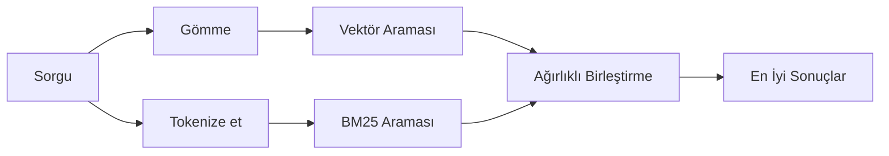

---
read_when:
    - memory_search'un nasıl çalıştığını anlamak istiyorsunuz
    - Bir gömme sağlayıcısı seçmek istiyorsunuz
    - Arama kalitesini ayarlamak istiyorsunuz
summary: Memory aramasının, gömmeler ve hibrit getirim kullanarak ilgili notları nasıl bulduğu
title: Memory araması
x-i18n:
    generated_at: "2026-04-25T13:45:23Z"
    model: gpt-5.4
    provider: openai
    source_hash: 5cc6bbaf7b0a755bbe44d3b1b06eed7f437ebdc41a81c48cca64bd08bbc546b7
    source_path: concepts/memory-search.md
    workflow: 15
---

`memory_search`, ifade biçimi özgün metinden farklı olduğunda bile memory dosyalarınızdan ilgili notları bulur. Bunu, memory'yi küçük parçalara dizinleyip bu parçaları gömmeler, anahtar kelimeler veya her ikisini kullanarak arayarak yapar.

## Hızlı başlangıç

Yapılandırılmış bir GitHub Copilot aboneliğiniz, OpenAI, Gemini, Voyage veya Mistral API anahtarınız varsa memory araması otomatik olarak çalışır. Bir sağlayıcıyı açıkça ayarlamak için:

```json5
{
  agents: {
    defaults: {
      memorySearch: {
        provider: "openai", // veya "gemini", "local", "ollama" vb.
      },
    },
  },
}
```

API anahtarı olmadan yerel gömmeler için, isteğe bağlı `node-llama-cpp` çalışma zamanı paketini OpenClaw'ın yanına kurun ve `provider: "local"` kullanın.

## Desteklenen sağlayıcılar

| Sağlayıcı      | Kimlik           | API anahtarı gerekir | Notlar                                               |
| -------------- | ---------------- | -------------------- | ---------------------------------------------------- |
| Bedrock        | `bedrock`        | Hayır                | AWS kimlik bilgisi zinciri çözümlendiğinde otomatik algılanır |
| Gemini         | `gemini`         | Evet                 | Görsel/ses dizinlemeyi destekler                     |
| GitHub Copilot | `github-copilot` | Hayır                | Otomatik algılanır, Copilot aboneliğini kullanır     |
| Local          | `local`          | Hayır                | GGUF model, ~0.6 GB indirme                          |
| Mistral        | `mistral`        | Evet                 | Otomatik algılanır                                   |
| Ollama         | `ollama`         | Hayır                | Yerel, açıkça ayarlanmalıdır                         |
| OpenAI         | `openai`         | Evet                 | Otomatik algılanır, hızlıdır                         |
| Voyage         | `voyage`         | Evet                 | Otomatik algılanır                                   |

## Arama nasıl çalışır

OpenClaw iki getirim yolunu paralel çalıştırır ve sonuçları birleştirir:



- **Vektör araması**, anlam olarak benzer notları bulur (`gateway host`,
  `"OpenClaw'ı çalıştıran makine"` ile eşleşir).
- **BM25 anahtar kelime araması**, tam eşleşmeleri bulur (kimlikler, hata
  dizeleri, yapılandırma anahtarları).

Yalnızca bir yol kullanılabiliyorsa (gömme yoksa veya FTS yoksa), diğeri tek başına çalışır.

Gömmeler kullanılamadığında OpenClaw, yalnızca ham tam eşleşme sıralamasına geri dönmek yerine yine de FTS sonuçları üzerinde sözcüksel sıralama kullanır. Bu bozulmuş mod, daha güçlü sorgu terimi kapsamına ve ilgili dosya yollarına sahip parçaları yükseltir; bu da `sqlite-vec` veya bir gömme sağlayıcısı olmadan bile geri çağırmayı kullanışlı tutar.

## Arama kalitesini iyileştirme

Büyük bir not geçmişiniz olduğunda iki isteğe bağlı özellik yardımcı olur:

### Zamansal azalma

Eski notlar sıralama ağırlığını kademeli olarak kaybeder, böylece son bilgiler önce görünür.
Varsayılan 30 günlük yarı ömürde, geçen aydan bir not özgün ağırlığının %50'siyle puanlanır.
`MEMORY.md` gibi kalıcı dosyalarda asla azalma uygulanmaz.

<Tip>
Ajanınızın aylarca günlük notları varsa ve eski bilgiler sürekli son bağlamın önüne geçiyorsa zamansal azalmayı etkinleştirin.
</Tip>

### MMR (çeşitlilik)

Yinelenen sonuçları azaltır. Beş notun hepsi aynı yönlendirici yapılandırmasından bahsediyorsa, MMR
en üst sonuçların tekrar etmek yerine farklı konuları kapsamasını sağlar.

<Tip>
`memory_search`, farklı günlük notlardan birbirine çok benzeyen parçaları sürekli döndürüyorsa MMR'yi etkinleştirin.
</Tip>

### İkisini de etkinleştirme

```json5
{
  agents: {
    defaults: {
      memorySearch: {
        query: {
          hybrid: {
            mmr: { enabled: true },
            temporalDecay: { enabled: true },
          },
        },
      },
    },
  },
}
```

## Çok modlu memory

Gemini Embedding 2 ile görselleri ve ses dosyalarını Markdown ile birlikte dizinleyebilirsiniz. Arama sorguları metin olarak kalır, ancak görsel ve ses içeriğiyle eşleşir. Kurulum için [Memory yapılandırma başvurusu](/tr/reference/memory-config) bölümüne bakın.

## Oturum memory araması

`memory_search`'ün önceki konuşmaları hatırlayabilmesi için isteğe bağlı olarak oturum transcript'lerini dizinleyebilirsiniz. Bu özellik `memorySearch.experimental.sessionMemory` aracılığıyla katılımlıdır. Ayrıntılar için [yapılandırma başvurusu](/tr/reference/memory-config) bölümüne bakın.

## Sorun giderme

**Sonuç yok mu?** Dizini denetlemek için `openclaw memory status` çalıştırın. Boşsa
`openclaw memory index --force` çalıştırın.

**Yalnızca anahtar kelime eşleşmeleri mi var?** Gömme sağlayıcınız yapılandırılmamış olabilir. `openclaw memory status --deep` komutunu denetleyin.

**CJK metni bulunamıyor mu?** FTS dizinini şu komutla yeniden oluşturun:
`openclaw memory index --force`.

## Daha fazla okuma

- [Active Memory](/tr/concepts/active-memory) -- etkileşimli sohbet oturumları için alt ajan memory'si
- [Memory](/tr/concepts/memory) -- dosya düzeni, arka uçlar, araçlar
- [Memory yapılandırma başvurusu](/tr/reference/memory-config) -- tüm yapılandırma ayarları

## İlgili

- [Memory genel bakışı](/tr/concepts/memory)
- [Active Memory](/tr/concepts/active-memory)
- [Yerleşik memory motoru](/tr/concepts/memory-builtin)
