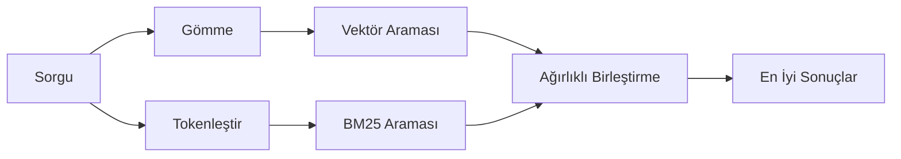

---
read_when:
    - '`memory_search` işleyişini anlamak istiyorsunuz.'
    - Bir gömme sağlayıcısı seçmek istiyorsunuz.
    - Arama kalitesini ayarlamak istiyorsunuz.
summary: Bellek araması, ilgili notları gömmeler ve hibrit erişim kullanarak nasıl bulur?
title: Bellek Araması
x-i18n:
    generated_at: "2026-04-10T08:50:06Z"
    model: gpt-5.4
    provider: openai
    source_hash: ca0237f4f1ee69dcbfb12e6e9527a53e368c0bf9b429e506831d4af2f3a3ac6f
    source_path: concepts/memory-search.md
    workflow: 15
---

# Bellek Araması

`memory_search`, ifade biçimi özgün metinden farklı olsa bile bellek dosyalarınızdan ilgili notları bulur. Bunu, belleği küçük parçalara ayırarak dizinleyip gömmeler, anahtar kelimeler ya da her ikisini kullanarak arayarak yapar.

## Hızlı başlangıç

Yapılandırılmış bir OpenAI, Gemini, Voyage veya Mistral API anahtarınız varsa bellek araması otomatik olarak çalışır. Bir sağlayıcıyı açıkça ayarlamak için:

```json5
{
  agents: {
    defaults: {
      memorySearch: {
        provider: "openai", // veya "gemini", "local", "ollama" vb.
      },
    },
  },
}
```

API anahtarı olmadan yerel gömmeler için `provider: "local"` kullanın (`node-llama-cpp` gerektirir).

## Desteklenen sağlayıcılar

| Sağlayıcı | Kimlik     | API anahtarı gerekir | Notlar                                               |
| --------- | ---------- | -------------------- | ---------------------------------------------------- |
| OpenAI    | `openai`   | Evet                 | Otomatik algılanır, hızlı                            |
| Gemini    | `gemini`   | Evet                 | Görsel/ses dizinlemeyi destekler                     |
| Voyage    | `voyage`   | Evet                 | Otomatik algılanır                                   |
| Mistral   | `mistral`  | Evet                 | Otomatik algılanır                                   |
| Bedrock   | `bedrock`  | Hayır                | AWS kimlik bilgisi zinciri çözümlendiğinde otomatik algılanır |
| Ollama    | `ollama`   | Hayır                | Yerel, açıkça ayarlanmalıdır                         |
| Local     | `local`    | Hayır                | GGUF model, ~0.6 GB indirme                          |

## Arama nasıl çalışır

OpenClaw iki erişim yolunu paralel olarak çalıştırır ve sonuçları birleştirir:



- **Vektör araması**, benzer anlama sahip notları bulur ("gateway host", "OpenClaw çalıştıran makine" ile eşleşir).
- **BM25 anahtar kelime araması**, tam eşleşmeleri bulur (kimlikler, hata dizeleri, yapılandırma anahtarları).

Yalnızca bir yol kullanılabiliyorsa (gömme yoksa veya FTS yoksa), diğeri tek başına çalışır.

## Arama kalitesini iyileştirme

Büyük bir not geçmişiniz varsa iki isteğe bağlı özellik yardımcı olur:

### Zamansal azalma

Eski notlar sıralama ağırlığını kademeli olarak kaybeder, böylece son bilgiler önce görünür. Varsayılan 30 günlük yarı ömürle, geçen aydan bir not özgün ağırlığının %50’siyle puanlanır. `MEMORY.md` gibi her zaman geçerli dosyalar hiçbir zaman azaltılmaz.

<Tip>
Aracınızın aylarca günlük notu varsa ve eski bilgiler sürekli son bağlamın önüne geçiyorsa zamansal azalmayı etkinleştirin.
</Tip>

### MMR (çeşitlilik)

Tekrarlayan sonuçları azaltır. Beş notun hepsi aynı yönlendirici yapılandırmasından söz ediyorsa MMR, en üstteki sonuçların tekrar etmek yerine farklı konuları kapsamasını sağlar.

<Tip>
`memory_search`, farklı günlük notlardan birbirine çok benzeyen parçaları sürekli döndürüyorsa MMR’yi etkinleştirin.
</Tip>

### İkisini de etkinleştirme

```json5
{
  agents: {
    defaults: {
      memorySearch: {
        query: {
          hybrid: {
            mmr: { enabled: true },
            temporalDecay: { enabled: true },
          },
        },
      },
    },
  },
}
```

## Çok kipli bellek

Gemini Embedding 2 ile görselleri ve ses dosyalarını Markdown ile birlikte dizinleyebilirsiniz. Arama sorguları metin olarak kalır, ancak görsel ve ses içeriğiyle eşleşir. Kurulum için [Bellek yapılandırma başvurusu](/tr/reference/memory-config) bölümüne bakın.

## Oturum belleği araması

İsteğe bağlı olarak oturum dökümlerini dizinleyebilirsiniz; böylece `memory_search` önceki konuşmaları hatırlayabilir. Bu özellik `memorySearch.experimental.sessionMemory` üzerinden isteğe bağlı olarak etkinleştirilir. Ayrıntılar için [yapılandırma başvurusu](/tr/reference/memory-config) bölümüne bakın.

## Sorun giderme

**Sonuç yok mu?** Dizini kontrol etmek için `openclaw memory status` çalıştırın. Boşsa `openclaw memory index --force` çalıştırın.

**Yalnızca anahtar kelime eşleşmeleri mi var?** Gömme sağlayıcınız yapılandırılmamış olabilir. `openclaw memory status --deep` ile kontrol edin.

**CJK metni bulunamıyor mu?** FTS dizinini `openclaw memory index --force` ile yeniden oluşturun.

## Daha fazla bilgi

- [Etkin Bellek](/tr/concepts/active-memory) -- etkileşimli sohbet oturumları için alt aracı belleği
- [Bellek](/tr/concepts/memory) -- dosya düzeni, arka uçlar, araçlar
- [Bellek yapılandırma başvurusu](/tr/reference/memory-config) -- tüm yapılandırma seçenekleri
