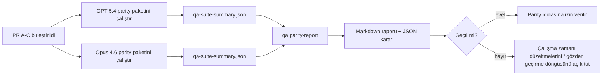

---
read_when:
    - GPT-5.4 / Codex eşdeğerlik PR serisini gözden geçirme
    - Parity programının arkasındaki altı sözleşmeli ajantik mimariyi sürdürme
summary: GPT-5.4 / Codex eşdeğerlik programını dört birleştirme birimi olarak nasıl gözden geçireceğiniz
title: GPT-5.4 / Codex eşdeğerlik maintainer notları
x-i18n:
    generated_at: "2026-04-25T13:49:20Z"
    model: gpt-5.4
    provider: openai
    source_hash: 162ea68476880d4dbf9b8c3b9397a51a2732c3eb10ac52e421a9c9d90e04eec2
    source_path: help/gpt54-codex-agentic-parity-maintainers.md
    workflow: 15
---

Bu not, GPT-5.4 / Codex parity programını özgün altı sözleşmeli mimariyi kaybetmeden dört birleştirme birimi olarak nasıl gözden geçireceğinizi açıklar.

## Birleştirme birimleri

### PR A: strict-agentic yürütme

Şunlara sahiptir:

- `executionContract`
- GPT-5 öncelikli aynı tur içinde devam etme
- terminal olmayan ilerleme takibi olarak `update_plan`
- yalnızca plan tabanlı sessiz durmalar yerine açık engellenmiş durumlar

Şunlara sahip değildir:

- kimlik doğrulama/çalışma zamanı hata sınıflandırması
- izin doğruculuğu
- replay/devam ettirme yeniden tasarımı
- parity kıyaslaması

### PR B: çalışma zamanı doğruculuğu

Şunlara sahiptir:

- Codex OAuth kapsam doğruluğu
- türlenmiş sağlayıcı/çalışma zamanı hata sınıflandırması
- dürüst `/elevated full` kullanılabilirliği ve engellenme nedenleri

Şunlara sahip değildir:

- araç şeması normalizasyonu
- replay/canlılık durumu
- kıyaslama geçidi

### PR C: yürütme doğruluğu

Şunlara sahiptir:

- sağlayıcıya ait OpenAI/Codex araç uyumluluğu
- parametresiz katı şema işleme
- replay-invalid yüzeye çıkarma
- duraklatılmış, engellenmiş ve terk edilmiş uzun görev durumu görünürlüğü

Şunlara sahip değildir:

- kendi kendine seçilmiş devam ettirme
- sağlayıcı kancaları dışındaki genel Codex lehçesi davranışı
- kıyaslama geçidi

### PR D: parity harness

Şunlara sahiptir:

- ilk dalga GPT-5.4 ile Opus 4.6 senaryo paketi
- parity belgeleri
- parity raporu ve sürüm geçidi mekanikleri

Şunlara sahip değildir:

- QA-lab dışındaki çalışma zamanı davranış değişiklikleri
- harness içindeki kimlik doğrulama/proxy/DNS simülasyonu

## Özgün altı sözleşmeye geri eşleme

| Özgün sözleşme                          | Birleştirme birimi |
| --------------------------------------- | ------------------ |
| Sağlayıcı aktarım/kimlik doğrulama doğruluğu | PR B           |
| Araç sözleşmesi/şema uyumluluğu         | PR C               |
| Aynı tur içinde yürütme                 | PR A               |
| İzin doğruculuğu                        | PR B               |
| Replay/devam ettirme/canlılık doğruluğu | PR C               |
| Kıyaslama/sürüm geçidi                  | PR D               |

## Gözden geçirme sırası

1. PR A
2. PR B
3. PR C
4. PR D

PR D kanıt katmanıdır. Çalışma zamanı doğruluğu PR'larının gecikme nedeni olmamalıdır.

## Nelere bakılmalı

### PR A

- GPT-5 çalıştırmaları yorumda durmak yerine eylem gerçekleştiriyor veya kapalı başarısız oluyor
- `update_plan` artık tek başına ilerleme gibi görünmüyor
- davranış GPT-5 öncelikli ve gömülü Pi kapsamlı kalıyor

### PR B

- kimlik doğrulama/proxy/çalışma zamanı hataları artık genel “model failed” işleyişine çökmez
- `/elevated full` yalnızca gerçekten kullanılabilir olduğunda kullanılabilir olarak anlatılır
- engellenme nedenleri hem modele hem de kullanıcıya dönük çalışma zamanına görünür

### PR C

- katı OpenAI/Codex araç kaydı öngörülebilir davranır
- parametresiz araçlar katı şema kontrollerinde başarısız olmaz
- replay ve Compaction sonuçları dürüst canlılık durumunu korur

### PR D

- senaryo paketi anlaşılır ve yeniden üretilebilirdir
- paket yalnızca salt okunur akışları değil, durum değiştiren bir replay güvenliği şeridini de içerir
- raporlar insanlar ve otomasyon tarafından okunabilir
- parity iddiaları anekdot değil, kanıt desteklidir

PR D'den beklenen varlıklar:

- her model çalıştırması için `qa-suite-report.md` / `qa-suite-summary.json`
- toplu ve senaryo düzeyinde karşılaştırmalı `qa-agentic-parity-report.md`
- makine tarafından okunabilir kararı içeren `qa-agentic-parity-summary.json`

## Sürüm geçidi

Şunlar gerçekleşmeden GPT-5.4'ün Opus 4.6 ile parity veya üstünlük sağladığını iddia etmeyin:

- PR A, PR B ve PR C birleştirildi
- PR D ilk dalga parity paketini temiz şekilde çalıştırıyor
- çalışma zamanı doğruculuğu regresyon paketleri yeşil kalıyor
- parity raporu sahte başarı vakası göstermiyor ve durma davranışında regresyon yok

Parity harness tek kanıt kaynağı değildir. İncelemede bu ayrımı açık tutun:

- GPT-5.4 ile Opus 4.6 arasındaki senaryo tabanlı karşılaştırmanın sahibi PR D'dir
- PR B deterministik paketleri hâlâ kimlik doğrulama/proxy/DNS ve tam erişim doğruculuğu kanıtının sahibidir

## Hızlı maintainer birleştirme iş akışı

Bir parity PR'ını indirmeye hazır olduğunuzda ve tekrarlanabilir, düşük riskli bir sıra istediğinizde bunu kullanın.

1. Birleştirmeden önce kanıt çıtasının karşılandığını doğrulayın:
   - yeniden üretilebilir belirti veya başarısız test
   - dokunulan kodda doğrulanmış kök neden
   - ilgili yolda düzeltme
   - regresyon testi veya açık manuel doğrulama notu
2. Birleştirmeden önce triage/etiketleme yapın:
   - PR inmemeliyse ilgili `r:*` otomatik kapatma etiketlerini uygulayın
   - birleştirme adaylarını çözülmemiş engelleyici tartışmalardan arındırın
3. Dokunulan yüzeyde yerelde doğrulayın:
   - `pnpm check:changed`
   - testler değiştiyse veya hata düzeltme güveni test kapsamına bağlıysa `pnpm test:changed`
4. Standart maintainer akışıyla (`/landpr` süreci) indirin, ardından doğrulayın:
   - bağlı issue'ların otomatik kapanma davranışı
   - `main` üzerinde CI ve birleştirme sonrası durum
5. İndirdikten sonra ilgili açık PR/issue'lar için duplicate araması yapın ve yalnızca kanonik bir referansla kapatın.

Kanıt çıtası öğelerinden biri bile eksikse birleştirmek yerine değişiklik isteyin.

## Hedeften kanıta eşleme

| Tamamlama geçidi öğesi                  | Birincil sahip | İnceleme varlığı                                                    |
| --------------------------------------- | -------------- | ------------------------------------------------------------------- |
| Yalnızca plan tabanlı takılma yok       | PR A           | strict-agentic çalışma zamanı testleri ve `approval-turn-tool-followthrough` |
| Sahte ilerleme veya sahte araç tamamlama yok | PR A + PR D | parity sahte başarı sayısı artı senaryo düzeyi rapor ayrıntıları    |
| Yanlış `/elevated full` rehberliği yok  | PR B           | deterministik çalışma zamanı doğruculuğu paketleri                  |
| Replay/canlılık hataları açık kalır     | PR C + PR D    | yaşam döngüsü/replay paketleri artı `compaction-retry-mutating-tool` |
| GPT-5.4, Opus 4.6 ile eşleşir veya onu geçer | PR D        | `qa-agentic-parity-report.md` ve `qa-agentic-parity-summary.json`   |

## Gözden geçiren için kısa özet: önce ve sonra

| Önceden kullanıcıya görünen sorun                       | Sonradan inceleme sinyali                                                                |
| ------------------------------------------------------- | ---------------------------------------------------------------------------------------- |
| GPT-5.4 planlamadan sonra duruyordu                     | PR A, yalnızca yorum tabanlı tamamlama yerine eylem veya engel davranışı gösterir        |
| Katı OpenAI/Codex şemalarıyla araç kullanımı kırılgan görünüyordu | PR C, araç kaydı ve parametresiz çağrıyı öngörülebilir tutar                     |
| `/elevated full` ipuçları bazen yanıltıcıydı            | PR B, rehberliği gerçek çalışma zamanı yeteneği ve engellenme nedenlerine bağlar         |
| Uzun görevler replay/Compaction belirsizliği içinde kaybolabiliyordu | PR C açık duraklatılmış, engellenmiş, terk edilmiş ve replay-invalid durum üretir |
| Parity iddiaları anekdot düzeyindeydi                   | PR D, her iki modelde de aynı senaryo kapsamıyla bir rapor ve JSON kararı üretir         |

## İlgili

- [GPT-5.4 / Codex agentic parity](/tr/help/gpt54-codex-agentic-parity)
