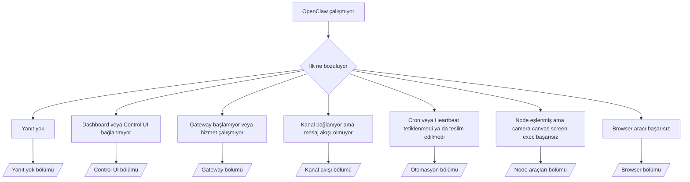

---
read_when:
    - OpenClaw çalışmıyor ve bir düzeltmeye ulaşmak için en hızlı yola ihtiyacınız var
    - Derin çalışma kılavuzlarına dalmadan önce bir triyaj akışı istiyorsunuz
summary: OpenClaw için önce belirtiye odaklanan sorun giderme merkezi
title: Genel Sorun Giderme
x-i18n:
    generated_at: "2026-04-20T09:03:58Z"
    model: gpt-5.4
    provider: openai
    source_hash: cc5d8c9f804084985c672c5a003ce866e8142ab99fe81abb7a0d38e22aea4b88
    source_path: help/troubleshooting.md
    workflow: 15
---

# Sorun Giderme

Yalnızca 2 dakikanız varsa, bu sayfayı bir triyaj giriş noktası olarak kullanın.

## İlk 60 saniye

Şu tam sırayı belirtilen düzende çalıştırın:

```bash
openclaw status
openclaw status --all
openclaw gateway probe
openclaw gateway status
openclaw doctor
openclaw channels status --probe
openclaw logs --follow
```

Tek satırda iyi çıktı:

- `openclaw status` → yapılandırılmış kanalları ve belirgin kimlik doğrulama hatalarının olmadığını gösterir.
- `openclaw status --all` → tam rapor mevcuttur ve paylaşılabilir.
- `openclaw gateway probe` → beklenen Gateway hedefi erişilebilir (`Reachable: yes`). `Capability: ...`, probun hangi kimlik doğrulama düzeyini doğrulayabildiğini söyler ve `Read probe: limited - missing scope: operator.read` bozulmuş tanılamadır, bağlantı hatası değildir.
- `openclaw gateway status` → `Runtime: running`, `Connectivity probe: ok` ve makul bir `Capability: ...` satırı. Okuma kapsamlı RPC kanıtına da ihtiyacınız varsa `--require-rpc` kullanın.
- `openclaw doctor` → engelleyici yapılandırma/hizmet hatası yok.
- `openclaw channels status --probe` → erişilebilir Gateway, canlı hesap başına taşıma
  durumunu ve `works` veya `audit ok` gibi probe/denetim sonuçlarını döndürür; eğer
  Gateway erişilemezse komut yalnızca yapılandırma özetlerine geri döner.
- `openclaw logs --follow` → istikrarlı etkinlik, tekrar eden ölümcül hata yok.

## Anthropic uzun bağlam 429

Şunu görürseniz:
`HTTP 429: rate_limit_error: Extra usage is required for long context requests`,
şuraya gidin: [/gateway/troubleshooting#anthropic-429-extra-usage-required-for-long-context](/tr/gateway/troubleshooting#anthropic-429-extra-usage-required-for-long-context).

## Yerel OpenAI uyumlu arka uç doğrudan çalışıyor ama OpenClaw içinde başarısız oluyor

Yerel veya self-hosted `/v1` arka ucunuz küçük doğrudan
`/v1/chat/completions` problarına yanıt veriyor ama `openclaw infer model run` veya normal
aracı turlarında başarısız oluyorsa:

1. Hata, `messages[].content` için string beklendiğini söylüyorsa
   `models.providers.<provider>.models[].compat.requiresStringContent: true` ayarlayın.
2. Arka uç hâlâ yalnızca OpenClaw aracı turlarında başarısız oluyorsa,
   `models.providers.<provider>.models[].compat.supportsTools: false` ayarlayın ve yeniden deneyin.
3. Küçük doğrudan çağrılar hâlâ çalışıyor ama daha büyük OpenClaw istemleri
   arka ucu çökertiyorsa, kalan sorunu üst akış model/sunucu sınırlaması olarak değerlendirin ve
   derin çalışma kılavuzunda devam edin:
   [/gateway/troubleshooting#local-openai-compatible-backend-passes-direct-probes-but-agent-runs-fail](/tr/gateway/troubleshooting#local-openai-compatible-backend-passes-direct-probes-but-agent-runs-fail)

## Eksik openclaw extensions nedeniyle Plugin kurulumu başarısız oluyor

Kurulum `package.json missing openclaw.extensions` ile başarısız oluyorsa, Plugin paketi
OpenClaw’ın artık kabul etmediği eski bir biçim kullanıyordur.

Plugin paketinde düzeltme:

1. `package.json` içine `openclaw.extensions` ekleyin.
2. Girdileri derlenmiş çalışma zamanı dosyalarına yönlendirin (genellikle `./dist/index.js`).
3. Plugin’i yeniden yayımlayın ve `openclaw plugins install <package>` komutunu tekrar çalıştırın.

Örnek:

```json
{
  "name": "@openclaw/my-plugin",
  "version": "1.2.3",
  "openclaw": {
    "extensions": ["./dist/index.js"]
  }
}
```

Referans: [Plugin architecture](/tr/plugins/architecture)

## Karar ağacı



<AccordionGroup>
  <Accordion title="Yanıt yok">
    ```bash
    openclaw status
    openclaw gateway status
    openclaw channels status --probe
    openclaw pairing list --channel <channel> [--account <id>]
    openclaw logs --follow
    ```

    İyi çıktı şuna benzer:

    - `Runtime: running`
    - `Connectivity probe: ok`
    - `Capability: read-only`, `write-capable` veya `admin-capable`
    - Kanalınızda taşıma katmanı bağlı görünür ve desteklendiği yerlerde `channels status --probe` içinde `works` veya `audit ok` görünür
    - Gönderici onaylanmış görünür (veya DM ilkesi açık/allowlist durumundadır)

    Yaygın günlük imzaları:

    - `drop guild message (mention required` → mention gating, Discord’da mesajı engelledi.
    - `pairing request` → gönderici onaylanmamış ve DM eşleme onayı bekliyor.
    - kanal günlüklerinde `blocked` / `allowlist` → gönderici, oda veya grup filtrelenmiş.

    Derin sayfalar:

    - [/gateway/troubleshooting#no-replies](/tr/gateway/troubleshooting#no-replies)
    - [/channels/troubleshooting](/tr/channels/troubleshooting)
    - [/channels/pairing](/tr/channels/pairing)

  </Accordion>

  <Accordion title="Dashboard veya Control UI bağlanmıyor">
    ```bash
    openclaw status
    openclaw gateway status
    openclaw logs --follow
    openclaw doctor
    openclaw channels status --probe
    ```

    İyi çıktı şuna benzer:

    - `Dashboard: http://...`, `openclaw gateway status` içinde gösterilir
    - `Connectivity probe: ok`
    - `Capability: read-only`, `write-capable` veya `admin-capable`
    - Günlüklerde auth döngüsü yok

    Yaygın günlük imzaları:

    - `device identity required` → HTTP/güvenli olmayan bağlam, cihaz kimlik doğrulamasını tamamlayamaz.
    - `origin not allowed` → tarayıcı `Origin`, Control UI
      Gateway hedefi için izinli değil.
    - yeniden deneme ipuçlarıyla `AUTH_TOKEN_MISMATCH` (`canRetryWithDeviceToken=true`) → güvenilen cihaz token’ı ile bir otomatik yeniden deneme gerçekleşebilir.
    - Bu önbelleğe alınmış token yeniden denemesi, eşlenmiş
      cihaz token’ı ile saklanan önbelleğe alınmış kapsam kümesini yeniden kullanır. Açık `deviceToken` / açık `scopes` çağıranları
      kendi istedikleri kapsam kümesini korur.
    - eşzamansız Tailscale Serve Control UI yolunda, aynı
      `{scope, ip}` için başarısız denemeler sınırlayıcı başarısızlığı kaydetmeden önce serileştirilir, bu yüzden
      eşzamanlı ikinci bir kötü yeniden deneme zaten `retry later` gösterebilir.
    - localhost tarayıcı origin’inden gelen `too many failed authentication attempts (retry later)` →
      aynı `Origin` kaynaklı tekrarlanan başarısızlıklar geçici olarak
      kilitlenir; başka bir localhost origin’i ayrı bir kova kullanır.
    - bu yeniden denemeden sonra tekrarlanan `unauthorized` → yanlış token/parola, auth modu uyumsuzluğu veya eski eşlenmiş cihaz token’ı.
    - `gateway connect failed:` → UI yanlış URL/portunu hedefliyor veya Gateway erişilemez.

    Derin sayfalar:

    - [/gateway/troubleshooting#dashboard-control-ui-connectivity](/tr/gateway/troubleshooting#dashboard-control-ui-connectivity)
    - [/web/control-ui](/web/control-ui)
    - [/gateway/authentication](/tr/gateway/authentication)

  </Accordion>

  <Accordion title="Gateway başlamıyor veya hizmet kurulu ama çalışmıyor">
    ```bash
    openclaw status
    openclaw gateway status
    openclaw logs --follow
    openclaw doctor
    openclaw channels status --probe
    ```

    İyi çıktı şuna benzer:

    - `Service: ... (loaded)`
    - `Runtime: running`
    - `Connectivity probe: ok`
    - `Capability: read-only`, `write-capable` veya `admin-capable`

    Yaygın günlük imzaları:

    - `Gateway start blocked: set gateway.mode=local` veya `existing config is missing gateway.mode` → Gateway modu remote, ya da yapılandırma dosyasında local mod damgası eksik ve onarılmalı.
    - `refusing to bind gateway ... without auth` → geçerli bir Gateway auth yolu olmadan loopback dışı bağlama (token/parola veya yapılandırılmışsa trusted-proxy).
    - `another gateway instance is already listening` veya `EADDRINUSE` → port zaten kullanımda.

    Derin sayfalar:

    - [/gateway/troubleshooting#gateway-service-not-running](/tr/gateway/troubleshooting#gateway-service-not-running)
    - [/gateway/background-process](/tr/gateway/background-process)
    - [/gateway/configuration](/tr/gateway/configuration)

  </Accordion>

  <Accordion title="Kanal bağlanıyor ama mesaj akışı olmuyor">
    ```bash
    openclaw status
    openclaw gateway status
    openclaw logs --follow
    openclaw doctor
    openclaw channels status --probe
    ```

    İyi çıktı şuna benzer:

    - Kanal taşıma katmanı bağlı.
    - Pairing/allowlist kontrolleri geçiyor.
    - Gerektiği yerde mention’lar algılanıyor.

    Yaygın günlük imzaları:

    - `mention required` → grup mention gating işleme almayı engelledi.
    - `pairing` / `pending` → DM göndericisi henüz onaylanmadı.
    - `not_in_channel`, `missing_scope`, `Forbidden`, `401/403` → kanal izin token’ı sorunu.

    Derin sayfalar:

    - [/gateway/troubleshooting#channel-connected-messages-not-flowing](/tr/gateway/troubleshooting#channel-connected-messages-not-flowing)
    - [/channels/troubleshooting](/tr/channels/troubleshooting)

  </Accordion>

  <Accordion title="Cron veya Heartbeat tetiklenmedi ya da teslim edilmedi">
    ```bash
    openclaw status
    openclaw gateway status
    openclaw cron status
    openclaw cron list
    openclaw cron runs --id <jobId> --limit 20
    openclaw logs --follow
    ```

    İyi çıktı şuna benzer:

    - `cron.status`, bir sonraki uyanma ile birlikte etkin gösterir.
    - `cron runs`, yakın tarihli `ok` girdilerini gösterir.
    - Heartbeat etkin ve aktif saatlerin dışında değil.

    Yaygın günlük imzaları:

    - `cron: scheduler disabled; jobs will not run automatically` → Cron devre dışı.
    - `heartbeat skipped` ve `reason=quiet-hours` → yapılandırılmış aktif saatlerin dışında.
    - `heartbeat skipped` ve `reason=empty-heartbeat-file` → `HEARTBEAT.md` var ama yalnızca boş/başlık içeren iskeletten oluşuyor.
    - `heartbeat skipped` ve `reason=no-tasks-due` → `HEARTBEAT.md` görev modu etkin ama görev aralıklarının hiçbiri henüz zamanı gelmiş değil.
    - `heartbeat skipped` ve `reason=alerts-disabled` → tüm Heartbeat görünürlüğü devre dışı (`showOk`, `showAlerts` ve `useIndicator` hepsi kapalı).
    - `requests-in-flight` → ana hat meşgul; Heartbeat uyanması ertelendi.
    - `unknown accountId` → Heartbeat teslim hedefi hesap mevcut değil.

    Derin sayfalar:

    - [/gateway/troubleshooting#cron-and-heartbeat-delivery](/tr/gateway/troubleshooting#cron-and-heartbeat-delivery)
    - [/automation/cron-jobs#troubleshooting](/tr/automation/cron-jobs#troubleshooting)
    - [/gateway/heartbeat](/tr/gateway/heartbeat)

    </Accordion>

    <Accordion title="Node eşlenmiş ama araçta camera canvas screen exec başarısız">
      ```bash
      openclaw status
      openclaw gateway status
      openclaw nodes status
      openclaw nodes describe --node <idOrNameOrIp>
      openclaw logs --follow
      ```

      İyi çıktı şuna benzer:

      - Node, `node` rolü için bağlı ve eşlenmiş olarak listelenir.
      - Çağırdığınız komut için yetenek mevcut.
      - Araç için izin durumu verilmiş.

      Yaygın günlük imzaları:

      - `NODE_BACKGROUND_UNAVAILABLE` → Node uygulamasını ön plana getirin.
      - `*_PERMISSION_REQUIRED` → OS izni reddedildi/eksik.
      - `SYSTEM_RUN_DENIED: approval required` → exec onayı beklemede.
      - `SYSTEM_RUN_DENIED: allowlist miss` → komut exec allowlist üzerinde değil.

      Derin sayfalar:

      - [/gateway/troubleshooting#node-paired-tool-fails](/tr/gateway/troubleshooting#node-paired-tool-fails)
      - [/nodes/troubleshooting](/tr/nodes/troubleshooting)
      - [/tools/exec-approvals](/tr/tools/exec-approvals)

    </Accordion>

    <Accordion title="Exec aniden onay istemeye başlıyor">
      ```bash
      openclaw config get tools.exec.host
      openclaw config get tools.exec.security
      openclaw config get tools.exec.ask
      openclaw gateway restart
      ```

      Ne değişti:

      - `tools.exec.host` ayarlanmamışsa varsayılan değer `auto` olur.
      - `host=auto`, sandbox çalışma zamanı etkinse `sandbox`, aksi durumda `gateway` olarak çözülür.
      - `host=auto` yalnızca yönlendirmedir; istemsiz "YOLO" davranışı `gateway/node` üzerinde `security=full` ve `ask=off` ile gelir.
      - `gateway` ve `node` üzerinde, ayarlanmamış `tools.exec.security` varsayılan olarak `full` olur.
      - Ayarlanmamış `tools.exec.ask` varsayılan olarak `off` olur.
      - Sonuç: onaylar görüyorsanız, bazı ana makine yerelinde veya oturum bazında ilkeler exec davranışını mevcut varsayılanlardan daha sıkı hâle getirmiştir.

      Geçerli varsayılan onaysız davranışı geri yükleyin:

      ```bash
      openclaw config set tools.exec.host gateway
      openclaw config set tools.exec.security full
      openclaw config set tools.exec.ask off
      openclaw gateway restart
      ```

      Daha güvenli alternatifler:

      - Yalnızca kararlı ana makine yönlendirmesi istiyorsanız sadece `tools.exec.host=gateway` ayarlayın.
      - Ana makine exec kullanmak istiyor ama allowlist dışı durumlarda yine de inceleme istiyorsanız `security=allowlist` ve `ask=on-miss` kullanın.
      - `host=auto` değerinin yeniden `sandbox` olarak çözülmesini istiyorsanız sandbox modunu etkinleştirin.

      Yaygın günlük imzaları:

      - `Approval required.` → komut `/approve ...` bekliyor.
      - `SYSTEM_RUN_DENIED: approval required` → node-host exec onayı beklemede.
      - `exec host=sandbox requires a sandbox runtime for this session` → örtük/açık sandbox seçimi var ama sandbox modu kapalı.

      Derin sayfalar:

      - [/tools/exec](/tr/tools/exec)
      - [/tools/exec-approvals](/tr/tools/exec-approvals)
      - [/gateway/security#what-the-audit-checks-high-level](/tr/gateway/security#what-the-audit-checks-high-level)

    </Accordion>

    <Accordion title="Browser aracı başarısız">
      ```bash
      openclaw status
      openclaw gateway status
      openclaw browser status
      openclaw logs --follow
      openclaw doctor
      ```

      İyi çıktı şuna benzer:

      - Browser durumu `running: true` ve seçilmiş bir tarayıcı/profil gösterir.
      - `openclaw` başlar veya `user` yerel Chrome sekmelerini görebilir.

      Yaygın günlük imzaları:

      - `unknown command "browser"` veya `unknown command 'browser'` → `plugins.allow` ayarlanmış ve `browser` içermiyor.
      - `Failed to start Chrome CDP on port` → yerel tarayıcı başlatması başarısız oldu.
      - `browser.executablePath not found` → yapılandırılmış ikili dosya yolu yanlış.
      - `browser.cdpUrl must be http(s) or ws(s)` → yapılandırılmış CDP URL’si desteklenmeyen bir şema kullanıyor.
      - `browser.cdpUrl has invalid port` → yapılandırılmış CDP URL’sinde kötü veya aralık dışı bir port var.
      - `No Chrome tabs found for profile="user"` → Chrome MCP attach profilinde açık yerel Chrome sekmesi yok.
      - `Remote CDP for profile "<name>" is not reachable` → yapılandırılmış uzak CDP uç noktası bu ana makineden erişilebilir değil.
      - `Browser attachOnly is enabled ... not reachable` veya `Browser attachOnly is enabled and CDP websocket ... is not reachable` → yalnızca ekleme profili için canlı CDP hedefi yok.
      - attach-only veya uzak CDP profillerinde eski viewport / dark-mode / locale / offline geçersiz kılmaları → etkin kontrol oturumunu kapatmak ve öykünme durumunu gateway’i yeniden başlatmadan serbest bırakmak için `openclaw browser stop --browser-profile <name>` çalıştırın.

      Derin sayfalar:

      - [/gateway/troubleshooting#browser-tool-fails](/tr/gateway/troubleshooting#browser-tool-fails)
      - [/tools/browser#missing-browser-command-or-tool](/tr/tools/browser#missing-browser-command-or-tool)
      - [/tools/browser-linux-troubleshooting](/tr/tools/browser-linux-troubleshooting)
      - [/tools/browser-wsl2-windows-remote-cdp-troubleshooting](/tr/tools/browser-wsl2-windows-remote-cdp-troubleshooting)

    </Accordion>

  </AccordionGroup>

## İlgili

- [FAQ](/tr/help/faq) — sık sorulan sorular
- [Gateway Troubleshooting](/tr/gateway/troubleshooting) — Gateway’e özgü sorunlar
- [Doctor](/tr/gateway/doctor) — otomatik sağlık kontrolleri ve onarımlar
- [Channel Troubleshooting](/tr/channels/troubleshooting) — kanal bağlantı sorunları
- [Automation Troubleshooting](/tr/automation/cron-jobs#troubleshooting) — Cron ve Heartbeat sorunları
