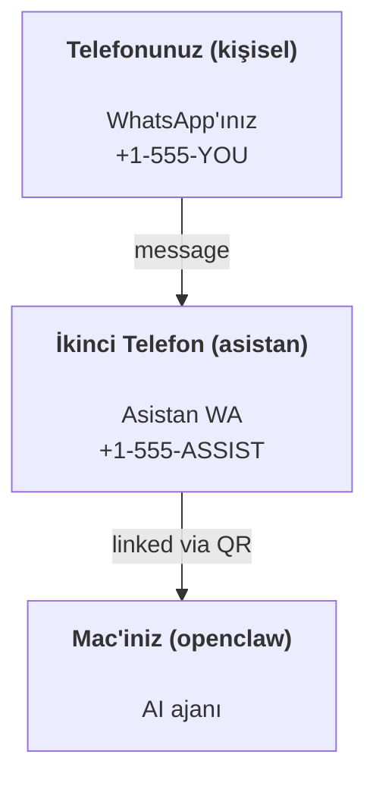

---
read_when:
    - Yeni bir asistan örneğini kullanıma alma
    - Güvenlik/izin etkilerini gözden geçirme
summary: OpenClaw’ı kişisel asistan olarak çalıştırmaya yönelik uçtan uca kılavuz ve güvenlik uyarıları
title: Kişisel asistan kurulumu
x-i18n:
    generated_at: "2026-04-25T13:57:47Z"
    model: gpt-5.4
    provider: openai
    source_hash: 1647b78e8cf23a3a025969c52fbd8a73aed78df27698abf36bbf62045dc30e3b
    source_path: start/openclaw.md
    workflow: 15
---

# OpenClaw ile kişisel bir asistan oluşturma

OpenClaw; Discord, Google Chat, iMessage, Matrix, Microsoft Teams, Signal, Slack, Telegram, WhatsApp, Zalo ve daha fazlasını AI ajanlarına bağlayan, self-hosted bir Gateway’dir. Bu kılavuz, “kişisel asistan” kurulumunu kapsar: her zaman açık AI asistanınız gibi davranan özel bir WhatsApp numarası.

## ⚠️ Önce güvenlik

Bir ajanı şunları yapabilecek bir konuma yerleştiriyorsunuz:

- makinenizde komut çalıştırmak (araç politikanıza bağlı olarak)
- çalışma alanınızdaki dosyaları okumak/yazmak
- WhatsApp/Telegram/Discord/Mattermost ve diğer paketlenmiş kanallar üzerinden yeniden mesaj göndermek

Muhafazakâr başlayın:

- Her zaman `channels.whatsapp.allowFrom` ayarlayın (kişisel Mac’inizde asla herkese açık çalıştırmayın).
- Asistan için özel bir WhatsApp numarası kullanın.
- Heartbeat artık varsayılan olarak her 30 dakikada bir çalışır. Kuruluma güvenene kadar `agents.defaults.heartbeat.every: "0m"` ayarlayarak devre dışı bırakın.

## Ön koşullar

- OpenClaw kurulmuş ve ilk kurulumu tamamlanmış olmalı — bunu henüz yapmadıysanız [Başlarken](/tr/start/getting-started) bölümüne bakın
- Asistan için ikinci bir telefon numarası (SIM/eSIM/ön ödemeli)

## İki telefonlu kurulum (önerilir)

İstediğiniz yapı şu:



Kişisel WhatsApp’ınızı OpenClaw’a bağlarsanız, size gelen her mesaj “ajan girdisi” olur. Bu çoğu zaman isteyeceğiniz şey değildir.

## 5 dakikalık hızlı başlangıç

1. WhatsApp Web’i eşleyin (QR gösterir; asistan telefonuyla tarayın):

```bash
openclaw channels login
```

2. Gateway’i başlatın (çalışır durumda bırakın):

```bash
openclaw gateway --port 18789
```

3. `~/.openclaw/openclaw.json` içine minimal bir yapılandırma koyun:

```json5
{
  gateway: { mode: "local" },
  channels: { whatsapp: { allowFrom: ["+15555550123"] } },
}
```

Şimdi allowlist’e alınmış telefonunuzdan asistan numarasına mesaj gönderin.

Onboarding tamamlandığında OpenClaw panoyu otomatik olarak açar ve temiz (token içermeyen) bir bağlantı yazdırır. Pano kimlik doğrulama isterse yapılandırılmış paylaşılan gizli anahtarı Control UI ayarlarına yapıştırın. Onboarding varsayılan olarak bir token kullanır (`gateway.auth.token`), ancak `gateway.auth.mode` değerini `password` olarak değiştirdiyseniz parola ile kimlik doğrulama da çalışır. Daha sonra yeniden açmak için: `openclaw dashboard`.

## Ajana bir çalışma alanı verin (AGENTS)

OpenClaw, çalışma talimatlarını ve “hafızayı” çalışma alanı dizininden okur.

Varsayılan olarak OpenClaw, ajan çalışma alanı olarak `~/.openclaw/workspace` kullanır ve bunu (başlangıç `AGENTS.md`, `SOUL.md`, `TOOLS.md`, `IDENTITY.md`, `USER.md`, `HEARTBEAT.md` ile birlikte) kurulum/ilk ajan çalıştırmasında otomatik olarak oluşturur. `BOOTSTRAP.md` yalnızca çalışma alanı yepyeniyse oluşturulur (sildikten sonra geri gelmemelidir). `MEMORY.md` isteğe bağlıdır (otomatik oluşturulmaz); mevcut olduğunda normal oturumlar için yüklenir. Alt ajan oturumları yalnızca `AGENTS.md` ve `TOOLS.md` dosyalarını enjekte eder.

İpucu: bu klasörü OpenClaw’ın “hafızası” gibi düşünün ve `AGENTS.md` + hafıza dosyalarınızın yedeklenmesi için onu bir git deposu yapın (tercihen özel). Git kuruluysa yepyeni çalışma alanları otomatik olarak başlatılır.

```bash
openclaw setup
```

Tam çalışma alanı düzeni + yedekleme kılavuzu: [Ajan çalışma alanı](/tr/concepts/agent-workspace)
Hafıza iş akışı: [Hafıza](/tr/concepts/memory)

İsteğe bağlı: `agents.defaults.workspace` ile farklı bir çalışma alanı seçin (`~` desteklenir).

```json5
{
  agents: {
    defaults: {
      workspace: "~/.openclaw/workspace",
    },
  },
}
```

Kendi çalışma alanı dosyalarınızı zaten bir depodan getiriyorsanız, bootstrap dosyası oluşturmayı tamamen devre dışı bırakabilirsiniz:

```json5
{
  agents: {
    defaults: {
      skipBootstrap: true,
    },
  },
}
```

## Bunu “bir asistana” dönüştüren yapılandırma

OpenClaw varsayılan olarak iyi bir asistan kurulumu sunar, ancak genellikle şunları ayarlamak isteyeceksiniz:

- [`SOUL.md`](/tr/concepts/soul) içindeki persona/talimatlar
- düşünme varsayılanları (istenirse)
- Heartbeat’ler (güvendiğinizde)

Örnek:

```json5
{
  logging: { level: "info" },
  agent: {
    model: "anthropic/claude-opus-4-6",
    workspace: "~/.openclaw/workspace",
    thinkingDefault: "high",
    timeoutSeconds: 1800,
    // 0 ile başlayın; daha sonra etkinleştirin.
    heartbeat: { every: "0m" },
  },
  channels: {
    whatsapp: {
      allowFrom: ["+15555550123"],
      groups: {
        "*": { requireMention: true },
      },
    },
  },
  routing: {
    groupChat: {
      mentionPatterns: ["@openclaw", "openclaw"],
    },
  },
  session: {
    scope: "per-sender",
    resetTriggers: ["/new", "/reset"],
    reset: {
      mode: "daily",
      atHour: 4,
      idleMinutes: 10080,
    },
  },
}
```

## Oturumlar ve hafıza

- Oturum dosyaları: `~/.openclaw/agents/<agentId>/sessions/{{SessionId}}.jsonl`
- Oturum meta verileri (token kullanımı, son rota vb.): `~/.openclaw/agents/<agentId>/sessions/sessions.json` (eski: `~/.openclaw/sessions/sessions.json`)
- `/new` veya `/reset`, o sohbet için yeni bir oturum başlatır (`resetTriggers` ile yapılandırılabilir). Tek başına gönderilirse ajan, sıfırlamayı doğrulamak için kısa bir merhaba mesajı verir.
- `/compact [instructions]`, oturum bağlamını sıkıştırır ve kalan bağlam bütçesini bildirir.

## Heartbeat’ler (proaktif mod)

Varsayılan olarak OpenClaw, şu istemle her 30 dakikada bir bir Heartbeat çalıştırır:
`Read HEARTBEAT.md if it exists (workspace context). Follow it strictly. Do not infer or repeat old tasks from prior chats. If nothing needs attention, reply HEARTBEAT_OK.`
Devre dışı bırakmak için `agents.defaults.heartbeat.every: "0m"` ayarlayın.

- `HEARTBEAT.md` mevcutsa ancak fiilen boşsa (yalnızca boş satırlar ve `# Heading` gibi markdown başlıkları içeriyorsa), OpenClaw API çağrılarını azaltmak için Heartbeat çalıştırmasını atlar.
- Dosya eksikse Heartbeat yine de çalışır ve ne yapılacağına model karar verir.
- Ajan `HEARTBEAT_OK` ile yanıt verirse (isteğe bağlı kısa dolgu ile; bkz. `agents.defaults.heartbeat.ackMaxChars`), OpenClaw o Heartbeat için dışa giden teslimatı bastırır.
- Varsayılan olarak, DM tarzı `user:<id>` hedeflerine Heartbeat teslimatına izin verilir. Heartbeat çalıştırmalarını etkin tutarken doğrudan hedef teslimatını bastırmak için `agents.defaults.heartbeat.directPolicy: "block"` ayarlayın.
- Heartbeat’ler tam ajan dönüşleri çalıştırır — daha kısa aralıklar daha fazla token tüketir.

```json5
{
  agent: {
    heartbeat: { every: "30m" },
  },
}
```

## İçeri ve dışarı medya

Gelen ekler (görseller/sesler/belgeler), şablonlar aracılığıyla komutunuza aktarılabilir:

- `{{MediaPath}}` (yerel geçici dosya yolu)
- `{{MediaUrl}}` (sözde URL)
- `{{Transcript}}` (ses dökümü etkinse)

Ajandan giden ekler: kendi satırında `MEDIA:<path-or-url>` ekleyin (boşluk yok). Örnek:

```
İşte ekran görüntüsü.
MEDIA:https://example.com/screenshot.png
```

OpenClaw bunları ayıklar ve metnin yanında medya olarak gönderir.

Yerel yol davranışı, ajanla aynı dosya okuma güven modeli izler:

- `tools.fs.workspaceOnly` değeri `true` ise giden `MEDIA:` yerel yolları OpenClaw geçici kökü, medya önbelleği, ajan çalışma alanı yolları ve sandbox tarafından üretilen dosyalarla sınırlı kalır.
- `tools.fs.workspaceOnly` değeri `false` ise giden `MEDIA:`, ajanın zaten okumasına izin verilen ana makine yerel dosyalarını kullanabilir.
- Ana makine yerel gönderimleri yine de yalnızca medya ve güvenli belge türlerine izin verir (görseller, ses, video, PDF ve Office belgeleri). Düz metin ve sır benzeri dosyalar gönderilebilir medya olarak değerlendirilmez.

Bu, dosya sistemi politikanız bu okumalara zaten izin veriyorsa, çalışma alanı dışındaki oluşturulmuş görsellerin/dosyaların artık gönderilebileceği anlamına gelir; bunu yaparken rastgele ana makine metin eki sızdırmasını yeniden açmaz.

## İşlemler kontrol listesi

```bash
openclaw status          # yerel durum (kimlik bilgileri, oturumlar, kuyruğa alınmış olaylar)
openclaw status --all    # tam teşhis (salt okunur, yapıştırılabilir)
openclaw status --deep   # desteklendiğinde kanal problarıyla canlı sağlık probu için Gateway'e sorar
openclaw health --json   # Gateway sağlık anlık görüntüsü (WS; varsayılan olarak yeni bir önbelleğe alınmış anlık görüntü döndürebilir)
```

Günlükler `/tmp/openclaw/` altında bulunur (varsayılan: `openclaw-YYYY-MM-DD.log`).

## Sonraki adımlar

- WebChat: [WebChat](/tr/web/webchat)
- Gateway işlemleri: [Gateway runbook](/tr/gateway)
- Cron + uyandırmalar: [Cron işleri](/tr/automation/cron-jobs)
- macOS menü çubuğu yardımcı uygulaması: [OpenClaw macOS uygulaması](/tr/platforms/macos)
- iOS Node uygulaması: [iOS uygulaması](/tr/platforms/ios)
- Android Node uygulaması: [Android uygulaması](/tr/platforms/android)
- Windows durumu: [Windows (WSL2)](/tr/platforms/windows)
- Linux durumu: [Linux uygulaması](/tr/platforms/linux)
- Güvenlik: [Güvenlik](/tr/gateway/security)

## İlgili

- [Başlarken](/tr/start/getting-started)
- [Kurulum](/tr/start/setup)
- [Kanal genel görünümü](/tr/channels)
