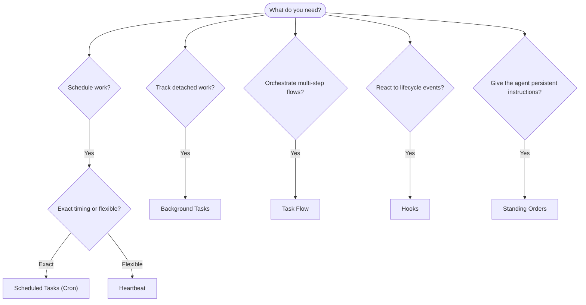

---
read_when:
    - Вирішуєте, як автоматизувати роботу з OpenClaw
    - Обираєте між heartbeat, cron, hooks і standing orders
    - Шукаєте правильну точку входу для автоматизації
summary: 'Огляд механізмів автоматизації: tasks, cron, hooks, standing orders і Task Flow'
title: Automation & Tasks
x-i18n:
    generated_at: "2026-04-05T17:56:59Z"
    model: gpt-5.4
    provider: openai
    source_hash: 13cd05dcd2f38737f7bb19243ad1136978bfd727006fd65226daa3590f823afe
    source_path: automation/index.md
    workflow: 15
---

# Automation & Tasks

OpenClaw виконує роботу у фоновому режимі за допомогою tasks, запланованих завдань, event hooks і постійних інструкцій. Ця сторінка допоможе вам вибрати правильний механізм і зрозуміти, як вони поєднуються між собою.

## Короткий посібник з вибору

| Випадок використання                    | Рекомендовано          | Чому                                             |
| --------------------------------------- | ---------------------- | ------------------------------------------------ |
| Надсилати щоденний звіт рівно о 9:00    | Scheduled Tasks (Cron) | Точний час, ізольоване виконання                 |
| Нагадай мені через 20 хвилин            | Scheduled Tasks (Cron) | Одноразове завдання з точним часом (`--at`)      |
| Запускати щотижневий глибокий аналіз    | Scheduled Tasks (Cron) | Автономне завдання, може використовувати іншу модель |
| Перевіряти вхідні кожні 30 хвилин       | Heartbeat              | Об’єднує перевірки з іншими, враховує контекст   |
| Відстежувати календар на майбутні події | Heartbeat              | Природно підходить для періодичної обізнаності   |
| Перевірити статус субагента або запуску ACP | Background Tasks   | Журнал tasks відстежує всю відокремлену роботу   |
| Перевірити, що запускалося і коли       | Background Tasks       | `openclaw tasks list` і `openclaw tasks audit`   |
| Багатокрокове дослідження, а потім підсумок | Task Flow           | Стійка оркестрація з відстеженням ревізій         |
| Запустити скрипт під час скидання сесії | Hooks                  | Керується подіями, спрацьовує на подіях життєвого циклу |
| Виконувати код під час кожного виклику інструмента | Hooks         | Hooks можуть фільтрувати за типом події          |
| Завжди перевіряти відповідність перед відповіддю | Standing Orders | Автоматично вставляються в кожну сесію           |

### Scheduled Tasks (Cron) проти Heartbeat

| Вимір           | Scheduled Tasks (Cron)              | Heartbeat                             |
| --------------- | ----------------------------------- | ------------------------------------- |
| Час             | Точний (cron-вирази, одноразово)    | Приблизний (типово кожні 30 хв)       |
| Контекст сесії  | Новий (ізольований) або спільний    | Повний контекст основної сесії        |
| Записи tasks    | Створюються завжди                  | Ніколи не створюються                 |
| Доставка        | Канал, webhook або без виводу       | Вбудовано в основну сесію             |
| Найкраще для    | Звітів, нагадувань, фонових завдань | Перевірки вхідних, календаря, сповіщень |

Використовуйте Scheduled Tasks (Cron), коли вам потрібен точний час або ізольоване виконання. Використовуйте Heartbeat, коли робота виграє від повного контексту сесії, а приблизний час є прийнятним.

## Основні поняття

### Заплановані завдання (cron)

Cron — це вбудований планувальник Gateway для точного часу. Він зберігає завдання, пробуджує агента в потрібний момент і може доставляти результат у канал чату або на endpoint webhook. Підтримує одноразові нагадування, повторювані вирази та вхідні тригери webhook.

Див. [Scheduled Tasks](/automation/cron-jobs).

### Tasks

Журнал фонових tasks відстежує всю відокремлену роботу: запуски ACP, породження субагентів, ізольовані виконання cron і операції CLI. Tasks — це записи, а не планувальники. Використовуйте `openclaw tasks list` і `openclaw tasks audit`, щоб їх переглядати.

Див. [Background Tasks](/automation/tasks).

### Task Flow

Task Flow — це підкладка оркестрації flow поверх фонових tasks. Вона керує стійкими багатокроковими flow з керованими й дзеркальними режимами синхронізації, відстеженням ревізій і `openclaw tasks flow list|show|cancel` для перевірки.

Див. [Task Flow](/automation/taskflow).

### Standing orders

Standing orders надають агенту постійні операційні повноваження для визначених програм. Вони зберігаються у файлах робочого простору (зазвичай `AGENTS.md`) і вставляються в кожну сесію. Поєднуйте з cron для контролю, прив’язаного до часу.

Див. [Standing Orders](/automation/standing-orders).

### Hooks

Hooks — це скрипти, керовані подіями, які запускаються подіями життєвого циклу агента (`/new`, `/reset`, `/stop`), ущільненням сесії, запуском gateway, потоком повідомлень і викликами інструментів. Hooks автоматично виявляються з каталогів і ними можна керувати за допомогою `openclaw hooks`.

Див. [Hooks](/automation/hooks).

### Heartbeat

Heartbeat — це періодичний хід основної сесії (типово кожні 30 хвилин). Він об’єднує кілька перевірок (вхідні, календар, сповіщення) в один хід агента з повним контекстом сесії. Ходи heartbeat не створюють записів tasks. Використовуйте `HEARTBEAT.md` для невеликого контрольного списку або блок `tasks:`, якщо вам потрібні лише періодичні перевірки за строком виконання в межах самого heartbeat. Порожні файли heartbeat пропускаються як `empty-heartbeat-file`; режим лише прострочених tasks пропускається як `no-tasks-due`.

Див. [Heartbeat](/gateway/heartbeat).

## Як вони працюють разом

- **Cron** обробляє точні розклади (щоденні звіти, щотижневі огляди) і одноразові нагадування. Усі виконання cron створюють записи tasks.
- **Heartbeat** обробляє рутинний моніторинг (вхідні, календар, сповіщення) одним об’єднаним ходом кожні 30 хвилин.
- **Hooks** реагують на конкретні події (виклики інструментів, скидання сесії, ущільнення) за допомогою власних скриптів.
- **Standing orders** надають агенту постійний контекст і межі повноважень.
- **Task Flow** координує багатокрокові flow поверх окремих tasks.
- **Tasks** автоматично відстежують усю відокремлену роботу, щоб ви могли її переглядати й аудіювати.

## Пов’язане

- [Scheduled Tasks](/automation/cron-jobs) — точне планування й одноразові нагадування
- [Background Tasks](/automation/tasks) — журнал tasks для всієї відокремленої роботи
- [Task Flow](/automation/taskflow) — стійка оркестрація багатокрокових flow
- [Hooks](/automation/hooks) — скрипти життєвого циклу, керовані подіями
- [Standing Orders](/automation/standing-orders) — постійні інструкції агента
- [Heartbeat](/gateway/heartbeat) — періодичні ходи основної сесії
- [Configuration Reference](/gateway/configuration-reference) — усі ключі конфігурації
