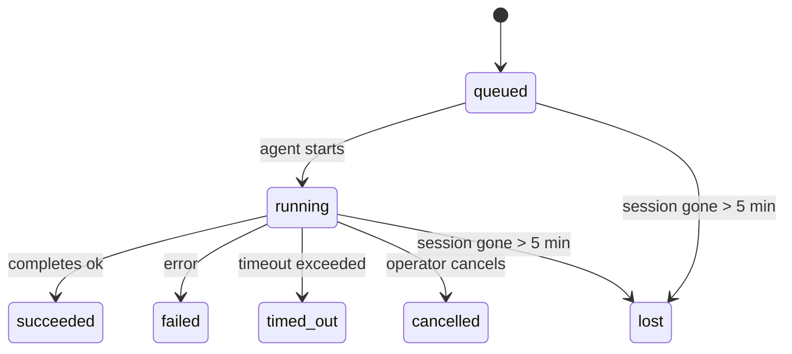

---
read_when:
    - Перевірка фонового процесу, що виконується або нещодавно завершився
    - Налагодження збоїв доставки для відокремлених запусків агентів
    - Розуміння того, як фонові запуски пов’язані із сесіями, cron і heartbeat
summary: Відстеження фонових завдань для запусків ACP, субагентів, ізольованих cron-завдань і CLI-операцій
title: Фонові завдання
x-i18n:
    generated_at: "2026-04-06T00:20:37Z"
    model: gpt-5.4
    provider: openai
    source_hash: 5fc757b30e2d9c1b5c4d9c8ff21cdc406835af207a83ee6076b63c348ad07781
    source_path: automation/tasks.md
    workflow: 15
---

# Фонові завдання

> **Шукаєте планування?** Див. [Автоматизація й завдання](/uk/automation), щоб вибрати правильний механізм. Ця сторінка описує **відстеження** фонової роботи, а не її планування.

Фонові завдання відстежують роботу, що виконується **поза межами вашої основної сесії розмови**:
запуски ACP, запуск субагентів, виконання ізольованих cron-завдань і операції, ініційовані через CLI.

Завдання **не** замінюють сесії, cron-завдання або heartbeat — це **журнал активності**, який фіксує, яка відокремлена робота відбулася, коли саме і чи була вона успішною.

<Note>
Не кожен запуск агента створює завдання. Цикли heartbeat і звичайний інтерактивний чат — ні. Усі виконання cron, запуски ACP, запуски субагентів і CLI-команди агента — так.
</Note>

## Коротко

- Завдання — це **записи**, а не планувальники: cron і heartbeat визначають, _коли_ виконується робота, а завдання відстежують, _що сталося_.
- ACP, субагенти, усі cron-завдання та CLI-операції створюють завдання. Цикли heartbeat — ні.
- Кожне завдання проходить через `queued → running → terminal` (`succeeded`, `failed`, `timed_out`, `cancelled` або `lost`).
- Cron-завдання залишаються активними, доки середовище виконання cron усе ще володіє завданням; CLI-завдання з чат-підтримкою залишаються активними лише доки контекст виконання, якому вони належать, усе ще активний.
- Завершення працює за push-моделлю: відокремлена робота може напряму сповістити або пробудити
  сесію запитувача/heartbeat після завершення, тому цикли опитування стану зазвичай є
  неправильним підходом.
- Ізольовані запуски cron і завершення субагентів у межах best-effort очищають відстежувані вкладки браузера/процеси для своєї дочірньої сесії перед фінальним обліком очищення.
- Доставка ізольованого cron пригнічує застарілі проміжні відповіді батьківського процесу, поки
  дочірня робота субагента все ще завершується, і надає перевагу фінальному дочірньому
  виводу, якщо він надходить до доставки.
- Сповіщення про завершення доставляються безпосередньо в канал або ставляться в чергу до наступного heartbeat.
- `openclaw tasks list` показує всі завдання; `openclaw tasks audit` виявляє проблеми.
- Термінальні записи зберігаються 7 днів, а потім автоматично видаляються.

## Швидкий старт

```bash
# Перелічити всі завдання (спочатку найновіші)
openclaw tasks list

# Фільтрувати за runtime або статусом
openclaw tasks list --runtime acp
openclaw tasks list --status running

# Показати деталі конкретного завдання (за ID, ID запуску або ключем сесії)
openclaw tasks show <lookup>

# Скасувати завдання, що виконується (завершує дочірню сесію)
openclaw tasks cancel <lookup>

# Змінити політику сповіщень для завдання
openclaw tasks notify <lookup> state_changes

# Запустити аудит працездатності
openclaw tasks audit

# Попередній перегляд або застосування обслуговування
openclaw tasks maintenance
openclaw tasks maintenance --apply

# Перевірити стан Task Flow
openclaw tasks flow list
openclaw tasks flow show <lookup>
openclaw tasks flow cancel <lookup>
```

## Що створює завдання

| Джерело                 | Тип runtime | Коли створюється запис завдання                       | Типова політика сповіщень |
| ----------------------- | ----------- | ----------------------------------------------------- | ------------------------- |
| Фонові запуски ACP      | `acp`       | Під час запуску дочірньої ACP-сесії                   | `done_only`               |
| Оркестрація субагентів  | `subagent`  | Під час запуску субагента через `sessions_spawn`      | `done_only`               |
| Cron-завдання (усі типи) | `cron`      | Під час кожного виконання cron (основна й ізольована сесія) | `silent`          |
| CLI-операції            | `cli`       | Команди `openclaw agent`, що виконуються через gateway | `silent`                 |
| Медіазавдання агента    | `cli`       | Запуски `video_generate` із прив’язкою до сесії       | `silent`                  |

Cron-завдання основної сесії типово використовують політику сповіщень `silent` — вони створюють записи для відстеження, але не генерують сповіщень. Ізольовані cron-завдання також типово мають `silent`, але вони помітніші, тому що виконуються у власній сесії.

Запуски `video_generate` із прив’язкою до сесії також використовують політику сповіщень `silent`. Вони все одно створюють записи завдань, але завершення повертається до початкової сесії агента як внутрішнє пробудження, щоб агент міг сам записати наступне повідомлення й прикріпити готове відео.

Поки завдання `video_generate` із прив’язкою до сесії все ще активне, інструмент також працює як запобіжник: повторні виклики `video_generate` у тій самій сесії повертають статус активного завдання замість запуску другого паралельного генерування. Використовуйте `action: "status"`, якщо вам потрібен явний запит прогресу/статусу з боку агента.

**Що не створює завдання:**

- Цикли heartbeat — основна сесія; див. [Heartbeat](/uk/gateway/heartbeat)
- Звичайні інтерактивні цикли чату
- Прямі відповіді `/command`

## Життєвий цикл завдання



| Статус      | Що це означає                                                            |
| ----------- | ------------------------------------------------------------------------ |
| `queued`    | Створено, очікує на запуск агента                                        |
| `running`   | Цикл агента активно виконується                                          |
| `succeeded` | Успішно завершено                                                        |
| `failed`    | Завершено з помилкою                                                     |
| `timed_out` | Перевищено налаштований час очікування                                   |
| `cancelled` | Зупинено оператором через `openclaw tasks cancel`                        |
| `lost`      | Runtime втратив авторитетний базовий стан після 5-хвилинного пільгового періоду |

Переходи відбуваються автоматично — коли пов’язаний запуск агента завершується, статус завдання оновлюється відповідно.

`lost` залежить від runtime:

- Завдання ACP: зникли метадані дочірньої ACP-сесії.
- Завдання субагента: дочірня сесія зникла зі сховища цільового агента.
- Cron-завдання: середовище виконання cron більше не відстежує завдання як активне.
- CLI-завдання: ізольовані завдання дочірньої сесії використовують дочірню сесію; CLI-завдання з чат-підтримкою натомість використовують живий контекст виконання, тому завислі рядки сесії каналу/групи/прямих повідомлень не підтримують їх активність.

## Доставка й сповіщення

Коли завдання досягає термінального стану, OpenClaw сповіщає вас. Є два шляхи доставки:

**Пряма доставка** — якщо завдання має цільовий канал (`requesterOrigin`), повідомлення про завершення надсилається безпосередньо в цей канал (Telegram, Discord, Slack тощо). Для завершень субагентів OpenClaw також зберігає прив’язану маршрутизацію потоку/теми, коли це можливо, і може заповнити відсутній `to` / акаунт зі збереженого маршруту сесії запитувача (`lastChannel` / `lastTo` / `lastAccountId`) перед тим, як відмовитися від прямої доставки.

**Доставка через чергу сесії** — якщо пряма доставка не вдалася або origin не задано, оновлення ставиться в чергу як системна подія в сесії запитувача й з’явиться під час наступного heartbeat.

<Tip>
Завершення завдання запускає негайне пробудження heartbeat, щоб ви швидко побачили результат — вам не потрібно чекати наступного запланованого циклу heartbeat.
</Tip>

Це означає, що типовий робочий процес базується на push-моделі: запустіть відокремлену роботу один раз, а потім дозвольте
runtime пробудити або сповістити вас після завершення. Опитуйте стан завдання лише тоді, коли
потрібні налагодження, втручання або явний аудит.

### Політики сповіщень

Керуйте тим, скільки інформації ви отримуєте про кожне завдання:

| Політика              | Що доставляється                                                        |
| --------------------- | ----------------------------------------------------------------------- |
| `done_only` (типово)  | Лише термінальний стан (`succeeded`, `failed` тощо) — **це типова поведінка** |
| `state_changes`       | Кожен перехід стану й оновлення прогресу                                |
| `silent`              | Взагалі нічого                                                          |

Змінити політику під час виконання завдання:

```bash
openclaw tasks notify <lookup> state_changes
```

## Довідка CLI

### `tasks list`

```bash
openclaw tasks list [--runtime <acp|subagent|cron|cli>] [--status <status>] [--json]
```

Стовпці виводу: ID завдання, тип, статус, доставка, ID запуску, дочірня сесія, підсумок.

### `tasks show`

```bash
openclaw tasks show <lookup>
```

Токен lookup приймає ID завдання, ID запуску або ключ сесії. Показує повний запис, включно з часовими даними, станом доставки, помилкою й термінальним підсумком.

### `tasks cancel`

```bash
openclaw tasks cancel <lookup>
```

Для завдань ACP і субагентів це завершує дочірню сесію. Статус переходить у `cancelled`, і надсилається сповіщення про доставку.

### `tasks notify`

```bash
openclaw tasks notify <lookup> <done_only|state_changes|silent>
```

### `tasks audit`

```bash
openclaw tasks audit [--json]
```

Виявляє операційні проблеми. Результати також з’являються в `openclaw status`, коли виявлено проблеми.

| Знахідка                  | Серйозність | Тригер                                               |
| ------------------------- | ----------- | ---------------------------------------------------- |
| `stale_queued`            | warn        | У стані queued понад 10 хвилин                       |
| `stale_running`           | error       | У стані running понад 30 хвилин                      |
| `lost`                    | error       | Зникло runtime-підтверджене володіння завданням      |
| `delivery_failed`         | warn        | Доставка не вдалася, і політика сповіщень не `silent` |
| `missing_cleanup`         | warn        | Термінальне завдання без мітки часу очищення         |
| `inconsistent_timestamps` | warn        | Порушення часової шкали (наприклад, завершено до початку) |

### `tasks maintenance`

```bash
openclaw tasks maintenance [--json]
openclaw tasks maintenance --apply [--json]
```

Використовуйте це для попереднього перегляду або застосування звірки, виставлення міток очищення й видалення
для завдань і стану Task Flow.

Звірка враховує runtime:

- Завдання ACP/субагентів перевіряють свою базову дочірню сесію.
- Cron-завдання перевіряють, чи середовище виконання cron усе ще володіє завданням.
- CLI-завдання з чат-підтримкою перевіряють базовий активний контекст виконання, а не лише рядок чат-сесії.

Очищення після завершення також враховує runtime:

- Завершення субагента в межах best-effort закриває відстежувані вкладки браузера/процеси для дочірньої сесії перед продовженням оголошення про очищення.
- Завершення ізольованого cron у межах best-effort закриває відстежувані вкладки браузера/процеси для cron-сесії до повного завершення запуску.
- Доставка ізольованого cron за потреби очікує завершення дочірніх дій субагента й
  пригнічує застарілий текст підтвердження батьківського процесу замість його оголошення.
- Доставка завершення субагента надає перевагу останньому видимому тексту асистента; якщо він порожній, використовується очищений останній текст `tool`/`toolResult`, а запуски лише з викликом інструмента, що завершилися тайм-аутом, можуть зводитися до короткого підсумку часткового прогресу.
- Помилки очищення не приховують реальний результат завдання.

### `tasks flow list|show|cancel`

```bash
openclaw tasks flow list [--status <status>] [--json]
openclaw tasks flow show <lookup> [--json]
openclaw tasks flow cancel <lookup>
```

Використовуйте це, коли вас цікавить саме оркеструвальний Task Flow,
а не окремий запис фонового завдання.

## Дошка завдань чату (`/tasks`)

Використовуйте `/tasks` у будь-якій чат-сесії, щоб побачити фонові завдання, пов’язані з цією сесією. Дошка показує
активні й нещодавно завершені завдання з runtime, статусом, часовими даними та деталями прогресу або помилки.

Коли в поточній сесії немає видимих пов’язаних завдань, `/tasks` повертається до локальних лічильників завдань агента,
щоб ви все одно отримали огляд без розкриття деталей інших сесій.

Для повного операторського журналу використовуйте CLI: `openclaw tasks list`.

## Інтеграція зі статусом (навантаження завдань)

`openclaw status` містить короткий підсумок завдань:

```
Tasks: 3 queued · 2 running · 1 issues
```

Підсумок повідомляє:

- **active** — кількість `queued` + `running`
- **failures** — кількість `failed` + `timed_out` + `lost`
- **byRuntime** — розбивка за `acp`, `subagent`, `cron`, `cli`

І `/status`, і інструмент `session_status` використовують знімок завдань з урахуванням очищення: активним завданням
надається перевага, застарілі завершені рядки приховуються, а нещодавні збої відображаються лише тоді, коли активної роботи
вже не залишилося. Це допомагає картці статусу залишатися зосередженою на тому, що важливо саме зараз.

## Зберігання й обслуговування

### Де зберігаються завдання

Записи завдань зберігаються в SQLite за адресою:

```
$OPENCLAW_STATE_DIR/tasks/runs.sqlite
```

Реєстр завантажується в пам’ять під час запуску gateway і синхронізує записи в SQLite для збереження після перезапусків.

### Автоматичне обслуговування

Очищувач запускається кожні **60 секунд** і виконує три дії:

1. **Звірка** — перевіряє, чи активні завдання все ще мають авторитетну базову підтримку runtime. Завдання ACP/субагентів використовують стан дочірньої сесії, cron-завдання — володіння активним завданням, а CLI-завдання з чат-підтримкою — базовий контекст виконання. Якщо цей базовий стан відсутній понад 5 хвилин, завдання позначається як `lost`.
2. **Виставлення міток очищення** — установлює часову мітку `cleanupAfter` на термінальних завданнях (`endedAt + 7 days`).
3. **Видалення** — видаляє записи, дата `cleanupAfter` яких уже минула.

**Термін зберігання**: термінальні записи завдань зберігаються **7 днів**, а потім автоматично видаляються. Налаштування не потрібне.

## Як завдання пов’язані з іншими системами

### Завдання і Task Flow

[Task Flow](/uk/automation/taskflow) — це рівень оркестрації потоків над фоновими завданнями. Один потік може координувати кілька завдань протягом свого життєвого циклу, використовуючи керовані або дзеркальні режими синхронізації. Використовуйте `openclaw tasks`, щоб переглядати окремі записи завдань, і `openclaw tasks flow`, щоб переглядати оркеструвальний потік.

Докладніше див. [Task Flow](/uk/automation/taskflow).

### Завдання і cron

**Визначення** cron-завдання зберігається в `~/.openclaw/cron/jobs.json`. **Кожне** виконання cron створює запис завдання — і для основної сесії, і для ізольованої. Cron-завдання основної сесії типово використовують політику сповіщень `silent`, тому вони відстежуються без генерації сповіщень.

Див. [Cron Jobs](/uk/automation/cron-jobs).

### Завдання і heartbeat

Запуски heartbeat — це цикли основної сесії; вони не створюють записи завдань. Коли завдання завершується, воно може ініціювати пробудження heartbeat, щоб ви швидко побачили результат.

Див. [Heartbeat](/uk/gateway/heartbeat).

### Завдання і сесії

Завдання може посилатися на `childSessionKey` (де виконується робота) і `requesterSessionKey` (хто її запустив). Сесії — це контекст розмови; завдання — це відстеження активності поверх нього.

### Завдання і запуски агентів

`runId` завдання пов’язує його із запуском агента, який виконує роботу. Події життєвого циклу агента (початок, завершення, помилка) автоматично оновлюють статус завдання — вам не потрібно керувати життєвим циклом вручну.

## Пов’язане

- [Автоматизація й завдання](/uk/automation) — усі механізми автоматизації в одному огляді
- [Task Flow](/uk/automation/taskflow) — оркестрація потоків над завданнями
- [Заплановані завдання](/uk/automation/cron-jobs) — планування фонової роботи
- [Heartbeat](/uk/gateway/heartbeat) — періодичні цикли основної сесії
- [CLI: Завдання](/cli/index#tasks) — довідка з команд CLI
