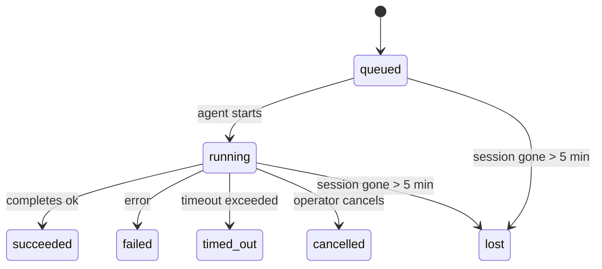

---
read_when:
    - Перевірка фонової роботи, що виконується або була нещодавно завершена
    - Налагодження збоїв доставки для відокремлених запусків агентів
    - Розуміння того, як фонові запуски пов’язані із сесіями, Cron і Heartbeat
sidebarTitle: Background tasks
summary: Відстеження фонових завдань для запусків ACP, субагентів, ізольованих завдань Cron і операцій CLI
title: Фонові завдання
x-i18n:
    generated_at: "2026-04-26T07:00:04Z"
    model: gpt-5.4
    provider: openai
    source_hash: 46952a378babdee9f43102bfa71dbd35b6ca7ecb142ffce3785eeb479e19d6b6
    source_path: automation/tasks.md
    workflow: 15
---

<Note>
Шукаєте планування? Див. [Automation & Tasks](/uk/automation), щоб вибрати правильний механізм. Ця сторінка охоплює **відстеження** фонової роботи, а не її планування.
</Note>

Фонові завдання відстежують роботу, що виконується **поза межами вашої основної сесії розмови**: запуски ACP, породження субагентів, ізольовані виконання завдань Cron і операції, ініційовані через CLI.

Завдання **не** замінюють сесії, завдання Cron або heartbeat — це **журнал активності**, який фіксує, яка відокремлена робота відбулася, коли саме і чи була вона успішною.

<Note>
Не кожен запуск агента створює завдання. Ходи Heartbeat і звичайний інтерактивний чат — ні. Усі виконання Cron, породження ACP, породження субагентів і команди агента CLI — так.
</Note>

## Коротко

- Завдання — це **записи**, а не планувальники: Cron і Heartbeat визначають, _коли_ виконується робота, а завдання відстежують, _що сталося_.
- ACP, субагенти, усі завдання Cron і операції CLI створюють завдання. Ходи Heartbeat — ні.
- Кожне завдання проходить через `queued → running → terminal` (`succeeded`, `failed`, `timed_out`, `cancelled` або `lost`).
- Завдання Cron залишаються активними, доки середовище виконання Cron усе ще володіє завданням; якщо стан середовища виконання в пам’яті зник, обслуговування завдань спочатку перевіряє стійку історію виконань Cron, перш ніж позначити завдання як `lost`.
- Завершення керується push-подіями: відокремлена робота може напряму сповістити або пробудити сесію/heartbeat запитувача після завершення, тому цикли опитування статусу зазвичай є хибним підходом.
- Ізольовані запуски Cron і завершення субагентів у межах best-effort очищають відстежувані вкладки браузера/процеси для їхньої дочірньої сесії перед фінальним обліком очищення.
- Доставка ізольованих запусків Cron пригнічує застарілі проміжні відповіді батьківської сесії, поки дочірня робота субагентів усе ще завершується, і надає перевагу фінальному виводу нащадка, якщо він надходить до моменту доставки.
- Сповіщення про завершення доставляються безпосередньо в канал або ставляться в чергу до наступного Heartbeat.
- `openclaw tasks list` показує всі завдання; `openclaw tasks audit` виявляє проблеми.
- Термінальні записи зберігаються 7 днів, після чого автоматично видаляються.

## Швидкий старт

<Tabs>
  <Tab title="Перелік і фільтрація">
    ```bash
    # Показати всі завдання (спочатку найновіші)
    openclaw tasks list

    # Фільтрація за середовищем виконання або статусом
    openclaw tasks list --runtime acp
    openclaw tasks list --status running
    ```

  </Tab>
  <Tab title="Перегляд">
    ```bash
    # Показати подробиці для конкретного завдання (за ID, ID запуску або ключем сесії)
    openclaw tasks show <lookup>
    ```
  </Tab>
  <Tab title="Скасування і сповіщення">
    ```bash
    # Скасувати запущене завдання (завершує дочірню сесію)
    openclaw tasks cancel <lookup>

    # Змінити політику сповіщень для завдання
    openclaw tasks notify <lookup> state_changes
    ```

  </Tab>
  <Tab title="Аудит і обслуговування">
    ```bash
    # Виконати аудит стану
    openclaw tasks audit

    # Попередній перегляд або застосування обслуговування
    openclaw tasks maintenance
    openclaw tasks maintenance --apply
    ```

  </Tab>
  <Tab title="Потік завдань">
    ```bash
    # Переглянути стан TaskFlow
    openclaw tasks flow list
    openclaw tasks flow show <lookup>
    openclaw tasks flow cancel <lookup>
    ```
  </Tab>
</Tabs>

## Що створює завдання

| Джерело                | Тип середовища виконання | Коли створюється запис завдання                        | Політика сповіщень за замовчуванням |
| ---------------------- | ------------------------ | ------------------------------------------------------ | ----------------------------------- |
| Фонові запуски ACP     | `acp`                    | Під час породження дочірньої сесії ACP                 | `done_only`                         |
| Оркестрація субагентів | `subagent`               | Під час породження субагента через `sessions_spawn`    | `done_only`                         |
| Завдання Cron (усі типи) | `cron`                 | Для кожного виконання Cron (основна сесія й ізольовані) | `silent`                            |
| Операції CLI           | `cli`                    | Команди `openclaw agent`, що виконуються через Gateway | `silent`                            |
| Медіазавдання агента   | `cli`                    | Запуски `video_generate`, прив’язані до сесії          | `silent`                            |

<AccordionGroup>
  <Accordion title="Типові сповіщення для Cron і медіа">
    Завдання Cron в основній сесії за замовчуванням використовують політику сповіщень `silent` — вони створюють записи для відстеження, але не генерують сповіщення. Ізольовані завдання Cron також за замовчуванням мають `silent`, але є помітнішими, оскільки виконуються у власній сесії.

    Запуски `video_generate`, прив’язані до сесії, також використовують політику сповіщень `silent`. Вони все одно створюють записи завдань, але завершення повертається в початкову сесію агента як внутрішнє пробудження, щоб агент міг сам написати наступне повідомлення й прикріпити готове відео. Якщо ви ввімкнете `tools.media.asyncCompletion.directSend`, асинхронні завершення `music_generate` і `video_generate` спочатку намагатимуться доставити результат безпосередньо в канал, а вже потім повертатися до шляху пробудження сесії запитувача.

  </Accordion>
  <Accordion title="Захист від одночасних video_generate">
    Поки завдання `video_generate`, прив’язане до сесії, усе ще активне, інструмент також працює як захист: повторні виклики `video_generate` у цій самій сесії повертають статус активного завдання замість запуску другої одночасної генерації. Використовуйте `action: "status"`, якщо хочете явний запит прогресу/статусу з боку агента.
  </Accordion>
  <Accordion title="Що не створює завдань">
    - Ходи Heartbeat — основна сесія; див. [Heartbeat](/uk/gateway/heartbeat)
    - Звичайні інтерактивні ходи чату
    - Прямі відповіді `/command`
  </Accordion>
</AccordionGroup>

## Життєвий цикл завдання



| Статус      | Що це означає                                                             |
| ----------- | ------------------------------------------------------------------------- |
| `queued`    | Створено, очікує на запуск агента                                         |
| `running`   | Хід агента активно виконується                                            |
| `succeeded` | Успішно завершено                                                         |
| `failed`    | Завершено з помилкою                                                      |
| `timed_out` | Перевищено налаштований час очікування                                    |
| `cancelled` | Зупинено оператором через `openclaw tasks cancel`                         |
| `lost`      | Середовище виконання втратило авторитетний базовий стан після 5-хвилинного пільгового періоду |

Переходи відбуваються автоматично — коли пов’язаний запуск агента завершується, статус завдання оновлюється відповідно.

Завершення запуску агента є авторитетним для активних записів завдань. Успішний відокремлений запуск фіналізується як `succeeded`, звичайні помилки запуску — як `failed`, а завершення через перевищення часу або переривання — як `timed_out`. Якщо оператор уже скасував завдання або середовище виконання вже зафіксувало сильніший термінальний стан, як-от `failed`, `timed_out` або `lost`, пізніший сигнал про успіх не знижує цей термінальний статус.

`lost` залежить від середовища виконання:

- Завдання ACP: зникли метадані дочірньої сесії ACP.
- Завдання субагентів: дочірня сесія зникла зі сховища цільового агента.
- Завдання Cron: середовище виконання Cron більше не відстежує завдання як активне, а стійка історія виконань Cron не показує термінального результату для цього запуску. Офлайновий аудит CLI не вважає власний порожній внутрішньопроцесний стан середовища виконання Cron авторитетним.
- Завдання CLI: завдання ізольованих дочірніх сесій використовують дочірню сесію; завдання CLI, прив’язані до чату, натомість використовують контекст живого запуску, тому завислі рядки сесій каналу/групи/прямих повідомлень не підтримують їх активними. Запуски `openclaw agent`, що працюють через Gateway, також фіналізуються за результатом свого запуску, тож завершені запуски не залишаються активними, доки sweeper не позначить їх як `lost`.

## Доставка і сповіщення

Коли завдання досягає термінального стану, OpenClaw сповіщає вас. Є два шляхи доставки:

**Пряма доставка** — якщо завдання має ціль каналу (`requesterOrigin`), повідомлення про завершення надсилається безпосередньо в цей канал (Telegram, Discord, Slack тощо). Для завершень субагентів OpenClaw також зберігає маршрутизацію прив’язаних гілок/тем, коли вона доступна, і може заповнити відсутній `to` / обліковий запис зі збереженого маршруту сесії запитувача (`lastChannel` / `lastTo` / `lastAccountId`), перш ніж відмовитися від прямої доставки.

**Доставка через чергу сесії** — якщо пряма доставка не вдається або джерело не задане, оновлення ставиться в чергу як системна подія в сесії запитувача й з’являється під час наступного Heartbeat.

<Tip>
Завершення завдання негайно запускає пробудження Heartbeat, тож ви швидко бачите результат — не потрібно чекати наступного запланованого тіку Heartbeat.
</Tip>

Це означає, що типовий робочий процес базується на push-подіях: один раз запускайте відокремлену роботу, а потім дозвольте середовищу виконання пробудити вас або сповістити після завершення. Опитуйте стан завдання лише тоді, коли потрібні налагодження, втручання або явний аудит.

### Політики сповіщень

Керуйте тим, скільки інформації ви отримуєте про кожне завдання:

| Політика              | Що доставляється                                                        |
| --------------------- | ----------------------------------------------------------------------- |
| `done_only` (типово)  | Лише термінальний стан (`succeeded`, `failed` тощо) — **це типовий режим** |
| `state_changes`       | Кожен перехід стану й оновлення прогресу                                |
| `silent`              | Нічого                                                                  |

Змінити політику під час виконання завдання:

```bash
openclaw tasks notify <lookup> state_changes
```

## Довідка CLI

<AccordionGroup>
  <Accordion title="tasks list">
    ```bash
    openclaw tasks list [--runtime <acp|subagent|cron|cli>] [--status <status>] [--json]
    ```

    Стовпці виводу: ID завдання, тип, статус, доставка, ID запуску, дочірня сесія, зведення.

  </Accordion>
  <Accordion title="tasks show">
    ```bash
    openclaw tasks show <lookup>
    ```

    Токен пошуку приймає ID завдання, ID запуску або ключ сесії. Показує повний запис, включно з часом, станом доставки, помилкою й термінальним підсумком.

  </Accordion>
  <Accordion title="tasks cancel">
    ```bash
    openclaw tasks cancel <lookup>
    ```

    Для завдань ACP і субагентів це завершує дочірню сесію. Для завдань, що відстежуються CLI, скасування фіксується в реєстрі завдань (окремого дескриптора дочірнього середовища виконання немає). Статус переходить у `cancelled`, і, якщо застосовно, надсилається сповіщення про доставку.

  </Accordion>
  <Accordion title="tasks notify">
    ```bash
    openclaw tasks notify <lookup> <done_only|state_changes|silent>
    ```
  </Accordion>
  <Accordion title="tasks audit">
    ```bash
    openclaw tasks audit [--json]
    ```

    Виявляє операційні проблеми. Якщо проблеми виявлено, висновки також з’являються в `openclaw status`.

    | Знахідка                  | Серйозність | Умова                                                                                                         |
    | ------------------------- | ----------- | ------------------------------------------------------------------------------------------------------------- |
    | `stale_queued`            | warn        | Перебуває в черзі понад 10 хвилин                                                                             |
    | `stale_running`           | error       | Виконується понад 30 хвилин                                                                                   |
    | `lost`                    | warn/error  | Зникло володіння завданням, прив’язане до середовища виконання; збережені втрачені завдання мають рівень warn до `cleanupAfter`, після чого стають error |
    | `delivery_failed`         | warn        | Доставка не вдалася, а політика сповіщень не є `silent`                                                       |
    | `missing_cleanup`         | warn        | Термінальне завдання без часової позначки очищення                                                            |
    | `inconsistent_timestamps` | warn        | Порушення часової послідовності (наприклад, завершено раніше, ніж розпочато)                                 |

  </Accordion>
  <Accordion title="tasks maintenance">
    ```bash
    openclaw tasks maintenance [--json]
    openclaw tasks maintenance --apply [--json]
    ```

    Використовуйте це для попереднього перегляду або застосування звірки, проставлення позначок очищення та видалення застарілих записів для стану завдань і Task Flow.

    Звірка залежить від середовища виконання:

    - Завдання ACP/субагентів перевіряють свою базову дочірню сесію.
    - Завдання Cron перевіряють, чи середовище виконання Cron усе ще володіє завданням, а потім відновлюють термінальний статус із збережених журналів виконань Cron/стану завдання, перш ніж переходити до `lost`. Лише процес Gateway є авторитетним для внутрішньопам’ятного набору активних завдань Cron; офлайновий аудит CLI використовує стійку історію, але не позначає завдання Cron як `lost` лише тому, що цей локальний Set порожній.
    - Завдання CLI, прив’язані до чату, перевіряють контекст живого запуску-власника, а не лише рядок сесії чату.

    Очищення після завершення також залежить від середовища виконання:

    - Завершення субагента в межах best-effort закриває відстежувані вкладки браузера/процеси для дочірньої сесії перед продовженням очищення оголошення.
    - Завершення ізольованого Cron у межах best-effort закриває відстежувані вкладки браузера/процеси для сесії Cron перед повним завершенням запуску.
    - Доставка ізольованого Cron за потреби очікує завершення дочірньої роботи субагента й пригнічує застарілий текст підтвердження батьківської сесії замість його оголошення.
    - Доставка завершення субагента надає перевагу найновішому видимому тексту помічника; якщо він порожній, використовується очищений найновіший текст `tool`/`toolResult`, а запуски лише з викликом інструмента, що завершилися через timeout, можуть зводитися до короткого підсумку часткового прогресу. Термінальні запуски зі статусом failed оголошують стан помилки без повторного відтворення захопленого тексту відповіді.
    - Збої очищення не маскують реальний результат завдання.

  </Accordion>
  <Accordion title="tasks flow list | show | cancel">
    ```bash
    openclaw tasks flow list [--status <status>] [--json]
    openclaw tasks flow show <lookup> [--json]
    openclaw tasks flow cancel <lookup>
    ```

    Використовуйте це, коли вас цікавить саме оркеструвальний Task Flow, а не окремий запис фонового завдання.

  </Accordion>
</AccordionGroup>

## Дошка завдань чату (`/tasks`)

Використовуйте `/tasks` у будь-якій чат-сесії, щоб побачити фонові завдання, пов’язані з цією сесією. Дошка показує активні та нещодавно завершені завдання із середовищем виконання, статусом, часом і подробицями прогресу або помилки.

Якщо для поточної сесії немає видимих пов’язаних завдань, `/tasks` повертається до локальних для агента лічильників завдань, тож ви все одно отримуєте огляд без розкриття подробиць інших сесій.

Для повного операторського журналу використовуйте CLI: `openclaw tasks list`.

## Інтеграція зі статусом (навантаження завдань)

`openclaw status` містить короткий підсумок завдань:

```
Tasks: 3 queued · 2 running · 1 issues
```

Підсумок повідомляє:

- **active** — кількість `queued` + `running`
- **failures** — кількість `failed` + `timed_out` + `lost`
- **byRuntime** — розбивка за `acp`, `subagent`, `cron`, `cli`

І `/status`, і інструмент `session_status` використовують знімок завдань з урахуванням очищення: активні завдання мають пріоритет, застарілі завершені рядки приховуються, а нещодавні збої показуються лише тоді, коли не лишилося активної роботи. Це допомагає картці статусу зосереджуватися на тому, що важливо саме зараз.

## Зберігання та обслуговування

### Де зберігаються завдання

Записи завдань зберігаються в SQLite за адресою:

```
$OPENCLAW_STATE_DIR/tasks/runs.sqlite
```

Реєстр завантажується в пам’ять під час запуску gateway і синхронізує записи до SQLite для надійності після перезапусків.

### Автоматичне обслуговування

Sweeper запускається кожні **60 секунд** і виконує три дії:

<Steps>
  <Step title="Звірка">
    Перевіряє, чи активні завдання все ще мають авторитетну прив’язку до середовища виконання. Завдання ACP/субагентів використовують стан дочірньої сесії, завдання Cron — володіння активним завданням, а завдання CLI, прив’язані до чату, — контекст запуску-власника. Якщо цей базовий стан відсутній понад 5 хвилин, завдання позначається як `lost`.
  </Step>
  <Step title="Проставлення позначок очищення">
    Установлює часову позначку `cleanupAfter` для термінальних завдань (`endedAt + 7 days`). Упродовж періоду зберігання втрачені завдання все ще з’являються в аудиті як попередження; після завершення `cleanupAfter` або за відсутності метаданих очищення вони стають помилками.
  </Step>
  <Step title="Видалення застарілих записів">
    Видаляє записи після настання дати `cleanupAfter`.
  </Step>
</Steps>

<Note>
**Зберігання:** термінальні записи завдань зберігаються **7 днів**, після чого автоматично видаляються. Налаштування не потрібні.
</Note>

## Як завдання пов’язані з іншими системами

<AccordionGroup>
  <Accordion title="Завдання і Task Flow">
    [Task Flow](/uk/automation/taskflow) — це шар оркестрації потоків над фоновими завданнями. Один потік протягом свого життєвого циклу може координувати кілька завдань, використовуючи керовані або дзеркальні режими синхронізації. Використовуйте `openclaw tasks`, щоб переглядати окремі записи завдань, і `openclaw tasks flow`, щоб переглядати оркеструвальний потік.

    Докладніше див. у [Task Flow](/uk/automation/taskflow).

  </Accordion>
  <Accordion title="Завдання і cron">
    **Визначення** завдання cron зберігається в `~/.openclaw/cron/jobs.json`; стан виконання під час роботи зберігається поруч у `~/.openclaw/cron/jobs-state.json`. **Кожне** виконання cron створює запис завдання — як для основної сесії, так і для ізольованої. Завдання cron в основній сесії за замовчуванням використовують політику сповіщень `silent`, тож вони відстежуються без створення сповіщень.

    Див. [Завдання Cron](/uk/automation/cron-jobs).

  </Accordion>
  <Accordion title="Завдання і heartbeat">
    Запуски Heartbeat — це ходи основної сесії, вони не створюють записів завдань. Коли завдання завершується, воно може ініціювати пробудження heartbeat, щоб ви швидко побачили результат.

    Див. [Heartbeat](/uk/gateway/heartbeat).

  </Accordion>
  <Accordion title="Завдання і сесії">
    Завдання може посилатися на `childSessionKey` (де виконується робота) і `requesterSessionKey` (хто її запустив). Сесії — це контекст розмови; завдання — це відстеження активності поверх нього.
  </Accordion>
  <Accordion title="Завдання і запуски агентів">
    `runId` завдання пов’язує його із запуском агента, що виконує роботу. Події життєвого циклу агента (початок, завершення, помилка) автоматично оновлюють статус завдання — керувати життєвим циклом вручну не потрібно.
  </Accordion>
</AccordionGroup>

## Пов’язане

- [Automation & Tasks](/uk/automation) — усі механізми автоматизації в одному огляді
- [CLI: Tasks](/uk/cli/tasks) — довідка з команд CLI
- [Heartbeat](/uk/gateway/heartbeat) — періодичні ходи основної сесії
- [Scheduled Tasks](/uk/automation/cron-jobs) — планування фонової роботи
- [Task Flow](/uk/automation/taskflow) — оркестрація потоків над завданнями
