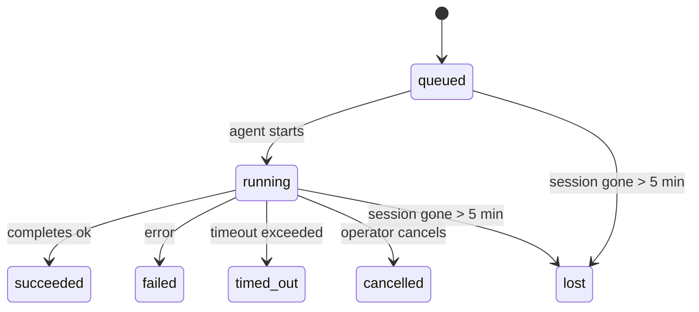

---
read_when:
    - Перегляд фонової роботи, що виконується або була нещодавно завершена
    - Налагодження збоїв доставки для відокремлених запусків агентів
    - Розуміння того, як фонові запуски пов’язані із сеансами, Cron і Heartbeat
summary: Відстеження фонових завдань для запусків ACP, субагентів, ізольованих завдань Cron і операцій CLI
title: Фонові завдання
x-i18n:
    generated_at: "2026-04-23T05:40:49Z"
    model: gpt-5.4
    provider: openai
    source_hash: 5cd0b0db6c20cc677aa5cc50c42e09043d4354e026ca33c020d804761c331413
    source_path: automation/tasks.md
    workflow: 15
---

# Фонові завдання

> **Шукаєте планування?** Див. [Автоматизація та завдання](/uk/automation), щоб вибрати правильний механізм. Ця сторінка описує **відстеження** фонової роботи, а не її планування.

Фонові завдання відстежують роботу, яка виконується **поза межами вашого основного сеансу розмови**:
запуски ACP, створення субагентів, виконання ізольованих завдань Cron і операції, ініційовані через CLI.

Завдання **не** замінюють сеанси, завдання Cron або Heartbeat — це **журнал активності**, який фіксує, яка відокремлена робота відбулася, коли саме і чи була вона успішною.

<Note>
Не кожен запуск агента створює завдання. Ходи Heartbeat і звичайний інтерактивний чат — ні. Усі виконання Cron, створення ACP, створення субагентів і команди агента через CLI — так.
</Note>

## Коротко

- Завдання — це **записи**, а не планувальники: Cron і Heartbeat визначають, _коли_ виконується робота, а завдання відстежують, _що сталося_.
- ACP, субагенти, усі завдання Cron і операції CLI створюють завдання. Ходи Heartbeat — ні.
- Кожне завдання проходить через `queued → running → terminal` (`succeeded`, `failed`, `timed_out`, `cancelled` або `lost`).
- Завдання Cron залишаються активними, доки середовище виконання Cron все ще володіє цим завданням; CLI-завдання з chat-backed залишаються активними лише доки їхній контекст запуску-власник іще активний.
- Завершення працює через push-механізм: відокремлена робота може сповістити напряму або пробудити сеанс-запитувач / Heartbeat після завершення, тому цикли опитування статусу зазвичай є неправильним підходом.
- Ізольовані запуски Cron і завершення субагентів у режимі best-effort очищають відстежувані вкладки браузера / процеси для свого дочірнього сеансу перед фінальним обліком очищення.
- Доставка ізольованих Cron приглушує застарілі проміжні відповіді батьківського процесу, поки ще завершуються нащадки-субагенти, і надає перевагу фінальному виводу нащадка, якщо він надходить до доставки.
- Сповіщення про завершення доставляються безпосередньо в канал або ставляться в чергу до наступного Heartbeat.
- `openclaw tasks list` показує всі завдання; `openclaw tasks audit` виявляє проблеми.
- Термінальні записи зберігаються 7 днів, після чого автоматично видаляються.

## Швидкий старт

```bash
# Показати всі завдання (спочатку найновіші)
openclaw tasks list

# Фільтрувати за runtime або статусом
openclaw tasks list --runtime acp
openclaw tasks list --status running

# Показати деталі конкретного завдання (за ID, ID запуску або ключем сеансу)
openclaw tasks show <lookup>

# Скасувати завдання, що виконується (завершує дочірній сеанс)
openclaw tasks cancel <lookup>

# Змінити політику сповіщень для завдання
openclaw tasks notify <lookup> state_changes

# Запустити аудит стану
openclaw tasks audit

# Переглянути або застосувати обслуговування
openclaw tasks maintenance
openclaw tasks maintenance --apply

# Переглянути стан TaskFlow
openclaw tasks flow list
openclaw tasks flow show <lookup>
openclaw tasks flow cancel <lookup>
```

## Що створює завдання

| Джерело                | Тип runtime | Коли створюється запис завдання                       | Типова політика сповіщень |
| ---------------------- | ----------- | ----------------------------------------------------- | ------------------------- |
| Фонові запуски ACP     | `acp`       | Створення дочірнього сеансу ACP                       | `done_only`               |
| Оркестрація субагентів | `subagent`  | Створення субагента через `sessions_spawn`            | `done_only`               |
| Завдання Cron (усі типи) | `cron`    | Кожне виконання Cron (основний сеанс та ізольований)  | `silent`                  |
| Операції CLI           | `cli`       | Команди `openclaw agent`, що виконуються через Gateway | `silent`                  |
| Медіазавдання агента   | `cli`       | Запуски `video_generate` з прив’язкою до сеансу       | `silent`                  |

Завдання Cron основного сеансу типово використовують політику сповіщень `silent` — вони створюють записи для відстеження, але не генерують сповіщень. Ізольовані завдання Cron також типово використовують `silent`, але є помітнішими, оскільки виконуються у власному сеансі.

Запуски `video_generate` з прив’язкою до сеансу також використовують політику сповіщень `silent`. Вони все одно створюють записи завдань, але завершення повертається у вихідний сеанс агента як внутрішнє пробудження, щоб агент міг сам написати подальше повідомлення й прикріпити готове відео. Якщо ви увімкнете `tools.media.asyncCompletion.directSend`, асинхронні завершення `music_generate` і `video_generate` спочатку намагатимуться доставити результат безпосередньо в канал, а вже потім повертатимуться до шляху пробудження сеансу-запитувача.

Поки завдання `video_generate` з прив’язкою до сеансу ще активне, інструмент також працює як захисний механізм: повторні виклики `video_generate` у тому самому сеансі повертають статус активного завдання замість запуску другого паралельного генерування. Використовуйте `action: "status"`, коли потрібен явний запит прогресу / статусу з боку агента.

**Що не створює завдань:**

- Ходи Heartbeat — основний сеанс; див. [Heartbeat](/uk/gateway/heartbeat)
- Звичайні ходи інтерактивного чату
- Прямі відповіді `/command`

## Життєвий цикл завдання



| Статус      | Що це означає                                                            |
| ----------- | ------------------------------------------------------------------------ |
| `queued`    | Створено, очікує запуску агента                                          |
| `running`   | Хід агента активно виконується                                           |
| `succeeded` | Успішно завершено                                                        |
| `failed`    | Завершено з помилкою                                                     |
| `timed_out` | Перевищено налаштований час очікування                                   |
| `cancelled` | Зупинено оператором через `openclaw tasks cancel`                       |
| `lost`      | Runtime втратив авторитетний базовий стан після 5-хвилинного пільгового періоду |

Переходи відбуваються автоматично — коли пов’язаний запуск агента завершується, статус завдання оновлюється відповідно.

`lost` залежить від runtime:

- Завдання ACP: зникли метадані дочірнього сеансу ACP.
- Завдання субагентів: дочірній сеанс зник зі сховища цільового агента.
- Завдання Cron: runtime Cron більше не відстежує це завдання як активне.
- Завдання CLI: ізольовані завдання дочірнього сеансу використовують дочірній сеанс; CLI-завдання з chat-backed натомість використовують live run context, тому наявність рядків lingering channel/group/direct session не підтримує їх активними.

## Доставка та сповіщення

Коли завдання досягає термінального стану, OpenClaw сповіщає вас. Є два шляхи доставки:

**Пряма доставка** — якщо завдання має ціль каналу (`requesterOrigin`), повідомлення про завершення надсилається безпосередньо в цей канал (Telegram, Discord, Slack тощо). Для завершень субагентів OpenClaw також зберігає прив’язку маршрутизації до треду / теми, коли це доступно, і може заповнити відсутній `to` / обліковий запис зі збереженого маршруту сеансу-запитувача (`lastChannel` / `lastTo` / `lastAccountId`) перед тим, як відмовитися від прямої доставки.

**Доставка через чергу сеансу** — якщо пряма доставка не вдалася або origin не встановлено, оновлення ставиться в чергу як системна подія в сеансі запитувача й з’являється під час наступного Heartbeat.

<Tip>
Завершення завдання негайно пробуджує Heartbeat, тож ви швидко бачите результат — не потрібно чекати наступного запланованого тіку Heartbeat.
</Tip>

Це означає, що типовий робочий процес базується на push-механізмі: один раз запускайте відокремлену роботу, а потім дайте runtime пробудити або сповістити вас після завершення. Опитуйте стан завдання лише тоді, коли потрібні налагодження, втручання або явний аудит.

### Політики сповіщень

Керуйте тим, скільки інформації ви отримуєте про кожне завдання:

| Політика              | Що доставляється                                                        |
| --------------------- | ----------------------------------------------------------------------- |
| `done_only` (типово)  | Лише термінальний стан (`succeeded`, `failed` тощо) — **це типове значення** |
| `state_changes`       | Кожен перехід стану та кожне оновлення прогресу                         |
| `silent`              | Взагалі нічого                                                          |

Змініть політику, поки завдання виконується:

```bash
openclaw tasks notify <lookup> state_changes
```

## Довідка CLI

### `tasks list`

```bash
openclaw tasks list [--runtime <acp|subagent|cron|cli>] [--status <status>] [--json]
```

Стовпці виводу: ID завдання, тип, статус, доставка, ID запуску, дочірній сеанс, зведення.

### `tasks show`

```bash
openclaw tasks show <lookup>
```

Токен lookup приймає ID завдання, ID запуску або ключ сеансу. Показує повний запис, включно з таймінгом, станом доставки, помилкою та термінальним підсумком.

### `tasks cancel`

```bash
openclaw tasks cancel <lookup>
```

Для завдань ACP і субагентів це завершує дочірній сеанс. Для завдань, що відстежуються CLI, скасування фіксується в реєстрі завдань (окремого дескриптора дочірнього runtime немає). Статус переходить у `cancelled`, а за потреби надсилається сповіщення про доставку.

### `tasks notify`

```bash
openclaw tasks notify <lookup> <done_only|state_changes|silent>
```

### `tasks audit`

```bash
openclaw tasks audit [--json]
```

Виявляє операційні проблеми. Знахідки також з’являються в `openclaw status`, коли виявлено проблеми.

| Знахідка                  | Серйозність | Умова спрацювання                                      |
| ------------------------- | ----------- | ------------------------------------------------------ |
| `stale_queued`            | warn        | У черзі понад 10 хвилин                                |
| `stale_running`           | error       | Виконується понад 30 хвилин                            |
| `lost`                    | error       | Зникло володіння завданням, підкріплене runtime        |
| `delivery_failed`         | warn        | Доставка не вдалася, а політика сповіщень не `silent`  |
| `missing_cleanup`         | warn        | Термінальне завдання без часової позначки очищення     |
| `inconsistent_timestamps` | warn        | Порушення часової шкали (наприклад, завершено до запуску) |

### `tasks maintenance`

```bash
openclaw tasks maintenance [--json]
openclaw tasks maintenance --apply [--json]
```

Використовуйте це, щоб переглянути або застосувати узгодження, проставлення очищення та видалення для завдань і стану Task Flow.

Узгодження залежить від runtime:

- Завдання ACP/subagent перевіряють свій базовий дочірній сеанс.
- Завдання Cron перевіряють, чи runtime Cron усе ще володіє цим завданням.
- CLI-завдання з chat-backed перевіряють live run context-власник, а не лише рядок сеансу чату.

Очищення після завершення також залежить від runtime:

- Завершення субагента в режимі best-effort закриває відстежувані вкладки браузера / процеси для дочірнього сеансу перед продовженням оголошення очищення.
- Завершення ізольованого Cron у режимі best-effort закриває відстежувані вкладки браузера / процеси для сеансу Cron до повного згортання запуску.
- Доставка ізольованого Cron за потреби очікує завершення подальшої роботи нащадків-субагентів і приглушує застарілий текст підтвердження батьківського процесу замість його оголошення.
- Доставка завершення субагента надає перевагу останньому видимому тексту помічника; якщо він порожній, використовується очищений останній текст tool/toolResult, а запуски лише з викликом інструмента, що завершилися тайм-аутом, можуть згортатися до короткого підсумку часткового прогресу. Термінальні невдалі запуски оголошують статус невдачі без повторного відтворення захопленого тексту відповіді.
- Збої очищення не маскують реальний результат завдання.

### `tasks flow list|show|cancel`

```bash
openclaw tasks flow list [--status <status>] [--json]
openclaw tasks flow show <lookup> [--json]
openclaw tasks flow cancel <lookup>
```

Використовуйте ці команди, коли вас цікавить саме оркеструвальний Task Flow, а не окремий запис фонового завдання.

## Дошка завдань у чаті (`/tasks`)

Використовуйте `/tasks` у будь-якому сеансі чату, щоб побачити фонові завдання, пов’язані з цим сеансом. Дошка показує активні та нещодавно завершені завдання з runtime, статусом, таймінгом, а також деталями прогресу або помилки.

Коли в поточному сеансі немає видимих пов’язаних завдань, `/tasks` повертається до локальних для агента лічильників завдань,
щоб ви все одно мали загальний огляд без розкриття деталей інших сеансів.

Для повного журналу оператора використовуйте CLI: `openclaw tasks list`.

## Інтеграція статусу (навантаження завдань)

`openclaw status` містить коротке зведення завдань:

```
Tasks: 3 queued · 2 running · 1 issues
```

Зведення показує:

- **active** — кількість `queued` + `running`
- **failures** — кількість `failed` + `timed_out` + `lost`
- **byRuntime** — розподіл за `acp`, `subagent`, `cron`, `cli`

І `/status`, і інструмент `session_status` використовують знімок завдань з урахуванням очищення: активним завданням
надається пріоритет, застарілі завершені записи приховуються, а недавні збої показуються лише тоді, коли більше не
залишається активної роботи. Це допомагає картці статусу зосереджуватися на тому, що важливо саме зараз.

## Зберігання та обслуговування

### Де зберігаються завдання

Записи завдань зберігаються в SQLite за адресою:

```
$OPENCLAW_STATE_DIR/tasks/runs.sqlite
```

Реєстр завантажується в пам’ять під час запуску Gateway і синхронізує записи з SQLite для надійного збереження після перезапусків.

### Автоматичне обслуговування

Очищувач запускається кожні **60 секунд** і виконує три дії:

1. **Узгодження** — перевіряє, чи активні завдання все ще мають авторитетне runtime-підкріплення. Завдання ACP/subagent використовують стан дочірнього сеансу, завдання cron — володіння активним завданням, а CLI-завдання з chat-backed — контекст запуску-власник. Якщо цей базовий стан відсутній понад 5 хвилин, завдання позначається як `lost`.
2. **Проставлення очищення** — встановлює часову позначку `cleanupAfter` для термінальних завдань (`endedAt + 7 days`).
3. **Видалення** — видаляє записи, дата `cleanupAfter` яких уже минула.

**Зберігання**: термінальні записи завдань зберігаються **7 днів**, після чого автоматично видаляються. Додаткове налаштування не потрібне.

## Як завдання пов’язані з іншими системами

### Завдання і Task Flow

[Task Flow](/uk/automation/taskflow) — це шар оркестрації потоків над фоновими завданнями. Один потік протягом свого життєвого циклу може координувати кілька завдань, використовуючи керовані або дзеркальні режими синхронізації. Використовуйте `openclaw tasks` для перегляду окремих записів завдань і `openclaw tasks flow` для перегляду оркеструвального потоку.

Докладніше див. [Task Flow](/uk/automation/taskflow).

### Завдання і cron

**Визначення** завдання cron зберігається в `~/.openclaw/cron/jobs.json`; стан виконання runtime зберігається поруч у `~/.openclaw/cron/jobs-state.json`. **Кожне** виконання cron створює запис завдання — і для основного сеансу, і для ізольованого. Завдання cron основного сеансу типово використовують політику сповіщень `silent`, тому відстежуються без генерації сповіщень.

Див. [Завдання Cron](/uk/automation/cron-jobs).

### Завдання і heartbeat

Запуски Heartbeat — це ходи основного сеансу, вони не створюють записів завдань. Коли завдання завершується, воно може пробудити Heartbeat, щоб ви швидко побачили результат.

Див. [Heartbeat](/uk/gateway/heartbeat).

### Завдання і сеанси

Завдання може посилатися на `childSessionKey` (де виконується робота) і `requesterSessionKey` (хто її запустив). Сеанси — це контекст розмови; завдання — це рівень відстеження активності поверх нього.

### Завдання і запуски агентів

`runId` завдання пов’язує його із запуском агента, який виконує роботу. Події життєвого циклу агента (запуск, завершення, помилка) автоматично оновлюють статус завдання — вам не потрібно керувати життєвим циклом вручну.

## Пов’язане

- [Автоматизація та завдання](/uk/automation) — усі механізми автоматизації з одного погляду
- [Task Flow](/uk/automation/taskflow) — оркестрація потоків над завданнями
- [Заплановані завдання](/uk/automation/cron-jobs) — планування фонової роботи
- [Heartbeat](/uk/gateway/heartbeat) — періодичні ходи основного сеансу
- [CLI: Tasks](/cli/tasks) — довідка з команд CLI
