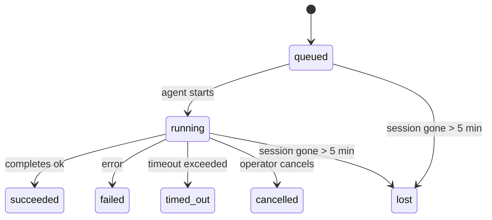

---
read_when:
    - Перевірка фонової роботи, яка виконується або була нещодавно завершена
    - Налагодження збоїв доставки для відокремлених запусків агентів
    - Розуміння того, як фонові запуски пов’язані із сеансами, cron і heartbeat
summary: Відстеження фонових завдань для запусків ACP, субагентів, ізольованих cron-завдань і операцій CLI
title: Фонові завдання
x-i18n:
    generated_at: "2026-04-06T02:31:25Z"
    model: gpt-5.4
    provider: openai
    source_hash: 2f56c1ac23237907a090c69c920c09578a2f56f5d8bf750c7f2136c603c8a8ff
    source_path: automation/tasks.md
    workflow: 15
---

# Фонові завдання

> **Шукаєте планування?** Перегляньте [Automation & Tasks](/uk/automation), щоб вибрати правильний механізм. Ця сторінка описує **відстеження** фонової роботи, а не її планування.

Фонові завдання відстежують роботу, яка виконується **поза межами вашого основного сеансу розмови**:
запуски ACP, запуск субагентів, виконання ізольованих cron-завдань і операції, ініційовані через CLI.

Завдання **не** замінюють сеанси, cron-завдання або heartbeat — це **журнал активності**, який фіксує, яка відокремлена робота відбулася, коли саме та чи була вона успішною.

<Note>
Не кожен запуск агента створює завдання. Повороти heartbeat і звичайний інтерактивний чат цього не роблять. Усі виконання cron, запуски ACP, запуски субагентів і команди агента CLI це роблять.
</Note>

## Коротко

- Завдання — це **записи**, а не планувальники: cron і heartbeat вирішують, _коли_ виконується робота, а завдання відстежують, _що сталося_.
- ACP, субагенти, усі cron-завдання й операції CLI створюють завдання. Повороти heartbeat — ні.
- Кожне завдання проходить шлях `queued → running → terminal` (`succeeded`, `failed`, `timed_out`, `cancelled` або `lost`).
- Cron-завдання залишаються активними, поки середовище виконання cron усе ще володіє завданням; CLI-завдання з чат-підкладкою залишаються активними лише доти, доки активний їхній контекст виконання.
- Завершення працює за принципом push: відокремлена робота може сповістити напряму або пробудити сеанс запитувача/heartbeat після завершення, тому цикли опитування статусу зазвичай є неправильною моделлю.
- Ізольовані запуски cron і завершення субагентів у міру можливості очищають відстежувані вкладки/процеси браузера для свого дочірнього сеансу перед фінальним обліком очищення.
- Доставка ізольованого cron пригнічує застарілі проміжні відповіді батьківського процесу, поки ще триває завершення нащадків-субагентів, і надає перевагу фінальному виводу нащадка, якщо він надходить до моменту доставки.
- Сповіщення про завершення доставляються безпосередньо в канал або ставляться в чергу до наступного heartbeat.
- `openclaw tasks list` показує всі завдання; `openclaw tasks audit` виявляє проблеми.
- Термінальні записи зберігаються 7 днів, після чого автоматично видаляються.

## Швидкий старт

```bash
# Перелічити всі завдання (спочатку найновіші)
openclaw tasks list

# Фільтрувати за runtime або статусом
openclaw tasks list --runtime acp
openclaw tasks list --status running

# Показати подробиці конкретного завдання (за ID, ID запуску або ключем сеансу)
openclaw tasks show <lookup>

# Скасувати запущене завдання (завершує дочірній сеанс)
openclaw tasks cancel <lookup>

# Змінити політику сповіщень для завдання
openclaw tasks notify <lookup> state_changes

# Запустити перевірку стану
openclaw tasks audit

# Переглянути або застосувати обслуговування
openclaw tasks maintenance
openclaw tasks maintenance --apply

# Переглянути стан TaskFlow
openclaw tasks flow list
openclaw tasks flow show <lookup>
openclaw tasks flow cancel <lookup>
```

## Що створює завдання

| Джерело                | Тип runtime | Коли створюється запис завдання                         | Політика сповіщень за замовчуванням |
| ---------------------- | ----------- | ------------------------------------------------------ | ----------------------------------- |
| Фонові запуски ACP     | `acp`       | Під час запуску дочірнього сеансу ACP                  | `done_only`                         |
| Оркестрація субагентів | `subagent`  | Під час запуску субагента через `sessions_spawn`       | `done_only`                         |
| Cron-завдання (усі типи) | `cron`    | Під час кожного виконання cron (основний сеанс та ізольовані) | `silent`                    |
| Операції CLI           | `cli`       | Команди `openclaw agent`, що виконуються через gateway | `silent`                            |
| Медіазавдання агента   | `cli`       | Запуски `video_generate` із підкладкою сеансу          | `silent`                            |

Cron-завдання основного сеансу за замовчуванням використовують політику сповіщень `silent` — вони створюють записи для відстеження, але не генерують сповіщень. Ізольовані cron-завдання також за замовчуванням використовують `silent`, але вони помітніші, оскільки виконуються у власному сеансі.

Запуски `video_generate` із підкладкою сеансу також використовують політику сповіщень `silent`. Вони все одно створюють записи завдань, але завершення повертається до початкового сеансу агента як внутрішнє пробудження, щоб агент міг сам написати подальше повідомлення та прикріпити готове відео. Якщо ви вмикаєте `tools.media.asyncCompletion.directSend`, асинхронні завершення `music_generate` і `video_generate` спершу намагаються доставити результат напряму в канал, а вже потім повертаються до шляху пробудження сеансу запитувача.

Поки завдання `video_generate` із підкладкою сеансу ще активне, інструмент також виконує роль захисного обмеження: повторні виклики `video_generate` у тому самому сеансі повертають статус активного завдання замість запуску другого паралельного генерування. Використовуйте `action: "status"`, якщо вам потрібен явний запит прогресу/статусу з боку агента.

**Що не створює завдання:**

- Повороти heartbeat — основний сеанс; див. [Heartbeat](/uk/gateway/heartbeat)
- Звичайні інтерактивні повороти чату
- Прямі відповіді `/command`

## Життєвий цикл завдання



| Статус      | Що це означає                                                             |
| ----------- | ------------------------------------------------------------------------- |
| `queued`    | Створене, очікує запуску агента                                           |
| `running`   | Поворот агента активно виконується                                        |
| `succeeded` | Успішно завершене                                                         |
| `failed`    | Завершене з помилкою                                                      |
| `timed_out` | Перевищено налаштований тайм-аут                                          |
| `cancelled` | Зупинене оператором через `openclaw tasks cancel`                         |
| `lost`      | Runtime втратив авторитетний базовий стан після 5-хвилинного пільгового періоду |

Переходи відбуваються автоматично — коли пов’язаний запуск агента завершується, статус завдання оновлюється відповідно.

`lost` враховує особливості runtime:

- Завдання ACP: зникли метадані дочірнього сеансу ACP.
- Завдання субагентів: дочірній сеанс зник із цільового сховища агента.
- Cron-завдання: runtime cron більше не відстежує завдання як активне.
- CLI-завдання: ізольовані завдання дочірнього сеансу використовують дочірній сеанс; CLI-завдання з чат-підкладкою натомість використовують живий контекст виконання, тож залишкові рядки сеансів каналу/групи/прямих повідомлень не підтримують їх активність.

## Доставка та сповіщення

Коли завдання досягає термінального стану, OpenClaw сповіщає вас. Є два шляхи доставки:

**Пряма доставка** — якщо завдання має цільовий канал (`requesterOrigin`), повідомлення про завершення надсилається безпосередньо в цей канал (Telegram, Discord, Slack тощо). Для завершень субагентів OpenClaw також зберігає прив’язану маршрутизацію thread/topic, коли це можливо, і може заповнити відсутні `to` / обліковий запис зі збереженого маршруту сеансу запитувача (`lastChannel` / `lastTo` / `lastAccountId`) перед тим, як відмовитися від прямої доставки.

**Доставка через чергу сеансу** — якщо пряма доставка не вдалася або походження не задане, оновлення ставиться в чергу як системна подія в сеансі запитувача і з’являється під час наступного heartbeat.

<Tip>
Завершення завдання негайно ініціює пробудження heartbeat, щоб ви швидко побачили результат — вам не потрібно чекати наступного запланованого heartbeat.
</Tip>

Це означає, що типовий робочий процес базується на push: один раз запустіть відокремлену роботу, а потім дозвольте runtime пробудити або сповістити вас після завершення. Опитуйте стан завдання лише тоді, коли вам потрібні налагодження, втручання або явний аудит.

### Політики сповіщень

Керуйте тим, скільки інформації ви отримуєте про кожне завдання:

| Політика              | Що доставляється                                                        |
| --------------------- | ----------------------------------------------------------------------- |
| `done_only` (default) | Лише термінальний стан (`succeeded`, `failed` тощо) — **це значення за замовчуванням** |
| `state_changes`       | Кожен перехід стану й оновлення прогресу                                |
| `silent`              | Нічого                                                                   |

Змінити політику під час виконання завдання:

```bash
openclaw tasks notify <lookup> state_changes
```

## Довідка CLI

### `tasks list`

```bash
openclaw tasks list [--runtime <acp|subagent|cron|cli>] [--status <status>] [--json]
```

Стовпці виводу: ID завдання, тип, статус, доставка, ID запуску, дочірній сеанс, підсумок.

### `tasks show`

```bash
openclaw tasks show <lookup>
```

Токен пошуку може бути ID завдання, ID запуску або ключем сеансу. Показує повний запис, включно з часом, станом доставки, помилкою та термінальним підсумком.

### `tasks cancel`

```bash
openclaw tasks cancel <lookup>
```

Для завдань ACP і субагентів це завершує дочірній сеанс. Статус переходить у `cancelled`, і надсилається сповіщення про доставку.

### `tasks notify`

```bash
openclaw tasks notify <lookup> <done_only|state_changes|silent>
```

### `tasks audit`

```bash
openclaw tasks audit [--json]
```

Виявляє операційні проблеми. Якщо виявлено проблеми, результати також з’являються в `openclaw status`.

| Виявлена проблема         | Серйозність | Умова спрацювання                                       |
| ------------------------- | ----------- | ------------------------------------------------------- |
| `stale_queued`            | warn        | Стан `queued` триває понад 10 хвилин                    |
| `stale_running`           | error       | Стан `running` триває понад 30 хвилин                   |
| `lost`                    | error       | Зникло runtime-підкріплене володіння завданням          |
| `delivery_failed`         | warn        | Доставка не вдалася, а політика сповіщень не `silent`   |
| `missing_cleanup`         | warn        | Термінальне завдання без позначки часу очищення         |
| `inconsistent_timestamps` | warn        | Порушення часової шкали (наприклад, завершено до запуску) |

### `tasks maintenance`

```bash
openclaw tasks maintenance [--json]
openclaw tasks maintenance --apply [--json]
```

Використовуйте це, щоб переглянути або застосувати звірку, встановлення позначок очищення та видалення для завдань і стану Task Flow.

Звірка враховує особливості runtime:

- Завдання ACP/субагентів перевіряють свій базовий дочірній сеанс.
- Cron-завдання перевіряють, чи runtime cron усе ще володіє завданням.
- CLI-завдання з чат-підкладкою перевіряють контекст живого виконання-власника, а не лише рядок сеансу чату.

Очищення після завершення також враховує особливості runtime:

- Після завершення субагента у міру можливості закриваються відстежувані вкладки/процеси браузера для дочірнього сеансу, перш ніж продовжиться оголошене очищення.
- Після завершення ізольованого cron у міру можливості закриваються відстежувані вкладки/процеси браузера для cron-сеансу, перш ніж виконання повністю завершиться.
- Доставка ізольованого cron за потреби чекає на подальші дії дочірніх субагентів і пригнічує застарілий текст підтвердження батьківського процесу замість його оголошення.
- Доставка завершення субагента надає перевагу останньому видимому тексту помічника; якщо він порожній, використовується очищений останній текст tool/toolResult, а запуски лише з викликом інструмента, що завершилися тайм-аутом, можуть зводитися до короткого підсумку часткового прогресу.
- Помилки очищення не маскують реальний результат завдання.

### `tasks flow list|show|cancel`

```bash
openclaw tasks flow list [--status <status>] [--json]
openclaw tasks flow show <lookup> [--json]
openclaw tasks flow cancel <lookup>
```

Використовуйте ці команди, коли вас цікавить оркеструвальний Task Flow, а не окремий запис фонового завдання.

## Дошка завдань чату (`/tasks`)

Використовуйте `/tasks` у будь-якому чат-сеансі, щоб побачити фонові завдання, пов’язані з цим сеансом. Дошка показує
активні й нещодавно завершені завдання з runtime, статусом, часом і подробицями прогресу або помилки.

Коли в поточному сеансі немає видимих пов’язаних завдань, `/tasks` повертається до локальних для агента лічильників завдань,
щоб ви все одно мали огляд без розкриття подробиць інших сеансів.

Для повного журналу оператора використовуйте CLI: `openclaw tasks list`.

## Інтеграція статусу (тиск завдань)

`openclaw status` містить короткий підсумок завдань:

```
Tasks: 3 queued · 2 running · 1 issues
```

Підсумок повідомляє:

- **active** — кількість `queued` + `running`
- **failures** — кількість `failed` + `timed_out` + `lost`
- **byRuntime** — розподіл за `acp`, `subagent`, `cron`, `cli`

І `/status`, і інструмент `session_status` використовують знімок завдань з урахуванням очищення: активним завданням надається перевага,
застарілі завершені рядки приховуються, а нещодавні збої показуються лише тоді, коли активна робота вже не триває.
Це допомагає картці статусу зосереджуватися на тому, що важливо саме зараз.

## Зберігання та обслуговування

### Де зберігаються завдання

Записи завдань зберігаються в SQLite за адресою:

```
$OPENCLAW_STATE_DIR/tasks/runs.sqlite
```

Реєстр завантажується в пам’ять під час запуску gateway і синхронізує записи з SQLite для надійності після перезапусків.

### Автоматичне обслуговування

Очищувач запускається кожні **60 секунд** і виконує три дії:

1. **Звірка** — перевіряє, чи активні завдання все ще мають авторитетне runtime-підкріплення. Завдання ACP/субагентів використовують стан дочірнього сеансу, cron-завдання — володіння активним завданням, а CLI-завдання з чат-підкладкою — контекст виконання-власника. Якщо цей базовий стан відсутній понад 5 хвилин, завдання позначається як `lost`.
2. **Позначка очищення** — установлює часову позначку `cleanupAfter` для термінальних завдань (`endedAt + 7 days`).
3. **Видалення** — видаляє записи, дата `cleanupAfter` яких уже минула.

**Термін зберігання**: записи термінальних завдань зберігаються **7 днів**, після чого автоматично видаляються. Жодного налаштування не потрібно.

## Як завдання пов’язані з іншими системами

### Завдання і Task Flow

[Task Flow](/uk/automation/taskflow) — це рівень оркестрації потоків над фоновими завданнями. Протягом свого життєвого циклу один потік може координувати кілька завдань, використовуючи керовані або дзеркальні режими синхронізації. Використовуйте `openclaw tasks` для перевірки окремих записів завдань, а `openclaw tasks flow` — для перевірки оркеструвального потоку.

Докладніше див. у [Task Flow](/uk/automation/taskflow).

### Завдання і cron

**Визначення** cron-завдання зберігається в `~/.openclaw/cron/jobs.json`. **Кожне** виконання cron створює запис завдання — і для основного сеансу, і для ізольованого. Cron-завдання основного сеансу за замовчуванням використовують політику сповіщень `silent`, тому вони відстежуються без створення сповіщень.

Див. [Cron Jobs](/uk/automation/cron-jobs).

### Завдання і heartbeat

Запуски heartbeat — це повороти основного сеансу, вони не створюють записів завдань. Коли завдання завершується, воно може ініціювати пробудження heartbeat, щоб ви швидко побачили результат.

Див. [Heartbeat](/uk/gateway/heartbeat).

### Завдання і сеанси

Завдання може посилатися на `childSessionKey` (де виконується робота) і `requesterSessionKey` (хто її запустив). Сеанси — це контекст розмови; завдання — це відстеження активності поверх нього.

### Завдання і запуски агентів

`runId` завдання пов’язує його із запуском агента, який виконує роботу. Події життєвого циклу агента (запуск, завершення, помилка) автоматично оновлюють статус завдання — вам не потрібно керувати життєвим циклом вручну.

## Пов’язане

- [Automation & Tasks](/uk/automation) — усі механізми автоматизації в одному огляді
- [Task Flow](/uk/automation/taskflow) — оркестрація потоків над завданнями
- [Scheduled Tasks](/uk/automation/cron-jobs) — планування фонової роботи
- [Heartbeat](/uk/gateway/heartbeat) — періодичні повороти основного сеансу
- [CLI: Tasks](/cli/index#tasks) — довідка з команд CLI
